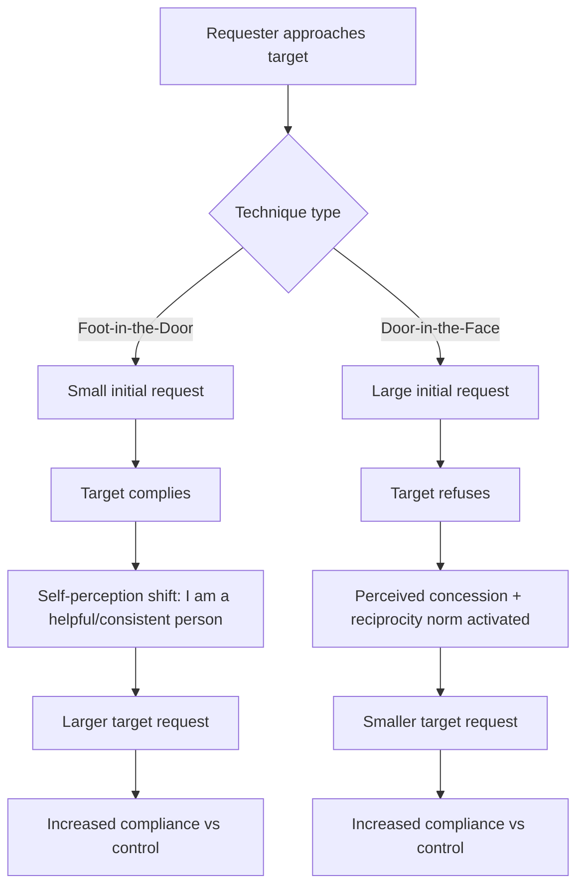

## Foot-in-the-Door and Door-in-the-Face Techniques

### Overview

Foot-in-the-door (FITD) and door-in-the-face (DITF) are two sequential-request compliance techniques studied in social psychology, both used to increase the likelihood that a target will agree to a critical (target) request by first presenting a different, related request. They operate through opposite structural logic — FITD moves from small to large, DITF moves from large to small — and are explained by different underlying psychological mechanisms.

### Foot-in-the-Door Technique

**Definition**

A compliance strategy in which a requester first secures agreement to a small, easy request, then follows with a larger, related target request. Agreement to the small request increases the probability of agreement to the larger one, relative to presenting the large request alone.

**Origin**

The classic demonstration is Freedman and Fraser (1966), in which residents were first asked to sign a petition or accept a small sticker/request related to safe driving, then days later asked to allow a large, unsightly "Drive Carefully" billboard sign to be installed in their front yard. Compliance with the large request was substantially higher among those who had first agreed to the small request compared to a control group approached only with the large request.

**Mechanism: Self-Perception Theory**

The dominant explanation is Bem's self-perception theory: people infer their own attitudes and traits by observing their own behavior, particularly when internal attitudinal cues are weak or ambiguous. After complying with the small request, the person infers "I am the kind of person who helps with/supports this cause," and this self-concept shift makes subsequent compliance with a related, larger request more consistent with their updated self-image.

**Key Points**

- Two-step sequence: small request → compliance → larger target request
- Effect is strongest when both requests are related in theme/domain (e.g., both about safety, both about the same charity)
- Effect is attenuated when the initial request is either trivially small (no attitude inference triggered) or accompanied by a strong external incentive (payment), which undermines the self-attribution ("I did it for the money," not "I am a helpful person")
- Time delay between requests does not eliminate the effect and can sometimes strengthen it, since it allows self-perception to consolidate
- Works even when a different person delivers the second request, supporting self-perception over pure rapport-building explanations

**Boundary Conditions**

- Initial compliance must be freely chosen (no coercion), or self-perception attribution fails
- If the person is given an external justification for the first act, the internal attribution is blocked
- Works best when the target's self-concept is not already firmly fixed on the relevant dimension

### Door-in-the-Face Technique

**Definition**

A compliance strategy in which a requester first presents a large, typically unreasonable request expected to be refused, then follows with a smaller, more reasonable target request. Refusal of the large request increases the probability of compliance with the subsequent smaller request, relative to presenting the small request alone.

**Origin**

Demonstrated by Cialdini et al. (1975) in the "Even a Penny Will Help" line of research: participants asked to commit two years as unpaid counselors to juvenile delinquents (large request, virtually always refused) were then asked to chaperone a single zoo trip (small target request). Compliance with the small request was significantly higher than when it was presented alone.

**Mechanism: Reciprocal Concessions**

The primary explanation is the reciprocal concessions model: when the requester appears to concede from a large request to a smaller one, the target perceives this as a compromise and feels social pressure to reciprocate with their own concession — compliance. A secondary explanation involves perceptual contrast: the smaller request appears more reasonable and modest when judged against the anchor of the initial large request. Guilt from refusing the first request may also contribute.

**Key Points**

- Two-step sequence: large request → refusal → smaller target request
- Requires the same requester to deliver both requests (unlike FITD, which can tolerate a different requester for step two); this supports the reciprocal-concession explanation over pure contrast
- Effect is stronger when the requests are for the same cause/domain and presented with minimal delay between them
- The initial request must be large enough to be refused but not so extreme that it appears unreasonable or manipulative, which can trigger reactance and damage rapport
- Works even for prosocial or charitable requests, and has documented use in negotiation and sales contexts

**Boundary Conditions**

- If the target suspects manipulation, the reciprocity norm may be replaced by resentment, reducing compliance
- Effectiveness decreases with a long delay between the two requests, since the "concession" framing weakens over time
- Less effective when the same target has been previously exposed to the technique and become sensitized to it

### Comparative Structure

### Side-by-Side Comparison

| Dimension | Foot-in-the-Door | Door-in-the-Face |
| --- | --- | --- |
| Request order | Small → Large | Large → Small |
| Expected outcome of first request | Compliance | Refusal |
| Core mechanism | Self-perception theory | Reciprocal concessions / perceptual contrast |
| Requester consistency needed | Not required | Typically required |
| Effect of delay between requests | Minimal or positive | Reduces effectiveness |
| Risk factor | Overuse breeds resistance | Perceived manipulation breeds reactance |

### Worked Example

**Example**

A university fundraising office wants alumni to commit to a $500 annual donation.

- *FITD application*: Alumni are first asked to sign an online pledge supporting the university's mission (no monetary commitment). Weeks later, they receive a donation request. Those who signed the pledge show higher donation compliance because they now see themselves as "supporters of the university."
- *DITF application*: Alumni are first asked to commit to a $5,000 annual donation (expected refusal). Immediately afterward, the same caller asks for $500 instead. The $500 figure appears modest by contrast, and the caller's apparent concession invokes reciprocity, raising compliance relative to a cold $500 ask.

### Applied Domains

- Marketing and sales: tiered offers, free trials (FITD), initial premium pitch before a "discounted" offer (DITF)
- Charitable fundraising and volunteer recruitment
- Negotiation tactics, including anchoring-adjacent use of DITF
- Public health and safety campaigns (petition signing before behavior change requests)
- [Inference] Political canvassing and activist mobilization strategies frequently apply FITD logic, though controlled experimental evidence in naturalistic political settings is sparser than in laboratory or commercial contexts

### Limitations and Critiques

- Meta-analytic effect sizes for both techniques are generally modest (small-to-medium), and results vary considerably by context, request domain, and population
- [Unverified] Some individual studies report null or reversed effects under specific conditions (e.g., when requests are perceived as illegitimate), indicating the effects are not universal or guaranteed
- Ethical concerns: both techniques can be viewed as manipulative since they leverage automatic psychological responses (self-perception, reciprocity norms) rather than direct persuasion on the merits of the request
- Distinguishing FITD/DITF effects from simple demand characteristics or experimenter effects requires well-controlled designs with proper control groups

### Related Topics

- Low-ball technique
- Reciprocity norm and social exchange theory
- Cognitive dissonance theory (as an alternative/competing explanation for FITD)
- Anchoring and contrast effects in judgment
- Commitment and consistency principle (Cialdini's influence framework)
- Reactance theory
- Elaboration Likelihood Model (route of persuasion underlying sequential-request compliance)