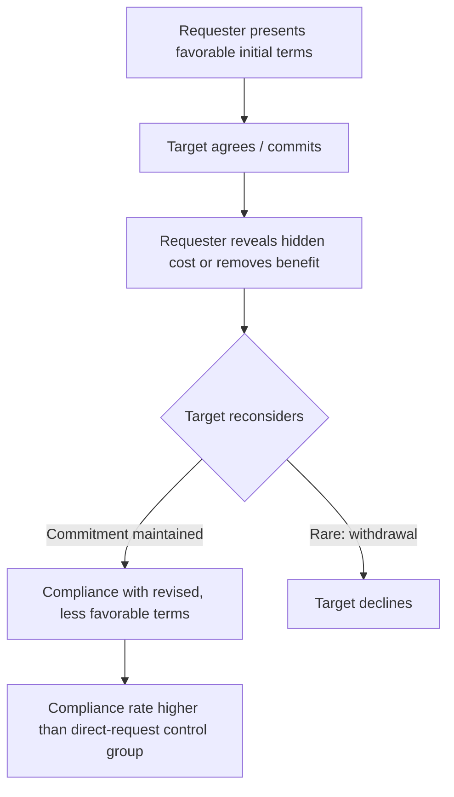

## The Low-Ball Technique

### Overview

The low-ball technique is a compliance strategy in which a requester secures agreement to a request under favorable or incomplete terms, and then, after the target has committed, reveals additional costs, removes a benefit, or otherwise makes the deal less favorable. Despite the change in terms, the target is more likely to follow through than if the true, less favorable terms had been presented from the outset.

### Origin

The classic demonstration is Cialdini, Cacioppo, Bassett, and Miller (1978). In one study, participants were asked to volunteer for a psychology experiment; those who agreed were then informed the session started at 7:00 a.m. A separate group was told the early time upfront, before agreeing. Participants who committed before learning of the inconvenient detail showed substantially higher follow-through rates than those informed at the outset, and this held even when participants were given the explicit option to withdraw after learning the true terms.

### Procedural Structure

The technique follows a fixed sequence:

1. **Initial offer**: Requester presents a request or deal with attractive or incomplete terms
2. **Commitment**: Target agrees to the deal
3. **Cost revelation**: Requester reveals a hidden cost, removes a benefit, or otherwise changes the terms unfavorably (e.g., "the price went up," "that model is unavailable, but this pricier one is")
4. **Re-confirmation**: Target is asked to confirm the (now less favorable) commitment
5. **Outcome**: Target frequently complies with the revised terms at a higher rate than a comparable group offered the true terms from the start

### Mechanism: Commitment and Consistency

The primary explanation draws on Cialdini's commitment and consistency principle: once a person makes a decision or takes a stance, they experience internal and social pressure to behave consistently with that prior commitment, even after the conditions that produced it change. The initial agreement activates a psychological commitment that persists independently of the specific terms that prompted it.

**Contributing Sub-Mechanisms**

- **Sunk-cost-like reasoning**: the target has already mentally or socially invested in the decision (e.g., told others, cleared their schedule), raising the perceived cost of reversing course
- **Cognitive dissonance avoidance**: backing out after committing would require acknowledging inconsistency between the decision and the reversal, which is psychologically uncomfortable
- **Anchoring on the original decision**: the target's frame of reference is anchored on "I already decided to do this," making the revised terms a modification rather than a fresh decision
- [Inference] Some accounts also invoke a self-presentation concern — reneging publicly may be perceived by the target as reflecting poorly on their reliability, which is distinct from pure internal dissonance

### Key Points

- Requires an explicit, active commitment before the cost change is revealed; passive or merely expressed interest does not reliably produce the effect
- The effect persists even when participants are explicitly told they are free to change their minds after learning the true terms
- Distinct from bait-and-switch in emphasis: bait-and-switch is typically framed as a broader marketing/retail practice (often involving product unavailability), while low-ball is the specific psychological compliance mechanism studied in the lab, though the two overlap substantially in applied settings
- The technique works best when the change in terms is revealed by the same person/source that obtained the original commitment, consistent with the commitment being tied to that specific interaction
- Effectiveness diminishes if the initial offer is obviously too good to be true, since the target may become suspicious of manipulation before ever committing

### Boundary Conditions

- If the target has not yet made an explicit behavioral commitment (e.g., only expressed casual interest), the technique loses its force, since commitment-consistency pressure has nothing to anchor to
- Public commitments (made in front of others) tend to produce stronger low-ball effects than private ones, consistent with consistency pressures being partly social
- Awareness of the technique (e.g., in consumer education contexts) can reduce, but does not necessarily eliminate, its effectiveness
- [Unverified] The durability of the effect over long time delays between commitment and cost revelation is less consistently documented than the immediate-reveal paradigm used in most classic studies

### Comparison to Related Sequential-Request Techniques

| Technique | Sequence | Core Mechanism | What Changes Between Steps |
| --- | --- | --- | --- |
| Foot-in-the-door | Small request → Large request | Self-perception | Size of request increases |
| Door-in-the-face | Large request → Small request | Reciprocal concession / contrast | Size of request decreases |
| Low-ball | Favorable terms → Commitment → Unfavorable terms revealed | Commitment/consistency | Terms of the *same* request worsen after agreement |

### Worked Example

**Example**

A car dealership salesperson negotiates a price of $18,000 for a vehicle, and the buyer verbally agrees to purchase at that price. While paperwork is being finalized, the salesperson returns and states that the manager did not approve the discount, and the actual price is $19,200. Buyers who already committed to the $18,000 deal are more likely to proceed with the purchase at $19,200 than buyers who were quoted $19,200 from the start, despite the final price being identical in both conditions.

### Applied Domains

- Retail and automotive sales negotiation
- Subscription services (introductory pricing followed by fee increases after signup)
- Fundraising (securing a verbal pledge before specifying the full expected commitment)
- [Inference] Employment negotiations, where an initial offer is adjusted downward after a candidate has informally accepted or turned down competing offers, though this specific application is less directly tested in controlled studies than consumer contexts

### Ethical and Legal Considerations

- The technique is widely regarded as ethically problematic because it exploits a decision-making bias rather than persuading on the actual merits of the final terms
- In several jurisdictions, low-ball-style practices in consumer sales overlap with regulated deceptive trade practices, particularly when paired with false scarcity claims or misrepresented product availability; specific legality depends on jurisdiction and the presence of intentional misrepresentation
- [Speculation] Repeated exposure to low-balling within an industry (e.g., automotive sales) may contribute to generalized consumer distrust of that industry's negotiation practices, though this broader reputational effect is not the primary focus of the original experimental literature

### Related Topics

- Foot-in-the-door and door-in-the-face techniques
- Commitment and consistency principle (Cialdini's influence framework)
- Cognitive dissonance theory
- Bait-and-switch marketing practices
- Sunk cost fallacy
- Anchoring and adjustment heuristic
- Consumer protection law and deceptive trade practices