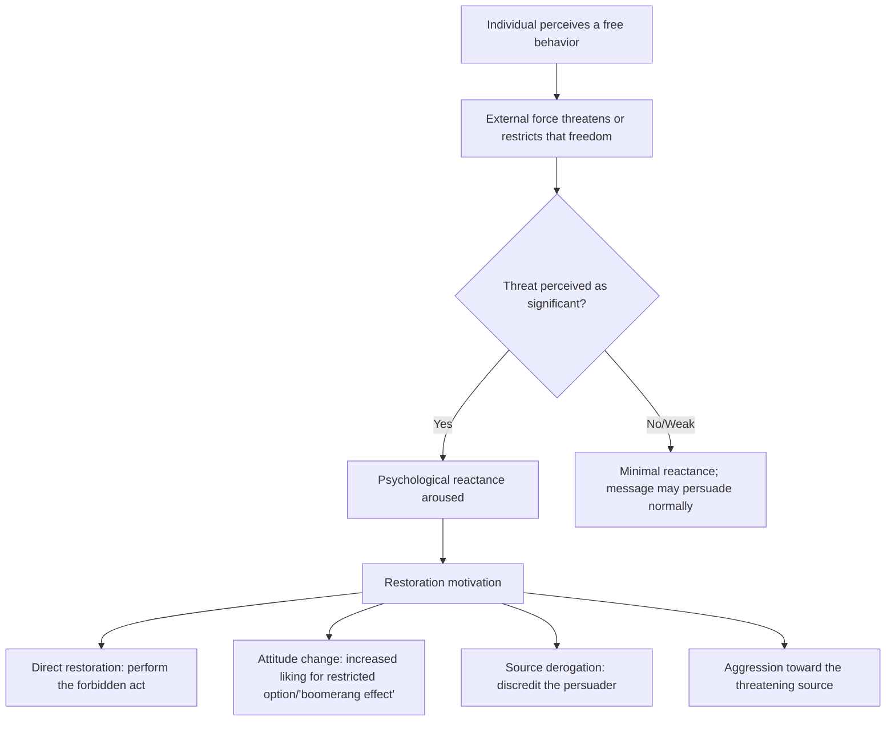

## Reactance Theory and Resistance to Persuasion

### Overview

Psychological reactance theory describes a motivational state that arises when a person perceives that a specific freedom to think, feel, or act is threatened, restricted, or eliminated. This state motivates the person to restore the threatened freedom, often by increasing their preference for the restricted option, resisting the influence attempt, or engaging in the forbidden behavior itself. Reactance is one of several mechanisms underlying resistance to persuasion, alongside attitude bolstering, counterarguing, and source derogation.

### Origin and Theoretical Foundation

Reactance theory was formulated by Jack Brehm (1966) in *A Theory of Psychological Reactance*. The core premise is that people hold a set of perceived "free behaviors" — actions or beliefs they believe they are entitled to engage in or hold. When an external force (a person, rule, persuasive message, or law) threatens or eliminates one of these free behaviors, the individual experiences reactance: an aversive motivational arousal directed at restoring the lost or threatened freedom.

### Core Theoretical Components

**Key Points**

- **Freedom**: A behavior, belief, or option the individual perceives as available to them and that they have previously exercised, expect to exercise, or believe they are entitled to
- **Threat to freedom**: Any external force — social pressure, explicit prohibition, strong persuasive appeal, or even excessive choice restriction — that makes continued access to the freedom uncertain
- **Reactance**: The internal motivational state aroused by the threat, proportional to the importance of the freedom and the magnitude/credibility of the threat
- **Restoration behavior**: Observable or attitudinal responses aimed at reasserting the freedom, including direct restoration (doing the forbidden thing), attitude change toward the restricted option (becoming more favorable to it), aggression toward the threatening source, or derogation of the source's credibility

### Magnitude of Reactance

Brehm proposed that the intensity of reactance is a function of several factors:

$$R = f(I_f, P_t, N_f)$$

Where $R$ is the magnitude of reactance aroused, $I_f$ is the importance of the threatened freedom, $P_t$ is the perceived proportion of freedoms threatened (i.e., how much of the person's freedom is at stake), and $N_f$ is the number of freedoms threatened by the same act. This is a conceptual/qualitative model from the original theory rather than a precisely quantified formula with fixed coefficients; it describes the direction of the relationships rather than an exact computational function. [Inference] Later empirical work operationalizes these factors as continuous moderators in reactance studies rather than treating Brehm's expression as a literal equation to be solved.

### Mechanism Diagram

### The Boomerang Effect

A central and frequently tested prediction of reactance theory is the **boomerang effect**: a persuasive message or restriction produces attitude or behavior change in the *opposite* direction from what was intended. Heavy-handed persuasion attempts (e.g., strongly worded warning labels, explicit bans) can increase the appeal of the restricted attitude or behavior rather than suppress it.

**Example**

A public health campaign uses strongly directive language ("You must NOT smoke — it is forbidden") aimed at adolescents. Because adolescence is a developmental period with heightened sensitivity to autonomy threats, some recipients respond with increased intention to smoke relative to a control group given a softer, autonomy-supportive message ("Many people choose not to smoke for their health"), illustrating the boomerang effect in a health-communication context.

### Reactance as a Resistance Mechanism (Broader Framework)

Reactance is one of several documented mechanisms of resistance to persuasion. Placing it in context:

| Resistance Mechanism | Core Process | Relation to Reactance |
| --- | --- | --- |
| Reactance | Motivational arousal from perceived freedom threat | Directly on-topic; freedom-restoration focused |
| Counterarguing | Generating cognitive rebuttals to message content | Independent cognitive process; can co-occur with reactance |
| Attitude bolstering | Retrieving/strengthening existing supportive beliefs | Independent; not freedom-based |
| Source derogation | Discrediting the persuader's credibility or motives | Can be a *downstream consequence* of reactance |
| Selective avoidance | Avoiding exposure to counter-attitudinal messages | Distinct; occurs before message processing |
| Inoculation (McGuire) | Pre-exposure to weakened counterarguments builds resistance | Complementary; inoculation can reduce future reactance by framing threats as expected |

### Moderators of Reactance

- **Freedom explicitness**: Reactance is stronger when the restricted freedom was clearly established or previously exercised
- **Message directiveness/controlling language**: Highly forceful language ("must," "have to," explicit commands) elicits more reactance than autonomy-supportive phrasing
- **Individual differences (trait reactance)**: Some individuals show consistently higher dispositional reactance across situations; this is measurable via instruments such as the Hong Psychological Reactance Scale
- **Perceived legitimacy of the source**: Threats from sources perceived as having legitimate authority (e.g., a doctor vs. a stranger) can produce different reactance magnitudes, though legitimate authority does not eliminate reactance entirely
- **Cultural orientation**: [Inference] Some cross-cultural research suggests individualist cultures may show stronger reactance to autonomy threats than collectivist cultures, though findings in this area are mixed and context-dependent, and this should be treated as a moderating tendency rather than a fixed rule
- **Age**: Adolescence is frequently associated with heightened reactance sensitivity, relevant to health communication research targeting youth

### Practical and Applied Implications

**Reducing Reactance in Persuasive Design**

- Use autonomy-supportive language rather than directive/controlling phrasing ("you may want to consider" vs. "you must")
- Provide choice within a persuasive appeal (offering options rather than a single mandated action)
- Acknowledge the audience's freedom explicitly before making the case ("Of course, it's your choice, but...")
- Avoid excessive repetition or heavy-handedness, which can compound perceived threat magnitude

**Deliberately Inducing Reactance (Strategic Use)**

- Some persuasion campaigns exploit reactance in reverse-psychology-style tactics, framing an undesired behavior as forbidden or restricted to increase resistance to it (e.g., anti-smoking campaigns highlighting industry manipulation to trigger reactance *against* tobacco companies rather than against the message itself)
- [Speculation] This "targeted reactance" approach — redirecting reactance toward a third party (e.g., an industry) rather than the message source — is a design strategy used in some campaigns, though its general reliability compared to non-reactance-based persuasion is not uniformly established across the literature

### Distinguishing Reactance from Related Constructs

- **Reactance vs. skepticism**: Skepticism involves doubting the truth value of message claims; reactance involves motivational resistance to the restriction of freedom, independent of the claims' validity
- **Reactance vs. cognitive dissonance**: Dissonance arises from inconsistency between cognitions/behaviors; reactance arises from a perceived threat to freedom and does not require any prior inconsistency
- **Reactance vs. simple disagreement**: Ordinary disagreement can occur without any motivational arousal; reactance specifically involves an aversive, arousal-based drive toward restoration

### Limitations and Critiques

- Reactance is difficult to measure directly (it is a hypothesized internal state); most studies infer it from downstream attitude/behavior change or self-report scales, introducing measurement ambiguity
- The boomerang effect, while well-documented in specific paradigms, is not universal — many persuasive messages with directive language do not produce boomerang effects, and the conditions determining when it occurs versus when standard persuasion prevails remain an active area of study
- [Unverified] The precise boundary conditions distinguishing when reactance dominates versus when systematic message-based persuasion (e.g., via the Elaboration Likelihood Model) dominates are not fully resolved in the literature, and effect sizes vary considerably across study designs and populations

### Related Topics

- Elaboration Likelihood Model and dual-process persuasion
- Inoculation theory (McGuire)
- Cognitive dissonance theory
- Source credibility and persuasion
- Autonomy-supportive communication in health psychology
- Forbidden fruit effect / boomerang effect
- Foot-in-the-door and door-in-the-face techniques
- The low-ball technique