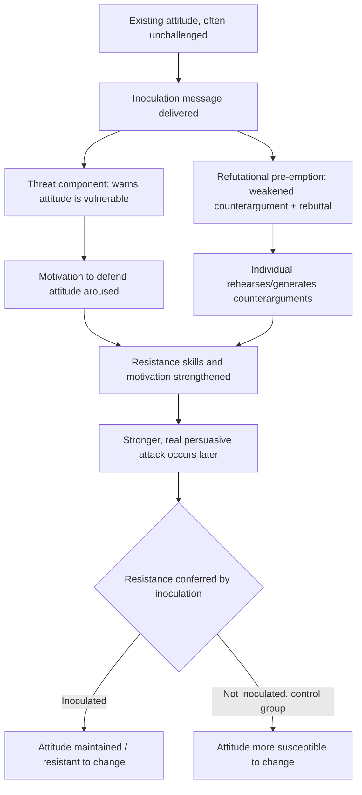

## Inoculation Theory

### Overview

Inoculation theory is a model of resistance to persuasion proposing that attitudes can be protected against future persuasive attacks in the same way the immune system is protected against disease: by exposing the individual to a weakened version of an attacking argument in advance, which stimulates the development of counterarguments ("mental antibodies") that strengthen resistance to a stronger, later attack.

### Origin

Inoculation theory was developed by William McGuire in the early 1960s. McGuire's original work focused on "cultural truisms" — widely held, rarely challenged beliefs (e.g., "you should brush your teeth after every meal") — which he found were paradoxically *easy* to change under persuasive attack precisely because people had never had to defend them and possessed no pre-formed counterarguments.

### The Biological Analogy

The theory is explicitly structured on a medical inoculation metaphor:

| Biological Inoculation | Attitudinal Inoculation |
| --- | --- |
| Weakened/attenuated pathogen introduced | Weakened version of a counter-attitudinal argument introduced |
| Immune system produces antibodies | Individual generates counterarguments |
| Body develops resistance to full-strength pathogen | Attitude develops resistance to full-strength persuasive attack |
| Requires pre-exposure before infection | Requires pre-exposure before the real persuasive attack |

### Two Core Components

Inoculation messages are theorized to work through two necessary components, both of which must generally be present for the effect to occur:

1. **Threat**: A warning that the existing attitude is vulnerable to attack, which motivates the individual to defend it. Threat is considered the motivational trigger of the inoculation process — without perceiving some risk to the attitude, the person has no reason to generate defenses.
2. **Refutational pre-emption**: Exposure to a weakened version of a counter-attitudinal argument, along with refutations of that argument. This can take two forms:
   - **Refutational-same**: pre-exposure to the specific arguments that will actually be used in the later attack
   - **Refutational-different**: pre-exposure to different arguments than those used in the later attack, testing whether inoculation confers general resistance rather than resistance to only the specific arguments rehearsed

### Process Diagram

### Key Points

- Inoculation is most effective on attitudes that are **not currently under attack** — it is a *prophylactic* (preventive) strategy, not a treatment for already-changed attitudes
- The refutational pre-emption must be genuinely weaker than the eventual real-world attack; an inoculation message that is too strong risks converting the target outright rather than building resistance
- Threat and refutational content function as distinct components — research has examined each independently to determine their relative contribution, and both are generally considered necessary for the classic inoculation effect
- Inoculation confers resistance not only to the specific arguments rehearsed (refutational-same) but also, to a meaningful degree, to novel counterarguments never explicitly addressed (refutational-different), suggesting the effect operates partly through generalized motivational and skill-based resistance rather than rote memorization of specific rebuttals
- Effects can decay over time without reinforcement ("booster" messages), similar to biological immunity waning without follow-up exposure

### Distinguishing Inoculation from Related Concepts

- **Inoculation vs. simple forewarning**: Forewarning alone (telling someone persuasion is coming) can produce some resistance through motivational arousal, but inoculation theory specifically adds the refutational pre-emption component — rehearsing actual counterarguments — which forewarning alone does not include
- **Inoculation vs. reactance**: Reactance is a motivational state triggered by a perceived threat to freedom; inoculation deliberately uses a "threat to attitude" as one of its two components, but the target of the threat differs (freedom vs. belief validity) and inoculation's goal is building reasoned counterarguments rather than a diffuse aversive arousal state
- **Inoculation vs. attitude bolstering**: Bolstering involves reinforcing existing supportive reasons for an attitude without addressing counterarguments; inoculation explicitly engages with counter-attitudinal material, which is central to its resistance-building mechanism

### Worked Example

**Example**

A public health organization wants to protect the public's positive attitude toward vaccination against anticipated misinformation.

- **Threat component**: "You may encounter claims online that vaccines are dangerous — some of these claims are designed to sound convincing."
- **Refutational pre-emption**: "One common claim is that vaccine ingredient X causes harm at the doses used. In reality, the doses studied are far below any harmful threshold, and large-scale safety monitoring has not found this association." The message presents a weakened version of the anti-vaccine argument alongside its refutation.

Individuals exposed to this inoculation message are, according to the theory, better equipped to resist a later, stronger anti-vaccination message than individuals with no prior exposure, because they have already rehearsed a counterargument and have been alerted to the vulnerability of their belief.

### Applied Domains

- Political communication (inoculating voters against anticipated attack ads or misinformation campaigns)
- Health communication (vaccination attitudes, anti-smoking campaigns, nutrition misinformation)
- Media literacy and misinformation/"fake news" resistance training, including prebunking approaches
- Organizational and marketing contexts (protecting brand attitudes against anticipated competitor claims or negative publicity)
- Consumer protection education

### Contemporary Extensions: "Prebunking" and Misinformation Research

Since the 2010s, inoculation theory has been extended into the domain of online misinformation, often under the label "prebunking." Researchers have developed:

- **Fact-based inoculation**: pre-exposure to refutations of specific false claims
- **Technique-based (logic-based) inoculation**: pre-exposure to the *manipulation techniques* themselves (e.g., false dichotomies, emotional manipulation, fake experts, scapegoating) rather than specific factual claims, intended to generalize resistance across many unrelated pieces of misinformation that use similar techniques
- Gamified inoculation interventions (e.g., browser games in which players practice producing misinformation techniques in a controlled setting) have been used as a delivery mechanism for technique-based inoculation in media literacy research

[Inference] Technique-based inoculation is theorized to generalize more broadly across topics than fact-based inoculation, since it targets the underlying manipulative structure rather than any single false claim, though the comparative effectiveness of the two approaches continues to be an active empirical question rather than a settled finding.

### Limitations and Critiques

- Effect sizes for inoculation, especially in field settings outside the lab, vary and are sometimes modest; effectiveness depends heavily on message design quality and the strength/relevance of the refutational content
- Booster messages are often needed to maintain resistance over time, adding practical implementation complexity for real-world campaigns
- [Unverified] The relative necessity of the threat component versus the refutational component (i.e., whether one can be reduced or omitted without meaningfully weakening the effect) has produced mixed findings across different studies and inoculation message designs
- Inoculation is generally ineffective, or requires substantially different design ("therapeutic" rather than "prophylactic" approaches), once an attitude has already been successfully attacked and changed, since the theory is built around preemptive rather than corrective resistance

### Related Topics

- Reactance theory and resistance to persuasion
- Elaboration Likelihood Model and dual-process persuasion
- Cultural truisms and attitude vulnerability
- Misinformation, prebunking, and media literacy interventions
- Source credibility and persuasion
- Counterargument generation and cognitive resistance
- Attitude strength and accessibility