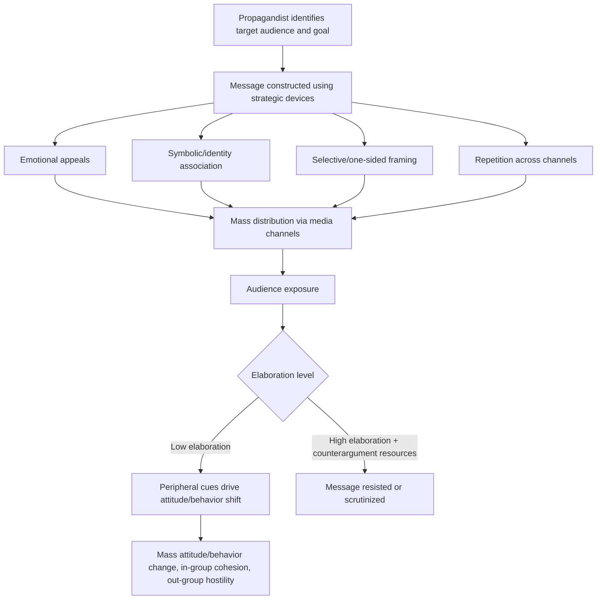

## Propaganda and Mass Persuasion

### Overview

Propaganda refers to the deliberate, systematic attempt to shape perceptions, cognitions, and behavior of a mass audience to achieve a response that furthers the intent of the propagandist, typically through one-sided or selectively framed communication distributed through mass media channels. Mass persuasion is the broader category of influence processes operating at scale on large audiences, of which propaganda is a specific, often ethically charged, subtype.

### Definitional Distinctions

**Key Points**

- Propaganda is typically distinguished from ordinary persuasion by (a) an explicit strategic intent by an identifiable or hidden source, (b) one-sidedness or deliberate omission of counter-evidence, and (c) a goal favoring the propagandist's interests rather than a mutual or audience-centered exchange of ideas
- The term carries strong negative connotations in most contemporary usage, though historically (particularly pre-World War II) it was used more neutrally to describe organized persuasion campaigns, including in the founding work of the Institute for Propaganda Analysis (1937)
- Mass persuasion is the umbrella term encompassing propaganda, public health campaigns, advertising, and political communication broadly — not all mass persuasion is propaganda, since ethical, transparent, evidence-based communication that presents balanced information is generally excluded from the term even when conducted at scale

### Historical Foundations

Jacques Ellul's *Propaganda: The Formation of Men's Attitudes* (1965) proposed a highly influential and comprehensive typology distinguishing:

- **Political vs. sociological propaganda**: deliberate government/organizational campaigns vs. diffuse, unintentional propagation of a society's values through advertising, education, and media
- **Agitation vs. integration propaganda**: agitation propaganda incites action and disruption (often used by movements seeking change); integration propaganda aims to habituate individuals to the existing social order and make them conform to it
- **Vertical vs. horizontal propaganda**: vertical flows from an elite/leader down to a mass audience; horizontal spreads through peer networks and small-group interaction

Harold Lasswell's early communication research (1920s–1930s) proposed the influential model summarized as "who says what, in which channel, to whom, with what effect," which became foundational to mass communication research broadly, including but not limited to propaganda studies.

### Classic Propaganda Techniques

The Institute for Propaganda Analysis (1937) catalogued a set of common devices, several of which remain standard reference points in social psychology and communication coursework:

| Technique | Description |
| --- | --- |
| Name-calling | Attaching a negative label to a person/idea to provoke rejection without evidence |
| Glittering generalities | Associating a person/idea with vague, virtuous words (freedom, democracy) to generate approval without scrutiny |
| Transfer | Associating the authority/prestige of a respected symbol (flag, religious imagery) with the propagandist's cause |
| Testimonial | Having a respected or well-liked figure endorse the idea/product |
| Plain folks | Presenting the propagandist/idea as ordinary and relatable to the common person |
| Card stacking | Selectively presenting facts/arguments that favor one side while omitting or distorting contrary evidence |
| Bandwagon | Suggesting that "everyone" supports the idea, pressuring conformity through perceived consensus |

### Psychological Mechanisms Underlying Propaganda Effectiveness

**Peripheral-Route Processing**

Much classic propaganda relies on cues that bypass careful argument scrutiny, consistent with the peripheral route described in the Elaboration Likelihood Model: emotional appeals, source attractiveness/authority, symbolic association, and repetition, rather than logically evaluable evidence.

**Repetition and the Illusory Truth Effect**

Repeated exposure to a statement increases its perceived truthfulness independent of its actual validity — the illusory truth effect. Mass propaganda campaigns exploit this through sustained repetition of slogans and claims across multiple channels over time.

**In-group/Out-group Framing**

Propaganda frequently constructs a sharply defined in-group (the audience, the nation, the cause) against a demonized or dehumanized out-group, leveraging social identity processes: enhancing in-group cohesion and legitimizing hostile attitudes or action toward the out-group.

**Source Credibility and Authority Cues**

Propaganda often relies on perceived authoritative or trustworthy sources (real or manufactured), consistent with source-credibility research showing that expert or trustworthy-seeming sources increase persuasion, particularly under low-elaboration conditions.

**Emotional Appeals**

Fear appeals, national pride, moral outrage, and hope are used to generate strong affective states that can short-circuit deliberative evaluation, particularly when combined with a clear, simple call to action.

### Process Model

### Mass Media and Channel Considerations

- **Two-step flow model** (Lazarsfeld, Katz): mass media messages often reach the general public indirectly, filtered through opinion leaders who interpret and relay content to their social networks, meaning propaganda effectiveness is partly mediated by trusted intermediaries rather than direct mass exposure alone
- **Agenda-setting theory** (McCombs & Shaw): mass media does not necessarily tell audiences *what to think*, but strongly influences *what to think about*, which propaganda campaigns can exploit by controlling which issues receive sustained coverage
- **Modern digital extension**: social media algorithms, echo chambers, and computational propaganda (bot networks, coordinated inauthentic behavior, micro-targeted political advertising) represent contemporary extensions of classic propaganda mechanisms, operating at greater scale and with more precise audience targeting than 20th-century mass media

### Resistance and Counter-Propaganda

- **Inoculation-based approaches**: pre-exposing audiences to weakened propaganda techniques and their refutations (technique-based/"prebunking" inoculation) has been applied specifically to build resistance against manipulation tactics common in propaganda and misinformation
- **Media literacy education**: training audiences to recognize the classic devices (name-calling, bandwagon, card stacking, etc.) is a long-standing counter-propaganda strategy dating to the Institute for Propaganda Analysis itself
- **Source verification and fact-checking**: reduces the effectiveness of card-stacking and testimonial techniques by supplying the omitted counter-evidence
- [Inference] The relative effectiveness of media literacy education versus inoculation-based prebunking as counter-propaganda strategies is an active area of applied research, and the two approaches are generally considered complementary rather than competing

### Worked Example

**Example**

A wartime government campaign aims to increase public support for a mobilization effort. The campaign uses:

- **Transfer**: pairing mobilization imagery with the national flag and anthem
- **Glittering generalities**: framing the effort as defending "freedom" and "the homeland"
- **Testimonial**: featuring a respected public figure endorsing enlistment
- **Bandwagon**: depicting large crowds of citizens already volunteering
- **Card stacking**: emphasizing successes and omitting setbacks or costs

Each device targets peripheral, low-elaboration processing and leverages identity/emotion rather than presenting a balanced cost-benefit case for mobilization, illustrating the classic device catalogue applied in an integrated, multi-channel campaign.

### Applied and Research Domains

- Political science and international relations (state propaganda, wartime communication)
- Communication studies (media effects, agenda-setting, framing)
- Computational social science (bot detection, coordinated inauthentic behavior, computational propaganda)
- Public health (contrasted with propaganda as a model of "ethical" mass persuasion using similar techniques for prosocial ends, a distinction that remains debated)
- Consumer psychology and advertising ethics

### Limitations and Critiques

- The boundary between "propaganda" and "legitimate persuasive communication" (advertising, political campaigning, public health messaging) is contested and often applied asymmetrically — communication favoring one's own position is frequently labeled "information" while opposing communication is labeled "propaganda," a bias sometimes referred to as the propaganda label's rhetorical weaponization
- [Unverified] Quantifying the precise causal effect of specific propaganda techniques (as opposed to overall campaign exposure) on real-world mass attitude change is methodologically difficult outside controlled experimental settings, since field-level propaganda campaigns are rarely isolated from competing information sources
- Modern computational propaganda research faces rapid technological change (evolving social media algorithms, generative AI content), meaning empirical findings on effectiveness can become outdated relatively quickly relative to the pace of platform and technique evolution

### Related Topics

- Elaboration Likelihood Model and dual-process persuasion
- Inoculation theory
- Social identity theory and in-group/out-group dynamics
- Illusory truth effect and repetition-based persuasion
- Agenda-setting and framing theory
- Fear appeals and emotional persuasion
- Computational propaganda and misinformation on social media
- Source credibility and the sleeper effect