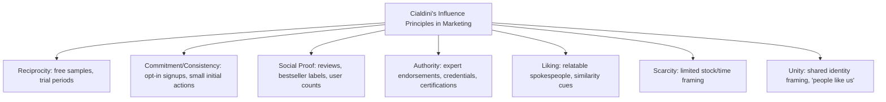

## Persuasion in Advertising and Marketing

### Overview

Advertising and marketing persuasion applies core social-psychological persuasion mechanisms — dual-process attitude formation, source and message characteristics, emotional appeals, and social influence principles — to commercial contexts where the goal is shaping consumer attitudes, purchase intentions, and brand behavior. It draws directly on general persuasion theory while adding domain-specific considerations: repeated low-involvement exposure, competitive brand positioning, and behavioral (purchase) rather than purely attitudinal outcomes.

### Dual-Process Foundations Applied to Advertising

**Elaboration Likelihood Model (ELM) in Advertising**

Advertising persuasion is commonly analyzed through the ELM's central vs. peripheral route distinction:

- **Central route advertising**: detailed product information, comparative claims, technical specifications, testable performance claims — effective when consumer involvement/motivation is high (e.g., purchasing a car, choosing health insurance)
- **Peripheral route advertising**: celebrity endorsement, attractive imagery, music, humor, emotional tone, repetition — effective when consumer involvement is low (e.g., routine grocery purchases, impulse buys)

**Key Points**

- High-involvement products (durable goods, expensive purchases, health/financial decisions) generally benefit from argument-rich, central-route advertising, since motivated consumers scrutinize claims
- Low-involvement products (snacks, household goods, low-cost items) generally benefit more from peripheral cues, since consumers are less motivated to process detailed argumentation
- Attitudes formed via the central route tend to be more durable and predictive of behavior than those formed via peripheral cues, a consideration relevant to long-term brand-loyalty strategy vs. short-term sales-lift tactics

### Source Effects in Advertising

- **Source credibility**: expertise and trustworthiness of an endorser or brand spokesperson increase persuasion, particularly under peripheral processing; a dentist endorsing toothpaste leverages perceived expertise
- **Source attractiveness**: physically or socially attractive endorsers increase message appeal through liking and identification processes, independent of argument quality
- **Celebrity endorsement and match-up hypothesis**: persuasion effectiveness is theorized to improve when there is a perceived logical fit between the endorser's image/expertise and the product category (e.g., an athlete endorsing sportswear), though [Inference] the empirical strength of the match-up effect varies across studies and product categories, and celebrity fame alone can sometimes override the need for a close conceptual fit
- **Sleeper effect**: a low-credibility source's persuasive impact can increase over time as the audience's memory for the source decouples from memory for the message content, a phenomenon studied originally in propaganda contexts and applicable to discounted or skeptically received advertising claims

### Emotional Appeals in Advertising

| Appeal Type | Mechanism | Typical Use Case |
| --- | --- | --- |
| Fear appeals | Threat + efficacy information motivates risk-reducing behavior (per the Extended Parallel Process Model) | Insurance, safety products, health-related goods |
| Humor | Increases attention, liking, and message recall; can reduce counterarguing | Low-involvement consumer goods |
| Nostalgia | Leverages positive affect tied to memory, increasing warmth toward brand | Legacy/heritage brand campaigns |
| Warmth/sentimentality | Builds emotional connection and brand attachment | Holiday and family-oriented campaigns |
| Scarcity-driven urgency | Combines emotional arousal (anxiety about missing out) with cognitive scarcity heuristic | Limited-time sales, flash promotions |

**Fear Appeal Caveat**: Consistent with the Extended Parallel Process Model, fear appeals are most effective when paired with a clear, credible efficacy message (a specific action the consumer can take to reduce the threat); fear without efficacy information risks defensive avoidance or message rejection rather than persuasion.

### Cialdini's Influence Principles Applied to Marketing

Robert Cialdini's six (later expanded to seven) principles of influence are widely applied in advertising and sales contexts:

- **Reciprocity**: free samples, trial subscriptions, or complimentary content create an implicit obligation to reciprocate through purchase or loyalty
- **Commitment and consistency**: newsletter signups or small free actions serve as a foot-in-the-door toward larger future purchases
- **Social proof**: customer review counts, "bestseller" labels, and user testimonials leverage the assumption that popularity signals quality, particularly under uncertainty
- **Authority**: expert endorsements, professional credentials ("dentist recommended"), and certification marks increase perceived legitimacy
- **Liking**: relatable, similar, or attractive spokespeople increase persuasion through interpersonal liking mechanisms
- **Scarcity**: "limited time," "only 3 left in stock" framing leverages loss aversion and the scarcity heuristic (perceived scarcity implies value)
- **Unity** (added in Cialdini's later work): framing the brand/product as part of a shared in-group identity ("for people who...") leverages social identity processes similar to those in propaganda and group persuasion research

### Repetition and the Mere Exposure Effect

Repeated advertising exposure increases positive affect toward a brand independent of message content, consistent with Zajonc's mere exposure effect. This underlies the rationale for sustained, high-frequency ad campaigns (brand awareness advertising) even when individual exposures carry minimal new information. The illusory truth effect (repetition increasing perceived truthfulness of claims) is also directly relevant to repeated brand claims and slogans.

### Framing and Anchoring in Pricing

- **Price anchoring**: presenting a high "original" price alongside a "sale" price leverages contrast effects to make the discounted price appear more attractive, structurally similar to the perceptual contrast mechanism in the door-in-the-face technique
- **Loss vs. gain framing**: messages framed around avoiding a loss ("don't miss out") versus achieving a gain ("get more") can differentially affect persuasion depending on the risk profile of the decision, consistent with prospect theory
- **Decoy pricing effect**: introducing a third, deliberately inferior option can shift preference toward a specific target option by altering the comparison set, an application of context-dependent choice research

### Behavioral and Digital Marketing Extensions

- **A/B testing and micro-targeting**: digital advertising platforms enable rapid experimental testing of persuasive message variants and algorithmic targeting of messages to psychographically or behaviorally segmented audiences
- **Retargeting**: repeated exposure to previously viewed products leverages both mere exposure and commitment-consistency (having previously engaged with the product) mechanisms
- **Influencer marketing**: extends source-credibility and liking mechanisms into parasocial relationship contexts, where audiences form one-sided perceived relationships with content creators that can enhance persuasive impact relative to traditional celebrity endorsement
- [Inference] Parasocial relationships with influencers are theorized to increase perceived source trustworthiness and reduce perceived commercial intent relative to traditional advertising, though the durability and generalizability of this advantage across influencer tiers (mega- vs. micro-influencers) remains an active area of applied marketing research

### Worked Example

**Example**

A skincare brand launches a campaign combining multiple principles:

- **Source**: a dermatologist (authority + expertise-based credibility) endorses the product
- **Social proof**: the ad states "over 2 million units sold"
- **Scarcity**: a limited-edition version is advertised as "while supplies last"
- **Central-route content**: clinical trial statistics on ingredient efficacy are included for high-involvement skincare consumers
- **Peripheral cues**: soft lighting, calming music, and an aspirational lifestyle setting support low-involvement, affect-based responses

This layered approach targets both central-route consumers seeking detailed justification and peripheral-route consumers responding to affective and social cues, illustrating how commercial campaigns often combine multiple persuasion mechanisms rather than relying on a single principle.

### Resistance and Ethical Considerations

- **Advertising literacy and skepticism**: increased consumer awareness of persuasive intent (e.g., through media literacy education) can activate a "persuasion knowledge" model response, in which consumers adjust their interpretation of a message once they recognize it as a deliberate persuasion attempt
- **Regulatory constraints**: many jurisdictions regulate deceptive advertising claims, targeted advertising to children, and required disclosures for influencer sponsored content, reflecting recognition of persuasion techniques' real-world behavioral impact
- **Overlap with propaganda techniques**: several classic propaganda devices (bandwagon, testimonial, transfer, card stacking) map directly onto standard advertising practice, raising recurring ethical questions about the boundary between legitimate marketing and manipulative persuasion

### Limitations and Critiques

- Laboratory-based persuasion effects (ELM, Cialdini's principles) do not always translate directly to real-world purchase behavior, where competing brand exposure, price sensitivity, and habitual buying patterns introduce confounds not present in controlled studies
- [Unverified] The precise incremental effect of any single persuasion principle (e.g., scarcity framing alone) on actual sales, isolated from co-occurring campaign elements, is difficult to establish outside controlled A/B testing environments, and published effect sizes vary considerably by product category and market context
- Rapid evolution of digital advertising technology (algorithmic targeting, generative AI-created content) means some applied findings can become outdated as platforms and consumer media habits change

### Related Topics

- Elaboration Likelihood Model and dual-process persuasion
- Cialdini's principles of influence
- Foot-in-the-door and door-in-the-face techniques
- The low-ball technique
- Mere exposure effect
- Propaganda and mass persuasion
- Prospect theory and framing effects
- Persuasion knowledge model and consumer skepticism