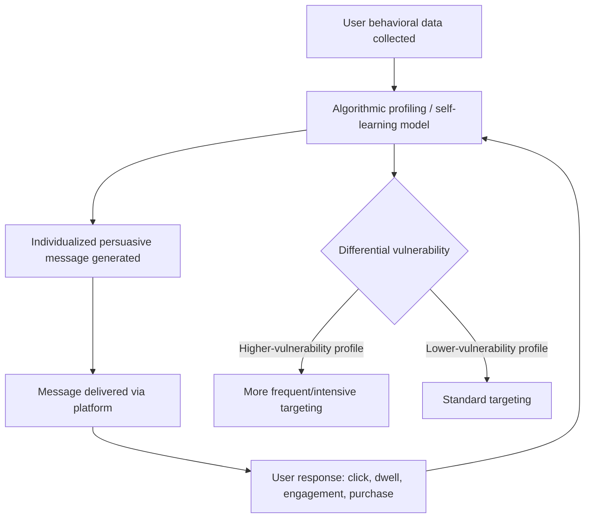

## Digital and Algorithmic Persuasion

### Overview

Digital and algorithmic persuasion refers to persuasive attempts that are data-driven, personalized, and mediated by recommendation and targeting algorithms, distinguishing them from traditional mass-media persuasion by their capacity for continuous, individualized adaptation based on behavioral data. In this framework, algorithms function as active participants in the persuasion process rather than passive distribution channels: the centrality of data and algorithms in media has changed the creation, delivery, and consumption of online content, including persuasive content, with algorithmic persuasion involving deliberate persuasive attempts that are data-driven and mediated by algorithms. [uva](https://dare.uva.nl/id/0efeb2df-83c6-491c-bcf1-93381e1db956)

### Defining Feature: Algorithms as Active Agents

A key conceptual shift in this literature is treating algorithms not as neutral pipes but as active agents shaping the communication process. Recommendation algorithms operate as active agents in communication processes rather than mere facilitators, and these systems can unintentionally amplify manipulative strategies introduced by external actors, even when the platform itself has no persuasive intent of its own. [unizar](https://papiro.unizar.es/ojs/index.php/rc51-jos/article/view/10992)

### Core Mechanism: Continuous Profiling and Adaptive Personalization

**Key Points**

- Self-learning algorithms are used for profiling individuals to persuade them through personalized commercial messages that are continuously adjusted to become more persuasive, distinguishing algorithmic persuasion from static, one-size-fits-all advertising [uva](https://werkenbij.uva.nl/en/vacancies/phd-position-algorithmic-persuasion-on-tiktok-a-differential-vulnerability-perspective-netherlands-14420)
- This continuous adjustment loop means message content, timing, and framing are iteratively optimized against behavioral response data (clicks, dwell time, engagement) rather than fixed at campaign launch
- The personalization operates at the level of the individual user rather than a broad demographic segment, extending classic audience-segmentation advertising into real-time, individualized targeting

### Differential Vulnerability

A central concern in current research is that algorithmic persuasion does not affect all users equally, and may systematically concentrate persuasive pressure on individuals already predisposed to harm. This could lead to inequalities in which certain people are more often affected by unfair commercial tactics and more heavily persuaded to engage in harmful behaviour — for example, young people who are sensitive to addictions may be targeted by online gambling websites, people who engage in excessive shopping may see more ads of online retailers featuring the kinds of products they are inclined to buy, and young people who are in need of money are seduced to invest in cryptocurrency by influencers on social media. [uva](https://werkenbij.uva.nl/en/vacancies/phd-position-algorithmic-persuasion-on-tiktok-a-differential-vulnerability-perspective-netherlands-14420)

This differential vulnerability framing extends classic persuasion research (which typically studies average effects across a population) toward asking *who* is most exposed and most affected, and what protective interventions might reduce harm for those groups specifically.

### Algorithmic Media Content Awareness

A related research strand examines whether users are even aware that content has been algorithmically selected or recommended for them, since this awareness plausibly affects how critically the content is processed — conceptually parallel to the persuasion-knowledge model in traditional advertising, where recognizing persuasive intent changes how a message is evaluated. Instruments have been developed specifically to measure this construct, such as scales assessing users' awareness that content is recommended by an algorithm, reflecting a research effort to validate measurable individual differences in algorithmic literacy. [uni-trier](https://dblp.uni-trier.de/pid/182/3371.html)

### Relationship to Classic Persuasion Constructs

| Classic Construct | Algorithmic Extension |
| --- | --- |
| Audience segmentation | Real-time individual-level profiling rather than static demographic segments |
| Source credibility | Parasocial relationships with algorithmically-promoted influencers |
| Repetition / mere exposure | Algorithmically maximized exposure frequency via engagement-optimized feeds |
| Persuasion knowledge model | Algorithmic media content awareness (recognizing content as algorithmically curated/targeted) |
| Elaboration Likelihood Model | Feed design often optimized for low-elaboration, peripheral-route engagement (short-form video, rapid scroll) |
| Social proof | Algorithmically amplified engagement metrics (likes, view counts) as heuristic cues |

### Parasocial Relationships and Influencer Dynamics

Algorithmic persuasion research increasingly examines how algorithmic promotion of influencer content interacts with parasocial processes — the one-sided relationships audiences form with content creators. Current work distinguishes between parasocial *interactions* (momentary, content-specific engagement) and parasocial *relationships* (durable, ongoing perceived connections), and investigates how factors such as influencer diversity and virtuality shape dual attitudes, from parasocial interactions to parasocial relationships — including research extending into virtual/AI-generated influencers as a distinct persuasive source category. [uva](https://www.uva.nl/en/profile/z/h/q.zhao/q.zhao.html)

### Methodological Approaches in Current Research

Because algorithmic persuasion operates on data the user typically cannot directly observe (the algorithm's internal targeting logic), researchers have developed methods to make these effects observable:

- **Eye-tracking**: measures attention allocation to algorithmically presented vs. organic content
- **Data donation**: participants voluntarily share their own platform data (viewed content, ad exposure logs) with researchers, allowing analysis of real, in-the-wild algorithmic exposure rather than only lab-simulated conditions
- **Survey and experimental methods**: used to assess downstream attitudinal and behavioral effects and to test candidate interventions
- [Inference] This mixed-methods combination reflects a broader methodological response to a core challenge in this field: platform algorithms are largely proprietary and non-transparent, making purely self-report or purely observational approaches individually insufficient to characterize actual exposure patterns

### Coordinated and Exploitative Uses of Recommendation Systems

Beyond individualized commercial targeting, algorithmic persuasion research also documents cases where external actors exploit platform recommendation systems for coordinated manipulation. A case study of coordinated cryptocurrency-related activities on Facebook and Telegram demonstrates how such manipulative efforts can disrupt the communicative functions intended by platform algorithms, illustrating that algorithmic persuasion encompasses not only sanctioned advertising but also adversarial exploitation of the same underlying systems (overlapping conceptually with computational propaganda and coordinated inauthentic behavior). [unizar](https://papiro.unizar.es/ojs/index.php/rc51-jos/article/view/10992)

### Worked Example

**Example**

A user who frequently watches short videos about quick financial gains begins seeing an increasing proportion of cryptocurrency investment content from influencer accounts. The recommendation algorithm, optimizing for engagement, continues surfacing similar content because the user's watch-time and interaction signals indicate high responsiveness. Over time, the user is exposed to a self-reinforcing stream of persuasive financial content, illustrating the profiling-to-adaptation loop and the differential vulnerability concern where financially strained users may be disproportionately exposed to high-risk investment persuasion.

### Proposed Remedies and Coping Interventions

Current research explicitly frames part of its agenda around identifying and testing protective interventions rather than only documenting the phenomenon: research examines who is most frequently exposed to algorithmic persuasion, how different groups cope with and are affected by it, and how to design and test remedies that help users cope and reduce negative consequences. Candidate remedy categories under investigation include algorithmic transparency/disclosure requirements, media literacy interventions tailored to algorithmic awareness, and platform-level design changes to targeting practices for vulnerable groups. [uva](https://www.uva.nl/en/profile/z/h/q.zhao/q.zhao.html)

### Limitations and Critiques

- Much of the empirical literature in this specific subfield is recent and still developing; several major projects characterizing differential vulnerability and remedy effectiveness are ongoing rather than concluded, meaning findings on *which* remedies work are not yet well-established
- [Unverified] The relative contribution of algorithm design versus user-level psychological vulnerability versus broader platform business incentives in producing harmful outcomes is difficult to disentangle empirically, since these factors are deeply intertwined in real platform ecosystems
- Platform algorithms are proprietary and subject to frequent, undisclosed changes, meaning research findings on specific mechanisms can become outdated as platforms update their recommendation systems
- [Speculation] Popular discourse on "algorithms controlling what you think" often overstates the deterministic power of recommendation systems relative to the more probabilistic, individual-difference-moderated effects documented in the peer-reviewed literature; academic framing (differential vulnerability, coping remedies) is generally more measured than some public-facing commentary on the topic

### Related Topics

- Persuasion in advertising and marketing
- Propaganda and mass persuasion
- Elaboration Likelihood Model and dual-process persuasion
- Parasocial relationships and influencer marketing
- Persuasion knowledge model and consumer skepticism
- Online behavioral advertising and targeted disclosure
- Media literacy and algorithmic literacy interventions