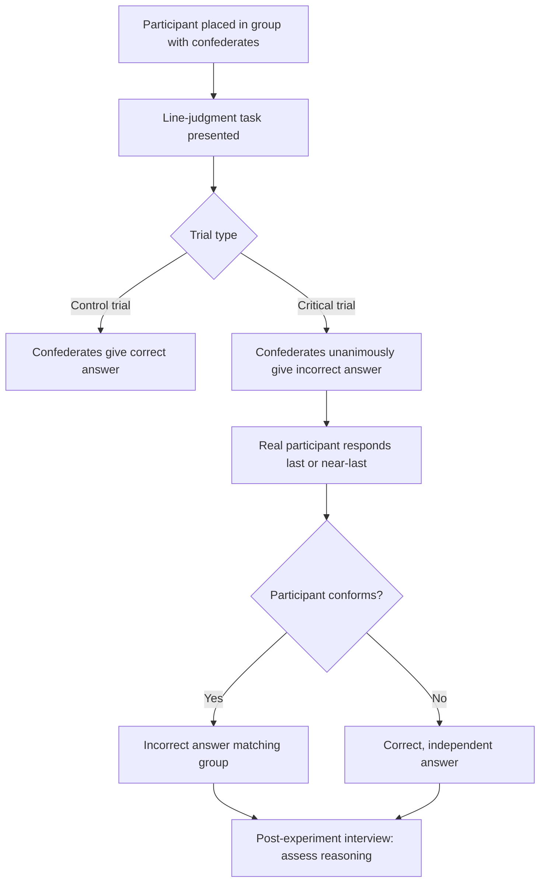

## Asch's Conformity Paradigm

### Overview

Asch's conformity paradigm is a classic experimental procedure developed by Solomon Asch in the early 1950s to study normative social influence — the tendency of individuals to conform to the judgments of a group even on an objectively unambiguous perceptual task. The paradigm demonstrated that a substantial proportion of participants would give a knowingly incorrect answer to align with a unanimous group of confederates, establishing conformity as a robust and measurable social-psychological phenomenon distinct from informational uncertainty.

### Original Procedure

Asch (1951, 1956) presented participants with a simple visual judgment task: identifying which of three comparison lines matched a standard line in length. The correct answer was objectively obvious under normal (non-social) conditions, with control-group error rates below 1%.

**Procedural Structure**

1. A participant is seated in a group with several other individuals, unaware that the others are confederates instructed to give predetermined responses
2. The group is shown a standard line and three comparison lines, and each member states aloud which comparison line matches the standard
3. On neutral ("control") trials, confederates give the correct answer
4. On critical trials, all confederates unanimously give the same, obviously incorrect answer before the real participant responds
5. The real participant's response is recorded, along with post-experiment interviews assessing their reasoning

### Key Findings

**Key Points**

- Across critical trials, approximately 37% of responses conformed to the incorrect majority (varying by study/condition), and roughly three-quarters of participants conformed at least once across a series of critical trials
- Conformity occurred despite the task being unambiguous, distinguishing the effect from informational social influence (which involves genuine uncertainty about the correct answer)
- Substantial individual variation was observed: some participants never conformed, while others conformed on nearly every critical trial
- Post-experiment interviews revealed that participants conformed for varied reasons, including genuine (temporary) perceptual doubt, a belief that the majority must be seeing something they were not, and a desire to avoid standing out or appearing different despite privately believing they were correct

### Manipulated Variables and Boundary Conditions

Asch and subsequent researchers systematically varied the paradigm to identify moderating factors:

| Variable | Effect on Conformity |
| --- | --- |
| Group size | Conformity increases with group size up to roughly 3–4 confederates, after which additional members produce diminishing or negligible additional increases |
| Unanimity | A single dissenting confederate (giving either the correct answer or even a different incorrect answer) sharply reduces conformity, even without providing informational support for the correct response |
| Task difficulty | Conformity increases as the task becomes more ambiguous or difficult, consistent with increased informational uncertainty compounding normative pressure |
| Response modality | Conformity decreases when participants can respond privately (e.g., in writing) rather than publicly aloud, indicating a normative (social approval-seeking) component |
| Confederate status/expertise | Perceived higher status or competence of the confederate majority tends to increase conformity pressure |

### Theoretical Mechanisms

**Normative Social Influence**

The primary explanation for Asch-type conformity is normative social influence: conforming to gain social approval, avoid rejection, or avoid appearing deviant, without necessarily changing one's private belief about the correct answer. This is supported by the finding that private-response conditions reduce conformity, since public disagreement — not private belief — is what triggers social evaluation concerns.

**Informational Social Influence (Secondary Contributor)**

Some conformity in the paradigm reflects informational social influence: genuine, if temporary, doubt about one's own perception when faced with a unanimous contrary group, particularly as task ambiguity increases. Post-experiment interviews indicated that a subset of conforming participants reported actually believing the group's answer was correct, at least momentarily, rather than merely complying outwardly.

**Distinguishing Compliance from Private Acceptance**

Asch's paradigm is frequently used to illustrate the distinction between:

- **Public compliance**: outward agreement with the group without private attitude change
- **Private acceptance**: genuine internalization of the group's judgment as correct

Most Asch-paradigm conformity is interpreted as public compliance rather than private acceptance, since participants' correct perception typically returns when tested individually afterward, though the interview data suggests a minority of cases involved genuine informational doubt.

### The Role of Dissent

The single-dissenter finding is among the most replicated and theoretically significant results from the paradigm: the mere presence of one other non-conforming voice, even if that voice is also objectively incorrect (as long as it breaks unanimity), substantially reduces the focal participant's conformity. This finding is foundational to later research on minority influence and the practical importance of a single ally in resisting group pressure.

### Worked Example

**Example**

In a workplace meeting, several colleagues unanimously (but incorrectly) agree that a project deadline has already been moved up. An employee who privately recalls the original deadline may nonetheless publicly agree with the group rather than voice disagreement, consistent with Asch-paradigm normative pressure — particularly if the disagreement would need to be voiced aloud in front of the group rather than submitted privately, and particularly if no other colleague raises the same objection.

### Applied and Extended Domains

- Jury deliberation and legal decision-making (pressure toward unanimous verdicts)
- Organizational behavior (groupthink-adjacent dynamics in meetings and decision-making bodies)
- Educational settings (peer pressure effects on classroom participation and stated opinions)
- Cross-cultural psychology: conformity rates in replications have varied by cultural context, with some meta-analyses suggesting higher average conformity in more collectivist cultural contexts, though this remains a generalization with substantial within-culture variation
- Clinical and developmental psychology: age-related and individual-difference studies of susceptibility to normative pressure

### Comparison to Related Paradigms

| Paradigm | Focus | Key Distinction from Asch |
| --- | --- | --- |
| Asch conformity | Normative pressure on unambiguous perceptual judgments | Baseline for studying majority influence absent genuine uncertainty |
| Sherif's autokinetic effect studies | Informational influence on ambiguous perceptual judgments | Task is genuinely ambiguous, isolating informational rather than normative influence |
| Milgram obedience studies | Obedience to direct authority instructions | Involves a hierarchical authority figure rather than a peer majority |
| Minority influence research (Moscovici) | Consistent minorities changing majority opinion | Reverses the direction of influence studied in Asch's design |

### Limitations and Critiques

- Ethical concerns regarding deception (confederates, false cover story) reflect broader mid-20th-century research practices that would require substantial modification under contemporary ethical review standards
- Some later replications, particularly outside the United States and across subsequent decades, have found somewhat lower average conformity rates than the original studies, and meta-analytic work indicates conformity levels have shown some historical variation, though the core qualitative effect (unanimous majority pressure inducing conformity) has been widely replicated
- [Unverified] The precise degree to which findings generalize beyond simple, low-stakes perceptual judgment tasks to higher-stakes, real-world normative pressure situations is difficult to establish directly from the original paradigm, since ecological validity concerns apply to any tightly controlled laboratory manipulation
- The original samples were predominantly male American college students, raising generalizability questions addressed only partially by later cross-cultural and demographic replications

### Related Topics

- Normative vs. informational social influence
- Sherif's autokinetic effect and the emergence of social norms
- Minority influence (Moscovici)
- Milgram's obedience studies
- Groupthink
- Social impact theory (Latané)
- Private acceptance vs. public compliance