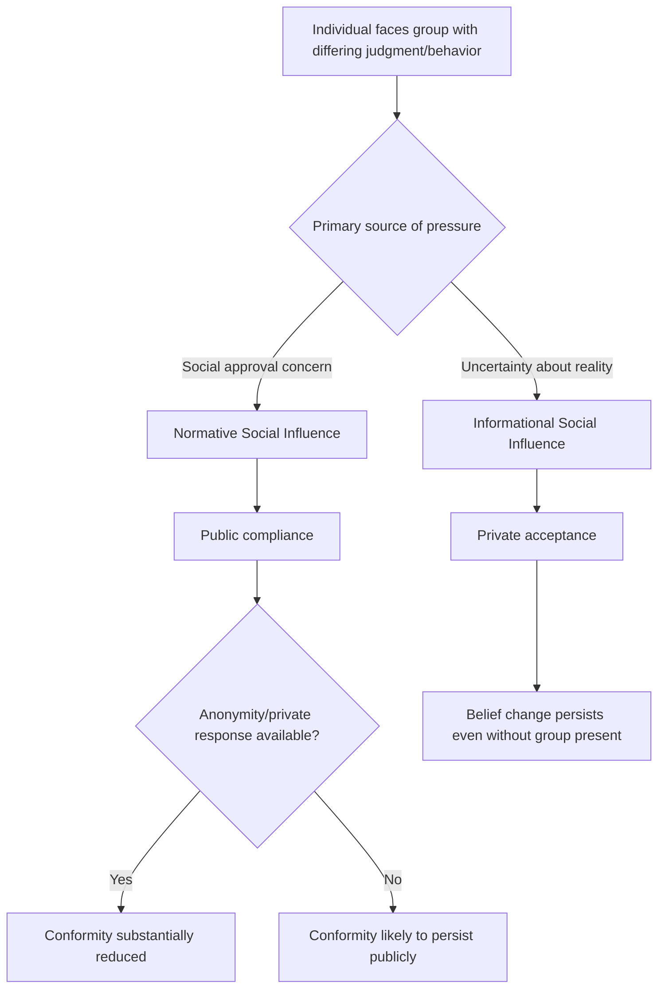

## Normative versus Informational Social Influence

### Overview

Normative and informational social influence represent the two foundational mechanisms by which groups shape individual judgment and behavior, formalized by Deutsch and Gerard (1955). Normative social influence is the tendency to conform to gain social approval, acceptance, or avoid rejection, while informational social influence is the tendency to conform because others' behavior or judgments are treated as evidence about objective reality, particularly under conditions of uncertainty. The distinction is foundational to social influence research and underlies the interpretation of virtually all major conformity, compliance, and obedience findings in the field.

### Formal Definitions

**Normative Social Influence**

Conformity driven by the desire to be liked, accepted, or to avoid social disapproval or rejection, independent of whether the group's position is believed to be factually correct. This typically produces public compliance without necessarily producing private attitude change.

**Informational Social Influence**

Conformity driven by the desire to be correct, using others' judgments or behavior as a source of information about an ambiguous or uncertain reality. This typically produces private acceptance, since the individual genuinely updates their belief based on perceived evidence from others.

### Comparative Framework

| Dimension | Normative Social Influence | Informational Social Influence |
| --- | --- | --- |
| Underlying motive | Desire for social approval / avoidance of rejection | Desire to be correct / reduce uncertainty |
| Typical result | Public compliance | Private acceptance |
| Task conditions favoring it | Unambiguous tasks with clear correct answers | Ambiguous, novel, or difficult tasks |
| Persistence after group removed | Often reverses once social pressure is removed | Tends to persist, since belief was genuinely updated |
| Classic paradigm | Asch's line-judgment conformity studies | Sherif's autokinetic effect studies |
| Effect of anonymity | Substantially reduced under private/anonymous responding | Largely unaffected by anonymity, since it is not about social evaluation |
| Emotional/cognitive experience | Awareness that one's private view differs from the response given | Genuine belief change; little or no felt conflict between private and public view |

### Process Diagram

### Classic Empirical Demonstrations

**Sherif's Autokinetic Effect (Informational)**

Sherif (1935) used the autokinetic effect — an illusion in which a stationary point of light in a dark room appears to move — to study conformity on a genuinely ambiguous perceptual task with no objectively correct answer. Participants' individual estimates of the light's movement converged toward a shared group norm over repeated trials, and this converged estimate persisted even when participants were later tested alone, consistent with genuine informational influence and private acceptance rather than mere public compliance.

**Asch's Line-Judgment Studies (Primarily Normative)**

Asch's conformity paradigm used an unambiguous line-length judgment task, where control-condition error rates were below 1%. Despite the lack of genuine ambiguity, a substantial proportion of participants conformed to a unanimous incorrect confederate majority on critical trials, and conformity dropped sharply when responses could be given privately — evidence that the primary driver was normative rather than informational, since the objective answer was not actually in doubt.

**Key Points**

- The two mechanisms are not mutually exclusive and frequently operate together in the same real-world situation — Asch's post-experiment interviews found that some conforming participants reported genuine, if temporary, perceptual doubt, indicating a partial informational component even in a nominally normative paradigm
- Task ambiguity is the primary moderator distinguishing which mechanism dominates: as ambiguity increases, informational influence becomes relatively more important; as ambiguity decreases (yet social pressure remains, as in unanimous group judgment), normative influence becomes relatively more dominant
- The public/private response manipulation is the standard experimental method for disentangling the two mechanisms, since normative influence is selectively reduced by privacy while informational influence is not

### Theoretical Origin

Deutsch and Gerard's (1955) original formulation grew out of an effort to explain differing conformity results across studies using different paradigms (Sherif's ambiguous-task studies vs. later unambiguous-task studies), proposing that these represented two theoretically distinct forms of social influence rather than a single unified conformity mechanism.

### Boundary Conditions and Moderators

- **Group unanimity**: both forms of influence are substantially reduced when group unanimity is broken by even one dissenter, though the underlying reason differs — for normative influence, a dissenter provides "social cover" reducing fear of standing out alone; for informational influence, a dissenter reduces the apparent strength of the "evidence" that the majority view is correct
- **Group size**: both forms show increasing influence with group size up to a point (typically 3–4 members), with diminishing returns beyond that threshold, though the specific functional relationship has been modeled somewhat differently across theoretical frameworks (e.g., social impact theory)
- **Expertise/credibility of the source**: informational influence is particularly sensitive to the perceived competence of the group or individual providing the judgment, since the entire mechanism rests on the group being a plausible source of accurate information
- **Task importance/accountability**: normative influence can be heightened when the individual expects future interaction with or evaluation by the group, increasing the stakes of social disapproval

### Worked Example

**Example**

A new employee attends their first team meeting where the team is discussing an ambiguous strategic question (which market to prioritize, with no clear objective answer) and later a factual question with a known correct answer (a specific project completion date visible in shared documentation).

- On the ambiguous strategic question, the employee is likely to genuinely update their opinion toward the team's consensus, reflecting **informational social influence**, since they have no strong independent basis for the correct answer and reasonably treat the team's judgment as informative.
- On the factual date question, if the team unanimously (but incorrectly) states the wrong date, the employee may publicly go along with the team's answer despite privately knowing the correct date from the documentation, reflecting **normative social influence** — particularly if they are new and concerned about being seen as combative or as not being a "team player."

### Applications Beyond Conformity Research

- **Compliance techniques**: many principles of compliance (e.g., social proof in Cialdini's framework) operate substantially through informational influence, since "everyone is doing X" is used as evidence that X is the correct or beneficial choice, particularly under uncertainty
- **Obedience research**: Milgram's obedience studies are generally interpreted as involving a distinct mechanism (obedience to perceived legitimate authority) rather than either normative or informational peer influence, though some informational deference to the experimenter's expertise has been discussed as a contributing factor
- **Group polarization and groupthink**: both phenomena are commonly explained using a combination of normative concerns (maintaining group cohesion/avoiding conflict) and informational effects (exposure to a skewed distribution of arguments favoring the initial group leaning)
- **Bystander effect**: informational influence contributes to the bystander effect through pluralistic ignorance — individuals look to others' (inaction) as information about whether a situation is genuinely an emergency

### Limitations and Critiques

- In real-world situations, normative and informational influence are frequently confounded and difficult to cleanly separate outside controlled laboratory manipulations (e.g., the private/anonymous response condition), meaning field applications of the distinction are often more interpretive than experimentally isolated
- [Unverified] The relative weighting of normative versus informational influence in any specific real-world social pressure situation is difficult to quantify precisely without a controlled design directly comparing public and private response conditions
- Some theorists have proposed additional or refined categories of social influence (e.g., referent informational influence within social identity theory, which blends normative and informational elements by grounding "correctness" in in-group norms specifically) suggesting the original two-category framework, while foundational, may not fully capture all conformity mechanisms

### Related Topics

- Asch's conformity paradigm
- Sherif's autokinetic effect and emergence of social norms
- Social identity theory and referent informational influence
- Pluralistic ignorance and the bystander effect
- Milgram's obedience studies
- Groupthink and group polarization
- Cialdini's principles of influence (social proof)