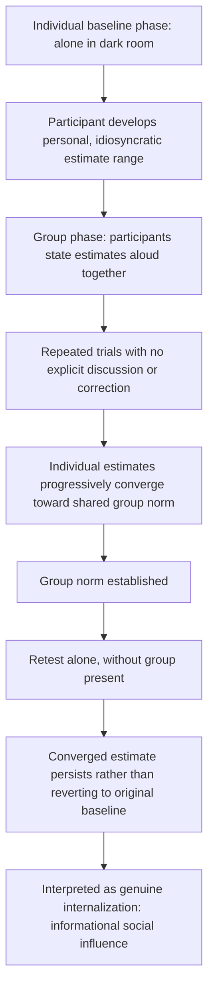

## Sherif's Autokinetic Effect Studies

### Overview

Sherif's autokinetic effect studies (1935, 1936) were among the earliest controlled laboratory demonstrations of social norm formation, using a visual illusion in which a stationary point of light in an otherwise completely dark room appears to move. Because the illusion provides no objective reference point, Muzafer Sherif used it to study how individuals construct subjective judgments under genuine ambiguity, and how those judgments converge toward a shared group norm through social interaction — establishing the paradigm most closely associated with informational social influence.

### The Autokinetic Effect (Perceptual Basis)

The autokinetic effect is a well-documented optical/perceptual illusion: when a single small stationary point of light is viewed in a completely dark room with no other visible reference points, the light appears to drift or move, even though it does not actually move. The illusion arises from the absence of a stable visual frame of reference against which the eye can register the light's true stationary position, combined with small involuntary eye movements. Because there is no genuine "correct" amount of movement to perceive, individual estimates of how far the light moved vary considerably and have no external ground truth against which to be judged right or wrong.

### Original Procedure

**Individual Baseline Phase**

Participants were placed alone in a darkened room and asked to estimate, across repeated trials, how far the stationary light appeared to move. Because the task is genuinely ambiguous, individual participants developed their own personal, idiosyncratic estimate range (a "personal norm") that remained relatively stable across their own individual trials, but varied considerably between different participants.

**Group Convergence Phase**

Participants were then placed in small groups (typically 2–3 people) and asked to state their estimates aloud in each other's presence across repeated trials. Over successive group trials, individual estimates progressively converged toward a shared, group-specific norm, despite no explicit discussion, correction, or external feedback — the mere exposure to others' spoken estimates was sufficient to produce convergence.

**Persistence Phase**

In some study variants, participants who had established a group norm were subsequently tested alone again. The converged, group-influenced estimate tended to persist even in the absence of the group, rather than reverting to the participant's original individual baseline — a key finding indicating genuine private acceptance rather than mere public compliance.

### Key Findings

**Key Points**

- Convergence occurred gradually across repeated trials rather than immediately, consistent with an incremental process of using others' estimates as evidence about the ambiguous stimulus
- The resulting group norm was arbitrary — different groups converged on different specific estimate values, demonstrating that the norm was a socially constructed reference point rather than a discovery of any objective truth
- When individuals who had already independently established group norms in different groups were later combined into new groups, their diverging norms tended to further converge toward a new shared value, illustrating the self-reinforcing nature of norm formation across group compositions
- The persistence of the converged estimate after the group was removed is the key evidence distinguishing this paradigm from primarily normative conformity effects (such as Asch's), since normative compliance is typically expected to weaken once social evaluation pressure is removed

### Order-of-Exposure Variations

Later variants of the paradigm (and related studies) examined whether the sequence of individual-then-group vs. group-then-individual exposure affected the strength and persistence of convergence:

- **Individual-first**: participants establish a personal baseline before group exposure, as in the original design; convergence still occurs but may be somewhat tempered by the participant's prior individual anchor
- **Group-first**: participants are exposed to the group's shared judgment-formation process before ever forming an individual baseline; in this ordering, the group norm can become even more deeply internalized as the participant's "true" reference point, since no prior individual anchor exists to compete with it

### Theoretical Significance: Establishing Informational Social Influence

Sherif's findings became the foundational empirical demonstration for what Deutsch and Gerard (1955) later formally termed informational social influence: conformity driven by using others' judgments as evidence about an objectively uncertain reality, typically producing genuine private acceptance rather than mere public compliance. The autokinetic paradigm's defining feature — genuine ambiguity with no objectively correct answer — isolates this mechanism more cleanly than paradigms involving unambiguous tasks (such as Asch's line-judgment studies), where normative pressure plays a larger relative role.

### Comparison to Asch's Paradigm

| Dimension | Sherif's Autokinetic Studies | Asch's Line-Judgment Studies |
| --- | --- | --- |
| Task ambiguity | High (genuinely uncertain stimulus) | Low (objectively unambiguous answer) |
| Primary mechanism | Informational social influence | Primarily normative social influence |
| Group composition | Naive participants (no confederates in original design) | Confederates giving predetermined incorrect answers |
| Result durability | Persists in solo retesting | Often reverts once social pressure removed |
| Interpretation | Genuine norm internalization | Largely public compliance |
| Norm content | Arbitrary, group-specific, no objectively correct value | Objectively verifiable correct/incorrect answer |

### Worked Example

**Example**

A group of new employees, none of whom have prior experience with a company's informal workplace norms (e.g., how formally to dress on a "business casual" day, which has no explicit written rule), individually form loose personal impressions during their first days. As they observe and discuss with each other over the following weeks, their individual interpretations gradually converge toward a shared, office-specific norm — distinct from what any one new employee might have independently guessed, and persisting in the employee's judgment even when they are, on a given day, dressing without direct reference to coworkers, consistent with the informational-influence and lasting-internalization pattern demonstrated in the autokinetic paradigm.

### Applied and Extended Domains

- Social norm formation and cultural transmission research broadly
- Organizational socialization (how newcomers adopt workplace norms under ambiguity)
- Risky-shift and group polarization research, which extended Sherif-style convergence logic to opinion and judgment domains beyond simple perceptual estimation
- Legal and jury research on how ambiguous evidentiary questions can lead to convergent, socially constructed interpretations among jurors
- [Inference] Contemporary research on norm formation in online communities (e.g., convergence of community-specific behavioral norms on unmoderated ambiguous questions) draws conceptually on Sherif's framework, though this is a more recent extension rather than part of Sherif's original empirical work

### Limitations and Critiques

- The autokinetic effect itself is a somewhat unusual and artificial perceptual stimulus, raising questions about how directly the findings generalize to norm formation on more naturalistic ambiguous judgments encountered in everyday life
- Original studies used small samples and simple statistical analyses by contemporary standards; [Unverified] the precise quantitative parameters of convergence (rate, degree, stability over longer time periods) have not been as extensively re-validated with modern methodological rigor as some other classic conformity paradigms
- The original design did not use confederates, meaning convergence reflects genuine mutual, bidirectional influence among naive participants rather than one-directional pressure from a fixed incorrect majority (as in Asch), which is a meaningful methodological and conceptual distinction sometimes blurred in secondary summaries
- Ethical standards for deception and debriefing in this era of research differ from contemporary norms, though the autokinetic paradigm itself involved comparatively minimal deception relative to other mid-20th-century social psychology studies

### Related Topics

- Normative versus informational social influence
- Asch's conformity paradigm
- Social norms and norm internalization
- Group polarization and the risky-shift phenomenon
- Organizational socialization
- Minority influence (Moscovici)
- Pluralistic ignorance