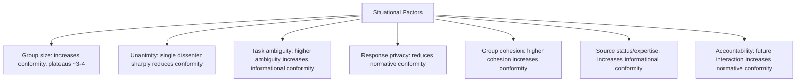

## Situational and Dispositional Factors in Conformity

### Overview

Conformity is influenced by two broad classes of predictors: situational factors, which are properties of the immediate social context (group size, unanimity, task characteristics), and dispositional factors, which are relatively stable individual differences in personality, self-concept, and demographic background that make some people more or less susceptible to social influence across situations. Research since Asch and Sherif's foundational studies has systematically mapped both classes, generally finding that situational factors account for larger and more consistent effects than dispositional factors, though individual differences remain a meaningful moderating layer.

### Situational Factors

**Group Size**

Conformity increases as group (majority) size increases, but with a well-documented curvilinear pattern: increases are steep from one to roughly three or four sources of influence, after which additional group members produce diminishing, and eventually negligible, additional conformity. This nonlinear relationship is formally addressed in social impact theory, which models social influence as a multiplicative function of the strength, immediacy, and number of influence sources, with diminishing marginal impact as the number of sources grows.

**Unanimity and the Presence of Dissent**

The unanimity of the influencing group is one of the strongest situational moderators identified in conformity research. A single dissenter — even one who is also objectively incorrect, as long as they break unanimity — substantially reduces conformity relative to a fully unanimous majority. This effect appears to operate by reducing normative pressure (providing "social cover" for disagreement) and, to a lesser degree, by weakening the informational impression that the correct answer must be obvious.

**Task Ambiguity and Difficulty**

As task ambiguity or difficulty increases, conformity tends to increase, consistent with a growing informational-influence component: increased uncertainty makes the judgments of others more valuable as evidence. This factor interacts with the normative/informational distinction directly, since highly ambiguous tasks shift the balance of influence mechanisms toward informational processes.

**Response Publicity vs. Privacy**

Conformity is substantially reduced when responses can be given privately or anonymously rather than publicly and aloud, isolating the normative component of influence (concern about social evaluation) from any genuine informational belief change.

**Group Cohesion and Attraction**

Conformity tends to increase with the perceived cohesiveness of the group and the individual's desire to belong to or be accepted by that specific group, consistent with normative-influence mechanisms rooted in the motivational value of group membership.

**Status and Expertise of the Source**

Higher perceived status, expertise, or competence of the influencing group or individual tends to increase conformity, particularly for the informational component, since a more credible source provides stronger apparent evidence.

**Accountability and Anticipated Future Interaction**

Expecting future interaction with, or evaluation by, the group tends to increase normative conformity pressure, since the stakes of social disapproval extend beyond the immediate interaction.

### Dispositional Factors

**Self-Esteem**

Lower self-esteem has been associated with somewhat higher conformity in classic research, theorized to reflect greater sensitivity to social evaluation or reduced confidence in one's own independent judgment, though effect sizes for this relationship are generally modest and not fully consistent across studies.

**Need for Social Approval / Affiliation**

Individuals higher in dispositional need for approval or affiliation motivation tend to show greater normative conformity, consistent with the theoretical link between normative influence and social-approval motives.

**Authoritarianism**

Higher scores on measures of authoritarian personality have been associated with increased conformity and deference to group/authority judgments in some classic and subsequent research, though this line of work intersects substantially with obedience research (e.g., work following from the classic authoritarian personality studies) rather than being isolated purely to conformity paradigms.

**Self-Monitoring**

Individuals high in self-monitoring (attentive to and adaptive toward situational social cues) tend to show greater conformity to situational norms, consistent with their general tendency to calibrate behavior to social context.

**Age**

Conformity susceptibility shows developmental patterns, with some research indicating particular sensitivity to peer conformity pressure during adolescence, plausibly linked to heightened salience of peer-group belonging during that developmental period; [Inference] this developmental pattern is more robustly established in peer-relevant domains (e.g., risk-taking, social behavior) than in the original Asch-style perceptual paradigm specifically, which was not designed as a developmental study.

**Culture (Individualism–Collectivism)**

Cross-cultural meta-analyses of Asch-type conformity replications have generally found somewhat higher average conformity rates in more collectivist cultural contexts compared to more individualist contexts, consistent with theorized differences in the relative value placed on group harmony versus individual independence — though this is a population-level generalization with substantial within-culture variability, and should not be treated as a deterministic individual-level predictor.

**Gender**

Some classic studies reported modestly higher conformity among women than men on certain tasks, but this finding has been substantially qualified by later research suggesting the effect is small, inconsistent, and may be confounded by task type (e.g., differential familiarity with stimulus materials used in early studies) rather than reflecting a robust, general gender difference in conformity susceptibility.

### Comparative Summary

| Factor Type | Example Factors | General Strength of Effect |
| --- | --- | --- |
| Situational | Group size, unanimity, task ambiguity, response privacy | Generally large, consistent, and well-replicated |
| Dispositional | Self-esteem, need for approval, self-monitoring, authoritarianism | Generally smaller, more variable effect sizes |
| Cultural/demographic | Individualism-collectivism, age, gender | Population-level tendencies; substantial within-group variance |

### The Person-Situation Interaction

**Key Points**

- Most contemporary treatments emphasize that situational and dispositional factors interact rather than operate independently — a person with high dispositional need for approval will show that tendency most strongly under situational conditions that already favor normative pressure (public responding, unanimous majority, high group cohesion)
- Dispositional factors generally function as moderators of situational effects rather than as independent, standalone predictors of comparable magnitude, consistent with a broader pattern in personality and social psychology research (the person-situation debate) where situational manipulations frequently produce larger average effect sizes than stable individual-difference measures
- [Inference] This asymmetry (situational factors generally outweighing dispositional ones in conformity research specifically) is broadly consistent with, though not identical to, longstanding debates in personality psychology about the relative predictive power of traits versus situations across behavioral domains generally

### Worked Example

**Example**

Two employees with similarly high dispositional need for social approval attend different meetings. In Meeting A, the group is small (3 people), reaches a unanimous but debatable conclusion, and requires a public verbal vote. In Meeting B, the group is larger (10 people) with one vocal dissenter, and opinions are collected via anonymous written ballot. The same dispositionally conformity-prone individual is likely to show much higher observed conformity in Meeting A than Meeting B, illustrating that situational structure can substantially amplify or suppress an underlying dispositional tendency.

### Applications

- Jury selection and deliberation design (understanding which jurors and group structures are more susceptible to pressure toward premature unanimity)
- Organizational meeting design (structuring anonymous input mechanisms to reduce normative conformity pressure on dissenting viewpoints)
- Developmental and educational psychology (peer pressure interventions calibrated to age-related conformity sensitivity)
- Cross-cultural training and international business psychology (anticipating differing baseline conformity tendencies across cultural contexts)
- Clinical and counseling psychology (assessing individual differences in susceptibility to social pressure relevant to certain presenting concerns, such as assertiveness training)

### Limitations and Critiques

- Dispositional conformity measures (e.g., personality inventories) generally show modest correlations with behavioral conformity in laboratory paradigms, raising ongoing questions about how strongly stable traits predict conformity behavior across differing situational contexts
- [Unverified] The degree to which dispositional conformity tendencies observed in laboratory paradigms (line judgments, opinion tasks) generalize to real-world domains with higher stakes (financial decisions, moral judgments, political opinions) is not fully established, since most classic dispositional-conformity research relies on low-stakes experimental tasks
- Much of the classic literature on dispositional factors (self-esteem, authoritarianism) predates contemporary personality assessment standards, and some effect sizes reported in early studies have not been consistently replicated with modern psychometric instruments and larger samples
- Cross-cultural conformity comparisons face persistent measurement-equivalence challenges (whether the same paradigm and task carry identical meaning across cultural contexts), which complicates straightforward interpretation of cross-cultural effect-size differences

### Related Topics

- Asch's conformity paradigm
- Normative versus informational social influence
- Social impact theory
- Sherif's autokinetic effect studies
- Authoritarian personality and obedience
- Person-situation debate in personality psychology
- Cross-cultural psychology and individualism-collectivism