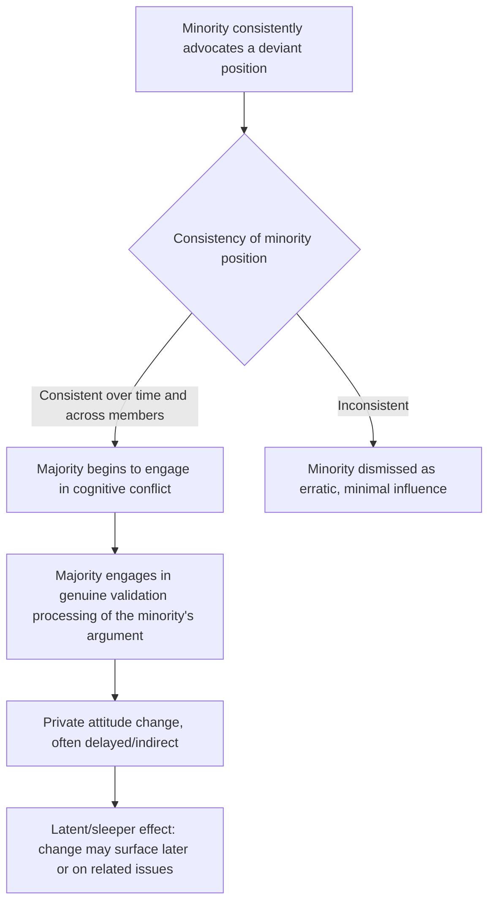

## Minority Influence and Social Change

### Overview

Minority influence refers to the process by which a numerical or positional minority within a group changes the attitudes or behaviors of the majority, reversing the direction of influence studied in classic majority-conformity paradigms such as Asch's. Pioneered primarily by Serge Moscovici, this line of research demonstrates that minorities can produce genuine, durable attitude change under specific conditions, and provides a social-psychological account of how social and political change originates from initially small dissenting factions.

### Origin and Theoretical Motivation

Moscovici's work in the 1960s and 1970s developed partly as a corrective to the majority-centric focus of earlier conformity research (Asch, Sherif), which implicitly treated social influence as a one-directional process from majority to individual. Moscovici argued that if influence only ever flowed from majorities to minorities, social change and innovation would be theoretically inexplicable, since all historical instances of social change necessarily began with a minority position. Genetic (developmental) social psychology, as Moscovici termed his broader framework, treats conflict between majority and minority positions as a normal and productive feature of group life rather than a pathology to be resolved through simple conformity.

### The Blue-Green Paradigm

Moscovici's classic experimental demonstration (1969) used a color-perception task: participants viewed a series of unambiguously blue slides, with confederates comprising a minority of the group consistently calling the slides "green."

**Key Findings**

- A minority consistently labeling objectively blue slides as green produced a modest but statistically reliable increase in the real participants' own "green" responses relative to a no-confederate control condition
- Minority influence effects were considerably smaller in magnitude than typical majority conformity effects (as in Asch), but were nonetheless genuine and measurable
- Follow-up testing using an ambiguous blue-green color perception task administered privately afterward showed that exposed participants shifted their color category boundaries, suggesting the influence extended to private perceptual judgment, not merely public response — an early indication that minority influence can produce genuine private (rather than only public) change

### Conditions for Minority Influence

**Behavioral Consistency**

Consistency is considered the single most critical factor enabling minority influence. A minority position must be expressed consistently — both across time (the same position maintained repeatedly) and consensually (agreement among minority members) — to be taken seriously rather than dismissed as random, uninformed, or unreliable. Inconsistent minorities exert minimal influence, since their position appears arbitrary rather than a genuine, considered stance.

**Key Points**

- Consistency signals confidence, commitment, and a genuine alternative worldview, prompting the majority to engage in effortful cognitive processing of the minority's argument rather than dismissing it out of hand
- Rigid, dogmatic consistency (refusing any flexibility whatsoever) can backfire by making the minority appear inflexible or unreasonable, whereas a degree of perceived flexibility or willingness to negotiate style (while maintaining the core position) tends to be more persuasive — a nuance developed in later refinements of the theory
- Minority influence effects tend to be smaller in immediate, direct, public measures than majority conformity effects, but are theorized to be more durable and more likely to produce genuine private attitude change (private acceptance) rather than mere public compliance

### Theoretical Mechanism: The Conversion Process

Moscovici's conversion theory proposes that majority and minority influence operate through qualitatively different cognitive processes:

| Dimension | Majority Influence | Minority Influence |
| --- | --- | --- |
| Typical processing | Comparison process — quick, low-effort matching of one's response to the perceived correct/socially expected answer | Validation process — effortful, deliberate consideration of the minority's argument and its merits |
| Typical result | Fast public compliance, often without private belief change | Slower, more indirect, but potentially genuine private attitude change |
| Attentional focus | Focus on the response itself (matching majority's answer) | Focus on the reasoning/content behind the position |
| Direct vs. indirect measurement | Effects often visible on directly measured, related items | Effects sometimes emerge more strongly on indirect or related (rather than the exact focal) measures — sometimes termed the "indirect" or "latent" effect |

### The Latent/Sleeper Effect in Minority Influence

A distinctive finding in minority influence research is that measurable attitude change sometimes appears more strongly, or with a delay, on indirect or related measures rather than immediately on the exact focal issue the minority argued about. This is interpreted as evidence that the majority processes and comes to terms with the minority's position privately over time, even while resisting immediate, public capitulation on the specific contested point — consistent with the deeper, more effortful validation processing proposed by conversion theory.

### Comparison to Majority Conformity

| Dimension | Majority Conformity (e.g., Asch) | Minority Influence (Moscovici) |
| --- | --- | --- |
| Direction of influence | Majority → individual | Minority → majority |
| Primary mechanism | Predominantly normative | Predominantly informational/cognitive (validation) |
| Speed of effect | Fast, immediate | Slower, sometimes delayed |
| Public vs. private change | Primarily public compliance | Greater tendency toward private/genuine change |
| Critical enabling condition | Group unanimity | Minority consistency |

### Worked Example

**Example**

A small group of employees within a large organization consistently and unanimously argues over an extended period, across multiple meetings, that the company's remote-work policy should change, even as they remain a clear numerical minority. Because their position is expressed consistently (same argument, same conviction, sustained over time) rather than sporadically, other employees begin engaging seriously with the argument's substance rather than dismissing it outright. Public policy change may not occur immediately, but individual employees may privately begin to favor more flexible work arrangements, with the shift becoming more visible later — for example, in support for a related but distinct proposal — illustrating both the consistency requirement and the latent/indirect effect pattern documented in minority influence research.

### Applications to Social and Political Change

- **Social movements**: minority influence theory provides a social-psychological framework for understanding how initially small activist movements (civil rights, environmental, labor movements) can shift broader societal attitudes over time through sustained, consistent advocacy
- **Innovation diffusion**: organizational and consumer behavior research has drawn on minority influence concepts to explain how initially unconventional ideas or products gain broader acceptance
- **Jury deliberation**: a consistent, confident lone dissenting juror can shift the eventual group verdict, an applied illustration directly connected to both minority influence and the dissent-effects literature from majority conformity research
- **Organizational change management**: consistent internal advocacy by a committed minority faction (a "coalition of the willing") is a recognized pathway for organizational culture and policy change, distinct from top-down majority-mandated change

### Limitations and Critiques

- Effect sizes for minority influence in controlled laboratory studies are generally modest, and there has been ongoing debate about how reliably and strongly the "conversion" (private, indirect) effect replicates compared to the more directly observable comparison-based majority effects
- [Unverified] The precise conditions under which a minority position transitions from being ignored/dismissed to genuinely engaged with (the tipping point of perceived credibility and consistency) are not fully specified by the theory and likely depend heavily on contextual factors (topic, group composition, broader social climate) not fully captured in laboratory color-perception paradigms
- Laboratory minority-influence paradigms (e.g., blue-green slide judgments) are somewhat removed from the complexity of real-world social and political minority movements, which involve additional factors (media coverage, resource mobilization, competing majority countermovements) not present in the simplified experimental setting
- [Inference] The relative contribution of minority consistency versus other factors documented in later research (e.g., perceived flexibility, minority members' perceived investment/sacrifice for their position) to real-world social change processes remains difficult to disentangle outside controlled studies, and much of the applied social-movement literature draws on the theory more as an organizing framework than as a precisely tested causal model

### Related Topics

- Asch's conformity paradigm
- Normative versus informational social influence
- Groupthink and group polarization
- Social change and collective action psychology
- Innovation diffusion theory
- Jury decision-making and deliberation dynamics
- Sherif's autokinetic effect studies