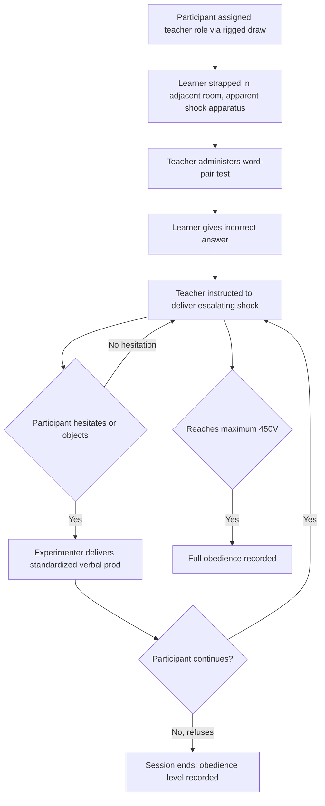

## Milgram's Obedience Studies

### Overview

Milgram's obedience studies, conducted by Stanley Milgram beginning in 1961, are among the most well-known and controversial experiments in social psychology, designed to investigate the conditions under which ordinary individuals would obey an authority figure's instructions to inflict apparent harm on another person. The studies demonstrated a surprisingly high rate of obedience to destructive commands, providing an influential — though contested — social-psychological framework for understanding atrocities committed by ordinary people under authoritative direction, most notably invoked in relation to Holocaust-era compliance.

### Original Procedure

**Cover Story and Roles**

Participants were recruited under the cover story of a study on memory and learning. Each session involved a "teacher" (the real participant), a "learner" (a confederate who was, unbeknownst to the participant, never actually shocked), and an experimenter in a lab coat who directed the session and represented the authority figure.

**Procedural Structure**

1. The participant was assigned (via a rigged draw) to the "teacher" role, with the confederate assigned to "learner"
2. The learner was strapped into an apparatus in an adjacent room, ostensibly wired to receive electric shocks
3. The teacher administered a word-pair memory test, and was instructed to deliver an escalating electric shock to the learner for each incorrect answer, using a shock generator with labeled voltage levels ranging from 15 volts ("Slight Shock") up to 450 volts ("Danger: Severe Shock," followed by an ominous unlabeled "XXX" designation at the highest levels)
4. As shock levels increased, the learner (via a pre-recorded audio track) expressed increasing discomfort, then pain, then desperate pleas to stop, and eventually ominous silence at higher voltage levels
5. If the participant expressed hesitation or a desire to stop, the experimenter delivered a standardized sequence of verbal prods ("Please continue," "The experiment requires that you continue," "It is absolutely essential that you continue," "You have no other choice, you must go on")
6. The primary dependent measure was the maximum shock level the participant was willing to administer before refusing to continue

### Key Findings

**Key Points**

- In the original baseline variant, approximately 65% of participants proceeded to administer the maximum 450-volt shock, despite the learner's apparent extreme distress and eventual silence at high voltage levels
- Virtually all participants continued to at least the 300-volt level, at which point the learner (per the script) pounded on the wall and then stopped responding
- Many participants displayed visible signs of significant stress and internal conflict — sweating, trembling, nervous laughter, and verbal protest — while nonetheless continuing to comply with the experimenter's instructions
- Pre-experiment predictions by psychiatrists, psychology students, and the general public substantially underestimated the actual obedience rates, expecting only a small minority of participants (often estimated around 1%) to proceed to the maximum shock level

### Systematic Variations and Boundary Conditions

Milgram and subsequent researchers conducted numerous procedural variations to identify the conditions that increased or decreased obedience:

| Variation | Effect on Obedience |
| --- | --- |
| Physical proximity to the learner (same room vs. separate room) | Obedience decreases as physical proximity/visibility of the victim increases |
| Physical proximity to the experimenter (same room vs. via telephone) | Obedience decreases substantially when the experimenter gives instructions remotely rather than in person |
| Presence of disobedient peer confederates | Obedience decreases sharply when the participant witnesses fellow "teachers" (confederates) refusing to continue |
| Institutional prestige/location (Yale University vs. a nondescript office setting) | Obedience decreases somewhat, though remains substantial, in a lower-prestige setting |
| Requiring the participant to physically place the learner's hand on a shock plate | Obedience decreases, though a substantial minority still comply even under direct physical contact conditions |
| Diffusion of responsibility (participant instructs another confederate to administer the actual shock) | Obedience increases when the participant is once removed from direct administration of harm |

### Theoretical Explanations

**Agentic State Theory**

Milgram's own primary theoretical explanation was the agentic state: under legitimate hierarchical authority, individuals shift from viewing themselves as autonomous, personally responsible agents to viewing themselves as agents carrying out another person's will, thereby psychologically transferring perceived moral responsibility for the outcome to the authority figure rather than themselves.

**Legitimate Authority and Institutional Context**

Obedience was theorized to depend heavily on the perceived legitimacy of the authority figure and the institutional context framing the interaction; reductions in obedience observed when prestige/institutional setting was degraded are consistent with this explanation, since a less legitimate-seeming authority carries reduced psychological weight.

**Gradual Commitment and the Foot-in-the-Door Parallel**

The incremental, step-by-step escalation of shock levels has been noted as structurally similar to foot-in-the-door dynamics: each small increment is a relatively minor escalation from the previous compliant act, making a sudden refusal at any given step feel inconsistent with the participant's own prior established pattern of compliance.

**Buffers and Psychological Distance**

The proximity variations (physical distance from victim, remote vs. in-person experimenter instructions) demonstrated that psychological "buffers" — reduced direct perceptual or causal connection to the consequence of one's action — substantially facilitate obedience to harmful instructions, a finding with broader relevance to research on moral disengagement.

### Worked Example

**Example**

A junior employee is instructed by a senior manager to withhold safety-relevant information from a client because "it's standard practice and the company requires it." Even though the employee experiences internal discomfort, the presence of an ostensibly legitimate authority figure issuing an explicit, standardized-sounding directive, combined with psychological distance from the client (who is not physically present), can increase compliance relative to a scenario where the employee interacts directly and visibly with the affected client, mirroring the proximity and authority-legitimacy findings from Milgram's variations.

### Ethical Controversy and Methodological Legacy

- The original studies generated substantial and lasting ethical controversy due to the psychological distress experienced by participants during the procedure and the use of deception without informed consent about the study's true purpose
- The controversy surrounding Milgram's methods was a significant contributing factor in the development of modern research ethics standards, including institutional review board (IRB) processes and more stringent informed consent and debriefing requirements in psychological research
- Contemporary replications (where permitted under modern ethical constraints) have generally used partial or modified paradigms — such as stopping the procedure at a lower "point of no return" voltage level rather than allowing participants to reach the maximum shock — to reduce participant distress while still measuring obedience tendencies

### Applications and Broader Significance

- Understanding institutional and organizational compliance with harmful directives (e.g., whistleblower research, corporate misconduct, military conduct)
- Historical and political analysis of mass atrocity, particularly discussions of ordinary individual participation in state-directed violence (most prominently, though not without significant scholarly debate, in relation to Holocaust perpetration)
- Healthcare and organizational hierarchy research examining obedience to authority in contexts where junior staff may hesitate to challenge senior authority even when they perceive potential harm (a concern studied in some medical safety and error-prevention literature)
- Foundational reference point for research on destructive obedience, moral disengagement, and whistleblowing behavior

### Limitations and Critiques

- Archival research on Milgram's original data and recordings (conducted decades later) has raised questions about the degree of experimenter improvisation beyond the standardized prod script, participant skepticism about whether the shocks were genuinely real, and variability in how strictly the procedure was implemented across sessions, complicating a fully literal interpretation of the reported obedience rates
- [Unverified] The degree to which explicit obedience to a scripted laboratory authority figure directly generalizes to complex, real-world authority relationships (which involve additional factors such as ongoing employment relationships, gradual normalization of harmful practices over extended time periods, and diffuse rather than singular authority figures) remains debated, and the original paradigm's ecological validity is a long-standing point of critique
- Some historians and social psychologists have argued that ideological identification with the authority's goals (rather than purely agentic, identity-suppressing obedience) played a substantial role in participants' compliance, representing a partial theoretical alternative or supplement to Milgram's original agentic-state account
- The gender, cultural, and demographic composition of original samples (predominantly white American men in the initial studies) raises generalizability questions, partially, though not fully, addressed by later cross-cultural and gender-inclusive replication attempts

### Related Topics

- Agentic state theory
- Asch's conformity paradigm
- Foot-in-the-door and door-in-the-face techniques
- Moral disengagement and diffusion of responsibility
- Authoritarian personality
- Research ethics and informed consent standards
- Bystander effect and diffusion of responsibility