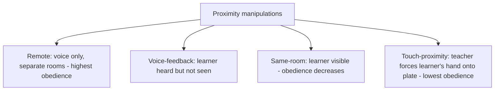

## Situational Determinants of Obedience

### Overview

Situational determinants of obedience refer to the specific contextual and procedural variables that Stanley Milgram and subsequent researchers systematically manipulated to identify which features of a social situation increase or decrease compliance with an authority figure's instructions to perform harmful acts. This body of research shifted the primary explanatory emphasis for destructive obedience away from stable personality traits (a "few bad apples" or authoritarian-personality account) and toward the power of situational structure, making it a foundational case study for situationism in social psychology.

### Physical and Psychological Proximity to the Victim

**Key Points**

- Obedience decreases as the physical proximity and perceptual immediacy of the victim increases; when the learner was in the same room as the teacher and directly visible, obedience rates were lower than in the original voice-only, separate-room condition
- The **touch-proximity condition**, requiring the participant to physically force the learner's hand onto a shock plate, produced the lowest obedience rate among the classic proximity variations, though a meaningful minority of participants still complied even under direct physical contact
- These findings are interpreted as evidence that psychological distance functions as a buffer, reducing the salience of the victim's suffering and thereby reducing the moral weight the action carries for the participant — a mechanism with clear conceptual overlap with moral disengagement research

### Proximity and Legitimacy of the Authority Figure

- **Authority proximity**: obedience decreased substantially when the experimenter delivered instructions remotely (e.g., by telephone) rather than being physically present in the room, indicating that the authority figure's perceptual immediacy matters at least as much as, and possibly more than, the victim's proximity
- **Institutional prestige and setting**: obedience decreased, though remained substantial, when the study was conducted in a modest commercial office setting rather than at a prestigious university (Yale), suggesting the perceived legitimacy of the institutional context contributes to compliance, separate from the individual authority figure's personal characteristics
- **Uniform and role markers**: an authority figure's visible symbols of legitimate role (lab coat, formal title, official-seeming apparatus) are theorized to reinforce perceived legitimacy and contribute to obedience, consistent with broader research on authority cues in compliance

### Presence of Disobedient or Obedient Models

Exposure to the behavior of peers performing the same role produced some of the largest observed effects in the variation studies:

- When participants observed **confederate peers refusing to continue** the procedure, obedience among real participants dropped sharply, illustrating that a visible model of disobedience can substantially undercut authority-based compliance, conceptually parallel to the dissent-effect findings in Asch's conformity paradigm
- Conversely, when the participant's role was limited to a supporting function (e.g., reading word lists) while another individual administered the shocks directly, obedience among participants in the supporting role remained very high, illustrating a **diffusion of responsibility** effect

### Gradual, Incremental Escalation

The stepwise structure of the shock generator — starting at a mild, easily justified level and increasing in small increments — is considered a critical situational feature independent of the specific voltage labels used:

- Each incremental step represented only a small escalation from the previous, already-completed step, making abrupt refusal at any single point feel inconsistent with the participant's own immediately preceding behavior
- This incremental structure is frequently compared to the foot-in-the-door compliance mechanism, where early small commitments make later, larger commitments more likely through a self-perception or consistency-based process

### Degree of Personal Responsibility and Task Structure

- **Direct vs. delegated action**: obedience increased when participants were once removed from directly administering the harmful act (e.g., instructing another party to deliver the shock) compared to performing the act themselves, consistent with reduced perceived personal responsibility under delegated task structures
- **Absence of a script or clear protocol for refusal**: participants were not given an explicit, socially sanctioned way to exit the situation; the prods used by the experimenter ("The experiment requires that you continue") provided a continuation script but no equivalent scripted permission to stop, which may have made spontaneous refusal more socially and cognitively effortful

### Time for Reflection and Commitment Momentum

- [Inference] Some analyses of the Milgram paradigm suggest that the rapid, continuous pacing of the procedure — trial after trial in quick succession — limited participants' opportunity for extended reflection on the cumulative pattern of their actions, a factor distinct from, but potentially compounding, the incremental-commitment mechanism described above; this interpretation is a secondary analytical account rather one of Milgram's own directly tested experimental variables

### Comparative Summary of Key Situational Manipulations

| Situational Variable | Direction of Effect on Obedience |
| --- | --- |
| Increased victim proximity/visibility | Decreases |
| Increased authority proximity (in-person vs. remote) | Increases |
| Higher institutional prestige/legitimacy | Increases |
| Presence of disobedient peer models | Decreases sharply |
| Delegated (vs. direct) administration of harm | Increases |
| Incremental, small-step escalation | Increases (relative to an equivalent single large step) |
| Explicit permission/model for refusal | Decreases (when present) |

### Worked Example

**Example**

A hospital's chain-of-command culture requires nurses to escalate any concerns about a physician's orders only through a formal, multi-step channel, while physicians are physically present on the ward and carry high institutional prestige. A nurse who has concerns about an order may be more likely to comply without objection under these conditions than in a setting with (a) less rigid hierarchical distance between roles, (b) visible precedent of colleagues raising concerns without penalty, and (c) direct, unmediated communication with the patient affected by the decision — illustrating how several of Milgram's situational determinants (authority proximity/prestige, absence of disobedient models, patient/victim distance) can combine in applied organizational contexts. This mapping is illustrative of the theoretical mechanisms rather than a direct empirical replication of the original laboratory findings.

### Theoretical Integration: Situationism vs. Dispositionism

The systematic, large, and consistent effects produced by relatively modest procedural changes (rather than differences between individual participants) became a landmark case for the situationist position in the broader person-situation debate in personality and social psychology — the argument that behavior is frequently driven more powerfully by situational context than by stable individual traits. This interpretation has been influential but is not without qualification, since individual variation in obedience persisted within every situational condition studied (no manipulation produced 0% or 100% obedience), indicating that dispositional factors retain some explanatory role even within the situationist framework.

### Applications

- Organizational and healthcare hierarchy research on structuring "psychological safety" and normalized dissent channels to counteract destructive-obedience risk
- Military and institutional ethics training, addressing how chain-of-command structures can be paired with explicit protocols for conscientious objection or escalation of concerns
- Whistleblower protection policy design, informed by research on the situational barriers (proximity, diffusion of responsibility, absence of disobedient models) that suppress dissent
- Crisis and disaster-response training, where incremental escalation of directives under authority pressure can parallel the gradual-commitment dynamics identified in the obedience paradigm

### Limitations and Critiques

- As with the broader Milgram literature, the precise generalizability of laboratory-derived situational effect sizes to complex, real-world authority hierarchies (which involve longer time horizons, ongoing relationships, and more diffuse authority structures) remains a matter of scholarly debate rather than settled fact
- [Unverified] The relative causal weight of each situational variable when several occur simultaneously in a real-world setting (as opposed to being isolated one at a time in controlled variations) has not been extensively tested, since Milgram's original variations generally manipulated one factor at a time against an otherwise standard baseline procedure
- Contemporary ethical constraints on replicating the full original paradigm limit the ability to directly re-test some of the more extreme situational variations (e.g., touch-proximity) under modern research standards, meaning some classic findings rely on the original mid-20th-century data without full independent replication under current methodological rigor

### Related Topics

- Milgram's obedience studies
- Agentic state theory
- Moral disengagement and diffusion of responsibility
- Asch's conformity paradigm
- Foot-in-the-door and door-in-the-face techniques
- Person-situation debate in personality psychology
- Whistleblowing and organizational dissent