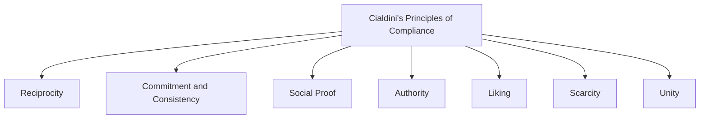

## Cialdini's Principles of Compliance

### Overview

Cialdini's principles of compliance are a set of psychological levers identified by Robert Cialdini, originally through a program of participant-observation research across sales, fundraising, and marketing professions, that systematically increase the likelihood that a person will agree to a request. Originally formalized as six principles in *Influence: The Psychology of Persuasion* (1984), the framework was later expanded to seven principles with the addition of unity. The principles are widely used both as a descriptive account of everyday compliance-gaining tactics and as a practical toolkit referenced across marketing, negotiation, and behavioral-design contexts.

### The Seven Principles

### Reciprocity

**Definition**: People feel obligated to return favors, gifts, or concessions given to them by others, and this obligation can be leveraged to increase compliance with a subsequent request.

**Key Points**

- The obligation to reciprocate can be triggered even by small, unsolicited gifts or favors, and even when the recipient did not want or request the initial gift
- Reciprocity underlies techniques such as free samples, complimentary consultations, and the door-in-the-face technique, where an apparent concession from a large to a smaller request triggers reciprocal concession from the target
- The norm of reciprocity is considered a near-universal social norm across human cultures, contributing to its broad practical effectiveness as a compliance principle

**Example**

A charity includes a small gift (such as personalized address labels) with a donation request mailer. Recipients who might otherwise discard the request feel a mild obligation to reciprocate the unsolicited gift, increasing donation rates relative to a request with no accompanying gift.

### Commitment and Consistency

**Definition**: Once people make a commitment (especially an active, public, or freely chosen one), they experience internal and social pressure to behave consistently with that prior commitment, even when circumstances change.

**Key Points**

- This principle underlies the foot-in-the-door technique (small initial commitment increasing compliance with a larger subsequent request) and the low-ball technique (commitment maintained even after unfavorable terms are revealed)
- Written, public, and effortful commitments produce stronger consistency pressure than private, passive, or low-effort ones
- The theoretical mechanism draws on self-perception theory (inferring one's own attitudes from observed behavior) and cognitive dissonance avoidance (discomfort from behaving inconsistently with a prior stance)

### Social Proof

**Definition**: People look to the behavior of others, particularly similar others, as a guide for their own correct behavior or judgment, especially under conditions of uncertainty.

**Key Points**

- Social proof is most influential when the situation is ambiguous and when the "others" being observed are perceived as similar to oneself
- Common applications include customer review counts, "bestseller" or "most popular" labels, testimonials, and statements of widespread adoption ("join millions of satisfied customers")
- Theoretically related to informational social influence and to the mechanisms underlying Sherif's autokinetic-effect norm-convergence findings

### Authority

**Definition**: People are more likely to comply with requests from individuals perceived as legitimate authorities, experts, or credible sources.

**Key Points**

- Authority cues can be substantive (genuine credentials, expertise, demonstrated track record) or purely symbolic (titles, uniforms, official-seeming trappings), with symbolic cues alone shown to increase compliance even absent genuine underlying expertise
- This principle connects directly to Milgram's obedience research, which demonstrated the substantial behavioral power of perceived legitimate authority even in ethically fraught contexts
- Common applications include expert endorsements, professional credentials, and titles or uniforms signaling official status

### Liking

**Definition**: People are more easily persuaded by and more likely to comply with requests from individuals they like, with liking increased by factors such as physical attractiveness, similarity, compliments, familiarity, and cooperative association.

**Key Points**

- Several sub-factors reliably increase liking-based compliance: physical attractiveness (a documented "halo effect" extending to perceived competence and trustworthiness), similarity to oneself (in background, opinions, or even minor incidental traits), receiving genuine or flattering compliments, and repeated positive contact (mere exposure effect)
- Applications include the use of relatable spokespeople in advertising, rapport-building sales techniques, and network-based sales models (e.g., party-plan sales) that leverage pre-existing personal relationships rather than relying on liking built from scratch

### Scarcity

**Definition**: People assign greater value to opportunities, objects, or information perceived as scarce, limited, or dwindling in availability, and are more motivated to acquire them under time or quantity pressure.

**Key Points**

- Scarcity operates partly through loss aversion (the prospect of missing out is more motivating than an equivalent prospective gain) and partly through an inference heuristic (scarce items are assumed to be more valuable or desirable)
- Common applications include "limited time only" framing, low-stock notifications, exclusive/limited-edition releases, and deadline-based urgency messaging
- Scarcity effects tend to be stronger for newly restricted availability (something that was previously abundant becoming scarce) than for items that have always been scarce, and stronger under competitive scarcity (competing with other people for a limited resource) than simple time-limited scarcity

### Unity

**Definition**: Added in Cialdini's later work, unity refers to compliance increases driven by a shared social identity or sense of belonging to the same group ("we-ness") between the requester and target, distinct from mere liking or similarity.

**Key Points**

- Unity is theorized to operate through in-group identification processes (conceptually related to social identity theory) rather than simple interpersonal attraction, making it a categorically distinct principle from liking despite surface similarity
- Applications include marketing and political messaging that explicitly frames the audience and requester as members of a shared category ("as fellow [group identity], we understand...") and family/community-based appeals invoking shared identity or heritage

### Comparative Summary

| Principle | Core Driver | Classic Application |
| --- | --- | --- |
| Reciprocity | Obligation to return favors | Free samples, gifts before requests |
| Commitment/Consistency | Pressure to align with prior stance | Foot-in-the-door, low-ball technique |
| Social Proof | Uncertainty resolved via others' behavior | Reviews, bestseller labels, testimonials |
| Authority | Deference to perceived expertise/legitimacy | Expert endorsement, credentials, titles |
| Liking | Persuasion increases with interpersonal fondness | Attractive/similar spokespeople, rapport-building |
| Scarcity | Loss aversion and value inference from limited availability | Limited-time offers, low-stock alerts |
| Unity | Shared in-group identity ("we-ness") | Identity-based group appeals |

### Theoretical Relationship to Broader Persuasion Research

Cialdini's principles are generally understood as operating predominantly through peripheral-route processing in dual-process persuasion frameworks (the Elaboration Likelihood Model), since most rely on heuristic cues (authority symbols, social consensus, scarcity signals) rather than requiring careful evaluation of message content. This positions the framework as complementary to, rather than a replacement for, central-route argument-based persuasion models, and explains why the principles tend to be particularly effective in low-involvement or time-pressured decision contexts.

### Worked Example

**Example**

An online retailer's checkout page combines several principles simultaneously: a countdown timer showing the sale ending in one hour (**scarcity**), a note that "1,204 people bought this in the last week" (**social proof**), a badge indicating the product is "recommended by certified professionals" (**authority**), a message thanking the customer for their loyalty with a small unexpected discount (**reciprocity**), and framing referencing "members of our community" (**unity**). This layered application illustrates how commercial persuasion design frequently stacks multiple principles within a single interface rather than relying on any one in isolation.

### Applications Beyond Sales and Marketing

- Public health behavior-change campaigns (social proof and authority applied to vaccination or healthy-behavior messaging)
- Behavioral economics and "nudge" policy design (particularly social proof and commitment devices in areas such as tax compliance and energy conservation)
- Negotiation and workplace influence tactics
- Political campaigning and civic engagement messaging (unity and social proof applied to voter turnout campaigns)
- User-experience and interface design ("dark patterns" debates specifically concern the ethical boundary of applying scarcity and social proof cues in digital interfaces)

### Limitations and Critiques

- The principles were derived substantially through applied field observation of practicing "compliance professionals" (salespeople, fundraisers) rather than solely from controlled laboratory experimentation, and while many individual principles have since been validated experimentally, the original integrative framework is sometimes characterized as more of a practitioner-oriented synthesis than a single tightly unified theoretical model
- [Unverified] The relative strength of each principle varies considerably by context, culture, and individual differences, and few studies have directly compared all seven principles' effect sizes against one another under equivalent conditions, making claims about which principle is "strongest" generally difficult to support with precise evidence
- Ethical concerns are frequently raised regarding the deliberate, non-transparent application of these principles, particularly scarcity and social proof, in digital "dark pattern" interface design, where the line between legitimate persuasive design and manipulative exploitation of automatic psychological responses is actively debated in both academic and regulatory contexts
- Overuse or transparent application of any single principle (e.g., obviously manufactured scarcity) can trigger reactance or skepticism (via the persuasion knowledge model), potentially reversing the intended effect

### Related Topics

- Foot-in-the-door and door-in-the-face techniques
- The low-ball technique
- Elaboration Likelihood Model and dual-process persuasion
- Social identity theory
- Persuasion in advertising and marketing
- Milgram's obedience studies
- Reactance theory and resistance to persuasion