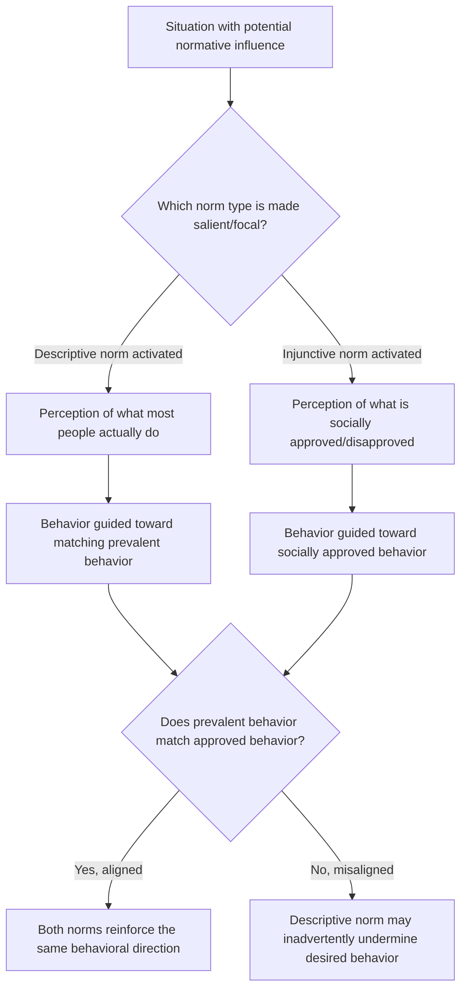

## Descriptive versus Injunctive Social Norms

### Overview

Descriptive and injunctive norms are two theoretically distinct types of social norms formalized primarily by Cialdini, Reno, and Kallgren (1990, 1991) within their focus theory of normative conduct. Descriptive norms refer to perceptions of what most people actually do in a given situation, while injunctive norms refer to perceptions of what most people approve or disapprove of — what one ought to do. The distinction matters because the two norm types can point in different directions and produce different, sometimes conflicting, behavioral effects, and because only the norm type that is cognitively "focal" (salient in attention) at the moment of decision is likely to guide behavior.

### Formal Definitions

**Descriptive Norms**

Perceptions of the prevalence of a behavior — what most people actually do in a given context. Descriptive norms motivate behavior by providing informational evidence about what is likely to be effective or adaptive, operating similarly to informational social influence.

**Injunctive Norms**

Perceptions of what is socially approved or disapproved of — what most people believe one *should* or *should not* do, independent of what people actually do. Injunctive norms motivate behavior through the anticipation of social sanctions (approval or disapproval), operating similarly to normative social influence.

### Comparative Framework

| Dimension | Descriptive Norms | Injunctive Norms |
| --- | --- | --- |
| Core question answered | "What do most people do?" | "What do most people approve/disapprove of?" |
| Underlying psychological process | Primarily informational (efficiency/adaptiveness heuristic) | Primarily normative (social sanction anticipation) |
| Source of motivation | Evidence about what is effective, typical, or safe | Anticipated social approval or disapproval |
| Can it inadvertently backfire? | Yes — highlighting a high prevalence of an undesirable behavior can normalize it | Less prone to this specific backfire, since it directly states the approved standard |
| Classic experimental domain | Littering studies, hotel towel-reuse studies | Littering studies, hotel towel-reuse studies (often tested alongside descriptive norms in the same paradigms) |

### The Focus Theory of Normative Conduct

Cialdini and colleagues proposed that norms only reliably influence behavior when they are cognitively activated or "focal" at the moment of the relevant decision. A norm that exists but is not salient to the individual in that specific context is unlikely to guide behavior, regardless of how widely held it may be. This theoretical claim was tested and supported through field experiments manipulating which norm type was made salient in a given environmental context.

### Classic Empirical Demonstrations

**Littering Studies (Cialdini, Reno, and Kallgren)**

Field experiments manipulated environmental cues signaling either descriptive norms (e.g., a littered vs. clean environment, signaling how much littering "typically" occurs) or injunctive norms (e.g., a confederate visibly picking up litter, signaling social disapproval of littering) to test their independent and combined effects on participants' littering behavior. Findings generally supported that both norm types independently influenced behavior, but that a descriptive norm depicting a heavily littered environment could paradoxically increase littering by communicating that littering is common and thus normatively "normal," even when injunctive disapproval of littering was also present.

**Hotel Towel Reuse Studies**

A widely cited applied line of research examined messaging strategies to encourage hotel guests to reuse towels (an environmental conservation behavior). Messages emphasizing a descriptive norm (e.g., "the majority of guests in this hotel reuse their towels") were found in this research stream to be more effective at increasing towel reuse than more generic environmental-appeal messaging, and descriptive norm messages referencing guests specifically in the *same room* or *same hotel* (rather than a more distant reference group) tended to be particularly effective, illustrating the importance of reference-group specificity in descriptive norm messaging.

### The Boomerang Risk of Descriptive Norm Messaging

**Key Points**

- A well-documented practical pitfall is that public health, environmental, and safety campaigns emphasizing how *common* an undesirable behavior is (e.g., "most students binge drink," "most people don't recycle") can inadvertently increase that undesirable behavior by normalizing it through descriptive norm information, even when the campaign's explicit intent is injunctive (to discourage the behavior)
- This risk has led to specific applied guidance in social marketing and public health communication to avoid foregrounding negative descriptive norm statistics unless paired with, or replaced by, positive descriptive framing (e.g., emphasizing the majority who do *not* engage in the undesirable behavior) or strong injunctive framing
- This backfire risk is one of the most cited practical implications of the descriptive/injunctive distinction, since it demonstrates that well-intentioned normative messaging can be actively counterproductive if the wrong norm type, or the wrong valence of a norm type, is emphasized

### Interaction Between the Two Norm Types

- When descriptive and injunctive norms are aligned (most people both do the behavior and approve of it), normative pressure toward that behavior tends to be strongest, since both informational and normative influence mechanisms reinforce the same behavioral direction
- When the two norms are misaligned (a behavior is common but disapproved of, such as speeding, or uncommon but approved of, such as an emerging pro-environmental behavior not yet widely adopted), the specific norm made salient in a given messaging or environmental context will tend to dominate, per focus theory, making the choice of which norm to foreground a critical design decision in behavior-change interventions

### Worked Example

**Example**

A university wants to reduce student alcohol misuse. A campaign stating "70% of students engage in binge drinking on weekends" (intended to shock students into recognizing a problem) risks a boomerang effect, since it communicates a descriptive norm that binge drinking is common and thus behaviorally "normal" among peers. An alternative campaign stating "most students (over 80%) have four or fewer drinks when they go out" reframes the descriptive norm around actual moderate behavior, and can be paired with an explicit injunctive statement ("most students believe binge drinking is not a good way to have fun") to reinforce both norm types in the intended direction — illustrating the applied social-norms marketing approach informed directly by the descriptive/injunctive distinction.

### Applications

- **Social norms marketing** in public health (alcohol and substance use prevention, particularly on college campuses)
- **Environmental conservation campaigns** (energy conservation, towel reuse, recycling, water usage), frequently using descriptive norm comparisons to neighbors or similar reference groups (e.g., home energy report programs comparing a household's usage to similar nearby households)
- **Tax compliance and civic behavior nudges**, where descriptive norm statements about compliance rates have been used in behavioral public policy interventions
- **Organizational culture and compliance messaging**, applying both norm types to workplace safety, ethics, or DEI-related behavior change initiatives
- **Public health messaging generally** (mask-wearing, vaccination, handwashing), where the choice between descriptive and injunctive framing, and attention to the boomerang risk, has been directly informed by this research tradition

### Limitations and Critiques

- Effect sizes for norm-based messaging interventions vary considerably across studies, target behaviors, and populations, and some meta-analytic work has found more modest average effects than early influential field studies might suggest, indicating the practical impact of norm messaging should be calibrated with appropriate expectations rather than assumed to be uniformly large
- [Unverified] The precise conditions determining when a descriptive norm will produce a boomerang effect versus a straightforward compliance-increasing effect are not fully specified by the theory, and likely depend on additional factors (perceived reference-group similarity, valence framing, existing injunctive beliefs) not always disentangled in applied campaign evaluations
- Reference-group specificity effects (e.g., "guests in this room" vs. "hotel guests generally") suggest that norm-messaging effectiveness is sensitive to design details that are not always systematically varied or reported in applied intervention studies, complicating direct comparison across different campaigns and contexts
- [Inference] The framework's original development in physical/environmental behavior domains (littering, towel reuse, energy use) means its direct applicability to more complex, identity-laden behaviors (e.g., political attitudes, deeply held moral positions) may require additional theoretical adaptation not fully tested in the foundational studies themselves

### Related Topics

- Normative versus informational social influence
- Cialdini's principles of compliance (social proof)
- Sherif's autokinetic effect studies
- Pluralistic ignorance
- Social norms marketing and public health communication
- Nudge theory and behavioral public policy
- Reactance theory and resistance to persuasion