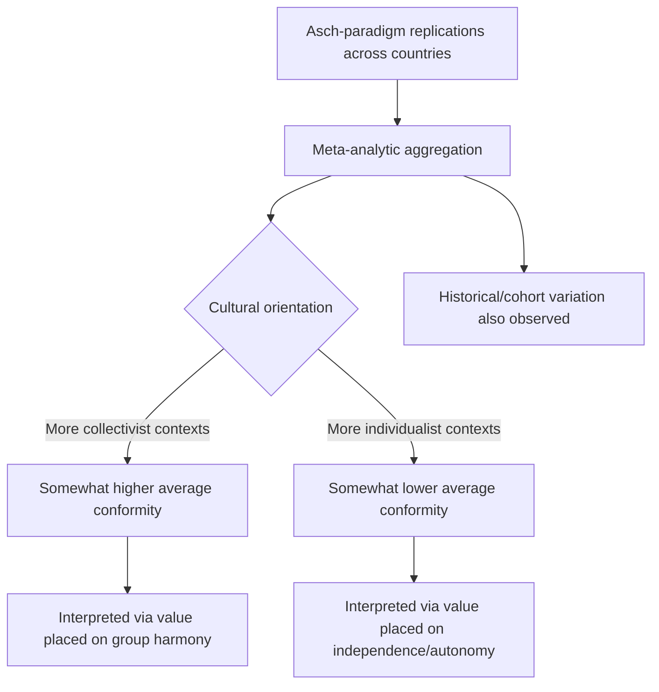

## Cultural Variation in Conformity

### Overview

Cultural variation in conformity research examines how average levels of conformity, the mechanisms driving it, and its social meaning differ across cultural contexts, most prominently along the individualism-collectivism dimension identified in cross-cultural psychology. This research extends classic conformity paradigms (particularly Asch's line-judgment procedure) across dozens of countries and cultural settings, testing whether the foundational findings of Western, largely American, social psychology generalize globally.

### The Individualism–Collectivism Framework

**Key Points**

- Individualist cultures (commonly associated with Western, particularly North American and Northern/Western European contexts in this literature) tend to emphasize personal autonomy, independence, and self-expression as central values
- Collectivist cultures (commonly associated with many East Asian, Latin American, African, and Middle Eastern contexts in this literature) tend to emphasize group harmony, interdependence, and social cohesion as central values
- This dimension, most closely associated with Geert Hofstede's cross-cultural values research, has become the dominant framework for organizing cross-cultural conformity findings, though it represents a simplified, population-level generalization rather than a precise predictor of any individual's behavior

### Meta-Analytic Findings on Asch-Paradigm Replications

Bond and Smith's (1996) influential meta-analysis aggregated Asch-type conformity replications conducted across numerous countries and time periods, providing the most systematic cross-cultural test of the original findings.

**Key Findings**

- Conformity rates on Asch-type unambiguous judgment tasks were found to be higher, on average, in more collectivist cultural contexts compared to more individualist ones, consistent with the theorized value placed on group harmony and social conformity in collectivist settings
- Conformity was also found to vary by year of study, with later replications in some Western contexts showing somewhat lower average conformity than Asch's original mid-20th-century studies, suggesting a possible historical/generational shift in addition to a cross-cultural one
- The relationship between individualism-collectivism and conformity, while statistically reliable in the aggregate meta-analytic data, involved considerable variability across individual studies, indicating that culture-level averages should not be treated as precise predictors for any specific national sample or individual

### Theoretical Mechanisms for Cultural Variation

**Differing Weight on Normative vs. Informational Influence**

[Inference] One proposed explanation is that collectivist cultural contexts may place relatively greater social value and weight on normative social influence specifically (maintaining group harmony), while individualist contexts may place relatively greater emphasis on independent judgment even at the cost of some social friction, though this remains a broad theoretical interpretation rather than a mechanism directly isolated and tested within the classic cross-cultural replication studies themselves.

**Differing Construal of the Self**

Cross-cultural psychology has proposed that individuals in collectivist cultures may hold a more interdependent self-construal (defining the self partly through relationships and group membership), while individuals in individualist cultures may hold a more independent self-construal (defining the self as distinct and autonomous from the group). Under this framework, conforming to group judgment may carry different meaning and psychological cost depending on which self-construal is culturally emphasized — potentially representing an expression of appropriate social embeddedness in interdependent contexts, rather than a "loss" of independent judgment as it might be interpreted in independent-self contexts.

**Differing Social Meaning of Conformity Itself**

A recurring point in this literature is that conformity may not carry the same evaluative connotation across cultures. In individualist contexts, conformity is sometimes implicitly treated in the research tradition (and popular discourse) as a failure of independent judgment, whereas in collectivist contexts, alignment with group judgment may be understood as socially appropriate and adaptive behavior rather than a deficiency, complicating any simple "more conformity = worse" interpretive framing.

### Beyond the Individualism-Collectivism Binary

**Key Points**

- Subsequent cross-cultural research has cautioned against treating individualism-collectivism as a single, monolithic binary, noting substantial within-country and within-region variation, as well as multiple distinct sub-dimensions (e.g., vertical vs. horizontal collectivism, differing across contexts that emphasize hierarchy vs. equality within group-oriented cultures)
- [Unverified] The degree to which national-level cultural averages meaningfully predict individual-level conformity behavior, as opposed to serving as a population-level descriptive statistic, remains a subject of ongoing methodological debate in cross-cultural psychology, given substantial individual variation within any single cultural context
- Some scholars have raised concerns about measurement equivalence — whether the same experimental paradigm and stimulus materials carry identical psychological meaning when administered across different cultural and linguistic contexts — as a methodological complication for direct cross-cultural effect-size comparisons

### Task Domain as a Moderator of Cultural Effects

Cross-cultural conformity differences are not necessarily uniform across all types of judgment or decision tasks:

- Effects appear most consistently documented in tasks structurally similar to Asch's original unambiguous perceptual judgment paradigm
- [Inference] Cultural variation patterns in conformity on more ambiguous, informationally uncertain tasks (closer to Sherif's autokinetic paradigm) versus more socially or morally loaded decisions are less thoroughly mapped in the comparative literature than the specific Asch-paradigm replications aggregated in major meta-analyses, since much of the systematic cross-cultural replication work has concentrated on the Asch procedure specifically

### Worked Example

**Example**

A multinational company implementing the same team-decision-making process across offices in different countries may observe that, holding the formal decision procedure constant, some regional offices show a stronger tendency toward rapid, public consensus around a senior team member's initial position, while other offices show more frequent, sustained public disagreement even after an initial majority view has emerged. Cross-cultural conformity research suggests such differences may partly reflect differing culturally-shaped weightings of group-harmony-preserving normative pressure relative to independent-judgment-expressing behavior, though a range of situational and organizational factors (not just national culture) would also plausibly contribute to any such observed pattern in an applied business setting.

### Applications

- Cross-cultural management and international business psychology (team dynamics, negotiation styles, meeting facilitation across culturally diverse or multinational teams)
- International marketing and social-proof-based advertising strategy, which may require calibration given differing baseline sensitivity to social-proof cues across cultural markets
- Cross-cultural clinical and counseling psychology (understanding culturally-shaped norms around individual assertiveness and group deference in therapeutic contexts)
- Comparative education research on classroom participation norms and peer-influence dynamics across educational systems
- International jury and legal-decision-making research, examining whether deliberation and consensus-formation patterns vary across differing cultural-legal contexts

### Limitations and Critiques

- The individualism-collectivism framework, while highly influential, has been critiqued within cross-cultural psychology itself for oversimplifying complex, multidimensional cultural variation into a single bipolar dimension, and more refined multi-dimensional cultural frameworks have been proposed as partial alternatives or supplements
- [Unverified] Precise, up-to-date quantitative comparisons of conformity rates across a fully representative range of contemporary global cultural contexts are limited, since much of the foundational meta-analytic evidence (e.g., Bond and Smith, 1996) synthesizes studies conducted primarily in the latter half of the 20th century, and the pace of more recent, methodologically updated cross-cultural replications directly extending this specific research question is comparatively limited
- Sampling in much of the underlying replication literature has often relied on convenience samples (frequently university students) within each country, raising standard generalizability concerns common throughout much of experimental social psychology, compounded specifically in the cross-cultural context by potential unrepresentativeness of student samples relative to broader national populations
- [Speculation] Globalization, increased cross-cultural contact, and the rise of transnational digital social environments may be altering baseline cultural conformity patterns in ways not yet fully captured by the existing cross-cultural conformity literature, though this specific claim remains an area for further empirical investigation rather than an established finding

### Related Topics

- Asch's conformity paradigm
- Normative versus informational social influence
- Individualism-collectivism and self-construal theory
- Situational and dispositional factors in conformity
- Cross-cultural psychology and Hofstede's cultural dimensions
- Descriptive versus injunctive social norms
- Minority influence and social change