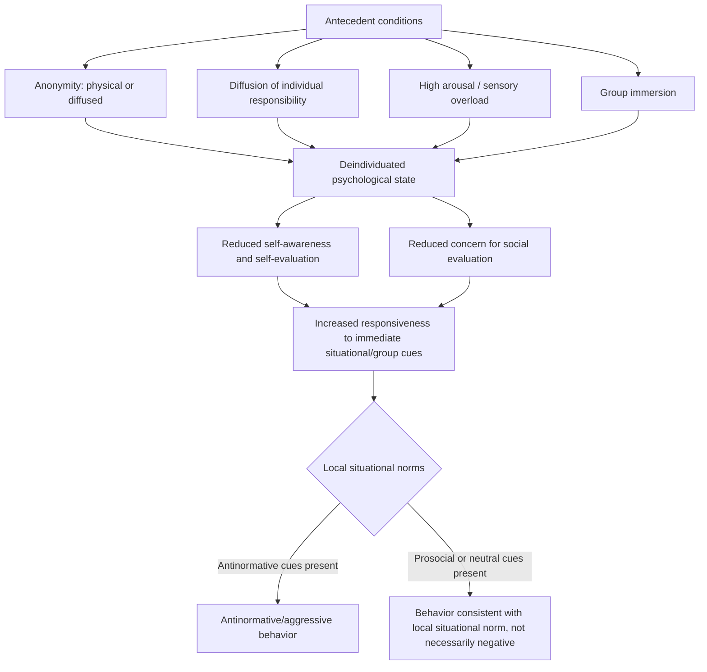

## Deindividuation

### Overview

Deindividuation is a psychological state in which self-awareness, personal identity, and individual accountability are diminished, typically under conditions of anonymity, group immersion, or reduced self-focus, leading to increased likelihood of behavior that departs from an individual's normal personal or social standards — including impulsive, disinhibited, or antinormative behavior. The construct originated in efforts to explain crowd and mob behavior and has since been developed into more precise cognitive and social-identity-based theoretical models.

### Origin

The concept traces to Gustave Le Bon's late-19th-century crowd psychology writing, which proposed that individuals submerged in a crowd lose their sense of individual responsibility and personal identity, becoming susceptible to a collective "group mind." Leon Festinger, Albert Pepitone, and Theodore Newcomb (1952) introduced the term "deindividuation" formally into experimental social psychology, and Philip Zimbardo (1969) substantially extended and popularized the concept, proposing a broader theoretical model linking anonymity, reduced self-awareness, and disinhibited behavior.

### Zimbardo's Classic Model

Zimbardo's formulation proposed that a set of situational input variables produces a psychological state of deindividuation, which in turn produces a range of behavioral outputs:

**Input Variables (Antecedent Conditions)**

- Anonymity (physical, such as masks/uniforms, or diffused, such as large group size)
- Reduced feelings of individual responsibility, often through diffusion across group members
- High arousal states, sometimes induced by the situation itself (noise, physical activity, altered states)
- Sensory overload or novel/unstructured situations
- Group immersion and physical proximity to others engaged in similar behavior

**Internal State: Deindividuation**

A subjective state characterized by reduced self-observation and self-evaluation, reduced concern for social evaluation by others, and a lowered threshold for expressing normally inhibited behavior.

**Output Behaviors**

Impulsive action, increased responsiveness to immediate situational cues rather than internalized personal standards, and — most notably in the classic literature — increased antinormative or aggressive behavior, though outputs were later shown to depend heavily on situational and normative context rather than being uniformly negative.

### Classic Empirical Demonstrations

**Zimbardo's Shock-Delivery Studies**

In early experimental work, Zimbardo found that participants made anonymous (via hooded costumes, group settings, and no individual identification) delivered longer-duration electric shocks to a confederate compared to participants who remained individually identifiable, consistent with the disinhibition hypothesis under anonymity conditions.

**Halloween Trick-or-Treating Studies (Diener et al.)**

A frequently cited field study found that children in costume (anonymous) were more likely to take extra candy or money beyond what was permitted when left unsupervised, compared to children who were not anonymous (e.g., asked their name or observed individually), and this effect was further moderated by group size — children in larger anonymous groups showed the highest rates of transgressive behavior.

**The Stanford Prison Experiment (Related but Distinct)**

Zimbardo's later, separately conducted Stanford Prison Experiment (1971) is frequently discussed alongside deindividuation theory, since the guards' uniforms, mirrored sunglasses, and assigned roles are commonly interpreted through a deindividuation-adjacent lens (anonymity and role-based disinhibition contributing to abusive behavior). [Unverified] However, this study is methodologically and conceptually distinct from controlled deindividuation experiments, and has itself been subject to substantial methodological critique in recent decades — including documented experimenter influence on participant behavior — meaning it should be treated as an illustrative, historically influential case study rather than as a rigorously controlled empirical test of deindividuation theory specifically.

### Theoretical Refinement: The Social Identity Model of Deindividuation Effects (SIDE)

A significant theoretical revision, the Social Identity model of Deindividuation Effects (SIDE), developed primarily by Reicher, Spears, and Postmes, challenged the classic view that deindividuation produces a uniform loss of identity and norm-free behavior. Instead, SIDE proposes that:

- Reduced individual self-awareness under anonymity does not eliminate identity but rather shifts attention from *personal* identity to *social* (group) identity
- Behavior under deindividuated conditions becomes governed by the norms of the salient social identity/group context, rather than becoming random or purely impulsive
- This means deindividuation can produce prosocial, antisocial, or neutral behavior depending entirely on which group norms are salient in the specific context — anonymity amplifies conformity to the locally relevant group norm rather than uniformly producing disinhibited antisocial behavior

**Key Points**

- SIDE represents a substantial theoretical departure from Zimbardo's original "loss of self" framing, reframing deindividuation as a norm-amplification process tied to social identity rather than a straightforward removal of normative constraint
- This refinement helps explain mixed findings in the classic literature, where anonymity sometimes increased prosocial or cooperative behavior rather than aggression, depending on the salient group context and norms present in that specific setting
- SIDE has been particularly influential in extending deindividuation theory to computer-mediated communication and online anonymity research, where group-specific norms (e.g., of a particular online community) plausibly shape whether anonymity produces hostile or cooperative behavior

### Comparison of Classic and SIDE Models

| Dimension | Classic (Zimbardo) Model | SIDE Model |
| --- | --- | --- |
| What is lost under anonymity | Self-awareness and normative constraint generally | Personal identity salience specifically |
| Predicted behavioral direction | Generally toward antinormative/disinhibited behavior | Toward whatever norm is salient for the relevant group identity |
| Role of group norms | Secondary; deindividuation seen as largely norm-free | Central; deindividuation channels behavior through group norms |
| Explanation for prosocial anonymous behavior | Difficult to explain within the original framework | Directly predicted when prosocial group norms are salient |

### Applications

- **Online behavior and anonymity**: deindividuation theory (particularly the SIDE model) is widely applied to explain online disinhibition, including hostile behavior in anonymous or pseudonymous online spaces, as well as the observation that some anonymous online communities exhibit strong cooperative or prosocial norms rather than uniform hostility
- **Crowd and riot behavior**: classic deindividuation concepts remain influential in explaining collective aggressive behavior in crowds, protests, and riots, alongside more contemporary social-identity-informed models of crowd psychology
- **Organizational and uniform-wearing contexts**: research has examined how uniforms and role-based anonymity in institutional settings (military, police, some corporate contexts) may interact with deindividuation-related processes, with implications for accountability design
- **Social media platform design**: debates over anonymous versus identified posting policies frequently draw, explicitly or implicitly, on deindividuation and SIDE theory regarding the conditions under which anonymity increases versus decreases prosocial or antisocial behavior

### Worked Example

**Example**

An online forum with fully anonymous posting (no persistent usernames, no identifying information) might show sharply differing behavior depending on the forum's established community norms: an anonymous forum with a strong, actively enforced culture of technical helpfulness and mutual respect may exhibit continued cooperative, prosocial posting behavior even under full anonymity, while an anonymous forum with a loosely enforced or hostile prevailing culture may exhibit escalated hostile behavior under the same anonymity conditions. This divergence illustrates the SIDE model's central prediction more directly than the classic Zimbardo framework, since anonymity alone does not determine the behavioral direction — the locally salient group norm does.

### Limitations and Critiques

- The classic deindividuation literature has been criticized for inconsistent operationalization of key variables (anonymity, self-awareness, group immersion) across different studies, complicating direct comparison and synthesis of findings
- Some classic demonstrations, including aspects of Zimbardo's own related work (the Stanford Prison Experiment), have faced significant methodological critique in recent scholarship, including concerns about experimenter demand effects and selective reporting, which has led some researchers to treat certain classic illustrative cases with greater caution than in earlier decades
- [Unverified] The relative explanatory power of the classic Zimbardo model versus the SIDE model for any specific real-world deindividuation-related behavior (e.g., a particular incident of online harassment or crowd violence) is often difficult to establish retrospectively, since real-world cases rarely allow the controlled isolation of anonymity, arousal, and group-norm variables achieved in laboratory studies
- [Inference] The rapid evolution of digital anonymity contexts (pseudonymous accounts, algorithmically curated anonymous communities, AI-mediated interactions) may introduce forms of anonymity and social-identity salience not fully anticipated by either the classic or SIDE theoretical frameworks, representing an area of continued theoretical development rather than settled application

### Related Topics

- Social identity theory
- Milgram's obedience studies
- Stanford Prison Experiment (methodological context)
- Groupthink and group polarization
- Online disinhibition effect
- Bystander effect and diffusion of responsibility
- Crowd psychology and collective behavior