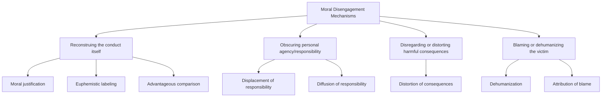

## Moral Disengagement in Obedience Contexts

### Overview

Moral disengagement is a set of cognitive mechanisms, formalized by Albert Bandura, through which individuals selectively deactivate or reconstruct their normal moral self-regulatory processes, enabling them to engage in harmful conduct without experiencing the self-condemnation, guilt, or distress that would ordinarily accompany such actions. Within obedience research specifically, moral disengagement provides a cognitive-mechanistic complement to Milgram's agentic state theory, explaining the specific psychological processes by which individuals reconcile personal harmful action with an intact self-concept as a moral person.

### Theoretical Origin

Bandura developed moral disengagement theory within his broader social-cognitive theory of moral agency, proposing that moral self-regulation normally operates as an internal restraint on harmful behavior through anticipatory self-sanctions (guilt, self-condemnation). Moral disengagement describes how this internal restraint can be selectively and temporarily disabled through specific cognitive reframing mechanisms, without requiring any general or permanent change in the individual's underlying moral standards.

### The Eight Mechanisms of Moral Disengagement

Bandura identified eight distinct cognitive mechanisms, commonly grouped into four functional categories based on which stage of the moral self-regulation process they target:

**Reconstruing the Conduct**

- **Moral justification**: reframing harmful conduct as serving a higher moral, social, or ideological purpose (e.g., "this is necessary for scientific progress" or "this serves the greater good")
- **Euphemistic labeling**: using sanitized or technical language to describe harmful actions, reducing their perceived severity (e.g., referring to harm as a "procedure" or "protocol step")
- **Advantageous comparison**: contrasting one's own harmful conduct favorably against a more extreme hypothetical or real alternative, making one's own actions appear comparatively minor or justified

**Obscuring or Minimizing Personal Agency**

- **Displacement of responsibility**: attributing responsibility for one's actions to an authority figure's direct orders, consistent directly with Milgram's agentic state mechanism, in which the individual perceives themselves as an instrument of another's will rather than an autonomous moral agent
- **Diffusion of responsibility**: spreading perceived responsibility across multiple participants in a harmful process (e.g., a division of labor in which no single individual feels fully responsible for the outcome), reducing the perceived personal moral weight of any one person's specific contribution

**Disregarding or Distorting Consequences**

- **Distortion of consequences**: minimizing, ignoring, or disbelieving the actual severity or reality of the harm produced by one's actions, often facilitated by physical or temporal distance from the visible outcome

**Blaming or Dehumanizing the Target**

- **Dehumanization**: perceiving or portraying the victim as lacking full human qualities, reducing empathic identification and the moral restraint normally triggered by harming a fellow human being
- **Attribution of blame**: reframing the victim (or circumstances) as responsible for bringing the harm upon themselves, shifting perceived moral culpability away from the perpetrator

### Application to Milgram's Obedience Paradigm

**Key Points**

- Milgram's own agentic state concept maps closely onto Bandura's displacement of responsibility mechanism — both describe the psychological relocation of perceived moral responsibility from the individual actor to the directing authority figure
- The experimenter's standardized verbal prods ("the experiment requires that you continue") can be understood as an externally supplied moral justification, framing continued shock administration as serving the higher purpose of scientific research
- The proximity manipulations in Milgram's variation studies (reduced obedience with increased victim visibility) are consistent with distortion-of-consequences and dehumanization mechanisms — increased psychological or physical distance from the victim facilitates the disengagement processes that make continued compliance psychologically tolerable
- The diffusion-of-responsibility variation (where participants instructed another party to administer the actual shock, and showed increased obedience) directly illustrates Bandura's diffusion-of-responsibility mechanism operating within an experimentally isolated obedience context

### Distinguishing Moral Disengagement from Milgram's Agentic State Theory

| Dimension | Milgram's Agentic State Theory | Bandura's Moral Disengagement Theory |
| --- | --- | --- |
| Scope | Specific to hierarchical authority-obedience situations | General cognitive framework applicable across many harmful-behavior contexts, not limited to obedience |
| Core proposed mechanism | Shift from autonomous to agentic self-perception under authority | Multiple distinct, independently identifiable cognitive mechanisms |
| Level of specificity | A single overarching psychological state | Eight discrete, separately measurable component mechanisms |
| Empirical measurement | Primarily inferred from obedience behavior and self-report in the original studies | Directly measurable via validated psychometric scales (e.g., the Moral Disengagement Scale) across varied populations and contexts |

### Broader Applications Beyond the Original Obedience Paradigm

- **Organizational and corporate misconduct**: moral disengagement mechanisms (particularly euphemistic labeling and diffusion of responsibility) have been applied to explain participation in unethical organizational practices, including financial misconduct and regulatory violations
- **Military and combat psychology**: dehumanization and moral justification mechanisms are frequently applied to understanding participation in wartime violence and atrocity, extending beyond laboratory-based obedience research into field and historical analysis
- **Aggression and bullying research**: moral disengagement has been extensively studied as a predictor of bullying and aggressive behavior in adolescents, using validated self-report scales to measure individual differences in disengagement tendency independent of any specific obedience-to-authority context
- **Corporate and environmental harm**: euphemistic labeling (e.g., technical or bureaucratic language obscuring environmental or consumer harm) and advantageous comparison have been applied to understanding organizational decision-making around known but under-acknowledged harms

### Worked Example

**Example**

An employee at a company is instructed by a manager to implement a policy the employee privately suspects may disadvantage certain customers. Several moral disengagement mechanisms may operate simultaneously: the policy may be described using neutral technical language such as "risk-based account adjustment" rather than more direct language (**euphemistic labeling**); the employee may reason that "the policy team designed this, I'm just implementing it" (**displacement of responsibility**); the employee may never directly interact with affected customers, reducing the salience of any actual harm (**distortion of consequences**); and the employee may reason that competitor companies engage in more clearly harmful practices, making their own company's policy comparatively acceptable (**advantageous comparison**). This composite illustrates how multiple mechanisms frequently combine in applied organizational obedience-adjacent contexts, echoing the multi-mechanism operation observed in Milgram-paradigm interpretive analyses.

### Individual Differences in Moral Disengagement

- Bandura and colleagues developed validated psychometric scales to measure trait-level moral disengagement tendency, finding meaningful and stable individual variation in the general propensity to employ these mechanisms across situations
- Higher trait moral disengagement has been associated in subsequent research with increased aggressive, antisocial, and unethical behavior across multiple domains (adolescent bullying, financial dishonesty, organizational misconduct), suggesting moral disengagement functions partly as a dispositional trait alongside its situationally-activated application within specific contexts such as the Milgram paradigm
- [Inference] This dispositional dimension complements, rather than replaces, the primarily situational emphasis of Milgram's original obedience research, suggesting that both stable individual differences and situational structuring (as documented in Milgram's variation studies) jointly contribute to real-world destructive-obedience outcomes, though the precise relative weighting of trait versus state factors specifically within obedience-to-authority contexts (as opposed to moral disengagement research more broadly) has not been as extensively isolated as the situational variables Milgram directly manipulated.

### Limitations and Critiques

- While theoretically well-specified with validated measurement instruments, the application of moral disengagement mechanisms specifically to Milgram's original obedience data is substantially interpretive/retrospective rather than something the original studies were designed to directly test, since Bandura's mechanisms were formalized after and independent of Milgram's original experimental program
- [Unverified] The degree to which each of the eight mechanisms operates independently versus in a tightly interdependent cluster within any specific obedience or harmful-compliance episode is difficult to establish with precision, since real-world and even laboratory instances of destructive obedience typically involve several mechanisms operating simultaneously rather than in isolation
- As with other individual-difference measures discussed alongside primarily situational obedience research, trait moral disengagement scores generally show moderate rather than strong predictive power for specific behavioral outcomes in any single situational context, consistent with the broader person-situation pattern observed throughout conformity and obedience research
- Cross-cultural and cross-context generalizability of the specific eight-mechanism structure, while broadly supported across numerous studies, continues to be refined in ongoing psychometric and cross-cultural validation research

### Related Topics

- Milgram's obedience studies
- Situational determinants of obedience
- Agentic state theory
- Deindividuation
- Dehumanization and intergroup aggression
- Diffusion of responsibility and the bystander effect
- Organizational ethics and corporate misconduct psychology