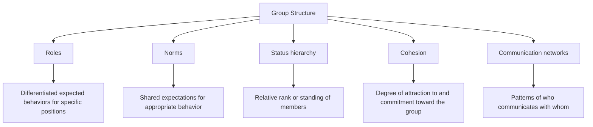

## Defining Groups and Group Structure

### Overview

The study of group processes begins with defining what constitutes a psychological group and characterizing the structural features — roles, norms, status hierarchies, and cohesion — that organize interaction within it. A group, in the social-psychological sense, is generally distinguished from a mere aggregate of co-present individuals by the presence of interdependence, shared identity, and structured interaction among members, and group structure refers to the relatively stable patterns of relationships, expectations, and differentiation that emerge within such collections of people over time.

### Defining a Psychological Group

**Key Points**

- A widely used definitional criterion is interdependence: members of a genuine group influence and are influenced by one another, and outcomes for one member are connected to the behavior of others, distinguishing a group from a simple collection of unrelated individuals occupying the same space (an aggregate)
- Shared social identity is a second commonly cited criterion, particularly within the social identity theory tradition: members perceive themselves as belonging to a common category ("us") and are perceived by others as members of that category
- Structured interaction over time (as opposed to a single, fleeting encounter) is often considered necessary for the development of the role differentiation, norms, and status patterns that characterize established groups
- Some influential definitions emphasize a common goal or purpose as a defining feature, particularly for task-oriented or formally organized groups, while other definitions (e.g., pure social identity-based definitions) do not require an explicit shared goal, only a shared sense of categorical membership

### Types of Groups

| Group Type | Defining Feature | Example |
| --- | --- | --- |
| Primary group | Small, intimate, enduring, emotionally significant | Family, close friendship group |
| Secondary group | Larger, more impersonal, often goal- or task-oriented | Work team, professional association |
| In-group | The group an individual identifies as belonging to | One's own nationality, team, or organization |
| Out-group | A group an individual does not identify with | A rival organization or competing team |
| Reference group | A group used as a standard for self-evaluation or aspiration, whether or not one is a member | An aspirational professional community |
| Formal group | Explicitly structured with defined roles/rules, often institutionally created | A corporate department, a committee |
| Informal group | Emerges organically without formal structure or explicit rules | A friendship clique within a larger organization |

### Core Structural Components of Groups

### Roles

A role is a set of expected behaviors associated with a particular position within a group. Roles can be formally assigned (a job title with defined duties) or informally emergent (a group's habitual "peacemaker" or "devil's advocate," without any official designation).

**Key Points**

- Role differentiation allows groups to divide labor and coordinate complex tasks more efficiently than would be possible if all members behaved identically
- Role ambiguity (unclear expectations for a given position) and role conflict (incompatible expectations across multiple roles held by the same individual, or contradictory expectations within a single role) are well-documented sources of individual stress and reduced group functioning
- Classic and applied research on role-based behavior, including some deindividuation-adjacent findings (e.g., uniform-based role assumption), illustrates how strongly assumed roles can shape individual behavior, sometimes independent of a person's private attitudes or personality

### Norms

Group norms are shared expectations, whether explicit (written rules) or implicit (unstated but widely understood conventions), about appropriate behavior within the group. Norms can be further subdivided into descriptive norms (what members typically do) and injunctive norms (what members are expected to approve or disapprove of), a distinction directly relevant to compliance and conformity research within groups.

**Key Points**

- Norms typically develop gradually through repeated interaction (as demonstrated experimentally in Sherif's autokinetic-effect studies) rather than being fully specified in advance for informal groups
- Norm violation frequently triggers social sanctions from other group members, ranging from subtle disapproval to formal exclusion, providing the behavioral enforcement mechanism that maintains normative consistency within the group over time
- Norms can vary considerably in their strength (how tightly and consistently they are enforced) and their scope (how broad a range of behavior they govern), with some groups exhibiting "tight" cultures with strong, consistently enforced norms and others exhibiting "loose" cultures with weaker, more variably enforced norms

### Status and Status Hierarchies

Status refers to the relative rank, standing, or prestige of a member within the group's social structure. Status hierarchies can be formally designated (organizational rank) or informally emergent through processes such as demonstrated competence, seniority, or social skill.

**Key Points**

- Higher-status members typically have greater influence over group decisions, greater latitude to deviate from group norms without sanction (sometimes termed "idiosyncrasy credit"), and disproportionate speaking time and attention within group interactions
- Status hierarchies tend to stabilize relatively quickly in newly formed groups, often based on initially available cues (confidence, participation rate, perceived competence) that may or may not correlate strongly with actual task-relevant ability
- [Inference] The tendency for confident, high-participation members to acquire higher status regardless of actual competence has practical implications for group decision-making quality, since status-based influence does not always track genuine expertise, though this specific dynamic is more directly studied within group decision-making and status-characteristics research traditions than within basic group-structure definitional work itself

### Cohesion

Group cohesion refers to the degree of attraction among group members and their commitment to remaining part of the group, often conceptualized as having both task-related (commitment to shared goals) and social/emotional (interpersonal attraction and belonging) components.

**Key Points**

- Cohesion is generally, though not universally, associated with increased group member satisfaction, communication, and cooperative behavior
- Highly cohesive groups can, under certain conditions, show reduced critical evaluation of group decisions and increased pressure toward consensus, a dynamic centrally implicated in groupthink research
- Cohesion and performance are related in a more complex way than a simple positive correlation; the relationship depends substantially on task type, with some research indicating cohesion contributes more strongly to performance on interdependent tasks requiring close coordination than on tasks that can be completed largely independently by individual members

### Communication Networks

The pattern of who communicates with whom within a group constitutes its communication network structure, which can range from centralized (information flows primarily through one or a few central members) to decentralized (relatively even communication access among all members).

**Key Points**

- Centralized networks tend to be more efficient for simple, well-defined tasks but can create bottlenecks and reduce satisfaction among peripheral members
- Decentralized networks tend to perform better on complex tasks requiring input integration from multiple members, though potentially at some cost to coordination speed
- [Unverified] The generalizability of classic laboratory communication-network findings (often using simple, artificial group tasks) to complex, real-world organizational communication structures is subject to ongoing debate, given the substantially greater complexity and informal communication channels present in most real organizational contexts compared to controlled laboratory network manipulations

### Worked Example

**Example**

A newly formed cross-functional project team at a company illustrates several structural elements simultaneously: formal roles are assigned (project lead, technical lead, coordinator), but informal roles also emerge organically (one member becomes the group's de facto mediator during disagreements); explicit norms are established (weekly meeting attendance expectations) alongside implicit ones (an unstated expectation that disagreements are raised privately before public meetings); a status hierarchy forms partly along formal lines (the project lead) and partly along informal lines (a highly respected senior engineer who is not formally the lead but carries substantial informal influence); and cohesion develops gradually as the team works together, potentially reaching a level where later group decisions require deliberate structural safeguards (as recommended in groupthink-prevention literature) to preserve critical evaluation.

### Applications

- Organizational design and team-structure planning (role clarity, communication network design, formal vs. informal status alignment)
- Group therapy and clinical group facilitation, where understanding emergent role and norm dynamics informs therapeutic group management
- Educational group-work design (understanding how student groups develop informal status hierarchies and roles, with implications for equitable participation)
- Sports team psychology (role clarity and cohesion research applied to athletic team performance)
- Military and emergency-response team structuring, where clearly defined formal roles and communication networks are critical under high-stakes, time-pressured conditions

### Limitations and Critiques

- Definitions of "group" vary somewhat across theoretical traditions (interdependence-based, social-identity-based, goal-based), and no single definition is universally adopted across all subfields of group research, meaning some conceptual imprecision persists at the foundational definitional level
- [Unverified] The precise boundary between a "true" psychological group and a looser aggregate or category (e.g., a large, diffuse social category with shared identity but minimal direct interdependence, such as a national identity group) is not fully settled, and different theoretical traditions draw this boundary somewhat differently
- Much of the classic experimental literature on group structure (communication networks, role differentiation) relies on small, artificial laboratory groups performing simplified tasks, raising standard generalizability questions when extending findings to large, complex, real-world organizational groups
- [Inference] The increasing prevalence of geographically distributed, digitally mediated groups (remote teams, online communities) may introduce structural dynamics — particularly around communication network patterns and norm formation — not fully anticipated by classic, primarily face-to-face-group-based structural research, representing an area of continued theoretical and applied development

### Related Topics

- Group cohesion and performance
- Social identity theory
- Sherif's autokinetic effect studies (norm formation)
- Groupthink and group polarization
- Descriptive versus injunctive social norms
- Status characteristics theory
- Communication networks in organizations