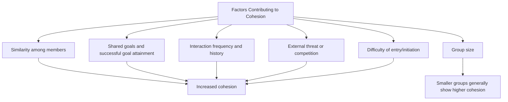

## Group Cohesion and Its Consequences

### Overview

Group cohesion refers to the degree to which members of a group are attracted to the group, committed to its goals, and motivated to remain part of it, functioning as one of the most extensively studied structural properties of groups due to its wide-ranging implications for member satisfaction, group performance, and group decision-making quality. Cohesion is generally treated as a multidimensional construct rather than a single unified property, with distinct social and task-related components that can develop somewhat independently and carry different consequences.

### Defining Cohesion: Task versus Social Dimensions

**Task Cohesion**

The degree to which group members share commitment to the group's goals and tasks, and are motivated to coordinate effectively to achieve them. Task cohesion centers on shared purpose and mutual instrumental commitment rather than interpersonal liking per se.

**Social (Interpersonal) Cohesion**

The degree of interpersonal attraction, liking, and emotional bonding among group members, independent of task-related commitment. Social cohesion reflects the group's function as a source of belonging and emotional connection.

**Key Points**

- Task and social cohesion are empirically and conceptually distinguishable; a group can be high in one and lower in the other (e.g., a professional team with strong shared commitment to project goals but relatively limited personal closeness among members, or a close friendship group with weak shared task orientation)
- Some theoretical frameworks further subdivide cohesion into additional components (e.g., group pride, perceived unity), though task and social cohesion remain the most consistently used core distinction across the literature
- The relative importance of task versus social cohesion for group outcomes depends substantially on the type of group and its primary purpose — task cohesion tends to be more strongly predictive of performance outcomes in work-oriented groups, while social cohesion tends to be more predictive of member satisfaction and retention

### Antecedents of Cohesion

- **Similarity**: members who perceive themselves as similar to one another (in attitudes, background, or values) tend to develop stronger interpersonal attraction and cohesion, consistent with broader similarity-attraction research in social psychology
- **Shared goals and successful goal attainment**: groups that achieve valued shared outcomes tend to develop stronger cohesion, and cohesion and success can form a mutually reinforcing cycle over time
- **Interaction history and frequency**: repeated positive interaction over time, consistent with the mere exposure effect, tends to increase cohesion
- **External threat or intergroup competition**: perceived threat from, or competition with, an external out-group tends to increase in-group cohesion, a finding with direct connections to social identity theory and classic intergroup-conflict research (e.g., Sherif's Robbers Cave studies)
- **Group size**: smaller groups generally show higher average cohesion than larger groups, plausibly due to increased opportunity for meaningful interaction among all members and reduced coordination complexity
- **Difficulty of entry or initiation**: groups with more demanding or effortful entry requirements have been associated with higher subsequent member commitment and cohesion, a finding sometimes interpreted through a cognitive-dissonance-based justification-of-effort mechanism

### Consequences of Cohesion: Positive Outcomes

**Key Points**

- Higher cohesion is generally associated with increased member satisfaction, reduced turnover/attrition, and greater willingness to communicate openly within the group
- Cohesive groups tend to show higher rates of cooperative behavior and lower rates of destructive within-group conflict, particularly for social/interpersonal conflict (as opposed to task-related disagreement, which cohesive groups do not necessarily suppress and may even handle more constructively)
- On interdependent tasks requiring close coordination among members, cohesion has been associated with improved group performance, plausibly because cohesive groups communicate more effectively and coordinate more smoothly

### Consequences of Cohesion: Negative Outcomes

**Groupthink**

The most extensively documented negative consequence of high cohesion is its role as a contributing antecedent to groupthink — a mode of group decision-making in which the desire for consensus and harmony overrides realistic appraisal of alternative courses of action. Irving Janis's original groupthink model identified high group cohesiveness as one of several necessary antecedent conditions (alongside structural faults such as insulation from outside opinion and situational stressors such as high-stakes time pressure), proposing that cohesion alone is generally not sufficient to produce groupthink but substantially increases its likelihood when combined with these other conditions.

**Reduced Critical Evaluation and Conformity Pressure**

Highly cohesive groups can develop stronger implicit normative pressure toward consensus, making dissenting members more reluctant to voice disagreement for fear of disrupting valued group harmony — a dynamic consistent with normative social influence operating more powerfully within groups whose members place high value on continued group membership and approval.

**Potential for Reduced Individual Performance on Independent Tasks**

[Inference] On tasks that do not require genuine interdependent coordination (i.e., tasks better suited to individual rather than collaborative effort), high cohesion does not reliably improve, and in some contexts may not meaningfully affect, individual-level task performance, since the performance benefits of cohesion are most directly tied to coordination-dependent group processes rather than to individual motivation or effort in isolation; this qualification is a commonly cited caveat in the cohesion-performance literature rather than a directly tested universal finding across all task types.

### The Cohesion-Performance Relationship: A Nuanced Picture

| Task Type | Relationship Between Cohesion and Performance |
| --- | --- |
| Highly interdependent tasks (requiring close coordination) | Cohesion generally associated with improved performance |
| Additive or independent tasks (individual contributions summed with limited coordination need) | Cohesion shows weaker or less consistent association with performance |
| Decision-making tasks under groupthink-prone conditions | High cohesion, combined with other antecedent conditions, associated with reduced decision quality |
| Creative/idea-generation tasks | Excessive cohesion has been associated in some research with reduced idea diversity, plausibly through increased normative pressure toward consensus |

Meta-analytic research on the cohesion-performance relationship has generally found a positive but modest average association, with substantial variation depending on task type, group size, and the specific measurement approach used for both cohesion and performance — indicating that cohesion should not be treated as a uniformly performance-enhancing property independent of context.

### Worked Example

**Example**

A tightly-knit executive leadership team with high social cohesion (strong personal friendships, long shared history) and high task cohesion (strong shared commitment to the company's mission) may coordinate exceptionally well and communicate efficiently during routine operations. However, when facing a high-stakes, time-pressured strategic decision — particularly one where the team is relatively insulated from outside perspectives and led by a strong, directive leader — this same high cohesion becomes a risk factor for groupthink-style decision-making, potentially suppressing dissenting analysis in favor of preserving the team's valued harmony and unity, illustrating how the same structural property (cohesion) can simultaneously support routine performance while creating vulnerability under specific high-stakes decision conditions.

### Applications

- **Organizational team design**: balancing cohesion-building activities (team-building exercises, shared goal-setting) against structural safeguards for critical evaluation (devil's advocate roles, structured dissent processes) to capture cohesion's benefits while mitigating groupthink risk
- **Sports psychology**: extensive applied research on team cohesion and athletic performance, generally supporting a positive association particularly for interdependent team sports requiring close coordination
- **Military unit cohesion**: long-standing applied research tradition examining how unit cohesion relates to both operational performance and psychological resilience among service members
- **Clinical and therapeutic group settings**: cohesion is considered a key therapeutic factor in group therapy contexts, associated with treatment engagement and outcome, drawing on related but somewhat distinct group-therapy-specific cohesion research
- **Groupthink prevention protocols**: organizational decision-making frameworks (e.g., structured devil's-advocate roles, anonymous input mechanisms, seeking outside expert opinion) are frequently designed specifically to counteract the decision-quality risks associated with high cohesion under groupthink-prone conditions

### Limitations and Critiques

- Cohesion has historically been measured using a range of different instruments and operational definitions across studies, complicating direct comparison and meta-analytic synthesis of findings across the broader literature
- [Unverified] The precise causal direction between cohesion and performance is difficult to establish definitively in much of the correlational field research on this topic, since successful group performance plausibly also increases subsequent cohesion, creating a likely bidirectional or cyclical relationship rather than a simple one-directional causal pathway
- The task-dependent nature of the cohesion-performance relationship means broad, general claims about cohesion's benefits require substantial qualification by task type, and popular or applied discussions of cohesion sometimes overstate its universal performance benefits relative to the more nuanced pattern found in the empirical literature
- [Inference] The increasing prevalence of geographically distributed and digitally mediated teams raises questions about how classic, largely face-to-face-derived cohesion research and measurement instruments apply to remote or hybrid group contexts, representing an area of ongoing rather than fully settled empirical development

### Related Topics

- Defining groups and group structure
- Groupthink and group polarization
- Social identity theory
- Sherif's Robbers Cave experiment and intergroup conflict
- Team performance and coordination in organizations
- Status characteristics theory
- Normative versus informational social influence