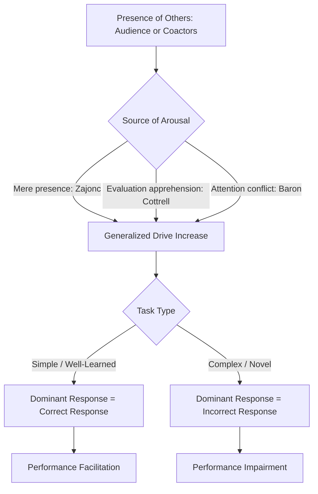

## Social Facilitation and Evaluation Apprehension

### Definition

Social facilitation refers to the tendency for the presence of others to enhance performance on simple, well-learned, or dominant tasks, while impairing performance on complex, novel, or non-dominant tasks. The phenomenon encompasses two related effects: **audience effects** (the mere presence of passive spectators) and **coaction effects** (performing alongside others engaged in the same task).

Evaluation apprehension is a proposed mechanism underlying social facilitation, referring to the concern or anxiety an individual experiences when they believe others are observing and judging their performance. It is distinguished from mere presence theories in that it emphasizes the *evaluative* nature of the audience rather than simple physical co-presence.

### Historical Background

#### Triplett's Original Observation (1898)

Norman Triplett is widely credited with conducting the first social psychology experiment. He observed that cyclists recorded faster times when racing against other cyclists than when racing alone against the clock. He then tested this in a laboratory setting using a fishing-reel task, finding that children performed the task faster in the presence of a coactor.

#### The Puzzle: Conflicting Findings (Early-to-Mid 20th Century)

Subsequent researchers found inconsistent results. Some studies (e.g., Floyd Allport's work) replicated facilitation effects on simple motor tasks, while others found that the presence of others *impaired* performance on tasks involving learning, memory, or complex reasoning. This inconsistency stalled research on the topic for decades because no unifying framework explained both directions of effect.

#### Zajonc's Drive Theory Resolution (1965)

Robert Zajonc resolved the contradiction by proposing that the presence of others increases generalized physiological **arousal (drive)**. According to Hull-Spence drive theory, increased drive strengthens the tendency to emit the **dominant response** — the response most likely to occur in a given situation.

- On simple/well-learned tasks, the dominant response is typically the *correct* response, so arousal facilitates performance.
- On complex/novel tasks, the dominant response is often *incorrect* (because the correct response has not yet been over-learned), so arousal impairs performance.

**[Zajonc's Drive Theory Predictions] (svg_diagram)**

<svg xmlns="http://www.w3.org/2000/svg" viewBox="0 0 700 380">

<rect x="0" y="0" width="700" height="380" fill="`#ffffff`" />

<text x="350" y="30" text-anchor="middle" font-size="16" font-weight="bold" fill="`#1a1a1a`">Zajonc's Drive Theory Predictions (svg_diagram)</text>

<line x1="80" y1="330" x2="620" y2="330" stroke="#333" stroke-width="2" />
<line x1="80" y1="330" x2="80" y2="60" stroke="#333" stroke-width="2" />
<text x="350" y="365" text-anchor="middle" font-size="13" fill="#333">Task Type</text>
<text x="30" y="200" text-anchor="middle" font-size="13" fill="#333" transform="rotate(-90 30 200)">Performance Quality</text>

<text x="220" y="345" text-anchor="middle" font-size="12" fill="#333">Simple / Well-Learned</text>

<text x="480" y="345" text-anchor="middle" font-size="12" fill="#333">Complex / Novel</text>

<rect x="180" y="200" width="60" height="130" fill="#a8c5e0" />
<rect x="260" y="150" width="60" height="180" fill="#4a7fb5" />
<text x="210" y="190" text-anchor="middle" font-size="11" fill="#333">Alone</text>
<text x="290" y="140" text-anchor="middle" font-size="11" fill="#333">With Others</text>
<rect x="440" y="150" width="60" height="180" fill="#a8c5e0" />
<rect x="520" y="200" width="60" height="130" fill="#c0392b" />
<text x="470" y="140" text-anchor="middle" font-size="11" fill="#333">Alone</text>
<text x="550" y="190" text-anchor="middle" font-size="11" fill="#333">With Others</text>

<text x="220" y="90" text-anchor="middle" font-size="11" fill="`#2c5f8a`" font-weight="bold">Facilitation</text>

<text x="480" y="90" text-anchor="middle" font-size="11" fill="`#a12a1f`" font-weight="bold">Impairment</text>

</svg>

### Theoretical Mechanisms

#### 1. Mere Presence Theory (Zajonc)

Zajonc initially argued that the presence of conspecifics is **inherently arousing**, rooted in evolutionary history where the presence of others (predators, competitors, mates) required vigilance and readiness to act. This is a relatively automatic, non-cognitive process — arousal occurs simply because others are present, without requiring conscious evaluation concerns.

#### 2. Evaluation Apprehension Theory (Cottrell, 1968)

Nickolas Cottrell challenged pure mere-presence theory, arguing that arousal does not stem from presence alone but from a **learned concern about being evaluated**. Key supporting evidence:

- In Cottrell's studies, performance effects were weaker when the audience was **blindfolded** or otherwise unable to evaluate the performer, compared to when the audience could actually observe and judge performance.
- This suggests that social facilitation requires the *anticipation of evaluation*, not mere physical presence.
- Evaluation apprehension is considered a **learned/socialized** source of drive, acquired through a lifetime of experience associating the judgment of others with reward and punishment.

#### 3. Distraction-Conflict Theory (Baron, Sanders)

Robert Baron and colleagues proposed that the presence of others creates **attentional conflict**: the individual must divide attention between the task and the audience. This attentional conflict itself is arousing, and it also produces:

- **Attentional narrowing** — a restriction of the range of cues attended to, which can help on simple tasks (fewer irrelevant cues compete) and hurt on complex tasks (relevant cues get excluded).
- This theory does not require the audience to be evaluative — any attention-demanding stimulus (even non-social) can theoretically produce similar effects, though social stimuli are typically the strongest distractors.

#### 4. Self-Presentation / Impression Management Theory (Bond)

Charles Bond proposed that evaluation apprehension arises specifically from concern about **damage to self-presentation** — individuals fear that poor performance in front of others will create an unfavorable impression. This ties social facilitation to broader self-presentation motives found throughout social psychology.

#### 5. Self-Awareness Theory Extension

Some researchers frame the effect through objective self-awareness: the presence of an audience increases self-focus, which increases motivation to match performance to internal standards — aiding well-rehearsed responses and disrupting those requiring flexible, controlled processing.

**Comparison of Theoretical Mechanisms**

| Theory | Proposed Source of Arousal/Effect | Requires Evaluation? | Requires Attention Conflict? |
| --- | --- | --- | --- |
| Mere Presence (Zajonc) | Innate response to presence of conspecifics | No | No |
| Evaluation Apprehension (Cottrell) | Learned concern about being judged | Yes | No |
| Distraction-Conflict (Baron) | Competition between task and social attention | No (any distractor works) | Yes |
| Self-Presentation (Bond) | Concern over damaged social image | Yes | No |

### The Role of Evaluation Apprehension: Key Findings

- **Cottrell, Wack, Sekerak, & Rittle (1968):** Participants performed a pseudo-recognition task alone, with an "inattentive audience" (blindfolded, ostensibly waiting for a perception experiment), or with an attentive, evaluative audience. Social facilitation of the dominant response occurred **only** in the evaluative-audience condition, not the mere-presence (blindfolded) condition — strong initial support for evaluation apprehension over pure mere presence.
- **Expertise and apprehension are inversely related in real-world performance contexts:** individuals highly skilled at a task tend to show less audience-induced impairment because the correct response is more strongly dominant, consistent with drive theory, while low-skill performers show larger evaluation-driven decrements.
- **Audience status/expertise matters:** an audience perceived as expert or high-status tends to produce stronger evaluation apprehension and larger performance effects than a novice or irrelevant audience.
- [Inference] Evaluation apprehension effects are likely to interact with individual differences such as trait social anxiety or need for approval, though effect sizes for such moderators vary across studies and are not always robust.

### Boundary Conditions and Moderators

- **Task complexity/learning stage:** The central moderator — effects reverse depending on whether the dominant response is correct (simple/well-learned) or incorrect (complex/novel).
- **Type of audience:** Passive spectators vs. coactors vs. evaluative experts produce different magnitudes of effect; coaction (working alongside others on the same task, especially competitively) tends to produce a comparable or even stronger drive increase than passive observation.
- **Audience visibility of the performer:** Effects are typically stronger when the audience can actually see and judge the performer's output (supporting evaluation apprehension).
- **Anonymity:** Reducing identifiability of the individual's performance (e.g., pooled/group output rather than individually assessed output) tends to reduce evaluation apprehension and can shift behavior toward social loafing instead of facilitation (see Related Topics).
- **Cultural and individual differences:** [Inference] Collectivist cultural contexts or individuals high in social anxiety may show amplified evaluation apprehension effects, though this is a less thoroughly replicated area compared to the core simple-vs-complex task distinction.

### Worked Example

**Scenario:** A graduate student is an expert typist (well-learned, dominant skill: fast accurate typing) but a novice at improvisational public speaking (non-dominant skill).

| Context | Typing (simple/well-learned) | Improv Speaking (complex/novel) |
| --- | --- | --- |
| Alone | Baseline speed/accuracy | Baseline (already effortful) |
| With an evaluative audience present | **Faster, equally or more accurate** (facilitation) | **Slower, more errors, more "blanking"** (impairment) |

**Mechanistic Explanation:** The audience raises arousal/drive in both cases. For typing, the dominant response (correct keystrokes) is strengthened, producing facilitation. For improv speaking, the dominant response (habitual filler phrases, hesitation, or generic language) is not the *correct* creative response required, so arousal strengthens the wrong tendencies, producing impairment. Evaluation apprehension theory adds that this effect would be reduced if the audience is not paying attention or not perceived as capable of judging performance (e.g., a distracted friend vs. a panel of professional comedians).

### Empirical Paradigms Used to Study This

- **Coaction paradigms:** Multiple participants perform the same task simultaneously without direct interaction (e.g., simple arithmetic, word association, maze tasks).
- **Audience paradigms:** A single participant performs while one or more observers watch.
- **Pseudo-recognition/word-association tasks:** Used by Cottrell and colleagues to distinguish dominant (fast, common associations) from non-dominant (rare, effortful associations) responses under varying audience conditions.
- **Physiological measures:** Heart rate, skin conductance, and cortisol have been used across studies to substantiate the "arousal" component of drive theory, though [Unverified] the precise physiological signature of evaluation apprehension specifically (versus general arousal) is not always cleanly isolated across the literature.

### Process Flow Diagram

### Applications

- **Workplace design:** Open-plan offices and visible performance monitoring can facilitate simple, routine work but may impair complex problem-solving or creative tasks — relevant to decisions about private workspaces for cognitively demanding roles.
- **Sports psychology:** Explains "home-field advantage" complexities and why highly trained athletes often perform *better* under crowd pressure (well-learned skills) while less-practiced athletes may choke.
- **Education/testing:** Test anxiety and oral examination performance can be understood partly through evaluation apprehension — well-rehearsed material is less vulnerable to audience-induced disruption than material still being learned.
- **Skill acquisition recommendations:** [Inference] Practicing new/complex skills in private or low-evaluation contexts before performing them publicly may reduce evaluation-apprehension-driven impairment, consistent with the theory, though specific training-design guidance varies by applied context.

### Distinguishing From Related Group Phenomena

| Phenomenon | Key Feature | Relation to Social Facilitation |
| --- | --- | --- |
| Social Loafing | Reduced individual effort in group tasks with **pooled/unidentifiable** output | Opposite condition: loafing occurs when evaluation apprehension is **reduced** via anonymity |
| Social Facilitation | Enhanced dominant response with **identifiable** individual performance and presence of others | Requires identifiability/evaluability |
| Deindividuation | Loss of self-awareness/identifiability in a group, reduced accountability | Also hinges on identifiability, but in the opposite direction (anonymity reduces self-monitoring) |
| Groupthink | Consensus-seeking overriding critical evaluation in decision-making groups | Distinct process; concerns group decision quality, not individual task performance under observation |

### Critiques and Limitations

- Drive theory's core construct — "drive" or "arousal" — has been criticized as difficult to operationalize and measure independently of the behavioral outcomes it is meant to explain, raising concerns about circularity.
- The dominant-response construct is often inferred *post hoc* from performance data rather than measured independently, which limits falsifiability in some study designs.
- [Inference] Some later meta-analytic work suggests effect sizes for classic social facilitation paradigms are moderate and heterogeneous across task types, meaning the phenomenon is robust but its magnitude is contingent on multiple moderators rather than a fixed constant.
- Mere presence and evaluation apprehension theories are not fully mutually exclusive; contemporary views often treat them as complementary or context-dependent mechanisms rather than competing complete explanations.

### Related Topics / Next Steps

- **Social loafing and the Ringelmann effect**
- **Deindividuation theory**
- **Groupthink and group decision-making**
- **Social comparison theory**
- **Choking under pressure (sports and performance psychology)**
- **Self-presentation and impression management theory**
- **Drive theory and arousal in motivation research (Hull-Spence framework)**
- **Coaction effects in animal and human behavior**
- **Stereotype threat (evaluation-based performance impairment in stigmatized-identity contexts)**