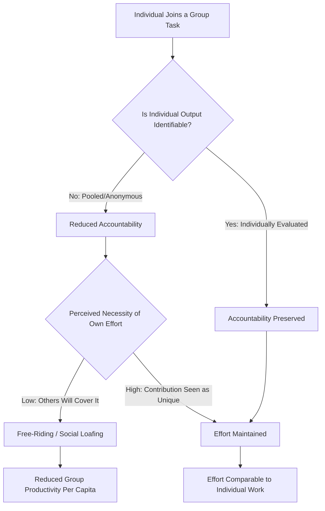

## Social Loafing and the Free-Rider Effect

### Definition

Social loafing refers to the tendency for individuals to exert **less effort** when working collectively in a group than when working individually on the same task. The free-rider effect is a closely related concept describing the tendency for individuals to reduce their effort and rely on others to carry the workload when they believe their own contribution is **dispensable** to the group's success, effectively "riding free" on the efforts of others.

While often used interchangeably, they are theoretically distinguishable:

- **Social loafing** is typically framed as a *motivational* decrement tied to reduced identifiability and accountability in additive group tasks.
- **Free-riding** is more explicitly framed around a *rational cost-benefit calculation* — individuals withhold effort when they perceive their contribution as unnecessary or unlikely to affect the collective outcome, particularly when the good produced is a **public good** (non-excludable, shared benefit).

### Historical Background

#### The Ringelmann Effect (1913)

French agricultural engineer Max Ringelmann conducted early experiments having individuals and groups pull on a rope while force was measured. He found that as group size increased, the **average individual effort decreased** — a group of eight pulled with less than eight times the force of one person alone. This became known as the **Ringelmann effect**.

Originally, this decline was attributed entirely to **coordination losses** — the physical/mechanical difficulty of synchronizing multiple people's efforts (e.g., people not pulling in perfect unison).

#### Latané, Williams, & Harkins (1979): Isolating Motivation Loss

Bibb Latané and colleagues designed experiments to separate coordination loss from **motivation loss**. Using a clapping/shouting paradigm, they had participants believe they were producing noise alone, or as part of a group (2, 4, or 6 people), while controlling for actual coordination demands using **pseudo-groups** (participants wore blindfolds/headphones and were falsely told others were also performing, when in fact they performed "together" only nominally).

- Even without any real coordination problem (since there was no actual synchronization required or possible), individual output still declined as perceived group size increased.
- This demonstrated that a **genuine motivational loss** — not just coordination difficulty — accounts for a substantial portion of the group-size performance decrement. Latané termed this **social loafing**.

### Theoretical Explanations

#### 1. Diffusion of Responsibility / Reduced Accountability

When individual contributions are pooled and not separately identifiable, individuals feel less personally accountable for the outcome, reducing the perceived personal cost of low effort.

#### 2. Collective Effort Model (Karau & Williams, 1993)

Steven Karau and Kipling Williams proposed an expectancy-value framework integrating prior research. According to the **Collective Effort Model (CEM)**, individuals exert effort on a group task to the extent that they expect:

$$E \times I \times V$$

Where:

- $E$ (Expectancy) = the belief that individual effort will lead to improved performance
- $I$ (Instrumentality) = the belief that improved performance will lead to a valued outcome
- $V$ (Value) = the subjective value placed on that outcome

Social loafing occurs when any of these links is weakened in group settings — e.g., when individual effort seems less likely to affect group performance (low $E$), when group performance seems less likely to translate to a meaningful personal outcome (low $I$), or when the outcome itself is not valued (low $V$).

#### 3. Free-Rider Theory / Public Goods Reasoning

Rooted in economic theory of **public goods**, free-riding occurs when a good or outcome is:

- **Non-excludable:** all group members benefit regardless of individual contribution
- **Non-rivalrous (often):** one member's benefit does not necessarily reduce another's

Under these conditions, a rational actor may conclude that withholding effort is individually optimal since their personal benefit is unaffected by their contribution level, especially if others' efforts are sufficient to produce the outcome. This is conceptually linked to the **tragedy of the commons** and **social dilemma** research.

#### 4. Sucker Effect

Individuals may also reduce effort to avoid feeling exploited — if they believe others in the group are loafing or will loaf, they may lower their own effort to avoid being the "sucker" who works hard while others benefit from their labor without reciprocating.

#### 5. Evaluation Potential (Link to Social Facilitation)

Loafing is reduced when individual output remains **identifiable and evaluable**. This connects directly to evaluation apprehension theory: pooled/anonymous output lowers evaluation apprehension, which removes a key driver of effort, whereas identifiable output preserves it.

**Theoretical Mechanisms Comparison**

| Mechanism | Core Driver | Key Moderator That Reverses Effect |
| --- | --- | --- |
| Diffusion of responsibility | Reduced personal accountability | Individual identifiability of output |
| Collective Effort Model | Weakened expectancy-instrumentality-value links | Meaningfulness/value of task or outcome |
| Free-rider reasoning | Rational cost-benefit calculation under non-excludable benefit | Perceived necessity of one's own contribution |
| Sucker effect | Avoidance of being exploited by others' low effort | Trust in other members' effort levels |

### Moderators That Reduce Social Loafing

Meta-analytic work (notably Karau & Williams, 1993) identified consistent moderators:

- **Identifiability of individual output:** When individual contributions can be evaluated separately, loafing is greatly reduced or eliminated.
- **Task meaningfulness/involvement:** Personally meaningful or intrinsically interesting tasks reduce loafing.
- **Group cohesion:** Members of highly cohesive groups (friends, valued in-groups) loaf less than members of ad hoc or low-cohesion groups.
- **Perceived uniqueness of contribution:** Believing one's contribution is unique or indispensable (not redundant with others') reduces loafing — directly addresses the free-rider calculation.
- **Smaller group size:** Loafing tends to increase as group size increases, partly because identifiability and perceived indispensability decrease.
- **Gender and cultural differences:** Some meta-analytic evidence suggests loafing effects are somewhat larger in men than women and larger in individualist cultures than collectivist cultures, though [Inference] the magnitude and consistency of these moderators vary across specific study samples and task types.
- **High individual standards/expectations for group performance:** Groups with explicit performance standards show reduced loafing.
- **Task difficulty and expectation of success:** Belief that the task is achievable and that effort matters (expectancy) sustains motivation.

### Worked Example

**Scenario:** A five-person student team is assigned a group project graded with a single collective grade (no individual breakdown of contribution).

| Condition | Likely Behavior | Mechanism |
| --- | --- | --- |
| Grade is purely collective; no peer evaluation | Reduced individual effort from some members | Diffusion of responsibility; low identifiability |
| Instructor requires signed individual contribution logs reviewed separately | Increased effort across members | Restored identifiability/evaluation apprehension |
| One member believes the others are highly skilled and will complete the work regardless | That member reduces effort | Free-riding: perceived low instrumentality of own contribution |
| Team assigns clearly delineated sub-tasks with named ownership | Reduced loafing across the team | Increased perceived uniqueness/indispensability of contribution |

### Empirical Paradigms

- **Rope-pulling/physical effort tasks** (Ringelmann; Ingham et al. replication using deceptive pseudo-groups to isolate motivation loss from coordination loss)
- **Shouting/clapping noise-production tasks** (Latané, Williams, & Harkins)
- **Cognitive/idea-generation tasks** (e.g., brainstorming paradigms), where "**production blocking**" is a distinct coordination-based confound researchers must control for separately from motivational loafing
- **Evaluation apprehension manipulation designs**, comparing pooled/anonymous output conditions against individually identifiable output conditions

### Process Flow Diagram

### Distinguishing Related Group-Size Phenomena

| Phenomenon | Effort Direction | Primary Mechanism |
| --- | --- | --- |
| Social Loafing | Decreased individual effort in groups | Reduced accountability/motivation |
| Free-Rider Effect | Decreased individual effort specifically for shared/public goods | Rational calculation of dispensability |
| Sucker Effect | Decreased effort in response to perceived loafing by others | Avoidance of exploitation |
| Social Facilitation | Increased or task-dependent effort/performance | Evaluation apprehension/arousal (requires identifiability) |
| Köhler Effect | **Increased** effort by weaker members in conjunctive tasks | Upward social comparison; indispensability of weakest link |

Note the **Köhler Motivation Gain Effect** is a notable counter-phenomenon: in *conjunctive* tasks (where group performance is limited by the weakest member, e.g., a chain is only as strong as its weakest link), less capable members often work *harder* in groups than alone, the opposite of loafing, because their individual contribution is highly visible and indispensable to the outcome.

### Applications

- **Organizational management:** Performance appraisal systems that isolate individual contributions within team-based structures (e.g., individual KPIs alongside team metrics) counteract loafing.
- **Education:** Peer evaluation components, individually graded reflections, and clearly assigned sub-roles in group projects are common evidence-based interventions.
- **Online collaboration/crowdsourcing:** [Inference] Virtual and distributed teams may be especially susceptible to loafing due to reduced visibility of individual contributions, though platform-specific tracking tools (e.g., commit histories, activity logs) can restore identifiability and likely mitigate the effect, consistent with the broader identifiability literature.
- **Public goods and civic behavior:** The free-rider concept extends beyond small groups to large-scale collective action problems (e.g., voting, environmental conservation, tax compliance), where non-excludability of benefits creates incentive structures for withholding individual contribution.

### Critiques and Limitations

- Most classic experiments use short-term, low-stakes laboratory tasks (shouting, rope-pulling); [Inference] generalization to long-term, high-stakes, real-world team contexts (e.g., corporate teams with ongoing relationships) may differ due to reputational and relational factors not well captured in brief lab paradigms.
- Cultural moderators (individualism/collectivism) show effect variability across studies, and cross-cultural meta-analytic conclusions should be treated as generalizations rather than fixed rules.
- Task type matters substantially: additive tasks (individual contributions sum to a total) show the clearest social loafing effects, while conjunctive and disjunctive tasks can produce different or even opposite motivational patterns (e.g., Köhler effect).
- The free-rider effect's economic/rational-choice framing and social loafing's motivational framing are not always empirically separated in a given study, and researchers do not universally agree on whether they represent the same underlying process or distinct ones.

### Related Topics / Next Steps

- **Social facilitation and evaluation apprehension**
- **Köhler motivation gain effect**
- **Groupthink and group decision-making**
- **Deindividuation theory**
- **Tragedy of the commons and social dilemmas**
- **Collective Effort Model (Karau & Williams, 1993)**
- **Group cohesion and group performance**
- **Diffusion of responsibility (bystander effect parallels)**
- **Team-based performance management systems**