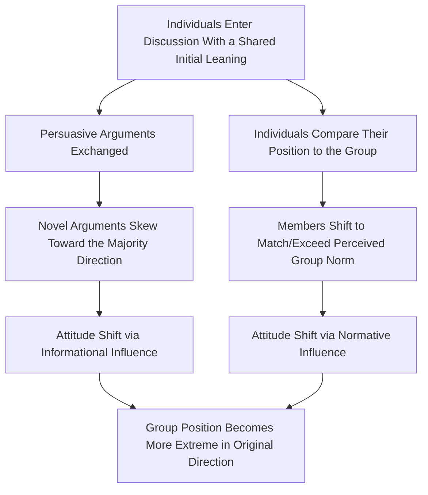

## Group Polarization

### Definition

Group polarization refers to the tendency for group discussion to strengthen the **initial inclinations** of group members, producing a post-discussion group decision or attitude that is **more extreme** in the same direction as the average pre-discussion leaning of the individuals. If members initially lean cautious, group discussion tends to make the group more cautious; if members initially lean risky, discussion tends to make the group riskier.

Group polarization is a shift in the **average** position of the group toward a more extreme pole, not necessarily unanimity or consensus on an extreme view — it can occur alongside continued diversity of opinion within the group.

### Historical Background

#### The "Risky Shift" Discovery (Stoner, 1961)

James Stoner, in an unpublished master's thesis, presented participants with a set of hypothetical dilemmas (the **Choice Dilemmas Questionnaire**, developed by Kogan and Wallach) in which a protagonist must choose between a risky, high-payoff option and a safe, low-payoff option. Stoner found that group discussion led participants to recommend **riskier** courses of action than their pre-discussion individual averages — the "**risky shift**."

#### Discovery of the "Cautious Shift"

Subsequent research found that not all dilemmas produced a risky shift; some items produced a **cautious shift**, where group discussion made participants more conservative than their individual baselines. This complicated the "risky shift" label and suggested the underlying phenomenon was not risk-specific but rather a general tendency toward **polarization in the direction of the initial lean**.

#### Reframing as Group Polarization (Moscovici & Zavalloni, 1969)

Serge Moscovici and Marisa Zavalloni proposed the broader term "group polarization," demonstrating the effect extended beyond risk-related dilemmas to attitudes generally (e.g., political opinions, jury verdicts, prejudice). This reframing established polarization as a general property of group discussion rather than a risk-specific anomaly.

### Theoretical Explanations

#### 1. Social Comparison Theory (Normative Influence)

Individuals are motivated to view themselves favorably relative to the group and to hold positions that are socially valued. Upon discovering that others share their general leaning (and sometimes hold it more strongly), individuals shift toward a **more extreme version** of the socially valued position to:

- Maintain a favorable self-presentation relative to the group norm
- Avoid being perceived as less committed to a valued position than peers

This is classified as a form of **normative social influence** — driven by desire for social approval rather than by new information.

#### 2. Persuasive Arguments Theory (Informational Influence)

During discussion, group members are exposed to a pool of arguments supporting the majority-favored direction, many of which they had not previously considered. Key premises:

- The pool of arguments available in a group leaning one direction is **disproportionately weighted** toward that direction (more novel supporting arguments exist to be shared than counterarguments).
- Exposure to these novel, persuasive arguments shifts individual attitudes further in that direction.
- This is classified as a form of **informational social influence** — driven by genuine reevaluation of the issue based on new information/arguments.

#### 3. Social Identity / Self-Categorization Theory Extension

Group polarization has also been explained via **self-categorization theory**: when individuals categorize themselves as group members, they conform to a **prototypical group position**, which is often more extreme than the simple average of individual pre-discussion positions (a "polarized norm"). Members shift toward this perceived prototype to affirm in-group identity and distinguish the in-group from relevant out-groups.

**Comparison of Explanatory Mechanisms**

| Theory | Influence Type | Core Driver | Key Evidence Supporting It |
| --- | --- | --- | --- |
| Social Comparison | Normative | Desire for favorable self-presentation relative to group | Polarization occurs even with minimal new argument exposure (e.g., simply learning others' positions) |
| Persuasive Arguments | Informational | Exposure to novel supporting arguments | Polarization occurs even without direct social comparison feedback, from argument pools alone |
| Self-Categorization | Normative/Identity-based | Conformity to a polarized in-group prototype | Polarization strength varies with strength of group identification |

[Inference] Most contemporary treatments regard social comparison and persuasive arguments as **complementary, co-occurring mechanisms** rather than mutually exclusive explanations, with their relative contribution likely varying by context and topic.

### Worked Example

**Scenario:** A jury deliberates on punitive damages in a civil case. Individually, before deliberation, six of eight jurors lean toward a moderately high damages award; two lean lower.

| Stage | Group Position | Mechanism at Work |
| --- | --- | --- |
| Pre-deliberation (individual averages) | Moderately high award favored | Baseline individual leanings |
| During deliberation | Majority-favoring arguments dominate discussion (more jurors generate more supporting arguments for high damages) | Persuasive Arguments Theory |
| Jurors realize the majority leans even higher than their own initial estimate | Individual jurors shift toward matching/exceeding perceived group norm | Social Comparison Theory |
| Post-deliberation verdict | Damages award **higher** than the pre-deliberation individual average | Group Polarization (risky/extreme shift) |

### Real-World Manifestations

- **Jury deliberation:** Polarization has been documented in mock jury studies, where post-deliberation punitive damage awards tend to be more extreme (either higher or lower) than the median of individual pre-deliberation judgments.
- **Political attitudes and echo chambers:** Like-minded political discussion groups (including online communities) tend to produce more extreme post-discussion attitudes, a mechanism frequently cited in discussions of political polarization and online radicalization. [Inference] While the underlying social-psychological mechanism is well-established in laboratory settings, the extent to which it fully accounts for real-world political polarization (versus selective exposure, algorithmic curation, and other factors) remains a subject of ongoing research and debate.
- **Organizational/corporate decision-making:** Homogeneous management teams may reach riskier or more extreme strategic decisions than any individual member would recommend alone.
- **Terrorism and radicalization research:** Some scholars have applied group polarization theory to explain incremental radicalization within insular groups sharing extreme initial views, where iterative discussion progressively shifts the group toward more extreme positions.

### Process Flow Diagram

### Distinguishing From Related Group Phenomena

| Phenomenon | Key Feature | Relation to Group Polarization |
| --- | --- | --- |
| Groupthink | Suppression of dissent in pursuit of consensus, often under high cohesion and stress | Distinct process; groupthink centers on defective decision-making and concurrence-seeking, while polarization centers on attitude extremity shift; the two can co-occur but are not identical |
| Conformity (Asch paradigm) | Individual yields to a unanimous group judgment, often against private belief | Polarization does not require yielding against private belief — shift is typically consistent with (extension of) prior private leaning |
| Minority Influence | A consistent minority shifts majority opinion over time | Polarization concerns the aggregate/majority-consistent shift, not minority-driven change |
| Deindividuation | Loss of self-awareness/identity in a group | Not a necessary condition for polarization, though anonymity in some online contexts may amplify polarization via reduced accountability |

### Key Boundary Conditions

- **Pre-existing shared lean is necessary:** Polarization requires a group whose members already share a directional tendency before discussion; groups with no initial shared lean, or perfectly balanced/opposing views, do not reliably polarize in a single direction.
- **Group homogeneity/attitude similarity** strengthens polarization; heterogeneous groups with genuinely opposed views are more likely to show attitude convergence toward the middle, or fail to reach a stable shift.
- **Discussion quality and argument pool composition:** The proportion of novel, direction-consistent arguments generated during discussion predicts the magnitude of shift under persuasive arguments theory.
- **Anonymity and online contexts:** [Inference] Reduced identifiability in online discussion (e.g., anonymous forums) may alter the balance between normative and informational mechanisms, though empirical findings on whether anonymity amplifies or dampens polarization online are mixed across studies.

### Critiques and Limitations

- Much of the classic empirical base relies on the Choice Dilemmas Questionnaire and laboratory discussion paradigms; [Inference] generalizability to long-term, high-stakes, real-world group decisions with ongoing social relationships may differ from short single-session lab discussions.
- Distinguishing the relative contributions of social comparison versus persuasive arguments mechanisms empirically is difficult, since both typically operate simultaneously in natural discussion.
- Group polarization is a **directional amplification** effect and does not, by itself, indicate whether the resulting group position is more or less accurate/correct than the pre-discussion average — amplification of an initially poor judgment is possible.

### Related Topics / Next Steps

- **Groupthink and defective group decision-making**
- **Conformity: Asch paradigm and normative/informational influence**
- **Minority influence and social change**
- **Deindividuation theory**
- **Jury decision-making research**
- **Social identity theory and self-categorization theory**
- **Echo chambers and online political polarization**
- **Persuasive arguments theory in attitude change**