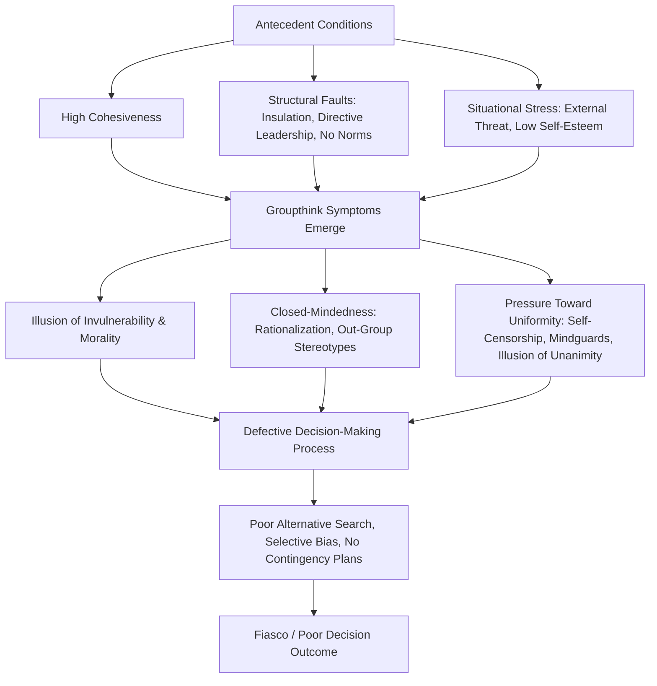

## Groupthink: Antecedents and Prevention

### Definition

Groupthink is a mode of thinking that occurs within highly cohesive groups when members' desire for **unanimity and consensus** overrides their motivation to realistically evaluate alternative courses of action. The term was coined by Irving Janis, who defined it as a deterioration of mental efficiency, reality testing, and moral judgment resulting from in-group pressures toward conformity.

Groupthink is distinct from ordinary conformity in that it specifically concerns **defective group decision-making processes**, often within high-stakes policy or organizational contexts, rather than simple attitude or judgment shifts on neutral tasks.

### Historical Background

#### Janis's Foundational Work (1972, revised 1982)

Irving Janis developed the groupthink model through retrospective case analysis of major U.S. foreign policy decisions, contrasting poor decisions with well-managed ones:

- **Fiascoes analyzed:** the Bay of Pigs invasion (1961), escalation of the Vietnam War, failure to anticipate the attack on Pearl Harbor (1941), the Watergate cover-up.
- **Well-managed counterexamples:** the Cuban Missile Crisis response (1962) and the Marshall Plan, which Janis argued show that the same decision-making groups can avoid groupthink under different procedural conditions.

Janis's methodology relied heavily on historical/archival case-study analysis rather than controlled experimentation, which shapes both the theory's real-world resonance and some of its empirical limitations (see Critiques).

### The Groupthink Model: Antecedent Conditions

Janis proposed three categories of antecedent conditions that increase the likelihood of groupthink:

#### 1. High Group Cohesiveness

A strong sense of camaraderie, loyalty, and desire to maintain group harmony. Janis considered cohesiveness a **necessary but not sufficient** condition — cohesive groups do not always fall into groupthink, but groupthink is unlikely without it.

#### 2. Structural/Organizational Faults

- **Insulation of the group** from outside/dissenting information or expert input
- **Lack of impartial leadership** (a directive leader who promotes a preferred solution early)
- **Lack of established norms/procedures** for methodical decision-making (e.g., no requirement to survey alternatives)
- **Homogeneity of members' social background and ideology**, reducing the range of perspectives represented

#### 3. Provocative Situational Context

- **High stress from external threats**, especially combined with low hope of finding a better solution than the leader's preferred one
- **Low self-esteem of members**, temporarily induced by recent failures, excessive task difficulty, or moral dilemmas that make members more willing to defer to group consensus

**Antecedent Conditions Summary Table**

| Category | Specific Antecedents |
| --- | --- |
| Cohesiveness | High group cohesiveness (necessary condition) |
| Structural Faults | Group insulation; directive/partial leadership; lack of decision-making norms; homogeneous member background |
| Situational Context | High external stress/threat; low perceived alternatives; temporarily low member self-esteem |

### Symptoms of Groupthink

Janis identified eight symptoms, commonly grouped into three categories:

**Overestimations of the Group**

1. **Illusion of invulnerability** — excessive optimism and risk-taking
2. **Belief in inherent group morality** — unquestioned belief in the rightness of the group's cause, discouraging ethical scrutiny

**Closed-Mindedness**

3. **Collective rationalization** — discounting warnings and negative feedback rather than reconsidering assumptions

4. **Stereotyped views of out-groups** — viewing opponents as too evil to negotiate with or too weak/stupid to pose a real threat

**Pressures Toward Uniformity**

5. **Self-censorship** — members withhold doubts and counterarguments

6. **Illusion of unanimity** — silence is interpreted as agreement, creating a false sense of consensus

7. **Direct pressure on dissenters** — members who raise objections face pressure to conform, sometimes framed as disloyalty

8. **Self-appointed "mindguards"** — members who shield the group/leader from dissenting information or unwelcome external opinions

### Consequences: Defective Decision-Making Symptoms

Janis linked the eight symptoms to observable decision-making defects, including:

- Incomplete survey of alternatives and objectives
- Failure to examine risks of the preferred choice
- Poor information search
- Selective bias in processing available information
- Failure to reconsider originally rejected alternatives
- Failure to work out contingency plans

### Process Flow Diagram

### Worked Example

**Scenario: Bay of Pigs Invasion (1961) — Illustrative Case**

| Groupthink Element | Manifestation in the Case (as analyzed by Janis) |
| --- | --- |
| High cohesiveness | Kennedy's close-knit advisory team, newly formed and eager to demonstrate competence |
| Directive leadership | President Kennedy's apparent early favoring of the invasion plan shaped discussion |
| Illusion of invulnerability | Overconfidence in the plan's success despite weak evidence |
| Self-censorship | Advisors with doubts reportedly withheld full objections in meetings |
| Mindguard behavior | Some members reportedly screened out dissenting viewpoints from reaching the full group |
| Outcome | Poorly vetted plan proceeded to failure |

[Unverified] These case interpretations rely on Janis's historical reconstruction and participant recollections; subsequent historians have debated some specifics of the decision process, and the case should be treated as an illustrative application of the model rather than an uncontested empirical demonstration.

### Prevention Strategies (Janis's Recommendations)

Janis proposed several structural and procedural remedies:

1. **Leader impartiality:** The leader should withhold personal preferences and opinions early in deliberations to avoid signaling a preferred outcome.
2. **Devil's advocate role:** Assign at least one member to formally argue against the group's tentative consensus, ideally rotating the role.
3. **Subgroup deliberation:** Divide the group into independent subgroups that deliberate separately before reconvening to compare conclusions.
4. **Outside expert consultation:** Regularly invite qualified outsiders to challenge the group's views and introduce alternative perspectives.
5. **Second-chance meetings:** After reaching a preliminary consensus, hold a follow-up meeting where members are explicitly encouraged to express any residual doubts before final commitment.
6. **Encourage open inquiry and objections:** Establish explicit norms that legitimize airing doubts and objections without penalty.
7. **Assign a "reality-testing" role:** Designate members to focus specifically on evaluating warning signs and risks of the preferred plan.
8. **Multiple independent groups:** When feasible, have separate groups work on the same problem independently, then compare solutions.

**Prevention Strategies Summary Table**

| Strategy | Primary Antecedent It Targets |
| --- | --- |
| Leader impartiality | Directive leadership / structural fault |
| Devil's advocate | Closed-mindedness / self-censorship |
| Subgroup deliberation | Group insulation / homogeneity of views |
| Outside expert consultation | Group insulation |
| Second-chance meeting | Illusion of unanimity |
| Open inquiry norms | Self-censorship / pressure on dissenters |
| Reality-testing role | Illusion of invulnerability |
| Independent parallel groups | Group insulation / lack of alternative search |

### Empirical Status and Research Approaches

- **Case study method (Janis's original approach):** Retrospective, qualitative analysis of historical decision records, memoirs, and interviews. Rich in ecological validity but limited in causal control.
- **Laboratory experimental tests:** Subsequent researchers (e.g., Philip Tetlock, and others using experimental manipulations of cohesiveness, leadership style, and insulation) have tested groupthink components under controlled conditions with **mixed support** for the full model.
- [Inference] Meta-analytic and experimental evidence more consistently supports some individual components (e.g., effects of directive leadership and insulation on decision quality) than the complete, integrated eight-symptom model as originally specified, suggesting the full syndrome as Janis described it may be less reliably observed as a unified package than its individual antecedent-outcome links.
- Some researchers (e.g., Whyte, 1998) have proposed reframing groupthink partly through a **collective efficacy/overconfidence lens** rather than purely a cohesion-driven conformity process.

### Distinguishing From Related Group Phenomena

| Phenomenon | Key Feature | Relation to Groupthink |
| --- | --- | --- |
| Group Polarization | Attitudes become more extreme in the direction of initial lean | Can co-occur with groupthink but is a distinct mechanism (extremity shift vs. consensus-seeking suppression of dissent) |
| Conformity (Asch) | Individual yields to unanimous group judgment on a factual/perceptual task | Groupthink is a group-level decision-process failure, not an individual perceptual conformity effect |
| Social Loafing | Reduced individual effort in additive tasks | Unrelated mechanism; groupthink concerns decision quality, not motivational effort |
| Diffusion of Responsibility | Reduced individual accountability in groups | Related conceptually (contributes to reduced individual scrutiny) but not identical; groupthink is a broader structural/procedural syndrome |

### Applications

- **Organizational governance:** Corporate boards and executive teams are frequently advised to institutionalize devil's advocate roles and outside audits to reduce groupthink risk in high-stakes decisions.
- **Military and intelligence decision-making:** Structured analytic techniques (e.g., "red teaming," structured self-critique protocols) in intelligence agencies draw directly on groupthink prevention principles.
- **Crisis management teams:** Emphasis on inviting dissent and avoiding premature leader-signaled preferences during emergency decision processes.
- **Clinical/medical team decision-making:** [Inference] Multidisciplinary team rounds and "time-out" procedures in some clinical settings function similarly to second-chance meetings, though this application is more an extrapolation of groupthink-prevention logic than a body of dedicated groupthink research in healthcare.

### Critiques and Limitations

- Reliance on retrospective case studies raises concerns about confirmation bias in selecting cases that fit the model and post hoc interpretation of ambiguous historical records.
- Experimental tests have produced inconsistent support for the complete model, particularly for the claim that high cohesiveness alone reliably produces groupthink; some studies find cohesiveness is a weaker or more conditional predictor than Janis proposed.
- The theory may underspecify **how much** of each antecedent condition is required and how the conditions interact, limiting precise predictive testing.
- Some scholars argue "groupthink" has become a loosely applied popular label for any poor group decision, diluting its specific theoretical meaning.

### Related Topics / Next Steps

- **Group polarization**
- **Conformity: Asch paradigm and normative/informational influence**
- **Minority influence and social change**
- **Diffusion of responsibility and bystander effect**
- **Decision-making biases: overconfidence and confirmation bias**
- **Leadership styles and group decision quality**
- **Organizational behavior: team decision-making structures**
- **Historical case analysis methodology in social psychology**