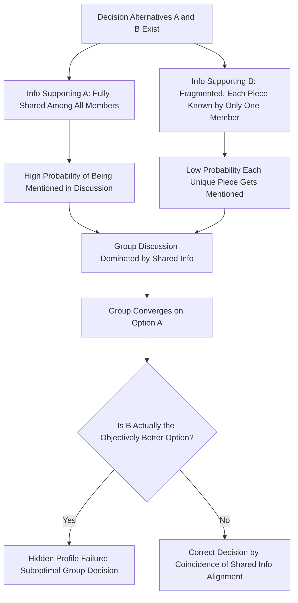

## Group Decision-Making Processes

### Definition

Group decision-making processes refer to the mechanisms, structures, and dynamics through which groups combine individual members' information, preferences, and judgments to reach a collective decision, judgment, or course of action. This encompasses the **procedural rules** used to aggregate input (e.g., majority vote, consensus), the **social dynamics** that shape discussion, and the **cognitive/informational processes** that determine whether groups outperform or underperform individuals.

### Task Typology: Steiner's Classification (1972)

Ivan Steiner proposed an influential taxonomy of group tasks based on how individual contributions combine to determine group performance, which is foundational for understanding when groups help or hurt decision quality.

| Task Type | Definition | Example |
| --- | --- | --- |
| **Additive** | Individual contributions are summed | Rope pulling, brainstorming quantity |
| **Conjunctive** | Group performance is limited by the weakest member | Mountain climbing team roped together; assembly line |
| **Disjunctive** | Group performance is determined by the best member's contribution (if adopted) | Solving a single correct-answer problem (e.g., math puzzle) |
| **Compensatory/Discretionary** | Individual judgments are averaged or combined by group discretion | Jury verdict, estimation tasks |

Steiner's core formula distinguishes **potential productivity** (what a group could theoretically achieve based on member resources) from **actual productivity**, with the difference attributed to **process loss**:

$$\text{Actual Productivity} = \text{Potential Productivity} - \text{Process Loss} + \text{Process Gain}$$

- **Process losses** include coordination problems and motivation losses (e.g., social loafing).
- **Process gains** include synergy effects where group interaction produces outcomes exceeding the best individual member's capability (less common but documented, e.g., in some disjunctive problem-solving tasks with effective error-checking).

### Decision Rules and Aggregation Methods

| Decision Rule | Description | Typical Strengths | Typical Weaknesses |
| --- | --- | --- | --- |
| **Majority rule** | Decision adopted if supported by more than half | Fast, clear resolution | Can suppress minority-held correct information |
| **Plurality rule** | Option with most votes wins (not necessarily majority) | Handles multiple options efficiently | May not reflect broad preference; vulnerable to vote-splitting |
| **Unanimity/consensus** | All members must agree | High buy-in, thorough vetting | Slow; vulnerable to groupthink pressures to manufacture false consensus |
| **Averaging (compensatory)** | Individual judgments are mathematically combined (e.g., mean/median estimate) | Reduces impact of individual outlier error; leverages "wisdom of crowds" | Can dilute a correct minority judgment toward the group mean |
| **Leader/authority decision** | A designated leader decides, potentially after group input | Fast; leverages any special leader expertise | Risk of insufficient information use if leader ignores group input |
| **Delegated/expert subgroup** | A subset of members with relevant expertise decides | Concentrates expertise | Excludes broader group perspectives |

### Key Informational Dynamics

#### 1. The Common Knowledge Effect (Shared Information Bias)

Groups tend to spend disproportionate discussion time on information that **all members already share** ("common" or "shared" information) rather than information held by only one or a few members ("unshared" or "unique" information), even when the unique information is critical to reaching the best decision.

- Demonstrated primarily through the **Hidden Profile paradigm** (Stasser & Titus, 1985), in which researchers distribute information about decision alternatives so that the best option's supporting evidence is fragmented across members (unshared), while weaker options' supporting evidence is fully shared among all members from the start.
- Groups using hidden profiles frequently fail to identify the objectively best option because discussion is statistically more likely to surface shared information (since more members can each independently mention it), while unique information is only introduced if the single member holding it chooses to raise it.

**Formal Logic of the Hidden Profile Effect (illustrative):**

If shared information is known by all $n$ group members and unique information is known by only 1 member, the probability that shared information gets mentioned during discussion is substantially higher purely due to the number of members capable of raising it — a structural/mathematical bias independent of any motivational suppression.

#### 2. Information Sampling Model (Stasser & Titus)

This formal model explains the common knowledge effect as partly a **sampling artifact**: each piece of information has some probability of being mentioned per discussion turn, and since shared information can be mentioned by multiple members, it has a cumulatively higher chance of entering discussion than unique information restricted to a single holder.

#### 3. Transactive Memory Systems

In well-functioning, especially long-standing, groups (e.g., established teams), members develop a **shared understanding of who knows what**, allowing efficient retrieval and integration of distributed expertise. This can offset the common knowledge effect if the group has structured awareness of specialized member knowledge.

### Process Flow Diagram: Hidden Profile Dynamics

### Worked Example

**Scenario:** A five-person hiring committee evaluates two finalist candidates, Candidate X and Candidate Y.

| Information Type | Distribution | Content |
| --- | --- | --- |
| Shared information | Known to all 5 members | Both candidates' strong resumes and interview charisma; slightly favors X on surface impression |
| Unique information | Each held by only 1 member | Five distinct facts about Y's superior track record on specific job-relevant competencies, each known by a different member |

**Predicted outcome (Hidden Profile Effect):** During discussion, the shared positive impressions of X are mentioned repeatedly and reinforced by multiple members, while each unique fact about Y is only as likely to surface as that single member's willingness/opportunity to raise it. The committee is statistically prone to selecting X despite Y being the objectively stronger candidate if all unique information had been pooled and considered.

**Mitigation applied:** If the committee uses a structured procedure — e.g., each member is explicitly asked in turn to share information no one else has mentioned — the unique information is more reliably surfaced, improving decision accuracy.

### Group vs. Individual Decision-Making: When Groups Help or Hurt

**Groups tend to outperform individuals when:**

- The task is disjunctive with a demonstrably correct/verifiable answer, and at least one competent member exists whose correct solution can be recognized and adopted by others ("truth wins" or "truth-supported wins" dynamics)
- The task benefits from averaging independent estimates (wisdom-of-crowds effects on quantitative estimation)
- Diverse relevant expertise is genuinely pooled and integrated (not just present but unused)

**Groups tend to underperform individuals (or the best individual) when:**

- Critical information is unevenly distributed (hidden profiles)
- Conformity pressures or status hierarchies suppress minority/expert input
- High cohesion combined with insulation produces groupthink dynamics
- The task is conjunctive and a single weak member constrains overall output
- Social loafing reduces motivation on additive tasks

### Group Polarization and Groupthink as Decision-Making Failure Modes

These closely related phenomena represent specific pathological patterns within the broader group decision-making landscape:

- **Group polarization:** discussion shifts the group's collective judgment toward a more extreme version of members' shared initial lean (see dedicated topic).
- **Groupthink:** cohesive, insulated groups under stress suppress critical evaluation of alternatives in pursuit of consensus (see dedicated topic).
- **Common knowledge/hidden profile effect:** structural bias toward shared information causes suboptimal option selection independent of any conformity pressure (distinguishing feature from groupthink, which is explicitly motivational/social).

**Comparison of Group Decision-Making Failure Modes**

| Failure Mode | Primary Cause | Information vs. Motivation Based |
| --- | --- | --- |
| Groupthink | Cohesion + insulation + directive leadership suppress dissent | Primarily motivational/normative |
| Group Polarization | Persuasive arguments and social comparison shift the group norm | Mixed informational and normative |
| Hidden Profile / Common Knowledge Effect | Structural sampling bias toward shared information | Primarily informational/structural |
| Social Loafing | Reduced individual effort on additive tasks | Motivational |

### Procedural Interventions to Improve Group Decisions

- **Structured discussion protocols** (e.g., explicitly polling each member for unique information before open discussion) to counteract the common knowledge effect
- **Devil's advocate and structured dissent roles** to counteract groupthink pressures
- **Nominal Group Technique:** members independently generate ideas/judgments in writing before any group discussion, reducing premature convergence and production blocking
- **Delphi method:** iterative, anonymous rounds of expert judgment with aggregated feedback between rounds, used to reduce conformity pressure while retaining group input, particularly for forecasting and expert-elicitation tasks
- **Devil's advocacy and dialectical inquiry:** formally structured debate techniques where subgroups argue opposing positions before a final decision
- **Anonymity/electronic brainstorming tools:** can reduce production blocking and evaluation apprehension in idea-generation phases

**Comparison of Structured Decision-Making Techniques**

| Technique | Core Feature | Primary Problem It Addresses |
| --- | --- | --- |
| Nominal Group Technique | Independent generation before discussion | Production blocking; premature convergence |
| Delphi Method | Anonymous iterative rounds with feedback | Conformity pressure; status-based influence |
| Devil's Advocacy | Assigned dissenting role | Groupthink; suppressed dissent |
| Dialectical Inquiry | Structured opposing subgroup debate | Insufficient consideration of alternatives |
| Structured information polling | Explicit prompts for unique information | Common knowledge/hidden profile effect |

### Applications

- **Corporate strategic planning:** Structured decision protocols (e.g., devil's advocacy, dialectical inquiry) are used in executive decision processes to counteract groupthink and hidden profile risks.
- **Jury decision-making:** Legal scholars study deliberation structure (e.g., verdict-driven vs. evidence-driven deliberation styles) as a key determinant of information pooling quality.
- **Forecasting and expert elicitation:** The Delphi method is widely used in fields such as public health policy and technology forecasting to aggregate expert judgment while minimizing status-driven conformity.
- **Medical diagnosis teams:** [Inference] Structured information-sharing protocols in multidisciplinary case conferences likely mitigate hidden-profile-type failures, though this is more an application of general findings than a distinct body of dedicated medical-team hidden-profile research.

### Critiques and Limitations

- Much hidden profile and common knowledge effect research uses artificial laboratory tasks with experimentally engineered information distributions; [Inference] real-world information distributions are typically messier and less cleanly "hidden," which may affect the magnitude of the effect outside the lab.
- The line between groupthink, polarization, and common-knowledge failures is not always empirically clean in real-world case studies, since multiple mechanisms often operate simultaneously.
- Structured interventions (Delphi, NGT, devil's advocacy) show generally positive but variable effect sizes across studies and task domains, and their effectiveness may depend on facilitator skill and organizational buy-in rather than the technique alone.

### Related Topics / Next Steps

- **Groupthink: antecedents and prevention**
- **Group polarization**
- **Social loafing and the free-rider effect**
- **Wisdom of crowds and collective intelligence**
- **Transactive memory systems**
- **Leadership styles and decision-making authority**
- **Jury decision-making research**
- **Brainstorming effectiveness and production blocking**