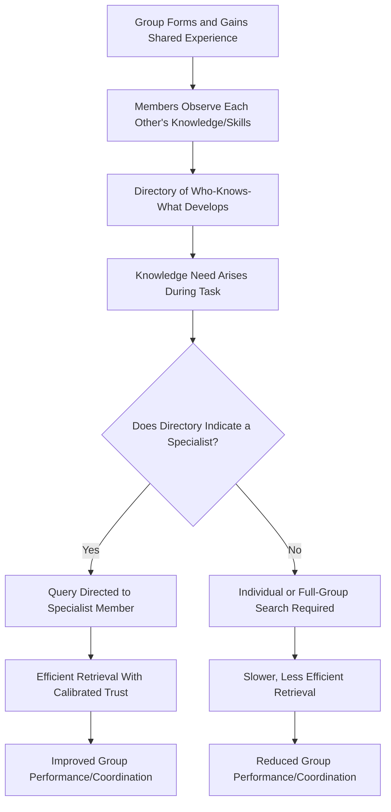

## Transactive Memory Systems

### Definition

A transactive memory system (TMS) is a shared cognitive system that groups (particularly close relationship dyads and work teams) develop for **encoding, storing, and retrieving knowledge** across individual members, combined with a shared awareness of **who knows what**. Rather than each member independently trying to know everything, a group with a well-developed TMS distributes cognitive labor: individuals specialize in different knowledge domains, and the group collectively knows more than the sum of any single member's knowledge because members know **where** to direct a given information need.

The system consists of two interdependent components:

- The **directory/meta-knowledge** — an internal map of who possesses expertise in which domain
- The **retrieval coordination process** — the social/behavioral routines by which members access others' specialized knowledge when needed

### Historical Background

#### Wegner's Original Formulation (1985, 1987)

Daniel Wegner introduced the concept of transactive memory, originally studying close relationships (particularly long-term romantic couples). He observed that partners in established relationships often develop a **differentiated, coordinated memory system**: one partner might reliably remember dates and appointments, while the other remembers technical or financial details, with each partner relying on the other's specialized recall.

Wegner's key theoretical contribution was framing this not merely as division of labor, but as a genuine **emergent group-level cognitive system** — the "transactive memory" existing at the level of the relationship/group, distinct from and exceeding the sum of the individual members' memories.

#### Extension to Work Teams (Liang, Moreland, Argote; Moreland, 1990s)

Subsequent researchers, notably Linda Argote and colleagues, extended the concept to organizational and work-team contexts. A key empirical paradigm involved training assembly-task teams either **together** (as intact groups) or as a set of **individually trained members later combined into ad hoc groups**. Groups trained together consistently developed stronger transactive memory systems and outperformed ad hoc groups of individually trained members with equivalent task knowledge, demonstrating that TMS formation depends on **shared group experience**, not merely aggregate individual competence.

### Core Components of a Transactive Memory System

| Component | Description |
| --- | --- |
| **Specialization** | Differentiated distribution of knowledge/expertise across members, rather than redundant overlap |
| **Credibility** | Members' trust in the accuracy and reliability of other members' specialized knowledge |
| **Coordination** | Smooth, efficient processes for accessing and integrating distributed knowledge when needed (e.g., knowing who to ask, minimal friction in retrieval) |

These three components (specialization, credibility, coordination) are the standard operationalized dimensions used in most empirical TMS measurement scales in organizational research.

### Theoretical Mechanisms

#### 1. Directory Updating

Group members continuously update their internal "directory" of who knows what, based on observed behavior, stated expertise, task assignments, and past successful retrievals.

#### 2. Allocation of Encoding Responsibility

New information entering the group is implicitly or explicitly assigned to the member(s) best positioned to encode and retain it, reducing redundant encoding effort across the group.

#### 3. Retrieval Coordination

When a knowledge need arises, members direct queries to the appropriate specialist rather than attempting to independently recall or search for the information themselves, and rely on the specialist's response with a degree of calibrated trust.

#### 4. Differentiation from Simple Division of Labor

TMS is distinguished from mere task division because it involves an internalized **shared cognitive map** of expertise location that guides ongoing, often implicit, coordination — not just a formal organizational chart assigning tasks.

### Process Flow Diagram

### Worked Example

**Scenario:** A four-person software development team has worked together for two years.

| Domain | Specialist (per TMS directory) | Coordination Behavior |
| --- | --- | --- |
| Database architecture | Member A | Team routes all schema questions to A without redundant research |
| Front-end UI frameworks | Member B | UI bugs are triaged directly to B |
| DevOps/deployment pipelines | Member C | Deployment issues escalate to C by default |
| Client requirements history | Member D | Ambiguous spec questions are referred to D, who maintains informal institutional memory |

**Outcome:** When a production bug spans both database and deployment concerns, the team efficiently coordinates A and C directly, rather than each member independently attempting to diagnose the full problem. This reflects high specialization, credibility (trust that A and C's input is reliable), and coordination (smooth routing of the problem to the right people) — the three canonical TMS dimensions.

**Contrast — Newly Formed Ad Hoc Team:** A team assembled for a one-time project, despite each member individually possessing comparable technical knowledge to the above, lacks a shared directory of expertise. Members redundantly research the same issues, are uncertain whom to ask, and may distrust or second-guess each other's input, producing slower and less coordinated problem-solving despite similar aggregate knowledge.

### Antecedents/Predictors of Strong TMS Development

- **Shared training/experience together** (rather than separately trained members later combined) — a well-replicated finding in the organizational literature
- **Group longevity and stability** — TMS tends to strengthen over time as membership remains stable, and can be disrupted by membership turnover
- **Communication quality and frequency** — richer, more frequent interaction supports directory formation
- **Task interdependence** — tasks requiring integration of diverse expertise create stronger incentive for TMS development than fully independent individual tasks
- **Face-to-face vs. distributed/virtual interaction:** [Inference] Traditional TMS research emphasizes co-located, face-to-face team formation as conducive to strong TMS development; virtual/distributed teams may develop TMS more slowly or through different mechanisms (e.g., digital documentation systems substituting for informal directory cues), though this is an active and evolving area of study rather than a settled finding.

### Consequences of Strong vs. Weak TMS

| Outcome Domain | Strong TMS | Weak TMS |
| --- | --- | --- |
| Task performance/efficiency | Higher, especially on complex/interdependent tasks | Lower; redundant effort, coordination delays |
| Knowledge retrieval speed | Fast, targeted queries to correct specialist | Slow, diffuse search |
| Error rates | Lower, due to credible specialist input | Higher, due to misallocated or unverified information |
| Team member satisfaction | [Inference] Generally associated with higher satisfaction and psychological comfort in organizational studies, though this relationship is less universally consistent than the performance-related findings | Lower coordination confidence |
| Vulnerability to turnover | High vulnerability — losing a specialist member can create a significant knowledge gap | Less catastrophic loss per member, but lower baseline performance overall |

### Relation to Other Group Cognition Phenomena

| Phenomenon | Relationship to Transactive Memory |
| --- | --- |
| Common knowledge effect / hidden profiles | TMS can directly counteract the common knowledge effect: a well-functioning directory helps groups deliberately seek out unique/unshared information from the correct specialist rather than defaulting to shared information |
| Groupthink | Distinct process; TMS concerns knowledge *distribution and retrieval efficiency*, not consensus-seeking or conformity pressure, though a poorly functioning TMS could in principle contribute to insufficient information search noted in groupthink cases |
| Social loafing | Distinct motivational phenomenon; however, [Inference] highly differentiated TMS specialization could plausibly reduce loafing on knowledge-based tasks by making individual contributions more visibly indispensable, an extrapolation consistent with the free-rider "perceived uniqueness" moderator rather than a directly established TMS-specific finding |
| Group decision-making processes | TMS is a foundational cognitive infrastructure that shapes the efficiency and accuracy of broader group decision-making, particularly for tasks requiring integration of specialized expertise |

### Applications

- **Organizational team design:** Encouraging stable team membership and shared onboarding/training experiences to foster TMS development, rather than frequently reshuffling personnel across projects.
- **Knowledge management systems:** Corporate wikis, expertise directories, and "who-knows-who" databases are sometimes explicitly designed to formalize and support transactive memory functions, particularly in larger organizations where informal directory-building is harder to sustain.
- **Close relationships/couples research:** TMS concepts have been applied to understand cognitive interdependence in long-term romantic partnerships, including practical divisions such as financial management, scheduling, and household knowledge.
- **Onboarding and knowledge transfer:** Organizations use TMS research to justify structured onboarding practices (e.g., pairing new hires with established members) to accelerate directory formation and reduce the performance dip associated with team membership changes.

### Critiques and Limitations

- Much of the classic experimental evidence relies on relatively simple laboratory assembly tasks (e.g., building electronic circuits); [Inference] generalizability to complex, long-term knowledge work (e.g., research teams, cross-functional corporate units) is plausible but less directly tested in tightly controlled experimental designs.
- TMS is often measured via self-report survey scales (specialization, credibility, coordination items), which may be subject to common method bias or post hoc rationalization of team performance rather than a fully independent measure of cognitive structure.
- The boundary between "genuine emergent group cognition" (Wegner's stronger claim) and "well-organized division of labor with good communication" is conceptually debated, and some researchers argue TMS is best understood as a useful organizing metaphor rather than a literal shared memory system.
- Distinguishing TMS effects from general team familiarity/rapport effects on performance is methodologically challenging, since both tend to increase together with shared group tenure.

### Related Topics / Next Steps

- **Group decision-making processes**
- **Common knowledge effect and hidden profiles**
- **Social loafing and the free-rider effect**
- **Groupthink: antecedents and prevention**
- **Team cognition and shared mental models**
- **Organizational knowledge management**
- **Group cohesion and performance**
- **Close relationships and interdependence theory**