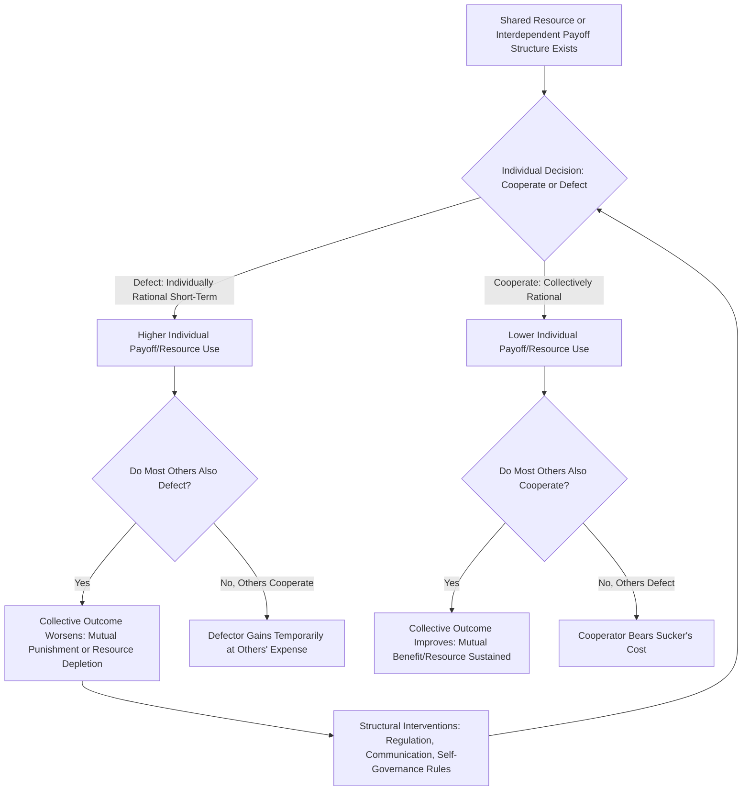

## Social Dilemmas: Prisoner's Dilemma and Commons Dilemmas

### Definition

A social dilemma is a situation in which individually rational, self-interested behavior produces an outcome that is **collectively worse** than if individuals had cooperated — a conflict between individual and collective rationality. Social dilemmas are characterized by two structural features:

1. Each individual receives a higher personal payoff for defecting (acting selfishly) than for cooperating, **regardless of what others do**.
2. If **all** individuals defect, everyone is worse off than if all had cooperated.

Social dilemmas are typically classified into two broad structural families: **dyadic/small-group dilemmas** (exemplified by the Prisoner's Dilemma) and **N-person/resource dilemmas** (exemplified by commons dilemmas, also called resource dilemmas or social traps).

### The Prisoner's Dilemma

#### Origin and Structure

The Prisoner's Dilemma originated in game theory (formalized by Merrill Flood and Melvin Dresher in 1950, with the "prisoner" framing attributed to Albert Tucker). The canonical narrative: two suspects are interrogated separately, each choosing to **cooperate** (stay silent, i.e., cooperate with the other suspect) or **defect** (betray the other by confessing).

**Standard Payoff Structure**

|  | Other Cooperates | Other Defects |
| --- | --- | --- |
| **You Cooperate** | Reward (R): Moderate payoff for both | Sucker's payoff (S): Worst payoff for you |
| **You Defect** | Temptation (T): Best payoff for you | Punishment (P): Poor payoff for both |

The defining mathematical condition of a Prisoner's Dilemma is:

$$T > R > P > S$$

And, for the iterated version, an additional condition is typically required:

$$2R > T + S$$

(ensuring mutual cooperation yields more combined payoff than alternating exploitation)

#### The Dilemma's Logic

Regardless of what the other player does, defecting yields a higher individual payoff ($T > R$ if the other cooperates; $P > S$ if the other defects) — defection is the **dominant strategy** for a purely self-interested rational actor. Yet if both players follow this individually rational logic and defect, both receive $P$, which is worse for both than the mutual cooperation payoff $R$. This is the core paradox: individually rational choices produce a collectively suboptimal (Pareto-inferior) outcome.

#### Single-Shot vs. Iterated Prisoner's Dilemma

- **Single-shot (one-time) PD:** Classical game theory predicts mutual defection as the Nash equilibrium, since there is no future interaction to incentivize cooperation.
- **Iterated Prisoner's Dilemma (IPD):** When the same players interact repeatedly, cooperation becomes more sustainable because players can respond to each other's prior behavior, opening the door to reciprocity-based strategies.

#### Axelrod's Tournament and Tit-for-Tat (1980s)

Robert Axelrod ran computer tournaments inviting researchers to submit strategies for the iterated Prisoner's Dilemma, competing round-robin against each other. The simple strategy **Tit-for-Tat** (TFT) — cooperate on the first move, then replicate the opponent's previous move on every subsequent move — won both tournaments.

Axelrod identified key properties that made TFT successful:

- **Niceness:** Never defects first
- **Retaliation:** Responds immediately to defection, discouraging exploitation
- **Forgiveness:** Returns to cooperation immediately if the opponent cooperates again
- **Clarity/simplicity:** Easy for opponents to recognize and adapt to, promoting stable mutual cooperation

[Inference] Subsequent research has identified conditions under which more complex or forgiving strategies can outperform strict Tit-for-Tat (e.g., in noisy environments with occasional unintended defections), so TFT's dominance is best understood as robust under many but not all tournament conditions rather than universally optimal.

### Commons Dilemmas (Resource/Social Trap Dilemmas)

#### Structure

Commons dilemmas (also termed resource dilemmas or "social traps," a term coined by John Platt) involve a shared, finite resource pool (e.g., grazing land, fisheries, groundwater, atmospheric capacity) that is:

- **Non-excludable:** difficult or impossible to prevent individuals from accessing/using
- **Subtractable/rivalrous:** one individual's use reduces the amount available to others

Unlike the two-person Prisoner's Dilemma, commons dilemmas are typically **N-person dilemmas**, involving many actors whose individually rational over-use decisions cumulatively deplete or destroy the shared resource.

#### "The Tragedy of the Commons" (Hardin, 1968)

Ecologist Garrett Hardin popularized the term through an essay describing a hypothetical shared pasture where each herder, acting to maximize individual gain, adds more livestock than the pasture can sustainably support. Each herder personally captures the full benefit of an additional animal, while the cost of overgrazing (resource depletion) is distributed across all users. The logical endpoint, absent intervention, is resource collapse — a tragedy in the sense that the outcome is inevitable and harmful to all despite each actor behaving "rationally" within the incentive structure.

#### Distinguishing Commons Dilemmas from Prisoner's Dilemma

| Feature | Prisoner's Dilemma | Commons Dilemma |
| --- | --- | --- |
| Number of actors | Typically 2 (dyadic) | Many (N-person) |
| Resource structure | No shared physical resource pool; abstract payoff matrix | Shared, depletable, subtractable resource |
| Outcome of mutual defection | Fixed poor payoff (P,P) | Potential total resource collapse (non-renewable depletion) |
| Visibility of others' choices | Often known/inferable (especially iterated) | Often diffuse/anonymous among many users |
| Classic real-world analogy | Arms races, price wars, doping in sports | Overfishing, deforestation, climate change, groundwater depletion, traffic congestion |

### Theoretical Explanations for Cooperation and Defection

#### 1. Structural/Incentive-Based Solutions

- **Regulation and enforcement:** External authority imposes rules, quotas, or penalties that alter the payoff structure to make cooperation individually rational (e.g., fishing quotas with enforced penalties).
- **Privatization:** Converting a shared resource into individually owned/excludable units removes the non-excludability condition (a solution favored in some economic analyses of commons problems, though contested for equity and feasibility reasons in many real-world contexts).
- **Communication:** Allowing group members to discuss the dilemma before choosing substantially increases cooperation rates in experimental resource dilemma studies, even without binding enforcement — attributed to increased trust, explicit commitments, and group identity formation during discussion.

#### 2. Elinor Ostrom's Self-Governance Framework

Elinor Ostrom's research (recognized with the Nobel Memorial Prize in Economic Sciences) challenged the assumption that commons dilemmas necessarily require either top-down state regulation or privatization. Studying real-world common-pool resource management (irrigation systems, fisheries, forests), she identified design principles under which communities successfully self-govern shared resources without either external imposition or privatization, including:

- Clearly defined resource boundaries and user group membership
- Rules tailored to local conditions, decided collectively by users
- Effective monitoring, often by the resource users themselves
- Graduated sanctions for rule violations
- Accessible conflict-resolution mechanisms
- Recognition of local self-governance rights by higher authorities

#### 3. Social/Psychological Factors

- **Social value orientation:** Individual differences in dispositional cooperativeness (prosocial vs. individualistic vs. competitive orientations) predict cooperation rates across social dilemma paradigms.
- **Group identity/in-group categorization:** Framing the dilemma in terms of shared group membership increases cooperation (linking to social identity theory).
- **Trust and reciprocity expectations:** Belief that others will also cooperate is a strong predictor of individual cooperative choice.
- **Reputation and repeated interaction:** Knowledge that one's choices will be observed by others in future interactions (reputational stakes) increases cooperation, consistent with indirect reciprocity theory.
- **Framing effects:** Dilemmas framed as "giving" to a public good versus "taking" from a shared resource can produce different cooperation rates even when mathematically equivalent, an effect studied extensively in public goods game paradigms.

### Process Flow Diagram

### Worked Example

**Scenario: Shared Office Refrigerator (Everyday Commons Dilemma)**

| Individual Choice | Personal Benefit | Collective Consequence if Widespread |
| --- | --- | --- |
| Take more than fair share of shared snacks | High personal benefit now | Shared supply depletes quickly for everyone |
| Take only fair share | Lower immediate personal benefit | Supply lasts for the whole office if most people cooperate |

**Applying Ostrom's principles as an intervention:** The office could implement clearly defined rules (e.g., posted guidelines on fair-use amounts), a simple monitoring mechanism (a visible sign-up/tracking sheet), and mild graduated social sanctions (a polite group reminder), which — consistent with commons self-governance research — would likely increase cooperative behavior without requiring a formal top-down policy from management.

### Experimental Paradigms

- **Two-person Prisoner's Dilemma games** with real monetary payoffs, single-shot or iterated
- **Public goods games:** N-person paradigm where individuals choose how much to contribute to a shared pool that is then multiplied and redistributed to all, regardless of individual contribution level — directly modeling free-riding incentives
- **Resource dilemma/commons simulation games:** Participants harvest from a simulated replenishing resource pool (e.g., a simulated fish stock), with depletion dynamics modeled explicitly
- **Public goods games with punishment options:** Testing whether allowing costly peer punishment of defectors increases sustained cooperation (generally found to increase cooperation, though the punishment itself is costly to the punisher)

### Relation to Other Group Phenomena

| Phenomenon | Relationship to Social Dilemmas |
| --- | --- |
| Social loafing / free-rider effect | The free-rider effect is essentially the individual-level manifestation of the public-goods social dilemma structure |
| Group polarization | Discussion in social dilemma experiments can shift group-level cooperative or competitive norms, an application of polarization dynamics to dilemma framing |
| Social identity theory | In-group categorization is one of the most consistent cooperation-increasing manipulations in social dilemma research |
| Reciprocal altruism (evolutionary psychology) | Provides an evolutionary account for why reciprocity-based strategies like Tit-for-Tat are psychologically intuitive and stable |

### Applications

- **Environmental policy:** Climate change, overfishing, and deforestation are widely modeled as large-scale commons dilemmas, informing policy tools such as cap-and-trade systems, quotas, and internationally coordinated agreements.
- **Public health:** Vaccination and mask-wearing during infectious disease outbreaks have been analyzed through a social dilemma lens (individual cost/inconvenience vs. collective public health benefit, with free-riding on herd immunity as a specific mechanism).
- **Organizational resource sharing:** Shared budgets, common equipment, or shared credit for team outputs can be structured using Ostrom-style principles (clear rules, monitoring, graduated sanctions) to reduce internal free-riding.
- **International relations:** Arms races and trade negotiations are frequently modeled using Prisoner's Dilemma-type payoff structures to explain persistent mutual distrust despite mutually beneficial cooperative alternatives.

### Critiques and Limitations

- Laboratory games (PD, public goods games) use simplified, monetized payoff structures that may not fully capture the complexity, uncertainty, and long time horizons of real-world dilemmas like climate change.
- Hardin's original "tragedy of the commons" framing has been critiqued, notably by Ostrom and other commons scholars, for overstating the inevitability of resource collapse and underestimating the historical prevalence of successful community self-governance.
- Cross-cultural and individual difference findings (e.g., social value orientation effects) show consistent directional patterns but [Inference] effect sizes and boundary conditions vary meaningfully across specific populations and dilemma framings, limiting simple universal generalizations.
- The relationship between short-term experimental cooperation measures and long-term real-world sustainable behavior change is not fully established, and translating laboratory findings into durable policy outcomes remains an active applied research challenge.

### Related Topics / Next Steps

- **Social loafing and the free-rider effect**
- **Social identity theory and in-group/out-group dynamics**
- **Reciprocal altruism and evolutionary game theory**
- **Public goods games and experimental economics**
- **Elinor Ostrom's commons governance principles**
- **Group polarization**
- **Cooperation and competition in intergroup relations**
- **Behavioral economics and bounded rationality**