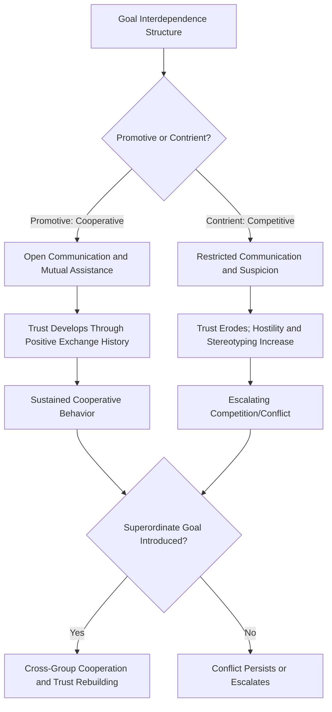

## Cooperation, Competition, and Trust

### Definition

Cooperation refers to behavior in which individuals or groups coordinate actions to achieve mutually beneficial outcomes, often requiring individuals to forgo some immediate self-interest for shared or long-term gain. Competition refers to behavior oriented toward maximizing one's own outcomes relative to others, often at others' expense, typically arising when goals are perceived as mutually exclusive (one party's gain implies another's loss). Trust is the psychological willingness to accept vulnerability to another's actions based on positive expectations of their intentions or behavior, and functions as a key psychological precondition for sustained cooperation, particularly under uncertainty.

These three constructs are deeply interlinked: trust enables cooperation by reducing the perceived risk of exploitation, while competitive framing and prior defection tend to erode trust and suppress cooperative behavior.

### Historical Background

#### Sherif's Robbers Cave Experiment (1954)

Muzafer Sherif conducted a landmark field experiment at a boys' summer camp, dividing participants into two groups ("Rattlers" and "Eagles") and manipulating intergroup relations across three phases:

1. **In-group formation:** Groups developed internal cohesion and identity in isolation from each other.
2. **Competitive phase:** Introducing zero-sum competitive tournaments between groups rapidly produced hostility, negative stereotyping, and intergroup conflict, even though the boys had no prior history of animosity.
3. **Conflict resolution phase:** Mere contact between groups (e.g., shared meals) failed to reduce hostility, but introducing **superordinate goals** — goals requiring intergroup cooperation to achieve outcomes neither group could accomplish alone (e.g., jointly repairing a water supply) — successfully reduced intergroup conflict and increased cross-group friendliness.

This established competition (specifically zero-sum, goal-incompatible competition) as a powerful driver of intergroup hostility, and cooperative interdependence toward shared goals as an effective conflict-reduction mechanism — foundational to later **realistic conflict theory** and Allport's **contact hypothesis** refinements (emphasizing that contact alone is insufficient without cooperative interdependence).

#### Deutsch's Theory of Cooperation and Competition (1949, 1973)

Morton Deutsch proposed a foundational framework distinguishing **promotively interdependent** goal structures (cooperation: one's success helps others succeed) from **contriently interdependent** goal structures (competition: one's success requires others' failure). Deutsch argued that the type of goal interdependence shapes communication patterns, trust development, and conflict resolution style, with cooperative interdependence generally fostering more open communication, mutual helpfulness, and trust than competitive interdependence.

### Trust: Conceptual Structure

#### Components of Trust (Mayer, Davis, & Schoorman, 1995 — widely used organizational trust framework)

| Component | Description |
| --- | --- |
| **Ability** | Perceived competence/skill of the trusted party in the relevant domain |
| **Benevolence** | Belief that the trusted party has positive intentions toward the truster, beyond self-interest |
| **Integrity** | Belief that the trusted party adheres to acceptable principles and is honest/consistent |

Trust is generally modeled as a function of the truster's perception of these three components, combined with the truster's own dispositional propensity to trust.

#### Trust and Risk

Trust inherently involves willingness to accept **vulnerability** — the truster cannot fully control or guarantee the trusted party's behavior, and genuine trust is only meaningfully demonstrated in situations involving real risk of exploitation or disappointment (a key theoretical point distinguishing "trust" from simple positive expectation without stakes).

### Theoretical Perspectives on Cooperation

#### 1. Social Exchange Theory

Cooperation is analyzed as an exchange in which individuals weigh the costs and rewards of cooperative versus competitive behavior, with continued cooperation contingent on perceived fairness and reciprocity of exchange over time.

#### 2. Reciprocity Norms

Gouldner's **norm of reciprocity** proposes a nearly universal social expectation that individuals should help those who have helped them and should not injure those who have helped them, providing a normative (not purely strategic) basis for sustained cooperation.

#### 3. Evolutionary/Reciprocal Altruism Accounts

Trivers' theory of **reciprocal altruism** provides an evolutionary rationale for cooperative behavior between non-kin: cooperative acts can be evolutionarily stable if the probability of repeated interaction and the ability to recognize and punish defectors ("cheater detection") are sufficiently high, since the long-term benefit of reciprocated cooperation outweighs the short-term cost.

#### 4. Social Identity and Intergroup Trust

Cooperation and trust tend to be systematically higher for in-group members than out-group members (**in-group favoritism**), even under minimal group manipulations (see social identity theory / minimal group paradigm). Superordinate categorization (recategorizing separate groups into one larger in-group) is a documented strategy for extending in-group-like trust and cooperation across former out-group boundaries.

### Factors That Increase Cooperation and Trust

- **Communication:** Allowing pre-decision communication substantially increases cooperation rates in experimental dilemma games, even absent enforceable commitments (see Social Dilemmas topic).
- **Repeated interaction/shadow of the future:** Anticipation of future interactions increases cooperative behavior by making reputation and reciprocity relevant (consistent with Axelrod's Tit-for-Tat findings).
- **Superordinate goals:** Shared goals requiring joint effort reduce intergroup competition and foster cross-group cooperation (Sherif).
- **Perceived fairness of outcomes/procedures:** Both distributive fairness (outcome allocation) and procedural fairness (how decisions are made) support sustained trust and cooperative willingness.
- **Similarity and shared identity:** Greater perceived similarity or shared category membership increases baseline trust and cooperative inclination.
- **Successful reciprocal exchanges (trust-building history):** Trust tends to develop incrementally through repeated positive exchanges, and can be modeled as a gradually updated expectation based on accumulated interaction history.
- **Reduced anonymity:** Identifiability of individuals' choices (linking to evaluation apprehension and social loafing research) tends to increase cooperative and trustworthy behavior.

### Factors That Decrease Cooperation and Erode Trust

- **Zero-sum/competitive framing:** Introducing competitive incentive structures (even superficial ones) rapidly increases intergroup hostility, as demonstrated in Robbers Cave.
- **Betrayal/broken trust:** Trust violations tend to have asymmetric psychological weight — trust is typically described in the literature as slower to build and faster to lose, particularly following violations attributed to poor integrity or malicious intent (as opposed to competence-based failures, which tend to be somewhat more forgivable).
- **Anonymity and reduced accountability:** Removing identifiability tends to reduce cooperative behavior (paralleling social loafing dynamics).
- **Out-group categorization:** Default lower trust extended to out-group members, amplified under conditions of intergroup threat or prior conflict history.
- **Uncertainty about others' intentions/type:** Ambiguity about whether a partner is cooperative or exploitative by disposition increases hesitancy to cooperate, particularly in single-shot or early-stage interactions.

### Process Flow Diagram

### Worked Example

**Scenario: Merging Two Rival Sales Teams Within a Company**

| Phase | Dynamic | Predicted Outcome (per Sherif/Deutsch framework) |
| --- | --- | --- |
| Pre-merger: separate teams compete for same client pool (contrient interdependence) | Zero-sum framing (one team's win is the other's loss) | Rivalry, distrust, negative stereotyping between teams |
| Merger announced with continued separate performance bonuses tied to relative ranking | Competitive structure persists | Continued distrust; poor integration; possible sabotage-like behavior |
| **Alternative intervention:** Leadership introduces a joint team target requiring combined effort (superordinate goal), with shared bonus contingent on combined performance | Promotive interdependence introduced | Increased cross-team communication and cooperative behavior; gradual trust-building through shared successful exchanges, consistent with Robbers Cave resolution phase findings |

### Measurement and Experimental Paradigms

- **Prisoner's Dilemma and public goods games:** Standard behavioral economics paradigms for quantifying cooperative vs. defecting choices under incentive structures (see Social Dilemmas topic)
- **Trust game (Berg, Dickhaut, & McCabe, 1995):** A sequential economic game in which a "truster" sends a portion of an endowment to a "trustee" (the amount is typically multiplied), and the trustee decides how much to return; the amount sent is used as a behavioral measure of trust, and the amount returned as a measure of trustworthiness/reciprocity
- **Minimal group paradigm:** Used to isolate the effect of mere group categorization (independent of any real conflict or competitive incentive) on in-group favoritism in trust and cooperative allocation
- **Ultimatum game:** While primarily used to study fairness norms, results are also informative about trust and expectations regarding others' fairness-related intentions

### Relation to Other Group Phenomena

| Phenomenon | Relationship to Cooperation/Competition/Trust |
| --- | --- |
| Social dilemmas (Prisoner's Dilemma, commons dilemmas) | Cooperation and trust are the central behavioral variables of interest within social dilemma paradigms |
| Social identity theory | In-group/out-group categorization is a primary driver of differential trust and cooperative willingness |
| Groupthink | High trust and cohesion, if excessive and combined with insulation, can tip into groupthink's suppression of critical dissent |
| Group polarization | Competitive intergroup framing can polarize in-group attitudes toward the out-group, amplifying hostility beyond initial levels |
| Realistic conflict theory | Provides the broader theoretical account for how competition over scarce resources generates intergroup hostility, directly derived from Sherif's findings |

### Applications

- **Organizational team design:** Structuring compensation and incentive systems around collective/shared goals rather than purely individual competitive metrics, informed by Deutsch's cooperative interdependence findings, to reduce internal rivalry and foster trust.
- **Conflict resolution and peacebuilding:** Superordinate goal interventions are widely cited in community reconciliation programs and international conflict mediation efforts as a practical strategy derived from Robbers Cave.
- **Negotiation and diplomacy:** Trust-building through incremental reciprocal concessions (echoing Tit-for-Tat dynamics) is a foundational principle in negotiation training (e.g., GRIT — Graduated and Reciprocated Initiatives in Tension-Reduction, a strategy explicitly designed to de-escalate mutual distrust through unilateral cooperative signals).
- **Workplace trust repair:** Organizational psychology applications of trust-violation research (distinguishing competence-based vs. integrity-based violations) inform practical guidance on trust-repair strategies following organizational mistakes or breaches.

### Critiques and Limitations

- Sherif's Robbers Cave study, while highly influential, involved a small, demographically homogeneous sample (white boys of similar age and background) under researcher-controlled conditions; [Inference] generalizability to more diverse populations and naturally occurring (non-researcher-orchestrated) intergroup conflicts should be treated with appropriate caution.
- Laboratory trust and dilemma games (Trust Game, Prisoner's Dilemma) involve relatively low real-world stakes compared to consequential real-world trust decisions (e.g., business partnerships, international treaties), and [Inference] findings may not fully scale to high-stakes contexts.
- The relative weighting of ability, benevolence, and integrity in trust judgments may vary by relationship type and cultural context, and the tripartite model, while widely used, is not the only trust framework in the literature.
- Superordinate goal interventions require the goal to be genuinely necessary and successfully achieved through joint effort; [Inference] a failed joint effort could plausibly exacerbate rather than reduce intergroup hostility, though this boundary condition is less directly tested than the successful-outcome case in the original Robbers Cave design.

### Related Topics / Next Steps

- **Social dilemmas: prisoner's dilemma and commons dilemmas**
- **Realistic conflict theory**
- **Social identity theory and intergroup relations**
- **Contact hypothesis and prejudice reduction**
- **Reciprocal altruism (evolutionary psychology)**
- **Negotiation and conflict resolution strategies**
- **Groupthink: antecedents and prevention**
- **Group polarization**