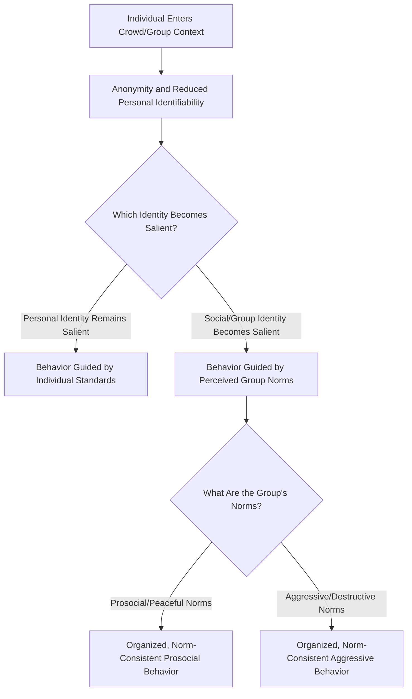

## Crowd Behavior and Collective Action

### Definition

Crowd behavior refers to the patterns of thought, emotion, and action that emerge when large numbers of individuals gather and act collectively, often producing behaviors distinct from what the same individuals would exhibit alone. Collective action refers more specifically to coordinated efforts by groups of individuals pursuing a shared goal, particularly in social and political movements (e.g., protests, strikes, riots, social movements), and is closely studied in relation to why individuals choose to participate in group efforts to achieve social or political change.

### Historical Background

#### Le Bon's Crowd Psychology (1895)

Gustave Le Bon's *The Crowd: A Study of the Popular Mind* proposed that individuals in crowds undergo a psychological transformation, losing individual rational judgment and personal responsibility, becoming susceptible to a **"collective mind"** driven by suggestibility, emotional contagion, and anonymity. Le Bon characterized crowds as prone to impulsive, irrational, and sometimes destructive behavior — a view historically influential but now regarded as largely outdated and empirically unsupported in its strong claims about crowd irrationality.

#### Deindividuation Theory (Festinger, Pepitone, & Newcomb, 1952; Zimbardo, 1969)

Leon Festinger and colleagues, later substantially extended by Philip Zimbardo, proposed **deindividuation theory** to explain crowd behavior through more testable psychological mechanisms:

- **Reduced self-awareness and self-monitoring:** Immersion in a group/crowd reduces individuals' focus on their own personal standards and identity.
- **Anonymity:** Being unidentifiable within a crowd reduces perceived personal accountability for actions.
- **Diffusion of responsibility:** Responsibility for group actions is spread across many people, reducing each individual's felt culpability.
- **Reduced private self-awareness combined with increased group immersion** was proposed to loosen normal behavioral restraints, potentially leading to increased impulsivity and reduced adherence to normal social norms — though critically, the *direction* of resulting behavior (antisocial or prosocial) depends on situational cues, not an inherent tendency toward destructiveness as Le Bon assumed.

#### Zimbardo's Experimental Extensions

Zimbardo's laboratory studies manipulated anonymity (e.g., via hoods/uniforms) and found that anonymous participants delivered more aggressive behavior (e.g., longer shocks in staged studies) than identifiable participants, providing early experimental support for deindividuation's link to disinhibited/antisocial behavior under specific conditions.

### Contemporary Reframing: Social Identity Model of Deindividuation Effects (SIDE)

Stephen Reicher, Russell Spears, and Tom Postmes developed the **SIDE model**, which substantially revised classical deindividuation theory based on accumulating evidence that crowd behavior is **not simply a loss of identity/norms**, but rather a shift from **personal identity** to a salient **social/group identity**, with behavior conforming to the norms of that specific group identity rather than becoming generically irrational or impulsive.

**Core claims of SIDE:**

- Anonymity and immersion in a crowd do not eliminate identity but shift the psychological salience from *personal* identity to *social* identity (identification with the specific crowd/group).
- Once social identity is salient, behavior conforms to the perceived **norms of that particular group**, which can be prosocial, peaceful, aggressive, or otherwise, depending entirely on the specific group's normative content — not a fixed tendency toward chaos or violence.
- This explains why some crowds (e.g., peaceful protest crowds, sports crowds celebrating a win, religious gatherings) show highly organized, norm-consistent behavior despite anonymity, directly contradicting Le Bon's and even some of classical deindividuation theory's predictions of generic irrationality.

**Comparison of Crowd Behavior Theories**

| Theory | Core Mechanism | Predicted Outcome of Crowd Immersion |
| --- | --- | --- |
| Le Bon's Crowd Mind | Contagion, suggestibility, loss of rational capacity | Generic irrational/destructive behavior |
| Classical Deindividuation (Zimbardo) | Reduced self-awareness, anonymity, diffused responsibility | Disinhibition; increased likelihood of impulsive/antisocial behavior |
| SIDE Model (Reicher, Spears, Postmes) | Shift from personal to social identity salience | Behavior conforms to specific salient group norms — direction depends on group identity content |

### Process Flow Diagram: SIDE Model

### Collective Action: Why Individuals Participate

Collective action research (distinct from but related to crowd behavior research) focuses on the psychological predictors of participation in organized group efforts, particularly protest and social movement activity.

#### Van Zomeren, Postmes, & Spears (2008): Social Identity Model of Collective Action (SIMCA)

A prominent meta-analytic integration identifying three core predictors of collective action participation:

1. **Perceived injustice:** A sense that the group has been unfairly treated, often rooted in **relative deprivation** — the perception of a gap between what one has/deserves and what a relevant comparison group has, which can be more predictive of collective action than absolute deprivation.
2. **Social identity:** Strength of identification with the disadvantaged group, predicting willingness to act on the group's behalf.
3. **Group efficacy:** Belief that collective action can actually produce meaningful change (analogous to the "Expectancy" component in the Collective Effort Model applied to social/political action).

**Formal relationship (conceptual, not a strict equation):**

$$\text{Collective Action Intention} \approx f(\text{Injustice}, \text{Identity}, \text{Efficacy})$$

with social identity often functioning as a partial mediator linking injustice perceptions and efficacy beliefs to actual participation intentions.

#### Relative Deprivation Theory (Runciman, 1966)

Distinguishes:

- **Egoistic (individual) relative deprivation:** perceived disadvantage relative to other individuals
- **Fraternalistic (group) relative deprivation:** perceived disadvantage of one's group relative to another group

Fraternalistic/group relative deprivation is generally found to be the stronger predictor of collective action participation (e.g., protest, activism) compared to purely individual-level deprivation, since collective action is fundamentally a group-oriented response to group-level grievance.

### Worked Example

**Scenario:** A community group organizes a protest against a proposed local policy change perceived as unfair to their neighborhood.

| SIMCA Component | Manifestation | Effect on Participation Likelihood |
| --- | --- | --- |
| Perceived injustice | Residents perceive the policy disproportionately harms their neighborhood relative to others (fraternalistic relative deprivation) | Increases motivation to act |
| Social identity | Strong neighborhood/community identification among residents | Increases willingness to act on the group's behalf; increases susceptibility to group-normative behavior once at the protest (SIDE) |
| Group efficacy | Residents believe past community protests have successfully influenced local policy | Increases belief that participation is worthwhile, increasing turnout |
| **Predicted outcome** | High injustice + high identity + high efficacy | High likelihood of collective action participation |

**Contrast:** If residents feel the policy is unfair (injustice present) but believe protest is futile (low group efficacy) and do not strongly identify with the neighborhood as a group, SIMCA predicts substantially lower participation despite the presence of grievance.

### Empirical Paradigms

- **Laboratory deindividuation manipulations:** Anonymity (hoods, darkness, group immersion) vs. identifiability conditions, measuring aggression or rule-violating behavior (Zimbardo-style paradigms)
- **Field studies of real crowds:** Observational and interview-based studies of actual protest crowds, football crowds, and religious gatherings (a hallmark of the SIDE research tradition, moving beyond pure laboratory manipulation)
- **Survey-based collective action research:** Cross-sectional and longitudinal surveys measuring injustice perceptions, identity strength, and efficacy beliefs as predictors of self-reported or actual protest participation
- **Archival/historical crowd analysis:** Reicher's early work analyzing the 1980 St Pauls riot in Bristol used archival and interview data to demonstrate that the "riot" crowd's behavior was **not random/indiscriminate** but followed identifiable normative boundaries (e.g., targeting specific symbols associated with the perceived out-group/authority, while largely sparing other targets), directly supporting SIDE over classical deindividuation predictions of generic irrational destructiveness.

### Relation to Other Group Phenomena

| Phenomenon | Relationship to Crowd Behavior/Collective Action |
| --- | --- |
| Social identity theory | Theoretical foundation for the SIDE model and SIMCA; group identification is central to both crowd norm-following and collective action participation |
| Deindividuation | Historical precursor theory to SIDE; classical deindividuation is now generally considered incomplete without the identity-salience refinement |
| Group polarization | Crowd/movement discussion can polarize participants toward more extreme shared positions, relevant to escalation dynamics within protest movements |
| Social loafing / free-rider effect | Directly relevant to the collective action problem: since movement benefits (e.g., policy change) are often non-excludable public goods, individuals may be tempted to free-ride on others' participation rather than personally bear the costs/risks of participating |
| Groupthink | Distinct process, but insulated activist groups experiencing high cohesion under external threat could theoretically be vulnerable to groupthink-style suppression of internal dissent about strategy |

### Applications

- **Public order and crowd management:** Contemporary policing and event-management practices increasingly draw on SIDE-informed principles, favoring facilitative, non-confrontational crowd management approaches over historically common confrontational tactics, based on evidence that heavy-handed treatment of crowds can itself escalate perceived shared grievance/identity and increase disorder (a dynamic explicitly studied in UK crowd-policing research following the SIDE tradition).
- **Social movement organizing:** Movement organizers can apply SIMCA's three predictors strategically — cultivating shared identity, articulating clear injustice framing, and demonstrating tangible efficacy (e.g., highlighting past successes) to increase mobilization.
- **Organizational and political communication:** Understanding relative deprivation (particularly fraternalistic/group-based) helps explain why objectively improving conditions does not always reduce grievance-driven collective action if a relevant comparison group's conditions improve faster.
- [Inference] Online collective action and digital activism (e.g., hashtag movements) likely engage similar SIMCA-type psychological predictors, though the anonymity and identity-salience dynamics of online crowds are an evolving research area distinct from, though related to, the physical-crowd tradition underlying classical deindividuation and SIDE research.

### Critiques and Limitations

- Le Bon's original crowd psychology, while historically foundational and still culturally influential, lacks empirical support for its strong claims of generic crowd irrationality and is largely superseded in contemporary social psychology by identity-based models.
- Classical deindividuation research (Zimbardo-style) has faced replication and interpretation challenges; [Inference] the specific finding that anonymity reliably increases aggression has more mixed support across subsequent studies than early accounts suggested, contributing to the shift toward the SIDE model's more nuanced, norm-contingent account.
- SIMCA is a correlational, largely survey-based model; while widely supported meta-analytically, [Inference] establishing strict causal ordering among injustice, identity, and efficacy in real-world mobilization remains methodologically challenging outside controlled experimental designs.
- Crowd behavior research often faces an inherent tension between rich, ecologically valid field/archival studies (harder to control causally) and controlled laboratory studies (higher control, lower ecological validity for genuine mass crowd dynamics).

### Related Topics / Next Steps

- **Deindividuation theory**
- **Social identity theory and intergroup relations**
- **Relative deprivation theory**
- **Group polarization**
- **Social loafing and the free-rider effect**
- **Social movements and political psychology**
- **Groupthink: antecedents and prevention**
- **Obedience to authority (Milgram) as a related crowd/compliance phenomenon**