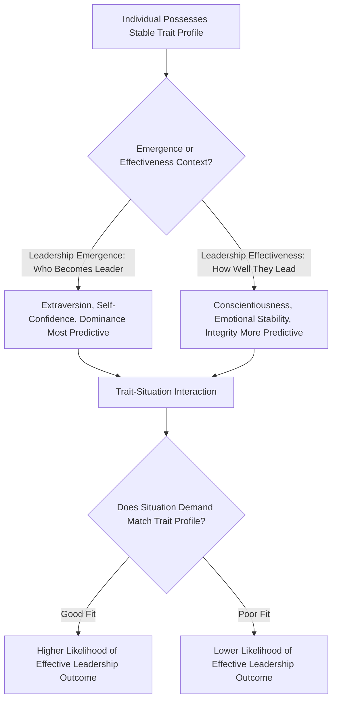

## Trait Approaches to Leadership

### Definition

Trait approaches to leadership propose that leadership effectiveness and emergence can be explained by **stable individual characteristics** — personality traits, physical attributes, abilities, and dispositions — that distinguish leaders from non-leaders and effective leaders from ineffective ones. This perspective represents the earliest systematic scientific approach to leadership research, historically associated with the **"Great Man" theory** framing (that leaders are born, not made), though contemporary trait research has moved substantially beyond this deterministic origin.

### Historical Background

#### The "Great Man" Theory Origins (19th Century)

Early conceptions of leadership, influenced by thinkers such as Thomas Carlyle, held that history is shaped primarily by exceptional individuals possessing innate, extraordinary qualities that destine them for leadership. This view assumed leadership traits were largely **fixed and hereditary**, not developable, and focused almost exclusively on historically prominent (and overwhelmingly male) figures — a framing now regarded as scientifically and socially limited.

#### Stogdill's Early Reviews (1948, 1974)

Ralph Stogdill conducted influential literature reviews that fundamentally reshaped trait research:

- **1948 review:** Found only weak and inconsistent correlations between individual traits and leadership across the studies examined, concluding that no universal set of traits reliably predicted leadership across all situations. This finding was highly influential in **shifting the field's dominant focus away from pure trait approaches toward situational and behavioral theories** for several decades.
- **1974 review:** Revisited the evidence with an expanded body of research and reached a more moderated conclusion: certain traits *do* show meaningful, if probabilistic, association with leadership, particularly when considered **in interaction with situational factors** rather than as universal, context-independent predictors. This reframing is often summarized as: "leadership is not simply a matter of possessing certain traits, but the relationship between traits and situational demands."

#### Revival Through Meta-Analysis (1980s–2000s)

Later meta-analytic work (notably Lord, De Vader, & Alliger, 1986; Judge, Bono, Ilies, & Gerhardt, 2002) applied more rigorous quantitative methods than the earlier narrative reviews, finding **more consistent and meaningful trait-leadership correlations** than Stogdill's 1948 review suggested — substantially rehabilitating trait approaches as a legitimate, evidence-supported component of leadership science, rather than a discredited historical relic.

### Key Traits Associated With Leadership

#### The Big Five Personality Traits and Leadership (Judge et al., 2002 meta-analysis)

| Big Five Trait | Association With Leadership Emergence/Effectiveness |
| --- | --- |
| **Extraversion** | Strongest and most consistent positive predictor across studies |
| **Conscientiousness** | Consistent positive predictor |
| **Openness to Experience** | Positive predictor, generally somewhat weaker than extraversion/conscientiousness |
| **Emotional Stability (low Neuroticism)** | Positive predictor |
| **Agreeableness** | Weakest and least consistent predictor among the five |

**Overall multiple correlation** in Judge et al.'s (2002) meta-analysis: the combined Big Five traits correlated more strongly with leadership than any single trait alone, supporting a **multi-trait profile** view over a single "the leadership trait" view.

#### Other Frequently Studied Leadership-Relevant Traits

- **Intelligence/cognitive ability:** Positively associated with leadership, though the relationship shows some evidence of being curvilinear or attenuated at very high levels relative to the group being led (related to concerns that a leader perceived as excessively more intelligent than followers may face communication or relatability difficulties) — a nuance debated in the literature rather than fully settled.
- **Self-confidence/self-efficacy:** Consistently associated with leadership emergence and follower perceptions of leader effectiveness.
- **Integrity/honesty:** Associated with leader effectiveness and follower trust, particularly relevant to transformational and ethical leadership research.
- **Need for power/dominance:** Associated with leadership emergence, particularly in initially leaderless group contexts, though the *effectiveness* consequences of high dominance/need for power depend heavily on how it is expressed (e.g., socialized vs. personalized power motivation, per McClelland's framework).
- **Self-monitoring:** Individuals high in self-monitoring (attentive to and adaptive toward social cues) show a tendency toward leadership emergence, plausibly due to greater social adaptability.
- **Charisma-related traits:** Traits associated with charismatic leadership (e.g., high energy, expressiveness, self-confidence) predict leadership emergence and are foundational to later charismatic/transformational leadership theories (see Related Topics).

### Distinguishing Leadership Emergence vs. Leadership Effectiveness

A critical methodological distinction in trait research:

| Construct | Definition | Trait Correlates |
| --- | --- | --- |
| **Leadership emergence** | Who comes to be perceived/selected as the leader within a group | Extraversion tends to show the strongest association |
| **Leadership effectiveness** | How well a leader actually performs once in the role (e.g., group/organizational outcomes) | Conscientiousness and emotional stability show relatively stronger associations; the trait-effectiveness relationship is generally weaker and more situationally contingent than the trait-emergence relationship |

[Inference] This distinction is important because a trait predicting who *becomes* a leader does not necessarily predict how *well* that person performs as a leader, and conflating the two has historically contributed to some inconsistency in earlier trait research findings.

### Process Flow Diagram

### Worked Example

**Scenario:** Comparing two candidates for a team-lead promotion.

| Trait Profile | Candidate A | Candidate B |
| --- | --- | --- |
| Extraversion | High | Low |
| Conscientiousness | Moderate | High |
| Emotional stability | Moderate | High |
| Predicted emergence likelihood | Higher (extraversion favors initial perception as leader-like) | Lower (may be overlooked despite strong underlying capability) |
| Predicted effectiveness once in role | Moderate | Potentially higher (conscientiousness/stability more linked to sustained effective performance) |

**Interpretation:** This illustrates the emergence/effectiveness distinction directly — trait research suggests organizations relying purely on perceived "leader-like" qualities (often extraversion-driven impressions) during selection may systematically overlook candidates whose trait profile is actually more strongly associated with long-term effectiveness, a concern with practical implications for leadership selection and promotion practices.

### Theoretical Refinements and Contemporary Integration

#### Trait Activation Theory (Tett & Guterman, 2000)

A more contemporary integration proposing that traits predict behavior (including leadership behavior) most strongly when the **situation provides relevant cues that "activate" the trait** — reframing the classic trait-vs-situation debate as an interactionist model rather than a strict either/or. This directly extends Stogdill's 1974 conclusion using more formal psychological theory.

#### The Leader Trait Emergence Effect (LTEE) and Zero-Acquaintance Research

Studies using "zero-acquaintance" designs (strangers rating each other's leadership potential after very brief exposure) find that perceivers can identify likely leaders with above-chance accuracy based on limited observable cues (e.g., physical stature, vocal qualities, nonverbal confidence displays), suggesting some leadership-relevant trait signals are detectable quickly — though [Inference] this speaks more directly to leadership *emergence/perception* than to genuine long-term leadership *effectiveness*.

### Comparison With Other Major Leadership Theory Families

| Theory Family | Core Focus | Relation to Trait Approach |
| --- | --- | --- |
| Trait Approach | Stable individual characteristics of the leader | Foundational/earliest approach; largely superseded then partially rehabilitated via meta-analysis |
| Behavioral Approach (e.g., Ohio State/Michigan studies) | Observable leader behaviors (e.g., consideration vs. initiating structure) | Emerged partly in reaction to trait approach's early perceived failure (Stogdill 1948) |
| Contingency/Situational Approaches (e.g., Fiedler's Contingency Model) | Fit between leader style and situational demands | Directly incorporates the trait-by-situation interaction insight from Stogdill's 1974 revision |
| Transformational/Charismatic Leadership | Leader behaviors and attributed qualities that inspire follower motivation beyond self-interest | Substantially traces back to trait research on charisma-related dispositions |
| Leader-Member Exchange (LMX) Theory | Quality of dyadic leader-follower relationships | Distinct relational focus, less directly rooted in trait tradition |

### Applications

- **Personnel selection and leadership assessment:** Organizational assessment centers and executive selection processes frequently incorporate personality inventories (e.g., Big Five-based instruments) informed by trait-leadership meta-analytic findings, particularly emphasizing conscientiousness and emotional stability for long-term effectiveness prediction.
- **Leadership development programs:** While core personality traits are relatively stable, [Inference] trait research has informed leadership development approaches that focus on trait-*expression* skills (e.g., coaching extraverted-style communication behaviors, structured self-confidence building) rather than assuming traits are entirely fixed and undevelopable, a more nuanced position than the original "Great Man" framing.
- **Succession planning:** Distinguishing emergence-predictive traits from effectiveness-predictive traits is used to caution organizations against over-weighting charismatic first impressions in succession and promotion decisions.

### Critiques and Limitations

- Early trait research suffered from inconsistent trait taxonomies across studies (before the Big Five became a standardized framework), which likely contributed to Stogdill's 1948 conclusion of weak/inconsistent findings — a methodological rather than purely theoretical limitation.
- Trait-leadership correlations, even in supportive meta-analyses, are generally moderate rather than strongly deterministic (correlations in the Judge et al. 2002 meta-analysis, for example, were meaningful but well below the level implying traits alone fully determine leadership outcomes), indicating substantial room for situational, behavioral, and relational factors.
- The historical "Great Man" framing has been critiqued for embedding cultural and gender bias, given its origins in analyzing a narrow, non-representative set of historical figures; contemporary trait research explicitly avoids this deterministic and exclusionary framing.
- Trait approaches alone do not explain **why** or **how** certain traits translate into effective leadership behavior in specific contexts, which is part of the motivation for behavioral, contingency, and process-oriented leadership theories that followed.

### Related Topics / Next Steps

- **Behavioral approaches to leadership (Ohio State and Michigan studies)**
- **Contingency and situational leadership theories (Fiedler's model)**
- **Transformational and charismatic leadership**
- **Leader-Member Exchange (LMX) theory**
- **Leadership emergence in initially leaderless groups**
- **Big Five personality model**
- **Power and social influence**
- **Gender and leadership research**