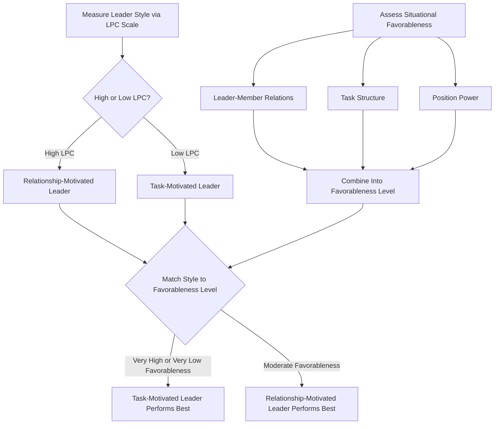
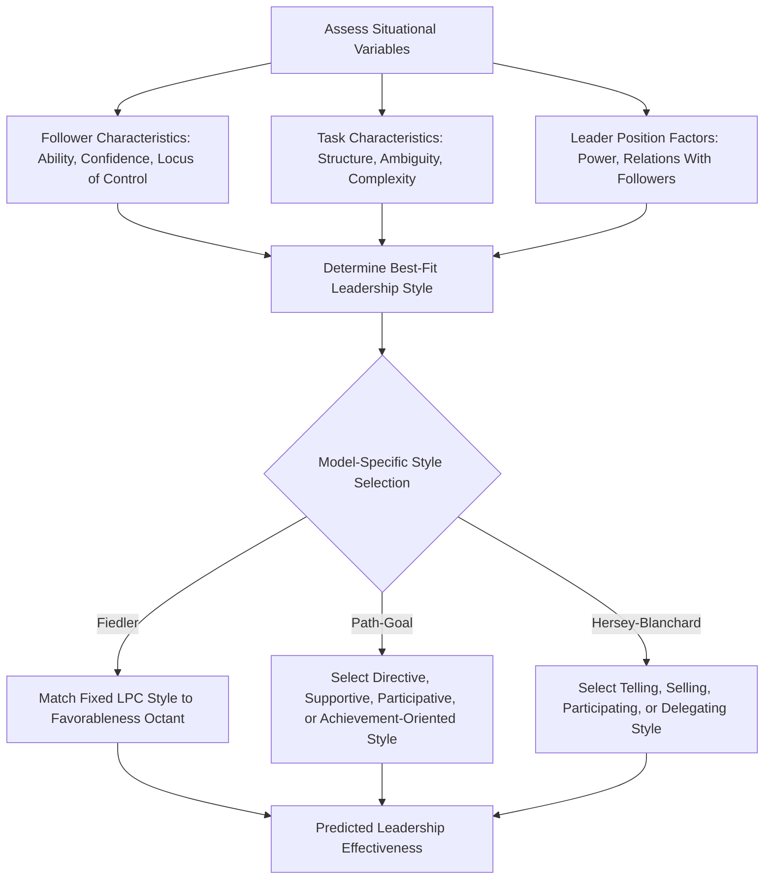

## Situational and Contingency Theories

### Definition

Situational and contingency theories of leadership propose that leadership effectiveness depends on the **interaction between a leader's characteristics/style and the demands of the specific situation**, rather than on universally effective traits or behaviors. These theories represent a direct evolution from trait approaches, formalizing Stogdill's (1974) insight that trait-leadership relationships are situationally contingent into fully developed, testable models specifying **which** situational variables matter and **how** they interact with leader style.

### Historical Background and Rationale

The shift toward situational thinking emerged from the perceived limitations of both trait approaches (which struggled to identify universal leader traits) and early behavioral approaches (which searched for a single "best" leadership behavior style applicable across all contexts). Both traditions largely failed to consistently predict leadership effectiveness across diverse settings, motivating researchers to formally incorporate **situational moderators** into leadership models.

### Fiedler's Contingency Model (1964, 1967)

Fred Fiedler developed the first comprehensive, empirically testable contingency theory of leadership, proposing that leadership effectiveness is a joint function of **leadership style** (viewed as a relatively fixed individual disposition) and **situational favorableness**.

#### Measuring Leadership Style: The Least Preferred Coworker (LPC) Scale

Fiedler operationalized leadership style using the **LPC scale**, in which leaders rate their least preferred coworker (the person they found hardest to work with) across a series of bipolar adjective dimensions (e.g., pleasant–unpleasant, friendly–unfriendly).

- **High LPC score:** Leader describes the least preferred coworker in relatively favorable terms, interpreted as a **relationship-motivated** leadership orientation.
- **Low LPC score:** Leader describes the least preferred coworker in harsh/unfavorable terms, interpreted as a **task-motivated** leadership orientation.

Fiedler treated LPC-measured style as a relatively stable trait-like disposition, not something easily changed through training — a key distinguishing feature from later, more flexible contingency models.

#### Situational Favorableness: Three Dimensions

Fiedler proposed that situational favorableness for the leader is determined by three factors, in order of importance:

1. **Leader-member relations:** The degree of trust, respect, and confidence subordinates have in the leader (good vs. poor)
2. **Task structure:** The degree to which the task is clearly defined, with specific procedures and verifiable outcomes (high vs. low structure)
3. **Position power:** The degree of formal authority/power the leader holds by virtue of their position (strong vs. weak)

Combining these three dichotomous factors produces **eight situational categories (octants)**, ranging from most favorable (good relations, high structure, strong power) to least favorable (poor relations, low structure, weak power) for the leader.

#### Core Predictions

Fiedler's model predicts a **curvilinear relationship**: task-motivated (low LPC) leaders perform best in situations of **high or low favorableness** (very favorable or very unfavorable), while relationship-motivated (high LPC) leaders perform best in situations of **moderate favorableness**.

**Fiedler's Contingency Model Predictions**

| Situational Favorableness | Best-Performing Leadership Style |
| --- | --- |
| Very high (good relations, high structure, strong power) | Task-motivated (low LPC) |
| Moderate | Relationship-motivated (high LPC) |
| Very low (poor relations, low structure, weak power) | Task-motivated (low LPC) |

#### Implication: Fit the Situation to the Leader, Not the Leader to the Situation

Because Fiedler viewed LPC-based leadership style as relatively fixed, his primary practical recommendation was **not** leader training to change style, but rather **selecting leaders whose style matches situational favorableness**, or restructuring the situation (e.g., altering task structure or position power) to fit the leader's existing style — a distinctive and sometimes debated practical implication relative to other, more flexibility-oriented contingency theories.

### Process Flow Diagram: Fiedler's Model

### Path-Goal Theory (House, 1971, 1996)

Robert House proposed Path-Goal theory, framing the leader's core function as **clarifying the path** to follower goal attainment by adapting leadership behavior to fit follower and task characteristics, thereby increasing follower motivation, satisfaction, and performance. Path-Goal theory draws explicitly on **expectancy theory** of motivation, positing that leaders influence followers' subjective expectations that effort will lead to performance and that performance will lead to valued rewards.

#### Four Leader Behavior Styles

| Style | Description |
| --- | --- |
| **Directive** | Provides specific guidance, clear expectations, and structured task instructions |
| **Supportive** | Shows concern for follower well-being and creates a friendly, approachable environment |
| **Participative** | Consults followers and incorporates their input into decision-making |
| **Achievement-oriented** | Sets challenging goals and expresses confidence in followers' ability to meet high standards |

Unlike Fiedler's model, House proposed leaders **can and should flexibly shift** among these styles depending on the situation — a key structural difference from Fiedler's relatively fixed-trait conception of style.

#### Key Contingency (Moderator) Variables

- **Follower characteristics:** e.g., locus of control, perceived ability, need for structure/autonomy — for example, followers with an external locus of control may respond better to directive leadership, while those with strong internal locus of control may prefer participative approaches
- **Task/environmental characteristics:** e.g., task structure, formal authority system, work group dynamics — for example, directive leadership is generally predicted to be most beneficial for ambiguous, unstructured tasks (clarifying the path), while it may be redundant or even resented for already highly structured, routine tasks

**Path-Goal Theory: Illustrative Matching Logic**

| Situation | Recommended Leader Style | Rationale |
| --- | --- | --- |
| Ambiguous, complex task | Directive | Reduces follower uncertainty about how to proceed |
| Highly structured, routine task | Supportive (directive largely redundant) | Followers already know the path; support addresses morale/satisfaction instead |
| Followers with low self-confidence on a challenging task | Supportive or Directive | Builds confidence and provides needed structure |
| Followers capable and seeking challenge | Achievement-oriented | Leverages capability and desire for growth |
| Decisions affecting followers directly, follower expertise relevant | Participative | Increases buy-in and leverages follower knowledge |

### Hersey and Blanchard's Situational Leadership Theory (SLT) (1969, later revisions)

Paul Hersey and Ken Blanchard proposed a widely popularized (though less rigorously empirically validated) model centered on matching leadership style to follower **"readiness" or "maturity"** — a combination of followers' task-relevant **ability** and **willingness/confidence**.

#### Four Leadership Styles (mapped to follower readiness level)

| Follower Readiness Level | Recommended Leader Style | Description |
| --- | --- | --- |
| Low readiness (unable, unwilling/insecure) | **Telling (S1)** | High task, low relationship focus; explicit direction |
| Low-to-moderate readiness (unable, willing/confident) | **Selling (S2)** | High task, high relationship focus; explains decisions, provides support |
| Moderate-to-high readiness (able, unwilling/insecure) | **Participating (S3)** | Low task, high relationship focus; shares decision-making |
| High readiness (able, willing/confident) | **Delegating (S4)** | Low task, low relationship focus; follower operates with autonomy |

This model has achieved substantial popularity in applied management training contexts, though [Inference] its empirical support in the academic leadership literature is generally considered weaker and less consistent than Fiedler's or House's models, and it is often characterized more as a practically intuitive framework than a rigorously validated scientific theory.

### Vroom-Yetton-Jago Normative Decision Model

A more narrowly scoped contingency approach focused specifically on **decision-making style** rather than overall leadership behavior, providing a decision-tree framework to help leaders determine the appropriate degree of follower participation (ranging from fully autocratic to fully delegated group decision-making) based on situational factors such as decision quality requirements, follower acceptance needs, and time constraints.

### Comparison of Major Contingency Theories

| Theory | Core Contingency Variable(s) | Is Leader Style Assumed Fixed or Flexible? | Primary Practical Implication |
| --- | --- | --- | --- |
| Fiedler's Contingency Model | Situational favorableness (leader-member relations, task structure, position power) | Fixed (LPC-based trait) | Match leader to situation, or change the situation |
| Path-Goal Theory | Follower characteristics and task/environment characteristics | Flexible | Leader adapts style to clarify follower's path to goals |
| Hersey-Blanchard SLT | Follower readiness/maturity | Flexible | Leader adapts style as follower readiness develops over time |
| Vroom-Yetton-Jago Model | Decision-specific situational factors (quality needs, acceptance needs, time) | Flexible (decision-specific) | Leader selects appropriate participation level per decision |

### Worked Example

**Scenario:** A new hospital nurse manager oversees two very different situations simultaneously.

| Situation | Team/Follower Profile | Task Type | Applying Path-Goal Theory | Applying Hersey-Blanchard SLT |
| --- | --- | --- | --- | --- |
| A | Newly hired nurses, uncertain of unit protocols | Highly structured (clinical protocols exist) | Directive style largely redundant given task structure; supportive style addresses morale during onboarding stress | Low readiness (unable but willing) → Selling (S2) style |
| B | Veteran senior nurses managing a complex, ambiguous case | Low structure (case requires judgment) | Directive style beneficial to reduce ambiguity, or participative given nurses' relevant expertise | High readiness (able and willing) → Delegating (S4) style |

**Interpretation:** Both frameworks converge on a similar practical conclusion via different theoretical routes — new, less experienced staff facing structured tasks benefit from higher-support/directive engagement, while experienced staff facing ambiguous, complex tasks benefit from greater autonomy or participative involvement, though each model justifies this through a different contingency logic (task-structure/motivation clarification in Path-Goal; follower readiness in Hersey-Blanchard).

### Process Flow Diagram: General Contingency Logic

### Empirical Status

- **Fiedler's model:** Received moderate empirical support in meta-analyses, though findings for some of the eight octants have been less consistent than others, and the LPC scale itself has faced criticism regarding its psychometric clarity and interpretation (i.e., what LPC "really" measures has been debated since the scale's introduction).
- **Path-Goal theory:** Empirical support is described in the literature as mixed to moderate; the theory's complexity (many follower/task moderators combined with four styles) has made comprehensive empirical testing challenging, and [Inference] some specific style-by-situation predictions have received more consistent support than others.
- **Hersey-Blanchard SLT:** Widely used in management training and popular literature, but generally regarded in academic reviews as having **weaker empirical validation** than Fiedler's or House's models; some of its core assumptions (e.g., the specific four-stage readiness progression) have not been strongly supported in controlled research.
- **Vroom-Yetton-Jago model:** Generally received more favorable empirical support for its specific, narrower focus on decision-participation appropriateness compared to broader, more diffuse leadership style models.

### Relation to Other Leadership Theory Families

| Theory Family | Relationship to Situational/Contingency Approaches |
| --- | --- |
| Trait Approaches | Contingency theories directly formalize Stogdill's (1974) trait-by-situation interaction conclusion into testable models |
| Behavioral Approaches (Ohio State/Michigan) | Contingency theories incorporate behavioral dimensions (e.g., task vs. relationship orientation) but add situational moderators the behavioral approaches lacked |
| Transformational/Charismatic Leadership | Distinct emphasis on follower inspiration and vision rather than situational style-matching, though some integrative models incorporate situational contingencies into transformational leadership application |
| Leader-Member Exchange (LMX) Theory | Shares an interactionist spirit (leader effectiveness depends on relational/contextual factors) but focuses on dyadic relationship quality rather than global situational variables |

### Applications

- **Leadership selection and placement:** Fiedler's model has been applied to justify matching or reassigning leaders to situations aligning with their measured LPC style rather than assuming universal leader adaptability.
- **Management training programs:** Path-Goal theory and Hersey-Blanchard's SLT are widely used frameworks in applied management and supervisory training curricula, valued for their practical, situationally adaptive guidance even where academic empirical support varies in strength.
- **Decision-making protocols:** The Vroom-Yetton-Jago model has been applied in organizational decision-process design, particularly for structuring when and how much to involve subordinates in specific decisions.
- **Healthcare, education, and military leadership development:** [Inference] These contingency frameworks, particularly Hersey-Blanchard's readiness-based model, are commonly referenced in leadership development curricula across these fields due to their intuitive, easily trainable structure, though rigorous field-effectiveness data specific to these sectors is not uniformly extensive.

### Critiques and Limitations

- Fiedler's LPC scale has faced long-standing psychometric criticism regarding what construct it actually measures and its test-retest reliability over time.
- Path-Goal theory's broad scope (multiple styles × multiple moderators) makes it comprehensive but also difficult to test and falsify as a complete, unified model.
- Hersey-Blanchard's SLT, despite its popularity, has been critiqued for relatively loose conceptual definitions of "readiness/maturity" and limited rigorous longitudinal validation of the proposed style-progression sequence.
- All contingency models share a general limitation: they can become complex to apply precisely in real-time practical settings, requiring leaders to accurately diagnose multiple situational variables simultaneously, which may not always occur reliably in practice.

### Related Topics / Next Steps

- **Trait approaches to leadership**
- **Behavioral approaches to leadership (Ohio State and Michigan studies)**
- **Transformational and charismatic leadership**
- **Leader-Member Exchange (LMX) theory**
- **Expectancy theory of motivation**
- **Vroom-Yetton-Jago normative decision model**
- **Leadership development and training methods**
- **Power bases and social influence (French and Raven)**