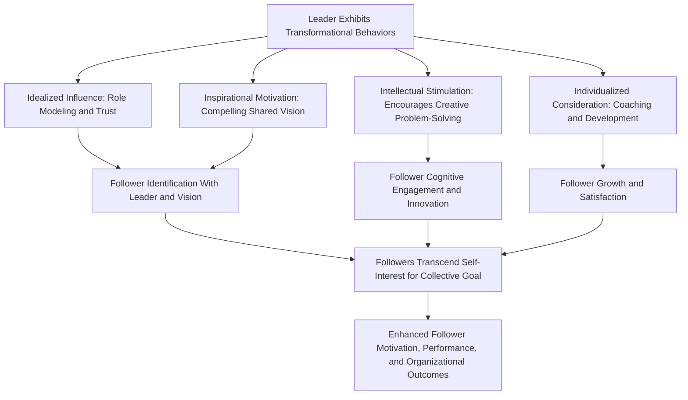

## Transformational and Charismatic Leadership

### Definition

Transformational leadership refers to a leadership style in which leaders inspire and motivate followers to **transcend their own immediate self-interest** for the sake of the organization or collective goal, fostering higher levels of follower motivation, moral development, and performance than would occur through simple exchange-based leadership. Charismatic leadership refers to a leadership style in which the leader's personal qualities, vision, and behaviors generate **strong emotional identification, admiration, and even devotion** from followers, often attributing exceptional or extraordinary qualities to the leader. The two constructs are closely related and substantially overlapping in the literature, with charisma frequently treated as a core component or close relative of transformational leadership rather than a fully separate category.

### Historical Background

#### Weber's Original Concept of Charismatic Authority (Early 20th Century)

Sociologist Max Weber introduced "charisma" as one of three types of legitimate authority (alongside traditional and legal-rational authority), describing it as a form of authority resting on followers' perception of a leader's **exceptional, almost supernatural or exemplary qualities**, distinct from authority derived from tradition or formal legal position. Weber's foundational conception emphasized that charismatic authority is inherently relational and perceptual — it exists in the followers' attribution of extraordinary qualities to the leader, not merely in the leader's objective characteristics.

#### Burns's Transformational vs. Transactional Leadership Distinction (1978)

Political sociologist James MacGregor Burns, studying political leadership, introduced the foundational distinction between:

- **Transactional leadership:** Leadership based on an exchange relationship — followers comply in return for specific rewards (pay, recognition, resources), with leader and follower goals treated as separate and satisfied through mutual exchange.
- **Transformational leadership:** Leadership that **raises the level of human conduct and ethical aspiration** of both leader and follower, fundamentally changing followers' values, motivations, and goals toward alignment with a shared higher purpose, rather than simple transactional exchange.

Burns originally framed these as **opposite ends of a single continuum**, though later researchers (notably Bass) revised this to treat them as **distinct, complementary dimensions** that can coexist within the same leader.

#### Bass's Extension and Formalization (1985)

Bernard Bass developed the most widely used contemporary model of transformational leadership, formalizing it into measurable dimensions and explicitly linking it to organizational and business leadership contexts (extending Burns's originally political framing). Bass proposed that transformational leadership **augments** transactional leadership rather than simply replacing it — effective leaders often exhibit both, with transformational behaviors producing performance beyond what transactional exchange alone would achieve (the "**augmentation effect**").

### Bass's Four "I"s of Transformational Leadership

| Dimension | Description |
| --- | --- |
| **Idealized Influence (Charisma)** | Leader acts as a role model, demonstrating high ethical/moral standards, earning follower trust, admiration, and identification |
| **Inspirational Motivation** | Leader articulates a compelling, optimistic vision of the future, communicates high expectations, and uses symbols/emotional appeals to inspire collective effort |
| **Intellectual Stimulation** | Leader encourages followers to question assumptions, think creatively, and approach problems in novel ways, fostering innovation |
| **Individualized Consideration** | Leader attends to each follower's individual needs for growth and development, acting as coach/mentor rather than treating followers uniformly |

These four dimensions are frequently measured using Bass and Avolio's **Multifactor Leadership Questionnaire (MLQ)**, the dominant instrument in transformational leadership research.

### The Full Range Leadership Model (Bass & Avolio)

Bass and Avolio's broader framework situates transformational leadership alongside transactional and non-leadership styles on a continuum of leadership behaviors:

| Style Category | Component | Description |
| --- | --- | --- |
| **Transformational** | Idealized Influence, Inspirational Motivation, Intellectual Stimulation, Individualized Consideration | Highest activation and effectiveness in the model |
| **Transactional** | Contingent Reward | Leader clarifies expectations and provides rewards for meeting them |
| **Transactional** | Management-by-Exception (Active) | Leader monitors performance and intervenes proactively when standards are not met |
| **Transactional** | Management-by-Exception (Passive) | Leader intervenes only after problems become significant |
| **Non-leadership** | Laissez-Faire | Leader avoids decisions, abdicates responsibility, and provides minimal guidance; generally the least effective style in the model |

**General empirical pattern:** Transformational leadership styles are most strongly associated with positive follower and organizational outcomes, contingent reward shows moderate positive associations, management-by-exception (especially passive) shows weaker or even negative associations, and laissez-faire leadership is consistently the most negatively associated style across meta-analytic findings.

### Process Flow Diagram

### Charismatic Leadership Theory (House, 1977; Conger & Kanungo, 1987)

#### House's Attribution-Based Theory of Charismatic Leadership

Robert House proposed a formal, testable theory identifying specific leader behaviors and follower effects associated with charismatic leadership attribution, including:

- Strong follower trust in the leader's beliefs
- Follower affection toward and unquestioning acceptance of the leader
- Follower emotional involvement in the mission
- Heightened follower performance goals and confidence in mission success

#### Conger and Kanungo's Behavioral/Attributional Model

Jay Conger and Rabindra Kanungo proposed that charisma results from an **attributional process** in which followers perceive certain leader behaviors as extraordinary, including:

- Advocating a vision that **departs substantially from the status quo**
- Taking **personal risk** and incurring high personal cost to achieve the vision
- Using **unconventional strategies** to achieve goals
- Demonstrating accurate assessment of environmental constraints and follower needs
- Communicating with strong rhetorical skill and emotional expressiveness

This framework emphasizes that charisma is fundamentally a **follower perception/attribution** contingent on specific observable leader behaviors, rather than a fixed, mysterious personal quality.

### Distinguishing Transformational, Charismatic, and Transactional Leadership

| Dimension | Transactional Leadership | Transformational Leadership | Charismatic Leadership (House/Conger-Kanungo) |
| --- | --- | --- | --- |
| Core mechanism | Exchange of rewards for compliance | Elevation of follower values/motivation beyond self-interest | Follower attribution of extraordinary qualities based on specific behaviors |
| Follower relationship | Contractual/exchange-based | Developmental and inspirational | Emotionally intense identification, sometimes idealization |
| Vision emphasis | Minimal; focused on clear task expectations | Central; articulates compelling shared vision | Central; vision often explicitly departs from status quo |
| Risk to leader | Low | Moderate | Explicitly emphasized (personal risk-taking is a defining behavior) |
| Overlap | Distinct base category in Full Range Model | Substantially overlaps with charisma (Idealized Influence dimension) | Substantially overlaps with transformational leadership; often treated as a component or close relative |

### The "Dark Side" of Charisma: Personalized vs. Socialized Charismatic Leadership

A significant refinement in the charismatic/transformational leadership literature distinguishes:

- **Socialized charismatic leadership:** Leader uses charismatic influence to serve collective interests, empower followers, and pursue ethically grounded goals.
- **Personalized charismatic leadership:** Leader uses charismatic influence primarily for self-aggrandizement, personal power, and self-interest, potentially fostering unhealthy follower dependence, suppressing dissent, or pursuing goals harmful to followers or society.

This distinction is central to understanding how charismatic leadership dynamics (extraordinary vision, strong follower devotion, risk-taking framed as heroic) can, in the personalized form, contribute to authoritarian or destructive leadership outcomes despite superficially similar behavioral signatures to prosocial transformational leadership. [Inference] Historical and organizational case analyses of destructive charismatic leaders often draw on this personalized/socialized distinction, though systematically and prospectively distinguishing the two in real time (before outcomes are known) remains a genuine practical and research challenge.

### Worked Example

**Scenario:** Two department heads at the same company both describe an ambitious digital transformation vision to their teams.

| Leader | Behavior Pattern | Likely Classification |
| --- | --- | --- |
| Leader A | Articulates a compelling shared vision (Inspirational Motivation); personally takes visible career risk advocating for the change (Idealized Influence/charisma); invites team members to challenge and improve the plan (Intellectual Stimulation); mentors individual team members through the transition (Individualized Consideration) | Transformational leadership, socialized charisma |
| Leader B | Articulates an equally compelling vision and takes visible personal risk, but discourages any questioning of the plan, takes personal credit for all successes, and expects unquestioning loyalty | Charismatic in follower-attribution terms, but personalized (self-serving) rather than socialized charisma; may lack genuine transformational elements like intellectual stimulation and individualized consideration |

**Interpretation:** Both leaders may generate strong follower emotional engagement and be perceived as "charismatic," but the underlying motivational orientation and long-term follower/organizational consequences (autonomy and growth vs. dependence and suppressed dissent) differ substantially — illustrating why charisma alone is an incomplete predictor of genuinely positive transformational outcomes.

### Empirical Evidence and Outcomes

- Meta-analyses (e.g., Judge & Piccolo, 2004) have found transformational leadership consistently and positively associated with follower satisfaction, follower motivation, leader effectiveness ratings, and various organizational performance measures, generally showing stronger associations than transactional contingent-reward leadership, though contingent reward also shows meaningful positive associations in many analyses.
- Transformational leadership has been associated with increased follower organizational citizenship behavior, reduced turnover intentions, and higher reported job satisfaction across a substantial body of organizational research.
- [Inference] Cross-cultural research suggests some transformational leadership behaviors (e.g., vision articulation) may generalize across cultural contexts reasonably well, while others (e.g., specific styles of individualized consideration) may be expressed differently depending on cultural norms around power distance and individualism/collectivism, though this remains an area of ongoing comparative research rather than a fully settled conclusion.

### Relation to Other Leadership Theory Families

| Theory Family | Relationship to Transformational/Charismatic Leadership |
| --- | --- |
| Trait Approaches | Charisma-related traits (self-confidence, expressiveness, dominance) identified in trait research are foundational precursors to charismatic leadership theory |
| Situational/Contingency Theories | Distinct emphasis: contingency theories focus on matching style to situational variables, while transformational/charismatic theories focus more on follower psychological transformation and vision, though situational factors (e.g., organizational crisis) have been studied as conditions that increase charismatic leadership emergence and effectiveness |
| Leader-Member Exchange (LMX) Theory | Distinct focus on dyadic relationship quality, though individualized consideration (a transformational dimension) shares conceptual overlap with high-quality LMX relationships |
| Groupthink | [Inference] Highly charismatic, especially personalized charismatic leadership combined with high group cohesion could plausibly increase groupthink vulnerability by suppressing dissent, an extrapolation consistent with groupthink's "directive leadership" antecedent rather than a finding specific to the charismatic leadership literature |

### Applications

- **Organizational leadership development:** Transformational leadership training programs (often using MLQ-based 360-degree feedback) are widely implemented in corporate and military leadership development contexts.
- **Change management:** Transformational leadership is frequently invoked as the preferred leadership style for guiding organizations through significant change initiatives, given its emphasis on vision articulation and follower buy-in beyond simple compliance.
- **Political and social movement leadership:** Charismatic leadership theory is widely applied to analyze historical and contemporary political and social movement leaders, examining how vision articulation, personal risk, and unconventional strategy contribute to follower mobilization (connecting to collective action research).
- **Ethical leadership and governance safeguards:** The personalized/socialized charisma distinction informs governance recommendations (e.g., board oversight, distributed decision authority) intended to mitigate risks associated with unchecked personalized charismatic influence in organizations.

### Critiques and Limitations

- The substantial conceptual overlap between "charisma" and "transformational leadership" (particularly the Idealized Influence dimension) has led to critiques that the constructs are not always cleanly empirically distinguishable, complicating precise theoretical differentiation.
- Much transformational leadership research relies on follower self-report ratings (e.g., MLQ), raising potential concerns about common-method bias and the possibility that follower performance/satisfaction ratings partly reflect general positive leader impressions rather than cleanly isolating the specific four-dimension model.
- The "Great Man"-adjacent origins of charisma theory (emphasis on extraordinary individual qualities) have drawn some of the same critiques leveled at classical trait theory, though contemporary attributional models (Conger & Kanungo) explicitly reframe charisma as a follower-perception process rather than a fixed personal essence.
- Distinguishing genuinely prosocial (socialized) transformational/charismatic leadership from personalized, potentially harmful charismatic influence is conceptually important but can be difficult to assess prospectively, particularly before longer-term outcomes are observable.

### Related Topics / Next Steps

- **Trait approaches to leadership**
- **Situational and contingency theories**
- **Leader-Member Exchange (LMX) theory**
- **Power bases and social influence (French and Raven)**
- **Groupthink: antecedents and prevention**
- **Ethical leadership and destructive leadership research**
- **Organizational change management**
- **Political psychology and collective action**