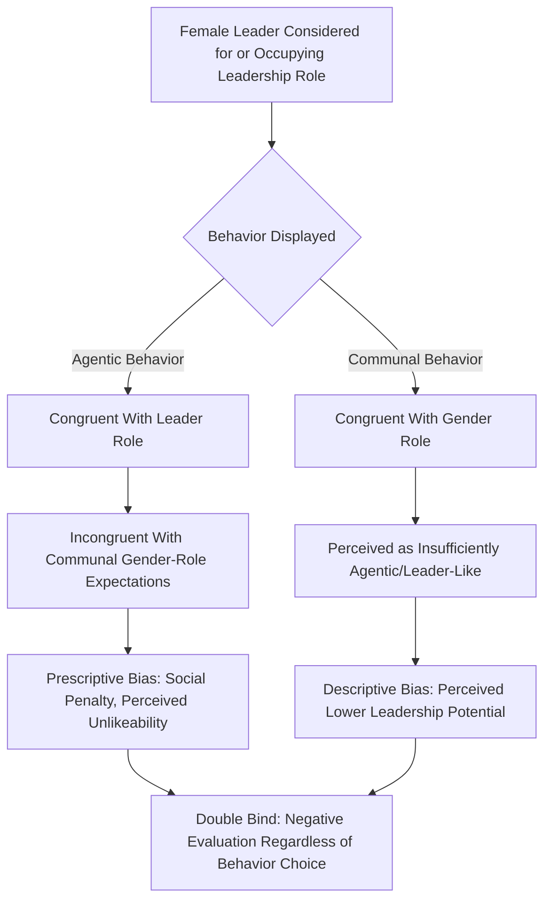

## Gender and Leadership

### Definition

Gender and leadership research examines how gender shapes leadership emergence, leadership style, follower perceptions and evaluations of leaders, and the structural/organizational barriers women face in attaining and succeeding in leadership roles. This field integrates social psychological theory (stereotyping, prejudice, social role theory) with organizational research to explain persistent gender disparities in leadership representation despite generally comparable leadership effectiveness across genders.

### Historical and Empirical Context: The Leadership Gap

Despite women's increasing representation in the workforce and in management generally, women remain persistently underrepresented in senior and executive leadership roles across most industries and countries — a well-documented pattern often referred to as the **"leaky pipeline"** (progressive underrepresentation at each successive organizational level) and, at the most senior levels, the **"glass ceiling"** (an invisible but real barrier to advancement to the highest positions). [Unverified] Precise current statistics vary by country, industry, and year and should be checked against current data sources rather than assumed static, but the general pattern of underrepentation at senior levels relative to entry and mid-level representation has been consistently documented across multiple decades of organizational research.

### Role Congruity Theory (Eagly & Karau, 2002)

Alice Eagly and Steven Karau's **role congruity theory** is the most influential contemporary social psychological framework explaining gender-based leadership evaluation bias. It proposes that prejudice toward female leaders arises from a perceived **incongruity** between:

- The **communal traits** stereotypically associated with women (e.g., warmth, nurturance, cooperativeness, sensitivity to others)
- The **agentic traits** stereotypically associated with successful leadership (e.g., assertiveness, competitiveness, dominance, independence)

This incongruity produces **two distinct forms of prejudice**:

1. **Descriptive bias:** Women are perceived as *less likely* to possess the agentic qualities believed necessary for effective leadership, leading to lower expectations of women's leadership potential before they even act.
2. **Prescriptive/injunctive bias:** When women *do* display agentic leadership behaviors, they may be evaluated *negatively* for violating communal gender-role expectations — a pattern often termed the **"double bind"**: women leaders face role incongruity whether they act communally (perceived as insufficiently leader-like) or agentically (perceived as insufficiently likable/appropriate for their gender role).

**Role Congruity Theory: The Double Bind**

| Leadership Behavior Displayed | Perception If Displayed by a Man | Perception If Displayed by a Woman |
| --- | --- | --- |
| Agentic (assertive, directive, competitive) | Congruent with both leader role and gender role; generally rewarded | Congruent with leader role but incongruent with communal gender-role expectations; may be evaluated as unlikeable, "too aggressive," or socially penalized |
| Communal (warm, collaborative, supportive) | Congruent with gender role but may be seen as insufficiently agentic/leader-like | Congruent with gender role but may be perceived as lacking sufficient agentic leadership qualities |

### The "Think Manager, Think Male" Phenomenon (Schein, 1973 and subsequent research)

Virginia Schein's foundational research documented that both male and female respondents, across multiple studies and countries, tended to describe successful middle managers using traits more closely aligned with **masculine gender stereotypes** than feminine ones — a pattern termed **"think manager, think male."** This reflects an implicit cultural association between leadership prototypes and masculinity, contributing to the descriptive bias component of role congruity theory. [Inference] Some more recent research suggests this association may be weakening somewhat over time and varies by industry/context, though it has not been fully eliminated across the broader body of replication and extension studies.

### The Glass Cliff Phenomenon (Ryan & Haslam, 2005)

Michelle Ryan and Alexander Haslam identified the **"glass cliff"** phenomenon: women (and members of other underrepresented groups) are disproportionately likely to be appointed to leadership positions during periods of **organizational crisis or poor performance**, when the risk of failure is elevated and the position is precarious.

**Proposed explanations for the glass cliff:**

- **Think crisis, think female:** Some evidence suggests that communal traits stereotypically associated with women (e.g., collaborative problem-solving, empathy) are perceived as particularly suited to crisis management contexts, somewhat paradoxically increasing women's appointment likelihood specifically *when* organizational risk is high.
- **Reduced competition for risky positions:** Precarious leadership positions may be less actively sought or competed for by others, potentially making them more accessible to women and minority candidates who otherwise face barriers to more secure, high-status positions.
- **Attribution consequences:** When a leader appointed during crisis subsequently "fails" (which may reflect the pre-existing crisis rather than leadership quality), attributions of failure may disproportionately be assigned to the leader's individual characteristics (including gender) rather than the pre-existing situational difficulty, potentially reinforcing negative stereotypes about women's leadership capability.

### Process Flow Diagram: Role Congruity and the Double Bind

### Meta-Analytic Findings on Actual Leadership Style and Effectiveness Differences

#### Eagly and Johnson's Meta-Analysis (1990) on Leadership Style

Found that women leaders tend, on average, to adopt a somewhat **more democratic/participative style** and men a somewhat more **autocratic/directive style**, though the researchers emphasized these average differences were relatively small and highly context-dependent, with organizational role and setting substantially moderating the size and even direction of style differences.

#### Eagly, Johannesen-Schmidt, and van Engen's Meta-Analysis (2003) on Transformational Leadership

Found that women leaders scored, on average, **slightly higher on transformational leadership** measures (particularly individualized consideration) and on the transactional contingent-reward dimension, than men, while men scored somewhat higher on the less-effective management-by-exception and laissez-faire styles. Since transformational and contingent-reward styles are generally associated with more positive organizational outcomes, this finding has been interpreted as suggesting **no leadership effectiveness deficit for women** — and if anything, a modest average style advantage on dimensions linked to positive outcomes.

#### Overall Effectiveness Meta-Analyses (Eagly, Karau, & Makhijani, 1995)

Found **no significant overall difference** in leader effectiveness between men and women in the aggregate, though effectiveness differences favoring one gender or the other did emerge in specific role contexts — for example, [Inference] some studies suggest men were rated somewhat more effective in more traditionally masculine-typed organizational roles and women somewhat more effective in roles requiring more interpersonal skill, consistent with a role-congruity-based contextual pattern rather than a general gender-based effectiveness gap.

**Summary of Key Meta-Analytic Patterns**

| Dimension | General Finding |
| --- | --- |
| Overall leadership effectiveness | No significant average difference; role-context-dependent variation exists |
| Leadership style (autocratic vs. democratic) | Small average difference; women somewhat more participative/democratic on average |
| Transformational leadership | Women score slightly higher on average, particularly individualized consideration |
| Leadership emergence in mixed-gender initially leaderless groups | Historically found men more likely to emerge as leaders, though [Inference] the size of this effect and its consistency across more contemporary samples and task types is less settled than the classic effectiveness-parity findings |

### Structural and Additional Explanatory Factors

- **Social role theory (Eagly, 1987):** Proposes that gender stereotypes arise substantially from the historical distribution of men and women into different social roles (e.g., traditional breadwinner vs. caregiver roles), which shapes perceived and actual gender-typical behavior and, in turn, leadership-relevant stereotype content — the theoretical foundation underlying role congruity theory's stereotype assumptions.
- **Implicit bias and in-group favoritism:** Male-dominated leadership pipelines can perpetuate homosocial reproduction (leaders favoring successors who resemble themselves), a structural mechanism distinct from but compounding stereotype-based evaluation bias.
- **Workplace structural barriers:** Organizational practices around parental leave, flexible work arrangements, and informal mentorship/sponsorship networks have been documented as contributing to differential career advancement opportunities, independent of individual leadership capability.
- **Intersectionality:** [Inference] Gender-leadership dynamics intersect with race, ethnicity, and other social identities in ways that produce distinct patterns for women of different racial/ethnic backgrounds (e.g., research on the compounded barriers facing women of color in leadership), an area of active and growing research rather than a fully settled body of findings comparable in volume to the broader gender-leadership literature.

### Worked Example

**Scenario:** A company is filling a senior leadership vacancy during a period of declining division performance (organizational crisis).

| Candidate | Profile | Predicted Dynamics (per Gender-Leadership Research) |
| --- | --- | --- |
| Candidate A (male) | Strong agentic leadership style, solid track record | Perceived as leader-prototypical (congruent with "think manager, think male" association); low glass-cliff risk given non-crisis-associated appointment pattern |
| Candidate B (female) | Strong agentic leadership style, comparable track record | May face prescriptive bias/likability penalty for agentic style (double bind); if appointed during this crisis period specifically, may reflect a glass-cliff pattern (elevated appointment likelihood during precarious/high-risk conditions) |
| **If Candidate B is appointed and the division's pre-existing decline continues short-term** | — | Risk of attribution bias: continued decline (a likely outcome given pre-existing crisis conditions) may be disproportionately attributed to her individual leadership capability rather than the pre-existing situational difficulty, per glass-cliff attribution research |

### Relation to Other Group/Leadership Phenomena

| Phenomenon | Relationship to Gender and Leadership |
| --- | --- |
| Trait approaches to leadership | "Think manager, think male" reflects the historically masculine-coded leadership trait prototype documented in classic trait research |
| Transformational/charismatic leadership | Meta-analytic evidence that women score comparably or higher on transformational dimensions directly informs debates about gender and leadership effectiveness |
| Stereotype threat | [Inference] Related mechanism: awareness of negative stereotypes about women's leadership capability could plausibly produce performance-undermining stereotype threat effects in leadership-relevant evaluative contexts, an extrapolation from the broader stereotype threat literature rather than a claim specific to a single leadership study |
| Social identity theory | In-group favoritism within predominantly male leadership networks can perpetuate homosocial reproduction patterns affecting women's advancement |

### Applications

- **Organizational diversity and inclusion policy:** Role congruity theory and glass cliff research inform structured, criteria-based promotion and hiring processes designed to reduce reliance on stereotype-influenced subjective judgment.
- **Leadership development programs for women:** Some organizations design targeted development and sponsorship programs informed by this research to address structural barriers (e.g., limited access to informal mentorship networks) distinct from any claimed leadership-capability gap, since meta-analytic evidence does not support a general effectiveness deficit.
- **Media and public narrative literacy:** Glass cliff research is frequently applied to interpret patterns in high-profile political and corporate leadership appointments, cautioning against attributing subsequent difficulties solely to the appointed leader's individual capability without considering pre-existing situational context.
- **Performance evaluation system design:** Awareness of the double-bind pattern informs efforts to design more behaviorally specific, less stereotype-susceptible performance evaluation criteria in some organizational contexts.

### Critiques and Limitations

- Much of the classic gender-leadership meta-analytic evidence is based on Western, particularly U.S. and European, samples; [Inference] cross-cultural generalizability of specific effect sizes and even some directional patterns (e.g., "think manager, think male") may vary in societies with substantially different gender-role norms, and should not be assumed uniform globally.
- Glass cliff research, while robust across multiple studies and contexts, has some inconsistency in effect size and boundary conditions across different industries and studies, and [Inference] the relative contribution of the "think crisis, think female" mechanism versus alternative explanations (e.g., reduced competition for risky roles) is not fully resolved.
- Gender is frequently treated as a binary variable in this body of research, reflecting historical methodological conventions; [Inference] contemporary research increasingly recognizes the need for more nuanced treatment of gender identity beyond the binary, though the bulk of the classic quantitative leadership literature summarized here was conducted using binary gender measures.
- Distinguishing genuine average style/effectiveness differences from evaluator bias in leadership research is methodologically challenging, since follower ratings of leader style and effectiveness are themselves potentially subject to the same stereotype-driven biases being studied.

### Related Topics / Next Steps

- **Trait approaches to leadership**
- **Transformational and charismatic leadership**
- **Social role theory**
- **Stereotype threat**
- **Prejudice, discrimination, and stereotyping**
- **Social identity theory and in-group favoritism**
- **Intersectionality in organizational psychology**
- **Power bases and social influence (French and Raven)**