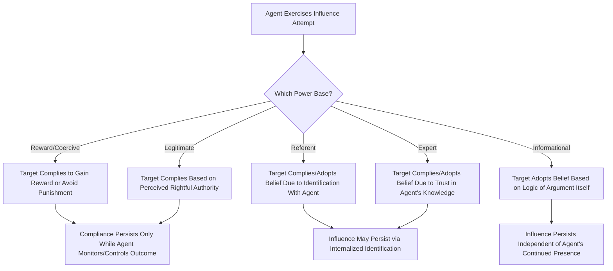

## Bases and Types of Social Power

### Definition

Social power refers to the capacity of an individual or group (the agent) to influence the beliefs, attitudes, or behavior of another individual or group (the target), typically by controlling resources, sanctions, or information that the target values or depends upon. Power is generally distinguished from **influence** (the actual exercise or effect of power) and from **authority** (power that is legitimated by formal position or social agreement) — power represents the underlying *capacity* or *potential* to influence, whether or not it is actively exercised.

### French and Raven's Bases of Social Power (1959)

John French and Bertram Raven developed the most influential and widely used taxonomy of social power, identifying **five original bases**, later expanded to six with the addition of informational power (Raven, 1965).

#### 1. Reward Power

The capacity to influence based on the agent's ability to provide **valued outcomes** (tangible or intangible rewards) to the target for compliance. Effectiveness depends on the target valuing the reward and believing the agent can and will actually deliver it.

#### 2. Coercive Power

The capacity to influence based on the agent's ability to administer **punishments or negative consequences** for non-compliance. Closely related to reward power in structure (both rely on the agent's control over outcomes) but distinguished by the valence (punishment vs. reward) and generally associated with more negative downstream consequences (e.g., resentment, reduced trust) than reward power.

#### 3. Legitimate Power

The capacity to influence based on the target's belief that the agent has a **rightful, socially sanctioned authority** to prescribe behavior, typically stemming from formal position, social norms, or reciprocity/equity expectations. Raven further distinguished sub-types of legitimate power, including:

- **Legitimate position power:** derived from formal organizational role/hierarchy
- **Legitimate power of reciprocity:** obligation to comply based on a prior favor received
- **Legitimate power of equity:** obligation to compensate for effort or hardship the agent has endured
- **Legitimate power of dependence/responsibility:** obligation to help a dependent or vulnerable party

#### 4. Referent Power

The capacity to influence based on the target's **identification with, admiration for, or desire to be associated with** the agent. Referent power does not require formal authority or control over resources; it arises from personal attraction, respect, or a sense of shared identity, and is closely linked to charismatic leadership theory.

#### 5. Expert Power

The capacity to influence based on the target's perception that the agent possesses **superior knowledge, skill, or expertise** relevant to the situation. Effectiveness depends on the target's trust in both the accuracy of the agent's expertise and the agent's honesty in applying it.

#### 6. Informational Power (added 1965)

The capacity to influence based on the **content and logic of the information or persuasive argument itself**, rather than on the target's ongoing dependence on the agent. Informational power is considered structurally distinct from the other five bases because, once the information/argument is accepted, the influence can persist **independent of the agent's continued presence or control** — the target internalizes the logic itself, rather than merely complying due to dependence on the agent.

**French and Raven's Power Bases Summary Table**

| Power Base | Source of Influence | Requires Ongoing Agent Presence/Control? |
| --- | --- | --- |
| Reward | Control over valued outcomes | Yes |
| Coercive | Control over punishments | Yes |
| Legitimate | Perceived rightful authority | Yes (tied to role/position/norm) |
| Referent | Identification/admiration | Partially — can persist through internalized identification |
| Expert | Perceived superior knowledge/skill | Partially — depends on continued perceived credibility |
| Informational | Persuasive content of the message itself | No — can be internalized independent of the agent |

### Process Flow Diagram: Power Bases and Compliance Durability

### Distinguishing Compliance, Identification, and Internalization (Kelman's Framework)

Herbert Kelman's classic framework of social influence outcomes maps closely onto the durability distinctions among French and Raven's power bases:

| Influence Process | Definition | Most Associated Power Bases |
| --- | --- | --- |
| **Compliance** | Surface behavior change to gain reward or avoid punishment; underlying private attitude unchanged | Reward, Coercive |
| **Identification** | Behavior/attitude adopted to establish or maintain a valued relationship with the influencing agent | Referent |
| **Internalization** | Behavior/attitude genuinely integrated into one's own value system, persisting independent of the agent | Expert, Informational |

This integration illustrates why reward and coercive power tend to produce the least durable influence (compliance only, often reverting once surveillance/incentive is removed), while expert, informational, and to some extent referent power tend to produce more durable, internalized change.

### Worked Example

**Scenario:** A manager wants an employee to adopt a new, more efficient work process.

| Approach | Power Base Invoked | Predicted Durability of Compliance |
| --- | --- | --- |
| "Do this or you'll face a formal warning" | Coercive | Likely reverts once monitoring/threat is removed (compliance only) |
| "Do this and you'll get a bonus" | Reward | Likely reverts once the reward incentive ends (compliance only) |
| "This is company policy, and I'm your supervisor" | Legitimate | Persists while the role/authority relationship remains salient |
| "I really respect you, and I know you want to do things the way I do because you look up to me" | Referent | May persist through ongoing identification with the manager, but is vulnerable if the relationship weakens |
| "I've researched this extensively, and the data clearly shows this method reduces errors by 30%" | Expert / Informational | Likely to produce the most durable adoption, since the employee can internalize the underlying logic independent of the manager's continued presence |

### Empirical and Theoretical Extensions

#### Power and Its Psychological Consequences on the Power-Holder

A substantial body of subsequent research (distinct from but related to French and Raven's original agent-target framework) examines how **holding power psychologically affects the power-holder**, including findings that increased power is associated with:

- Increased approach-oriented behavior and reduced inhibition (per the Approach/Inhibition Theory of Power, Keltner, Gruenfeld, & Anderson, 2003)
- Increased tendency toward abstract, "big-picture" thinking relative to detail-oriented processing
- Reduced perspective-taking and empathic accuracy toward less powerful others in some studies, though [Inference] this finding shows some inconsistency across replication attempts and may depend on situational and individual-difference moderators
- Increased likelihood of stereotyping others, potentially due to reduced motivation to individuate targets when the power-holder's outcomes are less dependent on them

#### Power-Dependence Theory (Emerson, 1962)

Richard Emerson's foundational sociological framework proposes that power is fundamentally **relational and rooted in mutual dependence**: Actor A's power over Actor B is a function of B's dependence on A, and this dependence is itself a function of how much B values the resources A controls and how many alternative sources B has for obtaining those resources. This reframes "power" not as a fixed individual possession but as an emergent property of the relationship and the structure of resource dependence between parties.

$$\text{Power}_{A \to B} = \text{Dependence}_{B \to A}$$

### Relation to Other Leadership and Group Phenomena

| Phenomenon | Relationship to Power Bases |
| --- | --- |
| Trait approaches to leadership | Need for power/dominance traits (McClelland) relate directly to individuals' tendency to seek and use particular power bases |
| Transformational/charismatic leadership | Referent power is foundationally linked to charismatic leadership's follower identification mechanism |
| Situational/contingency theories | Fiedler's "position power" dimension directly corresponds to legitimate power in the French and Raven taxonomy |
| Conformity and obedience (Milgram) | Legitimate and coercive power are central to explaining obedience to authority in Milgram-style paradigms |
| Social exchange theory | Power-dependence theory shares strong conceptual overlap with social exchange theory's cost-benefit and dependence-based relational framework |

### Applications

- **Organizational management and leadership development:** French and Raven's taxonomy is a foundational framework in management training, used to help leaders diagnose which power bases they rely on and to encourage cultivation of expert and referent power (associated with more durable, positive influence) alongside or instead of over-reliance on coercive power.
- **Negotiation and conflict resolution:** Power-dependence theory informs negotiation strategy by highlighting that reducing one's own dependence on a counterpart (e.g., developing alternative options, per the related concept of a negotiation's "best alternative to a negotiated agreement") shifts relative power balance.
- **Political science and international relations:** Legitimate and coercive power distinctions are widely applied to analyze the basis of state authority and the durability of compliance secured through coercion versus perceived legitimacy.
- **Compliance and health behavior interventions:** Expert and informational power principles inform public health communication strategy, emphasizing that messages perceived as coming from credible experts and communicated with compelling logical/evidentiary content tend to produce more durable behavior change than messages relying primarily on authority-based directives.

### Critiques and Limitations

- The boundaries between some power bases (e.g., referent and expert power; legitimate and reward power in some hierarchical contexts) can overlap in practice, and real-world influence attempts often draw on multiple bases simultaneously, complicating clean empirical isolation of each base's independent effect.
- French and Raven's original framework was developed primarily through conceptual analysis rather than extensive initial empirical testing; [Inference] subsequent empirical validation of the six-base structure has been generally supportive but has also generated debate about whether some bases should be further subdivided (as Raven did with legitimate power) or consolidated.
- The framework's original dyadic (agent-target) framing has been extended, but some critics argue it underspecifies how power operates in more complex multi-party, network, or institutional contexts compared to more sociologically oriented frameworks like power-dependence theory.
- Much of the power-holder psychological consequences research (e.g., approach/inhibition theory) has faced some replication challenges typical of experimental social psychology broadly, and effect sizes/consistency across study contexts should be interpreted with appropriate caution.

### Related Topics / Next Steps

- **Trait approaches to leadership**
- **Transformational and charismatic leadership**
- **Obedience to authority (Milgram)**
- **Social exchange theory**
- **Power-dependence theory (Emerson)**
- **Kelman's compliance, identification, and internalization framework**
- **Approach/Inhibition Theory of Power**
- **Negotiation and conflict resolution strategies**