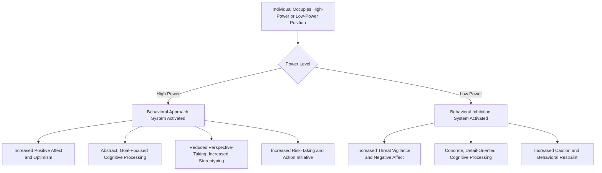

## Cognitive and Behavioral Effects of Holding Power

### Definition

This topic examines how possessing or being placed in a position of power **psychologically transforms the power-holder** — affecting cognition (attention, perspective-taking, abstraction, stereotyping), emotion, and behavior (risk-taking, disinhibition, goal pursuit) — independent of how that power was acquired or is exercised toward others. This is distinct from the study of power *bases* (French and Raven), which addresses the *sources* of influence capacity; this topic addresses the *psychological consequences* of holding power on the individual who possesses it.

### Historical Background

#### Early Observations and the Shift to Systematic Study

Early social psychology (including foundational work like Milgram's obedience studies) focused heavily on how power/authority affects the *target's* behavior. A distinct and later research tradition, particularly developed from the late 1990s through the 2000s, shifted focus to systematically studying **the psychology of the power-holder**, drawing on approach-avoidance motivational frameworks from broader psychological theory.

#### Keltner, Gruenfeld, and Anderson's Approach/Inhibition Theory of Power (2003)

Dacher Keltner and colleagues proposed the most influential integrative framework, arguing that having power activates the **behavioral approach system** (associated with reward-seeking, positive affect, and action) while reduced power activates the **behavioral inhibition system** (associated with threat-vigilance, negative affect, and behavioral restraint). This single motivational-systems framework was used to generate and organize a wide array of specific predictions about power's cognitive and behavioral effects.

### Core Cognitive Effects

#### 1. Abstract vs. Concrete Processing

Power has been associated with a shift toward more **abstract, "big-picture" construal** of situations and goals, while lower power/powerlessness is associated with more **concrete, detail-oriented processing**. This has been linked to Construal Level Theory more broadly, with power functioning as a variable that shifts psychological distance and abstraction level.

#### 2. Reduced Perspective-Taking and Empathic Accuracy

Multiple studies have found that experimentally induced or dispositional power is associated with **reduced accuracy in taking others' perspectives** and reduced tendency to spontaneously adopt another person's visual or mental viewpoint (e.g., in classic perspective-taking tasks involving physical vantage points or false-belief inference). [Inference] This effect has shown some inconsistency across replication attempts in the broader experimental social psychology literature, and its magnitude may depend on situational factors such as whether the power-holder's outcomes remain dependent on the other party.

#### 3. Increased Stereotyping of Others

Power has been associated with increased reliance on stereotypes when judging others, theoretically explained by reduced motivation to individuate lower-power targets when the power-holder's own outcomes are not strongly dependent on accurately understanding those targets — power reduces the *incentive* for effortful, individuated social cognition.

#### 4. Optimism and Risk Perception

Power has been associated with increased optimism about outcomes and a tendency to perceive **lower risk** and take more risks in decision-making, consistent with the approach-system activation proposed by Keltner et al.'s framework.

#### 5. Goal-Directed Attention and Cognitive Focus

Power has been linked to heightened attention toward goal-relevant stimuli and reduced distraction by goal-irrelevant information, consistent with an approach-motivation-driven narrowing of attentional focus toward reward-relevant cues.

**Summary of Core Cognitive Effects**

| Cognitive Domain | Effect of High Power |
| --- | --- |
| Construal level | More abstract, big-picture processing |
| Perspective-taking | Reduced accuracy/tendency to adopt others' viewpoints |
| Social judgment | Increased reliance on stereotypes |
| Risk perception | Reduced perceived risk; increased risk-taking |
| Attentional focus | Increased goal-directed focus; reduced distractibility by irrelevant cues |

### Core Behavioral and Affective Effects

#### 1. Disinhibition and Approach-Oriented Behavior

Power is associated with increased behavioral approach tendencies — greater willingness to act, take initiative, and pursue rewards, alongside reduced behavioral inhibition/restraint, consistent with the core prediction of the approach/inhibition framework.

#### 2. Positive Affect

Power has generally been associated with increased experience and expression of positive emotion, consistent with approach-system activation, while powerlessness has been associated with increased negative affect and threat sensitivity.

#### 3. Action Orientation and Initiative-Taking

Power-holders in experimental studies have shown increased likelihood of taking action in ambiguous situations (e.g., intervening when a situation calls for someone to act), consistent with reduced behavioral inhibition.

#### 4. Moral Hypocrisy and Rule Application

Some studies have found that power is associated with a tendency toward **moral hypocrisy** — holding others to stricter standards of behavior than oneself, or being more lenient in judging one's own rule violations relative to others' identical violations. [Inference] As with several effects in this literature, the consistency and boundary conditions of this specific finding across different experimental paradigms and samples warrant some caution in treating it as a fully settled, universal effect.

#### 5. Reduced Susceptibility to Social Influence/Conformity

Power has been associated with reduced conformity to others' opinions and reduced susceptibility to situational social pressures, consistent with the broader approach-oriented, self-directed behavioral profile associated with high power states.

### Process Flow Diagram

### Worked Example

**Scenario:** A newly promoted regional manager, contrasted with their prior role as an individual contributor, faces the same ambiguous customer complaint situation.

| Role | Predicted Cognitive/Behavioral Response (per Approach/Inhibition Theory) |
| --- | --- |
| Individual contributor (lower power) | More cautious, detail-focused evaluation of the complaint; hesitance to act without explicit approval; heightened attentiveness to potential risk of overstepping |
| Regional manager (higher power) | More confident, quicker decision to act; more abstract framing of the issue (e.g., "how does this fit our broader customer policy") rather than granular detail focus; potentially less effortful consideration of the individual complainant's specific perspective unless deliberately prompted to engage in perspective-taking |

**Interpretation:** This illustrates the approach/inhibition framework's core prediction — the same objective situation is processed and acted upon differently depending on the power position of the individual involved, driven by differing activation of approach versus inhibition-oriented psychological systems, rather than necessarily reflecting a difference in underlying individual character.

### Boundary Conditions and Moderators

- **Sense of legitimacy of power:** [Inference] Power perceived as illegitimately obtained or held may produce different psychological consequences (e.g., increased threat-sensitivity or compensatory behavior) than power perceived as legitimately earned, though this is a less thoroughly established finding than the core approach/inhibition effects themselves.
- **Accountability structures:** Power-holders who remain accountable to others (e.g., subject to review, dependent on others' cooperation for their own outcomes) may show attenuated versions of some negative cognitive effects (e.g., reduced stereotyping, better-maintained perspective-taking), since accountability reintroduces some of the dependence dynamics that power otherwise reduces.
- **Communal vs. personalized power orientation:** Drawing on McClelland's distinction (also relevant to charismatic leadership research), individuals with a more communal/socialized orientation toward power may show different behavioral consequences (e.g., less moral hypocrisy, more prosocial use of increased action-orientation) than those with a personalized power orientation, though [Inference] this moderating relationship is more clearly established in the charismatic leadership literature than in the specific experimental power-cognition paradigms discussed here.
- **Duration and stability of power:** Most experimental studies induce power through brief manipulations (e.g., role assignment, recall tasks); [Inference] the psychological consequences of long-term, stable power-holding in real organizational or political roles may differ in magnitude or character from short-term experimentally induced power states, an important caveat given the field's substantial reliance on brief laboratory manipulations.

### Relation to Other Leadership and Group Phenomena

| Phenomenon | Relationship to Power's Cognitive/Behavioral Effects |
| --- | --- |
| Bases and types of social power (French and Raven) | Distinct focus: French and Raven examine sources of power's influence on targets; this topic examines consequences of holding power on the power-holder |
| Groupthink | [Inference] A directive leader's reduced perspective-taking and increased confidence/risk tolerance under power could plausibly contribute to groupthink-relevant dynamics (e.g., insufficiently considering alternative views), an extrapolation connecting the two literatures rather than a direct empirical finding from a single study |
| Transformational/charismatic leadership | The communal/socialized vs. personalized power distinction relevant to charismatic leadership's "dark side" overlaps conceptually with power's moral hypocrisy and self-other application asymmetry findings |
| Gender and leadership | [Inference] Some researchers have examined whether the psychological effects of holding power operate similarly across genders or interact with gender-based stereotype expectations (e.g., whether disinhibited, approach-oriented behavior is evaluated differently when displayed by women versus men in power), connecting to role congruity theory's double-bind dynamics |

### Applications

- **Executive coaching and leadership development:** Awareness of power's tendency to reduce perspective-taking and increase stereotyping informs coaching interventions that explicitly encourage leaders to deliberately engage in perspective-taking exercises and seek diverse input, counteracting a documented tendency rather than assuming it will occur naturally.
- **Organizational accountability design:** Given that accountability structures appear to moderate some negative cognitive effects of power, organizations may design governance mechanisms (peer review, 360-degree feedback, transparent decision documentation) partly to counteract power's documented tendency to reduce careful, individuated social cognition.
- **Ethics and compliance training:** Understanding the moral hypocrisy finding informs organizational ethics training that explicitly addresses the risk of power-holders applying inconsistent standards to themselves versus others.
- **Political psychology:** This body of research is frequently applied to analyze and explain observed behavioral patterns among long-tenured political leaders, though [Inference] such applications to real-world, high-profile political figures generally extrapolate from controlled experimental findings rather than reflecting direct experimental study of those specific individuals.

### Critiques and Limitations

- A substantial portion of this literature relies on brief experimental power inductions (e.g., recall tasks, temporary role assignments in laboratory settings) rather than studying individuals with genuine, longstanding real-world power; generalizability from brief manipulated power states to enduring organizational or political power remains an important open question.
- Some specific effects within this literature, including aspects of the reduced-perspective-taking and moral hypocrisy findings, have faced replication challenges consistent with broader replication concerns across experimental social psychology, and effect sizes/robustness should be interpreted with appropriate caution rather than treated as uniformly settled.
- The approach/inhibition framework, while highly influential and generative of substantial research, is a broad organizing theory; [Inference] not every specific downstream prediction it generates has received equally strong or consistent empirical support, and the framework functions more as a productive heuristic than a fully validated, precise predictive model across all its proposed effects.
- Much research in this area has been conducted in Western, particularly U.S., organizational and laboratory contexts; cross-cultural generalizability of specific findings (e.g., whether power's disinhibiting effects manifest similarly in more collectivist or high-power-distance cultural contexts) is less thoroughly established.

### Related Topics / Next Steps

- **Bases and types of social power (French and Raven)**
- **Transformational and charismatic leadership**
- **Groupthink: antecedents and prevention**
- **Gender and leadership**
- **Obedience to authority (Milgram)**
- **Construal Level Theory**
- **Approach/Inhibition Theory of Power (Keltner, Gruenfeld, & Anderson)**
- **Ethical and destructive leadership research**