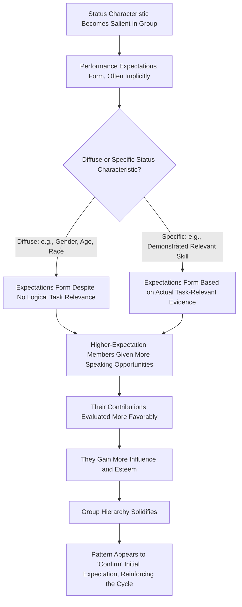

## Status and Hierarchy in Groups

### Definition

Status refers to the relative social rank, respect, prominence, or esteem an individual holds within a group, as perceived and conferred by other group members. Hierarchy refers to the broader structural arrangement of differentiated status and/or power positions within a group, ranging from steep (highly differentiated) to flat (relatively equal). While status and power are related and often correlated in real groups, they are theoretically distinct: **status** is fundamentally about respect and esteem (a socially conferred evaluation), while **power** (see related topics) is about control over resources or outcomes — an individual can hold high status without formal power (e.g., a respected elder), or formal power without genuine status-based respect (e.g., an unpopular but formally authorized supervisor).

### Historical Background

#### Early Sociometric and Small-Group Research

Early social psychology (e.g., Bales's Interaction Process Analysis in the 1950s) documented that small, initially leaderless task groups reliably and rapidly differentiate into status hierarchies, with certain members consistently talking more, being deferred to, and having disproportionate influence over group decisions — establishing that hierarchy formation is a robust, near-universal feature of group interaction rather than a rare or pathological occurrence.

#### Expectation States Theory (Berger, Cohen, & Zelditch, 1972)

Joseph Berger and colleagues developed **expectation states theory**, one of the most rigorously developed and empirically tested frameworks explaining how status hierarchies form and stabilize in task-oriented groups, particularly around the concept of **status characteristics**.

### Expectation States Theory: Core Mechanisms

#### Status Characteristics

A status characteristic is any individual attribute around which shared cultural beliefs exist regarding differential competence or worthiness, and around which group members hold **performance expectations** even before direct evidence of actual task competence is available.

- **Specific status characteristics:** Directly relevant to the task at hand (e.g., relevant technical expertise, prior demonstrated skill on this specific task type).
- **Diffuse status characteristics:** General characteristics carrying broad cultural performance expectations *not* logically tied to the specific task, such as gender, race, age, physical attractiveness, or perceived socioeconomic status. Critically, expectation states theory demonstrates that diffuse status characteristics influence group interaction and influence patterns **even on tasks entirely unrelated to the characteristic itself** — a key and somewhat counterintuitive theoretical contribution.

#### The Burden of Proof Process

Once a status characteristic becomes salient in a group (often automatically, simply by virtue of being observable), group members form **performance expectations** for each member based on that characteristic, largely without conscious awareness. These expectations then shape:

- **Opportunities to participate:** Higher-expectation members are given more opportunities to contribute
- **Performance evaluations:** Contributions from higher-expectation members are evaluated more favorably, even when objectively similar in quality to lower-expectation members' contributions
- **Influence:** Higher-expectation members' opinions carry more weight in group decisions
- **Rewards:** Higher-expectation members receive more esteem, deference, and credit

This creates a **self-fulfilling, self-reinforcing cycle**: initial status-based expectations shape interaction patterns, which in turn produce behavioral outcomes (more participation, more visible influence) that appear to *confirm* the initial expectation, even when the underlying status characteristic (e.g., gender) has no actual logical bearing on task competence.

### Process Flow Diagram: Expectation States Theory Cycle

### Status Construction Theory (Ridgeway)

Cecilia Ridgeway extended expectation states theory to explain how **entirely new status beliefs can emerge** even among individuals with no pre-existing cultural status distinction, through repeated small-group interactions in which resource or performance differences (even randomly assigned) become associated with a distinguishing characteristic and generalize into broader status beliefs over repeated encounters. This addresses the important question of *where* diffuse status characteristics originate and how they can spread and stabilize across a society, beyond simply assuming they are pre-existing cultural facts.

### Basking-in-Reflected-Glory (BIRGing) and Status Management

Robert Cialdini's research on **BIRGing** demonstrated that individuals strategically associate themselves with successful others/groups (e.g., wearing a team's colors after a win, using "we" language for a successful team's victory) to enhance their own perceived status by association — an individual-level status-management behavior connected to broader social identity processes.

### Dominance Hierarchies vs. Prestige Hierarchies

Contemporary status research (notably Henrich & Gil-White, 2001, drawing on evolutionary and comparative psychology) distinguishes two distinct routes to attaining high status/rank within groups:

| Route to Status | Mechanism | Associated Behaviors |
| --- | --- | --- |
| **Dominance** | Status achieved through intimidation, coercion, and control over resources or punishment | Aggression, threat displays, control-seeking behavior; associated status is often unstable and resented |
| **Prestige** | Status freely conferred by others in exchange for perceived competence, skill, or valuable knowledge | Skill demonstration, generosity, willingness to teach/mentor; associated status tends to be more stable and willingly granted |

[Inference] This dual-hierarchy framework is influential in evolutionary and comparative psychological accounts of status but represents a somewhat different theoretical tradition than the sociologically rooted expectation states theory, and integrating the two frameworks precisely (e.g., whether dominance and prestige routes interact with status characteristic effects) remains an area of ongoing theoretical development rather than a single unified consensus model.

### Worked Example

**Scenario:** A newly formed six-person cross-functional project team meets for the first time to solve an unfamiliar business problem.

| Member | Observable Characteristic | Predicted Status Dynamic (per Expectation States Theory) |
| --- | --- | --- |
| Member A | Senior job title, older, confident speaking style | High diffuse status characteristics (seniority, age) → likely given early speaking opportunities and more favorable initial evaluation, regardless of actual task-relevant expertise |
| Member B | Junior title, quieter demeanor, but has directly relevant specialized technical expertise for this exact problem | Specific status characteristic (task-relevant expertise) present but may take longer to become salient/recognized if diffuse characteristics initially dominate interaction patterns |
| **Predicted early dynamic** | — | Member A may initially receive more influence and deference than Member B, even though Member B's specific expertise is more directly task-relevant — illustrating the "burden of proof" bias toward diffuse status characteristics absent deliberate intervention |
| **Possible corrective intervention** | — | Explicitly highlighting Member B's specific relevant expertise early in the group's interaction (a documented expectation-states-theory-based intervention technique) can help recalibrate performance expectations toward actual task competence |

### Interventions to Counteract Status-Based Bias

Expectation states research has directly informed several evidence-based interventions:

- **Explicit competence framing:** Publicly and explicitly establishing a lower-diffuse-status member's specific task-relevant competence early in group interaction can help offset diffuse status characteristic bias.
- **Multiple ability framing:** Emphasizing that the task requires multiple different types of ability (reducing the salience of any single status characteristic as globally diagnostic of overall competence).
- **Structured turn-taking procedures:** Formal processes ensuring all members have equal speaking opportunity, counteracting the natural tendency for higher-status members to dominate floor time.
- **Anonymous or structured input methods:** Techniques such as Nominal Group Technique or Delphi method (see Group Decision-Making Processes) can reduce status-based influence disparities by structurally decoupling contribution visibility from status characteristics during idea generation.

### Relation to Other Group and Leadership Phenomena

| Phenomenon | Relationship to Status and Hierarchy |
| --- | --- |
| Trait approaches to leadership | Leadership emergence findings (e.g., extraversion predicting emergence) can be partly reinterpreted through expectation states theory as diffuse-status-characteristic-like dynamics operating on personality-linked behavioral cues |
| Gender and leadership | Gender functions as a classic diffuse status characteristic in expectation states research, directly relevant to "think manager, think male" and role congruity theory findings |
| Groupthink | Steep status hierarchies with strong deference to high-status members can contribute to self-censorship and mindguard behaviors central to groupthink |
| Group decision-making processes | Status hierarchies interact with the common knowledge effect: unique information held by lower-status members may be less likely to be voiced or credited, compounding hidden-profile-type information-pooling failures |
| Bases and types of social power | Status (esteem-based) and legitimate/referent power (authority/identification-based) are conceptually related but distinct; high status can be a source of referent power without formal legitimate authority |

### Applications

- **Team design and meeting facilitation:** Organizations increasingly apply expectation-states-informed facilitation techniques (structured turn-taking, explicit competence framing) to reduce status-driven participation and influence disparities, particularly in diverse teams where diffuse status characteristics (e.g., seniority, gender) risk overshadowing task-relevant expertise.
- **Diversity, equity, and inclusion initiatives:** Expectation states theory and status construction theory provide a rigorous social-psychological foundation for understanding how demographic status characteristics can systematically bias group participation and evaluation independent of actual competence, informing structural intervention design.
- **Educational group work:** Cooperative learning research has applied expectation-states-based interventions (e.g., "multiple ability" framing) in classroom group work to reduce status-based participation disparities among students.
- **Organizational hierarchy design:** Understanding the dominance/prestige distinction informs leadership selection and culture-design choices about whether an organization's implicit or explicit status-conferral mechanisms reward coercive/dominance-oriented behavior versus competence/generosity-oriented (prestige) behavior.

### Critiques and Limitations

- Expectation states theory has been rigorously and extensively tested primarily in laboratory task-group settings; [Inference] generalizability of precise effect magnitudes to complex, long-term, real-world organizational hierarchies (with many additional confounding factors) requires some caution, though the core theoretical mechanism is well-supported directionally.
- Status construction theory's account of how entirely new status beliefs emerge and spread across a population is theoretically elegant but [Inference] more challenging to test directly at a broad societal scale compared to controlled small-group laboratory designs.
- The dominance/prestige dual-hierarchy framework, while influential, emerged from a different theoretical tradition (evolutionary/comparative psychology) than expectation states theory (sociological small-group research), and the field has not fully achieved a single integrated model reconciling both traditions' insights.
- Distinguishing status from power and from simple popularity/likability can be conceptually and empirically challenging in applied real-world settings, since these constructs frequently correlate in practice even though they are theoretically distinguishable.

### Related Topics / Next Steps

- **Bases and types of social power (French and Raven)**
- **Gender and leadership**
- **Trait approaches to leadership**
- **Groupthink: antecedents and prevention**
- **Group decision-making processes**
- **Social identity theory and in-group favoritism**
- **Cognitive and behavioral effects of holding power**
- **Cooperative learning and educational group dynamics**