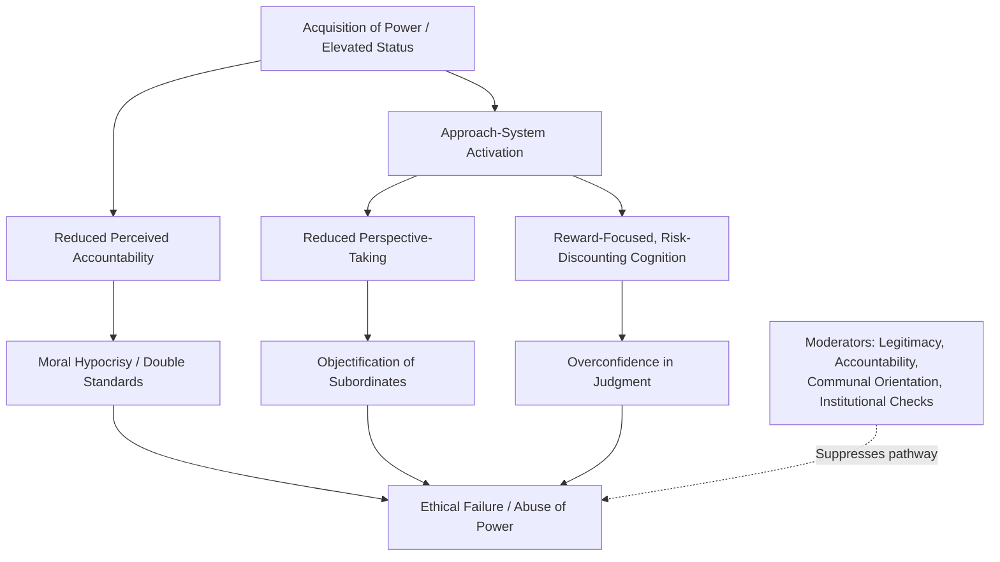

## Corruption of Power and Ethical Failure

### Definitions

**The corrupting effect of power** refers to the empirically documented tendency for holding elevated power, status, or authority to alter cognitive, emotional, and behavioral processes in ways that increase the likelihood of unethical, self-serving, or norm-violating conduct. This is distinguished from the folk notion that "corrupt people seek power" — social-psychological research primarily examines how the *possession* of power changes psychological functioning, independent of who initially attains it.

**Power** in this literature is typically defined as asymmetric control over valued resources and outcomes relevant to another person (Keltner, Gruenfeld, and Anderson's approach-inhibition framework being the dominant model). **Ethical failure** refers to behavior that violates moral, legal, or professional norms, ranging from minor hypocrisy to large-scale abuse.

### Historical and Theoretical Background

- Lord Acton's aphorism ("power tends to corrupt, absolute power corrupts absolutely," 1887) predates empirical psychology but frames the folk hypothesis that subsequent research has tested.
- **Zimbardo's Stanford Prison Experiment (1971)**: Assigned "guard" roles to college students in a simulated prison, with guards escalating to abusive behavior within days. Widely cited as a demonstration of situational power and role assignment enabling ethical failure, though the study has faced substantial methodological criticism in recent decades — including evidence that experimenters actively coached guards toward harsher behavior, undermining its status as a "natural" emergent effect. [Contested: subsequent historical analyses (e.g., Le Texier, 2019) argue the study's demand characteristics were far stronger than originally portrayed, and its conclusions should be treated with caution rather than as settled fact.]
- **Milgram's Obedience Studies (1961–1963)**: Though framed around obedience to authority rather than power-holding per se, these studies are frequently discussed alongside power-corruption research because they demonstrate how legitimated authority structures can produce ethical failure in ordinary participants.
- **Approach-Inhibition Theory of Power** (Keltner, Gruenfeld, & Anderson, 2003): The foundational modern framework, proposing that power activates the behavioral approach system (leading to disinhibited, reward-focused, action-oriented behavior) while reduced power activates the behavioral inhibition system (leading to vigilance, constraint, and threat-sensitivity).

### Core Mechanisms Linking Power to Ethical Failure

1. **Disinhibition and reduced self-monitoring**: Power reduces attentiveness to social consequences and situational constraints, lowering behavioral inhibition generally — including inhibition against norm violation.
2. **Perspective-taking deficits**: Experimental work (notably by Galinsky and colleagues) shows that power holders show reduced tendency to adopt others' visual, cognitive, and emotional perspectives, which can facilitate treating others instrumentally.
3. **Moral hypocrisy / double standards**: Multiple studies find that powerful individuals judge their own transgressions (e.g., minor rule-breaking) less harshly than they judge identical transgressions by others.
4. **Illusion of control and overconfidence**: Elevated power is associated with inflated perceived control over outcomes, which can lead to underestimating risk and disregarding checks.
5. **Objectification of others**: Power has been linked in experimental studies to viewing subordinates more as instruments for goal achievement than as full moral agents, reducing empathic constraint.
6. **Approach-oriented reward focus**: The approach-inhibition model predicts power-holders focus more on potential rewards of an action and less on potential risks or harms, shifting cost-benefit calculations toward self-interest.
7. **Erosion of accountability perception**: Powerful roles are often (accurately or not) associated with reduced perceived likelihood of being monitored, caught, or sanctioned.

### Key Empirical Studies

**Kipnis (1972) — "Does Power Corrupt?"**

An early experimental study finding that participants given greater ability to control others' behavior via rewards/punishments came to devalue their subordinates' intrinsic motivation and worth, attributing subordinate compliance to their own power rather than the subordinate's abilities.

**Galinsky, Magee, Inesi, & Gruenfeld (2006) — "Power and Perspectives Not Taken"**

Experimentally primed powerful participants were less accurate at inferring others' mental states and less likely to spontaneously adopt others' visual perspective (e.g., drawing an "E" on their own forehead readable to themselves rather than an observer).

**Lammers, Stapel, & Galinsky (2010) — "Power Increases Hypocrisy"**

Across several experiments, participants primed with high power were more likely to condemn others' cheating/speeding while being more likely to engage in the same behavior themselves, particularly when their power felt legitimate.

**Piff, Stancato, Côté, Mendoza-Denton, & Keltner (2012) — "Higher Social Class Predicts Increased Unethical Behavior"**

Using both correlational (e.g., observed driving behavior at intersections) and experimental methods, found upper-class indicators were associated with higher rates of self-reported unethical behavior and lab-based cheating/lying. [Note: this literature has drawn replication concerns in subsequent years regarding effect size and generalizability across cultures and samples.] [Unverified/contested: some direct replications have failed to reproduce the original effect sizes.]

### Moderators — When Power Does NOT Corrupt

Research consistently identifies boundary conditions, making "absolute power corrupts absolutely" an oversimplification rather than a universal law:

- **Legitimacy of power**: Power perceived as illegitimately obtained shows stronger corrupting effects than power perceived as earned or legitimately conferred.
- **Communal orientation / prosocial disposition**: Individuals high in trait communal orientation or moral identity often show power *increasing* prosocial behavior rather than corrupt behavior — power appears to amplify a person's pre-existing dispositional tendencies rather than uniformly corrupting everyone.
- **Accountability structures**: Power holders who expect to justify decisions to others, or who operate under transparent oversight, show substantially reduced ethical drift.
- **Communal/relational power framing**: Power conceptualized as "responsibility for others" rather than "freedom from others" tends to produce different (often more prosocial) behavioral patterns.
- **Organizational and institutional culture**: Strong ethical climates, whistleblower protections, and norm-setting by peer leadership can offset individual-level power effects.

### Real-World / Applied Examples

- **Corporate scandals** (e.g., accounting fraud cases like Enron): Frequently analyzed through the lens of executive power insulation, reduced perspective-taking toward stakeholders, and eroded accountability mechanisms.
- **Political corruption**: Abuse-of-office cases are often examined for the interaction between legitimate authority, weak institutional checks, and in-group loyalty norms that suppress internal dissent.
- **Institutional abuse** (e.g., in policing, clergy, or academic hierarchies): Power differentials combined with weak external accountability are recurring structural features across documented cases of prolonged institutional ethical failure.
- **Workplace incivility and abusive supervision**: Organizational behavior research finds supervisors with high power and low accountability show elevated rates of demeaning or exploitative treatment of subordinates.

### Distinguishing Related Concepts

| Concept | Focus | Relation to Power Corruption |
| --- | --- | --- |
| Power corruption | How holding power changes cognition/behavior | Core topic |
| Groupthink | How group cohesion suppresses dissent | Often co-occurs in powerful in-groups, but a distinct mechanism |
| Moral licensing | Prior good behavior "licensing" later transgression | A related but separate mechanism sometimes triggered by power-holder self-image |
| Diffusion of responsibility | Reduced individual accountability in groups | Can compound, rather than directly cause, power-related ethical drift |
| Banality of evil (Arendt) | Ordinary people committing atrocities via bureaucratic role conformity | Overlaps with obedience-to-authority research, distinct from power-holder disinhibition per se |

### Organizational and Applied Mitigation Strategies

- **Structural accountability**: Mandatory disclosure, audit trails, and third-party review reduce the perceived-impunity component of power corruption.
- **Perspective-taking interventions**: Deliberate practices (e.g., structured stakeholder consultation, rotating roles) can counteract the perspective-taking deficits associated with power.
- **Distributed / shared power structures**: Flattened hierarchies and checks-and-balances designs reduce concentration of unchecked authority.
- **Selection and promotion criteria**: Emphasizing communal orientation and demonstrated ethical track record in leadership selection may reduce the population of power-holders prone to corrupt drift (though this does not eliminate situational effects).
- **Psychological safety and whistleblower protection**: Reduces the suppression of internal dissent that often allows ethical failures to persist undetected.
- **Term limits and rotation**: Time-bounding power reduces entrenchment and the gradual erosion of self-monitoring associated with prolonged unchecked authority. [Inference: while broadly recommended in governance literature, direct causal evidence isolating rotation as the active ingredient (versus co-occurring reforms) is limited.]

### Diagram: Pathway From Power to Ethical Failure

### Diagram: Approach-Inhibition Theory of Power (svg_diagram)

<svg xmlns="http://www.w3.org/2000/svg" viewBox="0 0 720 360" font-family="sans-serif">
<text x="360" y="28" text-anchor="middle" font-size="18" font-weight="bold" fill="#1a1a2e">Approach-Inhibition Theory of Power (svg_diagram)</text>
<rect x="30" y="60" width="300" height="260" rx="10" fill="#e6f4ea" stroke="#34a853" stroke-width="2" />
<text x="180" y="90" text-anchor="middle" font-size="15" font-weight="bold" fill="#1e5e2e">High Power</text>
<text x="180" y="115" text-anchor="middle" font-size="12" fill="#333">Behavioral Approach System</text>
<text x="180" y="133" text-anchor="middle" font-size="12" fill="#333">activated</text>
<text x="180" y="163" text-anchor="middle" font-size="12" fill="#333">→ Reward-focused attention</text>
<text x="180" y="185" text-anchor="middle" font-size="12" fill="#333">→ Disinhibited action</text>
<text x="180" y="207" text-anchor="middle" font-size="12" fill="#333">→ Reduced perspective-taking</text>
<text x="180" y="229" text-anchor="middle" font-size="12" fill="#333">→ Optimistic risk assessment</text>
<text x="180" y="251" text-anchor="middle" font-size="12" fill="#333">→ Increased goal-directed,</text>
<text x="180" y="269" text-anchor="middle" font-size="12" fill="#333"> sometimes norm-violating,</text>
<text x="180" y="287" text-anchor="middle" font-size="12" fill="#333"> behavior</text>
<rect x="390" y="60" width="300" height="260" rx="10" fill="#fef7e0" stroke="#fbbc04" stroke-width="2" />
<text x="540" y="90" text-anchor="middle" font-size="15" font-weight="bold" fill="#8a6d00">Low Power</text>
<text x="540" y="115" text-anchor="middle" font-size="12" fill="#333">Behavioral Inhibition System</text>
<text x="540" y="133" text-anchor="middle" font-size="12" fill="#333">activated</text>
<text x="540" y="163" text-anchor="middle" font-size="12" fill="#333">→ Threat/vigilance focus</text>
<text x="540" y="185" text-anchor="middle" font-size="12" fill="#333">→ Behavioral constraint</text>
<text x="540" y="207" text-anchor="middle" font-size="12" fill="#333">→ Heightened situational</text>
<text x="540" y="225" text-anchor="middle" font-size="12" fill="#333"> attentiveness</text>
<text x="540" y="247" text-anchor="middle" font-size="12" fill="#333">→ Conservative risk assessment</text>
<text x="540" y="269" text-anchor="middle" font-size="12" fill="#333">→ Norm-conforming</text>
<text x="540" y="287" text-anchor="middle" font-size="12" fill="#333"> behavior more likely</text>
</svg>

### Common Misconceptions

- "Power corrupts absolutely" is **not** empirically supported as a universal law; the effect is moderated substantially by legitimacy, accountability, and individual disposition.
- Ethical failure under power is **not** solely a function of "bad people seeking power" — much of the experimental literature manipulates power via random assignment or priming, showing situational effects independent of prior character.
- The Stanford Prison Experiment should **not** be cited as clean, uncontaminated evidence of spontaneous role-based corruption; historical reanalysis indicates significant experimenter influence on outcomes. [Contested]
- Power effects are **not** monolithic across all power-holders — communally oriented individuals frequently show power increasing generosity and ethical behavior rather than decreasing it.

### Related Topics

- Approach-inhibition theory of power (Keltner, Gruenfeld, & Anderson)
- Obedience to authority (Milgram paradigm)
- Groupthink and janis's antecedent conditions
- Moral disengagement mechanisms (Bandura)
- Diffusion of responsibility and bystander effect
- Social dominance orientation
- Ethical leadership and servant leadership models
- Organizational accountability structures and whistleblower research
- Moral licensing effects
- Legitimacy and procedural justice in authority perception