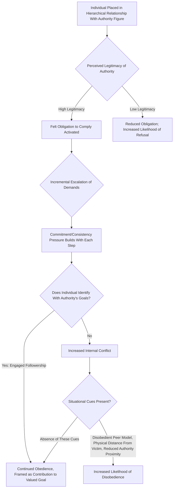

## Followership and Obedience to Leaders

### Definition

Followership refers to the study of the roles, behaviors, and psychological processes of individuals who follow leaders — a perspective that treats followers as active, consequential participants in leadership dynamics rather than merely passive recipients of leader influence. Obedience to leaders refers specifically to the tendency of individuals to comply with directives from authority figures, including compliance with instructions that conflict with personal moral standards, and represents one of the most extensively studied and consequential phenomena in social psychology.

### Historical Background

#### Milgram's Obedience Studies (1963, 1974)

Stanley Milgram conducted a landmark and highly controversial series of experiments examining the extent to which ordinary individuals would obey an authority figure's instructions to administer what they believed were increasingly severe (and potentially lethal) electric shocks to another person, ostensibly as part of a "learning experiment."

**Basic paradigm:** Participants ("teachers") were instructed by an experimenter (the authority figure) to administer shocks of increasing voltage to a "learner" (a confederate who did not actually receive shocks) for incorrect answers on a memory task. The experimenter used a standardized sequence of verbal prods ("Please continue," "The experiment requires that you continue," etc.) to encourage continuation when participants expressed hesitation.

**Key finding:** In the original baseline condition, approximately 65% of participants continued to the maximum shock level (450 volts, labeled with warnings including "Danger: Severe Shock" and beyond), despite the learner's simulated distress, pleading, and eventual silence — a substantially higher rate of destructive obedience than most observers (including psychiatrists surveyed beforehand) had predicted.

#### Situational Variables Affecting Obedience (Milgram's Follow-Up Variations)

Milgram conducted numerous variations systematically manipulating situational factors, finding obedience rates were substantially affected by:

| Situational Variable | Effect on Obedience |
| --- | --- |
| Physical proximity to the victim (e.g., same room vs. separate room) | Obedience decreased as proximity to the victim increased |
| Physical proximity/legitimacy of the authority figure (e.g., in-person vs. by phone) | Obedience decreased when the authority figure was physically absent or less immediately present |
| Presence of disobedient peers (confederates who refused to continue) | Obedience decreased substantially when participants observed peer models refusing to comply |
| Institutional prestige/setting (e.g., prestigious university vs. nondescript office building) | Obedience decreased somewhat in less prestigious/institutionally legitimate settings, though remained substantial even then |
| Diffusion of responsibility (e.g., participant instructed another person to administer the actual shock) | Obedience increased when the participant's direct causal role was reduced |

These variations demonstrated that destructive obedience is not simply a fixed individual trait but is **highly sensitive to situational and contextual factors**, a central and enduring lesson of the research program.

### Theoretical Explanations for Obedience

#### 1. Agentic State Theory (Milgram's Own Explanation)

Milgram proposed that individuals in a hierarchical authority relationship can shift into an **"agentic state"** — perceiving themselves as an instrument carrying out another person's (the authority's) wishes, rather than as autonomous moral agents personally responsible for their actions. This shift, Milgram argued, substantially reduces the psychological weight of personal moral responsibility for the outcome, facilitating continued compliance even with ethically troubling directives.

#### 2. Legitimate Authority and Perceived Role Obligations

Consistent with French and Raven's legitimate power base, obedience is substantially facilitated when the authority figure is perceived as occupying a legitimate, socially sanctioned role (e.g., a scientist conducting a study within an appropriate institutional context), activating a felt obligation to comply that is distinct from simple fear of punishment.

#### 3. Gradual, Incremental Commitment (Foot-in-the-Door Dynamics)

The incremental nature of Milgram's shock paradigm (starting with very mild shocks and escalating gradually) is theorized to engage **commitment and consistency** psychological processes: having already complied with milder requests, individuals face increasing psychological difficulty in abruptly refusing at any single later increment, a dynamic conceptually related to the foot-in-the-door compliance technique studied in persuasion research.

#### 4. Contemporary Engaged Followership Model (Haslam & Reicher)

Alexander Haslam and Stephen Reicher, drawing on social identity theory, proposed a significant reinterpretation challenging Milgram's agentic-state account. They argue that participants in Milgram-style paradigms are not passively relinquishing agency, but are actively and **identifying with the scientific/experimental enterprise** presented by the authority figure — obedience reflects engaged identification with the values and goals the authority represents (e.g., contributing to scientific knowledge), not a simple loss of self. This reframing suggests obedience is better understood through the same social-identity-based lens used in the SIDE model of crowd behavior, rather than as passive agentic surrender.

**Comparison of Obedience Explanations**

| Theory | Core Mechanism | Implication for Reducing Obedience |
| --- | --- | --- |
| Agentic State Theory (Milgram) | Perceived transfer of responsibility to authority figure | Reduce perceived legitimacy/proximity of authority to prevent agentic shift |
| Engaged Followership (Haslam & Reicher) | Active identification with the authority's goals/values | Undermine follower identification with the authority's mission or framing |
| Foot-in-the-Door/Commitment Dynamics | Incremental commitment escalation | Interrupt gradual escalation; make the "exit" decision salient earlier |
| Legitimate Power (French & Raven) | Perceived rightful, socially sanctioned authority | Reduce perceived legitimacy of the authority figure's role |

### Process Flow Diagram

### Worked Example

**Scenario:** An employee is instructed by a senior manager to alter financial reporting figures in a way the employee privately believes is misleading.

| Factor | Application to Obedience Research |
| --- | --- |
| Legitimate authority | The manager's formal position increases the employee's felt obligation to comply (French & Raven's legitimate power; agentic state activation) |
| Incremental escalation | If the request follows a series of smaller, previously accepted "adjustments," commitment/consistency pressure makes refusal at this later point psychologically harder than an initial outright refusal would have been |
| Physical/organizational proximity | Direct, in-person instruction from the manager is more likely to produce compliance than an ambiguous or indirect request |
| Presence of a dissenting peer | If a colleague present in the meeting voices explicit disagreement, the employee's likelihood of refusing increases substantially, mirroring Milgram's disobedient-peer-model findings |
| Engaged followership lens | If the employee identifies strongly with organizational loyalty or a narrative that "this protects jobs," obedience may reflect active identification with a valued goal rather than passive agentic surrender |

### Followership Typologies

Beyond obedience specifically, contemporary followership research (e.g., Kelley, 1992) has proposed typologies characterizing different **follower styles** based on independent critical thinking and level of active engagement:

| Follower Type | Independent Critical Thinking | Active Engagement |
| --- | --- | --- |
| **Passive/Sheep** | Low | Low |
| **Conformist/Yes-People** | Low | High |
| **Alienated** | High | Low |
| **Effective/Exemplary** | High | High |
| **Pragmatic (survivor)** | Moderate | Moderate |

[Inference] This typology is a widely referenced applied management framework, though it has received less rigorous large-scale empirical validation compared to the highly replicated Milgram obedience paradigm and the more theoretically grounded engaged followership model.

### Relation to Other Leadership and Group Phenomena

| Phenomenon | Relationship to Followership/Obedience |
| --- | --- |
| Bases and types of social power | Legitimate and coercive power are directly central to explaining obedience dynamics |
| Groupthink: antecedents and prevention | Directive/legitimate leadership combined with follower deference (a form of engaged or passive followership) is a structural antecedent of groupthink |
| Crowd behavior and collective action | Haslam and Reicher's engaged followership reinterpretation of Milgram directly parallels the SIDE model's identity-based reinterpretation of classical deindividuation theory |
| Conformity (Asch paradigm) | Distinct but related process: conformity concerns matching peer judgments, while obedience specifically concerns compliance with a hierarchically superior authority's directive |
| Transformational/charismatic leadership | Engaged followership's identification-based mechanism overlaps conceptually with referent power and follower identification central to charismatic leadership theory |

### Ethical Considerations in Obedience Research

Milgram's original studies raised substantial and enduring **research ethics concerns**, including the psychological distress experienced by participants believing they were harming another person, and the use of deception without full prior informed consent. These ethical concerns were highly influential in the development of contemporary research ethics standards and institutional review board (IRB) processes governing psychological research, and directly limit the ability of contemporary researchers to exactly replicate Milgram's original full-severity paradigm. Subsequent partial replications (e.g., Burger, 2009) have used modified, ethically constrained designs (e.g., stopping at a lower voltage threshold) to study obedience patterns while addressing these ethical concerns, generally finding broadly comparable (though not identical) obedience rates to Milgram's original findings up to the point of the modified stopping threshold.

### Applications

- **Organizational ethics and compliance training:** Milgram's findings and the situational moderators identified (proximity, peer dissent modeling, authority legitimacy) directly inform corporate ethics training designed to help employees recognize and resist destructive obedience pressures, particularly by explicitly modeling appropriate dissent behavior.
- **Military and institutional accountability structures:** Historical and legal analyses of atrocities committed under claimed orders (e.g., "just following orders" defenses) have drawn extensively on Milgram's findings and the agentic state concept to understand (though not excuse) how ordinary individuals can participate in harmful directed actions.
- **Whistleblower protection and dissent-enabling organizational design:** Given the strong effect of observing a disobedient peer model on reducing obedience in Milgram's variations, organizations increasingly design structures (protected reporting channels, explicit dissent-encouraging norms) intended to make early principled disagreement more visible and socially supported.
- **Leadership development:** The engaged followership model informs leadership training emphasizing that leaders bear responsibility for the values and goals they invite followers to identify with, since follower compliance is understood as active identification rather than simple externally imposed control.

### Critiques and Limitations

- Milgram's original studies, despite their enduring influence, have faced sustained ethical critique regarding participant welfare and deception, shaping subsequent research ethics standards that constrain modern replication.
- Some historical analysis of Milgram's original data and procedural notes has raised questions about variability in how strictly the standardized experimental script was followed across sessions, an important methodological caveat researchers consider when interpreting the precise obedience percentages reported.
- The agentic state theory and engaged followership model offer substantially different psychological accounts of the same core phenomenon; [Inference] the field has not fully resolved which account better explains obedience across all contexts, and the two may capture complementary rather than fully competing aspects of the underlying psychological process.
- Cross-cultural replications of obedience paradigms have generally found the phenomenon replicates across diverse cultural contexts, though [Inference] specific obedience rates and situational moderator effect sizes show some variation across studies and cultural settings rather than being perfectly uniform worldwide.

### Related Topics / Next Steps

- **Bases and types of social power (French and Raven)**
- **Groupthink: antecedents and prevention**
- **Crowd behavior and collective action**
- **Conformity: Asch paradigm and normative/informational influence**
- **Transformational and charismatic leadership**
- **Research ethics in psychological experimentation**
- **Social identity theory and self-categorization theory**
- **Foot-in-the-door and compliance techniques**