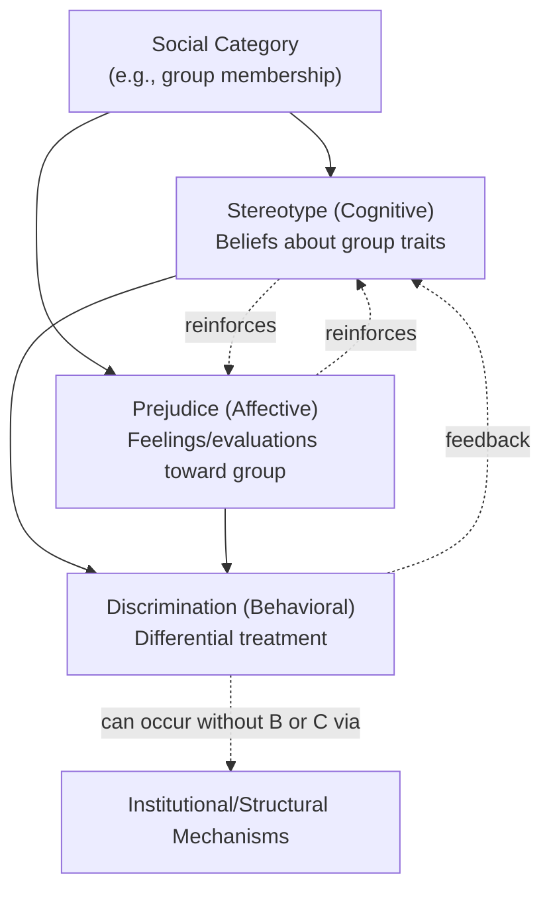

## Distinguishing Prejudice, Stereotypes, and Discrimination

### Overview

Prejudice, stereotypes, and discrimination are three related but conceptually distinct constructs in social psychology, commonly organized under the "ABC model" of intergroup attitudes: Affect (prejudice), Behavior (discrimination), and Cognition (stereotypes). Although they frequently co-occur and reinforce one another, each can theoretically exist independently of the others.

### The ABC Model

| Component | Construct | Nature | Primary Question |
| --- | --- | --- | --- |
| **A**ffect | Prejudice | Evaluative/emotional | "How do I *feel* about this group?" |
| **B**ehavior | Discrimination | Action-based | "How do I *treat* this group?" |
| **C**ognition | Stereotype | Belief-based | "What do I *think* about this group?" |

**Key Points**

- The ABC framework is a heuristic, not a strict causal chain — cognition does not always precede affect, and affect does not always predict behavior.
- All three components can be explicit (consciously held/reported) or implicit (automatic, not necessarily consciously endorsed).

### Stereotypes (Cognitive Component)

Stereotypes are cognitive schemas — generalized beliefs about the attributes, traits, or behaviors typical of members of a social category (e.g., race, gender, age, nationality, occupation).

**Key Points**

- Function as cognitive shortcuts ("heuristics") that reduce processing demands when categorizing complex social information.
- Can be descriptive (beliefs about what a group *is* like) or prescriptive (beliefs about what a group *should* be like — the latter underlies backlash against those who violate role expectations).
- May contain a "kernel of truth" in some cases but are frequently overgeneralized, resistant to disconfirming evidence, and applied even when known to be statistically inaccurate for a given individual.
- Operate at both explicit levels (consciously reportable, e.g., on a questionnaire) and implicit levels (measured indirectly, e.g., via the Implicit Association Test, or IAT).
- Illusory correlation (Hamilton & Gifford, 1976) is a key mechanism by which stereotypes form: people overestimate the association between minority groups and infrequent (often negative) behaviors because both are statistically distinctive and co-occurrence is memorable.

**Example**

A hiring manager unconsciously associates the category "older worker" with the trait "less adaptable to technology." This belief is a stereotype — it is a cognitive generalization, independent of whether the manager dislikes older workers (prejudice) or acts on the belief (discrimination).

### Prejudice (Affective Component)

Prejudice is a negative (or occasionally positive, i.e., "in-group favoritism") evaluative attitude or feeling toward a group and its individual members, typically formed prior to or independent of direct experience with the specific individual being judged.

**Key Points**

- Definitionally an attitude, meaning it has the tripartite attitude structure often cited in attitude theory (though in the ABC-of-intergroup-relations model specifically, prejudice is isolated as the *affective* piece).
- Can range from subtle (aversive racism, ambivalent sexism) to overt (hostile racism, blatant hatred).
- Modern theories distinguish:
  - **Old-fashioned/blatant prejudice**: openly expressed negative feelings and beliefs.
  - **Modern/symbolic/aversive prejudice**: negative affect that coexists with egalitarian self-concept, often expressed indirectly or in ambiguous situations where non-prejudicial justification is available (Gaertner & Dovidio's aversive racism framework; McConahay's modern racism scale).
- The Stereotype Content Model (Fiske, Cuddy, Glick, & Xu, 2002) proposes that prejudice toward specific groups is predicted by perceived **warmth** and **competence**, generating four distinct emotional profiles:
  - High warmth/high competence → admiration
  - Low warmth/low competence → contempt
  - High warmth/low competence → pity
  - Low warmth/high competence → envy

**Example**

An individual feels discomfort, dislike, or anxiety at the mere thought of interacting with a member of an outgroup — this affective reaction is prejudice, even if the person never verbalizes a stereotype or takes any discriminatory action.

### Discrimination (Behavioral Component)

Discrimination is differential (typically unfavorable) treatment of individuals based on their group membership rather than on individual merit or relevant characteristics.

**Key Points**

- Requires an observable behavioral act — it is the only one of the three constructs that necessarily manifests externally.
- Levels of analysis:
  - **Interpersonal discrimination**: face-to-face differential treatment (e.g., rudeness, exclusion, unequal service).
  - **Institutional/systemic discrimination**: policies, procedures, or structures within organizations/societies that produce unequal outcomes, sometimes without any individual actor holding conscious prejudice (e.g., biased hiring algorithms trained on historically skewed data).
- Can be direct (intentional, overt) or subtle/aversive (unconscious, deniable, e.g., reduced eye contact, shorter interactions, seating farther away).
- Microaggressions represent a well-studied subtype: brief, everyday verbal, behavioral, or environmental slights (intentional or unintentional) that communicate hostile or derogatory messages to members of marginalized groups.

**Example**

A landlord who holds no consciously reported negative stereotypes or feelings about a racial group nonetheless charges members of that group higher rent or more frequently denies their applications. This is discrimination, and it can occur through structural/institutional channels even absent measurable individual-level prejudice.

### Why the Distinction Matters: Dissociation Between Components

A central finding in the literature is that these three components do not always align — a person can hold a stereotype without prejudice, feel prejudice without discriminating, or discriminate without personally endorsing negative stereotypes or feelings.

**Key Points**

- **La Piere's (1934) classic study**: A Chinese couple traveling with La Piere were refused service at only 1 of over 250 establishments in person, yet when those same establishments were later surveyed by mail, over 90% said they would not serve Chinese guests — demonstrating a significant attitude-behavior gap. [Unverified: exact establishment/response counts vary slightly across secondary sources; treat figures as approximate as commonly cited in textbooks.]
- **Implicit-explicit dissociation**: A person may explicitly reject a stereotype yet show implicit bias on measures like the IAT, illustrating that cognitive associations can persist despite consciously egalitarian beliefs.
- **Aversive racism theory** explicitly models this dissociation: individuals with strong egalitarian values can still harbor unconscious negative affect toward outgroups, which surfaces only in ambiguous situations where bias can be attributed to non-race factors.
- Discrimination can occur via institutional mechanisms even when no individual holds the corresponding prejudice or stereotype — this is why anti-bias training targeting individual attitudes is often insufficient to eliminate institutional discrimination.

### Relationship Diagram

### Conceptual Model: Warmth × Competence (Stereotype Content Model)

<svg xmlns="http://www.w3.org/2000/svg" viewBox="0 0 520 420">
<text x="260" y="30" font-size="16" font-weight="bold" text-anchor="middle" fill="#1a1a1a">Stereotype Content Model (svg_diagram)</text>
<line x1="80" y1="360" x2="480" y2="360" stroke="#333" stroke-width="2" />
<line x1="80" y1="360" x2="80" y2="60" stroke="#333" stroke-width="2" />
<text x="280" y="395" font-size="13" text-anchor="middle" fill="#333">Competence →</text>
<text x="40" y="210" font-size="13" text-anchor="middle" fill="#333" transform="rotate(-90 40 210)">Warmth →</text>
<line x1="280" y1="60" x2="280" y2="360" stroke="#ccc" stroke-dasharray="4" />
<line x1="80" y1="210" x2="480" y2="210" stroke="#ccc" stroke-dasharray="4" />
<rect x="90" y="220" width="180" height="130" fill="#fde2e2" opacity="0.7" />
<text x="180" y="290" font-size="14" text-anchor="middle" fill="#8a1f1f">Contempt</text>
<text x="180" y="308" font-size="11" text-anchor="middle" fill="#8a1f1f">(low warmth, low competence)</text>
<rect x="290" y="220" width="180" height="130" fill="#fff3cd" opacity="0.8" />
<text x="380" y="290" font-size="14" text-anchor="middle" fill="#8a6d1f">Envy</text>
<text x="380" y="308" font-size="11" text-anchor="middle" fill="#8a6d1f">(low warmth, high competence)</text>
<rect x="90" y="70" width="180" height="130" fill="#d4edda" opacity="0.8" />
<text x="180" y="140" font-size="14" text-anchor="middle" fill="#1f6b2f">Pity</text>
<text x="180" y="158" font-size="11" text-anchor="middle" fill="#1f6b2f">(high warmth, low competence)</text>
<rect x="290" y="70" width="180" height="130" fill="#d1ecf1" opacity="0.8" />
<text x="380" y="140" font-size="14" text-anchor="middle" fill="#0f5c66">Admiration</text>
<text x="380" y="158" font-size="11" text-anchor="middle" fill="#0f5c66">(high warmth, high competence)</text>
</svg>

### Measurement Approaches

**Key Points**

- **Stereotypes**: free-response trait listing, diagnostic ratio tasks, semantic differential scales.
- **Prejudice**: explicit self-report scales (e.g., Modern Racism Scale, Attitudes Toward Women Scale), physiological measures (skin conductance, facial EMG), and implicit measures (IAT, evaluative priming).
- **Discrimination**: behavioral observation, audit/correspondence studies (e.g., sending matched resumes with different names signaling group membership), archival/institutional outcome data (hiring rates, sentencing disparities, loan approval rates).
- [Inference] Correspondence/audit studies are widely regarded as a methodologically strong approach for detecting real-world discrimination because they hold applicant qualifications constant, though outcomes and effect sizes vary across study contexts and cannot be assumed to generalize uniformly across all settings.

### Common Points of Confusion

**Key Points**

- Stereotypes are not inherently negative (e.g., "group X is hardworking") but can still contribute to discrimination via constrained or prescriptive expectations.
- Prejudice does not require a corresponding stereotype to be articulated — affective reactions can be automatic and precede explicit cognitive justification.
- Discrimination does not require conscious prejudice or explicit stereotype endorsement — this is central to understanding modern/systemic forms of bias.
- "Racism" and "sexism" are often used as umbrella terms that can encompass elements of all three constructs simultaneously (stereotyped beliefs + prejudicial affect + discriminatory behavior/structures) rather than referring to a single construct.

### Related Topics

- Implicit Association Test (IAT) and implicit bias measurement
- Aversive racism and modern/symbolic prejudice theories
- Stereotype Content Model and the BIAS map (Behaviors from Intergroup Affect and Stereotypes)
- Realistic Conflict Theory and Social Identity Theory as explanations for prejudice origins
- Contact Hypothesis (Allport) and prejudice-reduction interventions
- Stereotype threat and its performance effects
- Institutional vs. interpersonal discrimination
- Illusory correlation and outgroup homogeneity effect
- Ambivalent sexism theory (hostile vs. benevolent sexism)