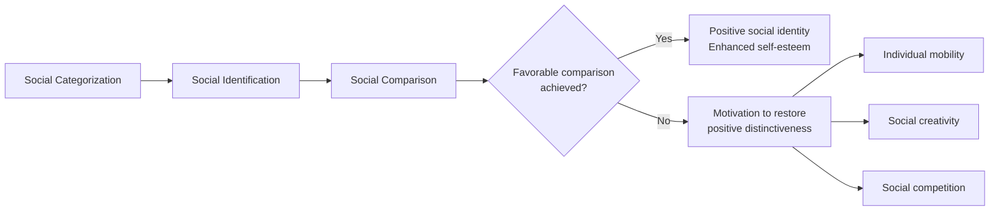

## Social Identity Theory

### Overview

Social Identity Theory (SIT), developed by Henri Tajfel and John Turner (1979), proposes that a portion of an individual's self-concept is derived from their membership in social groups. The theory explains intergroup discrimination, prejudice, and conflict as emerging from basic cognitive and motivational processes tied to group membership rather than requiring competition over real resources or pre-existing hostility.

### Core Premise

**Key Points**

- The self-concept is composed of two parts: **personal identity** (idiosyncratic individual characteristics, traits, abilities) and **social identity** (the part of self-concept derived from perceived membership in social groups, along with the value and emotional significance attached to that membership).
- People are motivated to achieve and maintain a positive social identity, which in turn contributes to positive self-esteem.
- Because social identity is partly comparative, positive distinctiveness is typically achieved by favorably comparing the in-group against relevant out-groups.

### Three Core Cognitive Processes

**Key Points**

1. **Social Categorization**: The cognitive process of sorting people (including oneself) into groups (e.g., by nationality, religion, occupation) to simplify the social environment. This process alone tends to accentuate perceived similarities within categories and differences between them.
2. **Social Identification**: The process of adopting the identity of the group one has categorized oneself as belonging to, and conforming to the norms and behaviors of that group. Emotional investment in group membership becomes tied to self-esteem.
3. **Social Comparison**: Once identification occurs, the in-group is compared to relevant out-groups. Because self-esteem is partly derived from group standing, these comparisons are typically biased to favor the in-group ("in-group favoritism"), which can manifest as out-group derogation.

### The Minimal Group Paradigm

Tajfel and colleagues (1971) developed the minimal group paradigm to isolate the minimum conditions necessary to produce intergroup discrimination.

**Key Points**

- Participants were assigned to groups based on trivial, arbitrary criteria (e.g., alleged preference for paintings by Klee vs. Kandinsky, or even a coin flip), with no face-to-face interaction, no history between groups, and no realistic conflict of interest.
- Despite the absence of any meaningful basis for group distinction, participants reliably allocated more resources (points/money) to anonymous in-group members than to out-group members.
- Notably, participants often chose strategies that maximized the *difference* between in-group and out-group allocations even at the cost of maximizing the absolute amount the in-group received — suggesting the motivation was relative in-group advantage, not merely self/group interest.
- This finding was central to establishing that mere categorization, absent any functional conflict, is sufficient to trigger in-group bias — a direct challenge to Realistic Conflict Theory's claim that intergroup competition requires competition over tangible resources.

**Example**

In a classroom demonstration modeled on the minimal group paradigm, students are randomly assigned to a "Blue" or "Green" team with no other distinguishing information. Within minutes, students often report more favorable impressions of same-team peers and begin to allocate hypothetical rewards unevenly in favor of their own team — despite the groups being entirely arbitrary.

### Strategies for Achieving Positive Distinctiveness

When group comparisons are unfavorable, SIT proposes three possible responses depending on perceived permeability of group boundaries and the perceived legitimacy/stability of status differences:

**Key Points**

- **Individual Mobility**: Attempting to psychologically or physically leave the low-status group and join a higher-status group (more likely when group boundaries are perceived as permeable).
- **Social Creativity**: Redefining or altering the comparison itself without changing actual group status, e.g.:
  - Comparing on a new dimension where the in-group excels.
  - Changing the values assigned to existing attributes (e.g., reframing a stereotyped trait as positive — "Black is beautiful").
  - Changing the comparison out-group to one that is lower-status.
- **Social Competition**: Directly attempting to reverse or improve the group's actual status relative to the out-group (more likely when boundaries are perceived as impermeable and status differences as illegitimate/unstable) — this pathway is most associated with collective action and intergroup conflict.

### Social Identity Theory vs. Realistic Conflict Theory

| Dimension | Social Identity Theory | Realistic Conflict Theory (Sherif) |
| --- | --- | --- |
| Origin of intergroup conflict | Mere categorization; cognitive/motivational need for positive distinctiveness | Real or perceived competition over scarce resources |
| Minimum condition for bias | Categorization alone (minimal groups) | Functional interdependence/competition |
| Classic study | Minimal group paradigm (Tajfel et al., 1971) | Robbers Cave experiment (Sherif et al., 1954/1961) |
| Resolution mechanism implied | Recategorization, changing comparison dimensions, status change | Superordinate goals requiring intergroup cooperation |

**Key Points**

- The two theories are generally viewed as complementary rather than mutually exclusive: real conflict can *accelerate and intensify* biases that categorization alone is sufficient to produce.

### Self-Categorization Theory as an Extension

Self-Categorization Theory (SCT; Turner et al., 1987) extended SIT by detailing the cognitive process of categorization itself.

**Key Points**

- Introduces the concept of **depersonalization**: when a social identity is salient, individuals perceive themselves and others less as unique individuals and more as interchangeable representatives of the group prototype.
- Proposes that self-categorization is context-dependent and can shift fluidly along a continuum from personal identity (unique individual) to increasingly inclusive social identities (e.g., family → nation → humanity).
- **Meta-contrast principle**: a given category becomes salient when perceived differences *between* groups exceed perceived differences *within* groups, in a given context.

### Applications and Empirical Extensions

**Key Points**

- **Prejudice and discrimination**: SIT is a foundational explanation for why intergroup bias arises even absent personal animosity or resource competition, informing subsequent theories of stereotyping and prejudice reduction.
- **Organizational behavior**: used to explain workplace in-group favoritism, team identification, and merger-related identity conflicts.
- **Collective action and social movements**: social competition strategies underlie models of when disadvantaged groups mobilize for social change (related to relative deprivation theory).
- **Common in-group identity model** (Gaertner & Dovidio) builds directly on SIT/SCT, proposing that prejudice can be reduced by recategorizing former out-group members into a shared, superordinate in-group identity.
- [Inference] Because in-group favoritism in the minimal group paradigm emerges so readily, many researchers treat it as evidence that intergroup bias reflects a relatively basic, possibly evolutionarily-rooted feature of social cognition, though the precise evolutionary account remains debated and is not a settled empirical matter.

### Critiques and Limitations

**Key Points**

- Critics note SIT better explains in-group favoritism than active out-group *hostility/derogation* — the minimal group paradigm robustly produces the former but the latter often requires additional factors (e.g., threat, status insecurity, or realistic conflict).
- The theory has been criticized for being more descriptive of *when* bias occurs than fully specifying the precise motivational mechanism (i.e., self-esteem enhancement) — the "self-esteem hypothesis" component of SIT has received mixed empirical support in meta-analyses.
- Boundary conditions matter: effects can vary depending on group status, size, perceived legitimacy of status differences, and cultural context (e.g., individualist vs. collectivist norms around self-construal). [Unverified: the magnitude of cross-cultural variation is an active area of ongoing research rather than a fixed, universally agreed-upon effect size.]

### Related Topics

- Self-Categorization Theory and depersonalization
- Minimal group paradigm methodology and variants
- Realistic Conflict Theory / Robbers Cave experiment
- In-group favoritism vs. out-group derogation
- Common In-group Identity Model
- Relative deprivation theory and collective action
- Stereotype formation and illusory correlation
- Contact hypothesis as a prejudice-reduction strategy
- Social dominance orientation and system justification theory