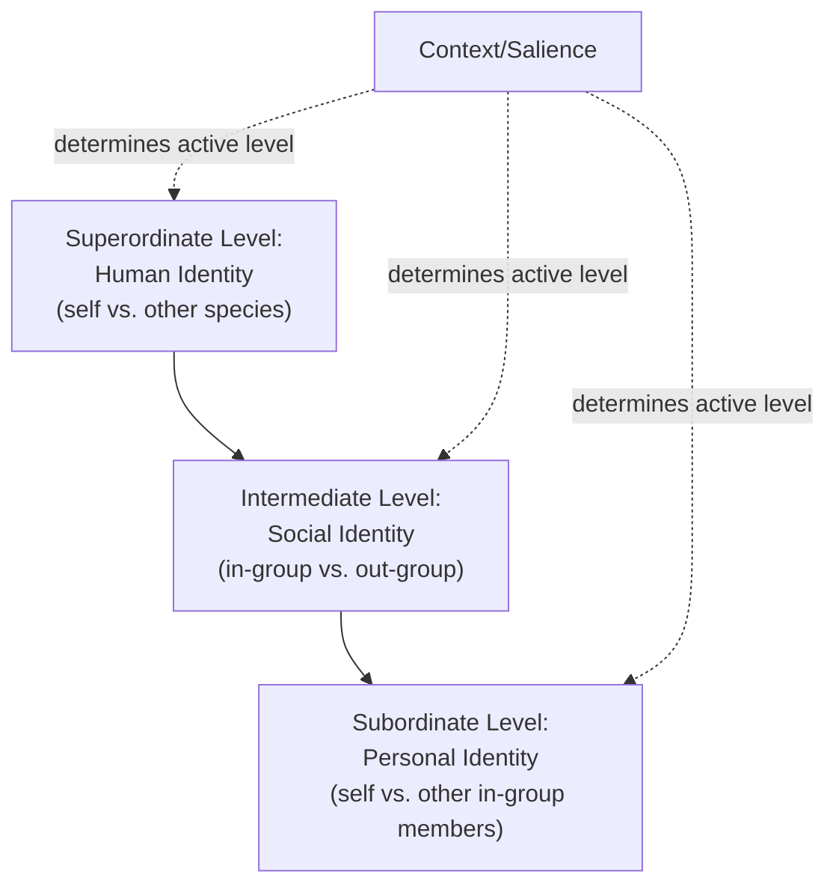

## Self-Categorization Theory

### Overview

Self-Categorization Theory (SCT), developed by John Turner and colleagues (Turner, Hogg, Oakes, Reicher, & Wetherell, 1987), is a cognitive theory of the group that explains how and when individuals come to perceive themselves and others as members of a social category rather than as unique individuals. It was developed as a formal extension of Social Identity Theory (SIT), specifying the underlying categorization process that SIT had proposed but not fully detailed.

### Core Premise

**Key Points**

- The self-concept is not a single, fixed structure but shifts fluidly depending on context, operating along a continuum of levels of abstraction.
- Self-categorization at any given moment determines whether a person acts, thinks, and feels as an individual or as a group member.
- The theory treats the group not as a fixed entity but as a *psychological process* — group behavior emerges when a shared social identity becomes the salient basis of self-perception.

### Levels of Self-Categorization

SCT proposes three hierarchical levels of self-categorization, organized by increasing inclusiveness:

**Key Points**

1. **Superordinate level (human identity)**: categorization of self as a human being, contrasted with other species. Broadest, most inclusive level.
2. **Intermediate level (social identity)**: categorization of self as a member of a particular social in-group, contrasted with relevant out-groups (e.g., nationality, gender, profession, sports team). This is the level most associated with intergroup behavior.
3. **Subordinate level (personal identity)**: categorization of self as a unique individual, contrasted with other in-group members based on personal traits, abilities, and interpersonal relationships.

**Key Points**

- Movement between levels is described as functional antagonism: as one level becomes psychologically salient and active, the others are relatively suppressed — a person cannot simultaneously maximize both personal and social identity salience in the same moment.

### Depersonalization

**Key Points**

- **Depersonalization** is the central mechanism of SCT: when a social identity becomes salient, individuals perceive themselves and others less in terms of unique, idiosyncratic characteristics and more as interchangeable exemplars of the relevant group prototype.
- Depersonalization is explicitly distinguished from "deindividuation" in classic crowd theory — it is not a loss of self or identity, but a *shift* in the level at which self is defined (from personal to social identity), which then produces normative, group-consistent behavior rather than purely impulsive or antisocial behavior.
- Depersonalization underlies phenomena such as group cohesion, conformity to group norms, stereotyping (applying the group prototype to self and others), and collective action.

### Determinants of Categorization Salience

SCT specifies that which self-category becomes salient in a given context depends on an interaction between the perceiver's readiness to use a category and the fit of that category to the situation.

**Key Points**

- **Accessibility**: how chronically ready or available a given category is for a perceiver, shaped by past experience, current goals, expectations, and values.
- **Fit**: the degree to which a category meaningfully accounts for similarities and differences in the immediate context. Fit has two components:
  - **Comparative fit**, governed by the **meta-contrast principle**: a category becomes psychologically salient to the extent that perceived differences *between* groups are greater than perceived differences *within* groups, in that context (formally, the ratio of inter-group to intra-group differences).
  - **Normative fit**: the degree to which the content of category differences matches the perceiver's normative expectations about what those group differences should look like (e.g., categorizing by political party fits better when the observed behavioral differences match stereotypical partisan content).

$$\text{Meta-contrast ratio} = \frac{\text{perceived inter-group differences}}{\text{perceived intra-group differences}}$$

**Example**

In a meeting with colleagues from one's own department and a rival department, if the discussion emphasizes departmental disagreements, "department" becomes the salient self-category (high comparative fit — between-department differences dominate). If, instead, the same room is reframed around an external threat to the whole organization, "organization member" becomes salient instead, and department-level distinctions temporarily recede.

### Prototypicality

**Key Points**

- Once a group identity is salient, group members are cognitively represented in terms of a **prototype**: a fuzzy set of attributes (beliefs, attitudes, behaviors) that simultaneously captures similarities within the group and differences from relevant out-groups (consistent with the meta-contrast principle).
- Prototypes are not average or typical members in a simple statistical sense — they are often *polarized* away from the out-group, exaggerating in-group–out-group distinctiveness (related to group polarization phenomena).
- Group members who are perceived as more prototypical typically have greater influence within the group and are more likely to emerge as leaders (this forms the theoretical basis of the **Social Identity Theory of Leadership**, developed later by Hogg).

### Relationship to Social Identity Theory

| Aspect | Social Identity Theory (SIT) | Self-Categorization Theory (SCT) |
| --- | --- | --- |
| Primary focus | Motivational: why people seek positive distinctiveness for their group | Cognitive: how and when categorization itself occurs |
| Scope | Intergroup relations, intergroup discrimination, status differences | General theory of group and individual behavior, including intragroup processes |
| Key mechanism | Social comparison, positive distinctiveness | Depersonalization, meta-contrast, prototypicality |
| Explains | In-group favoritism, minimal group effects | Group cohesion, conformity, polarization, leadership emergence, crowd behavior |

**Key Points**

- SIT and SCT are often referred to jointly as the "social identity approach," with SCT providing the cognitive infrastructure that operationalizes concepts SIT introduced at a more general level.

### Applications and Extensions

**Key Points**

- **Group polarization**: SCT explains polarization as a product of conformity to a polarized in-group prototype (referred to as "self-categorization" or "referent informational influence" account), rather than purely informational or normative influence as classically framed.
- **Crowd behavior**: reinterprets classic crowd psychology (e.g., Le Bon's "loss of self" account) by proposing that crowd behavior reflects depersonalization to a salient social identity, producing norm-consistent (not necessarily irrational) collective behavior.
- **Leadership**: highly prototypical group members are perceived as more trustworthy, influential, and legitimate as leaders — the basis of Hogg's Social Identity Theory of Leadership.
- **Stereotyping**: SCT frames stereotyping as a natural consequence of depersonalization — perceiving out-group (and in-group) members through the lens of category prototypes rather than individuating information.
- **Prejudice reduction**: informs recategorization-based interventions (e.g., the Common In-group Identity Model), which attempt to shift the salient level of self-categorization from a divisive intergroup level to a shared, inclusive superordinate level.

### Critiques and Limitations

**Key Points**

- Critics argue the theory's heavy emphasis on cognitive/perceptual mechanisms can underspecify emotional and motivational factors central to intergroup conflict (which SIT addresses more directly).
- The meta-contrast principle, while elegant, can be difficult to operationalize precisely in real-world (non-experimental) contexts where group boundaries and comparison contexts are ambiguous or overlapping. [Inference] This measurement difficulty is a commonly cited practical limitation in applying SCT outside controlled settings, though it does not undermine the theory's core logic.
- Some researchers note conceptual overlap and occasional definitional ambiguity between "depersonalization" in SCT and related constructs like deindividuation, requiring careful distinction in empirical work.

### Related Topics

- Social Identity Theory and the minimal group paradigm
- Meta-contrast principle and category salience
- Social Identity Theory of Leadership (Hogg)
- Group polarization (referent informational influence account)
- Deindividuation theory and crowd psychology (Le Bon, Zimbardo)
- Common In-group Identity Model
- Stereotyping as a byproduct of categorization
- Prototypicality and in-group influence dynamics