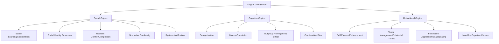

## Social, Cognitive, and Motivational Origins of Prejudice

### Overview

Prejudice arises from multiple, non-mutually-exclusive sources operating at different levels of analysis. Social psychology traditionally organizes these origins into three broad categories: **social** origins (arising from group relations, socialization, and intergroup dynamics), **cognitive** origins (arising from basic information-processing mechanisms), and **motivational** origins (arising from needs the prejudiced belief or attitude serves for the individual). Contemporary theory treats these as interacting, cumulative pathways rather than competing explanations.

### Social Origins of Prejudice

**Key Points**

- **Social learning/socialization**: prejudiced attitudes are transmitted through observation, modeling, and reinforcement from parents, peers, media, and institutions, consistent with social learning theory (Bandura). Children can acquire group attitudes before they have direct experience with out-group members.
- **Social identity processes**: per Social Identity Theory, mere categorization into groups produces in-group favoritism and can extend to out-group derogation as individuals seek positive distinctiveness for their in-group (see minimal group paradigm).
- **Realistic Conflict Theory** (Sherif): competition over real, tangible resources (jobs, land, status, political power) generates intergroup hostility; the classic **Robbers Cave experiment** demonstrated that competitive intergroup tasks rapidly produced hostility between arbitrarily formed boy-scout groups, and that hostility receded only when superordinate goals requiring cooperation were introduced.
- **Normative conformity**: prejudice can persist because it is a perceived social norm within one's reference group, and individuals conform to expressed group attitudes to gain social approval or avoid rejection, independent of their privately held beliefs.
- **Intergroup contact (or its absence)**: Allport's contact hypothesis holds that under specific conditions (equal status, common goals, intergroup cooperation, institutional support), contact between groups reduces prejudice; conversely, segregation and lack of contact sustain it.
- **Social dominance orientation (SDO)**: a general individual-difference and societal-level preference for group-based hierarchy, associated with support for ideologies and policies that maintain the relative dominance of high-status groups over low-status groups (Sidanius & Pratto).
- **System justification theory** (Jost & Banaji): people are motivated to view existing social, economic, and political arrangements as fair and legitimate, which can lead both advantaged *and* disadvantaged group members to endorse stereotypes that rationalize the status quo.

### Cognitive Origins of Prejudice

**Key Points**

- **Categorization**: the basic cognitive act of sorting people into groups is the foundational cognitive process underlying stereotyping; categorization automatically accentuates perceived similarities within groups and differences between groups (a byproduct of normal, adaptive information-processing that reduces cognitive load).
- **Illusory correlation** (Hamilton & Gifford, 1976): people overestimate the association between distinctive/infrequent group membership and distinctive/infrequent (often negative) behaviors, because both stand out and are jointly memorable, even when no true statistical association exists — a key mechanism for how negative stereotypes about minority groups form and persist.
- **Outgroup homogeneity effect**: people perceive greater variability among in-group members ("we are diverse individuals") than among out-group members ("they are all alike"), which facilitates and sustains overgeneralized stereotyping of out-groups.
- **Confirmation bias / selective attention**: once a stereotype is held, people selectively attend to, interpret, and recall information that confirms it while discounting disconfirming evidence.
- **Subtyping**: when confronted with a stereotype-disconfirming individual, people often mentally place that person in a special subcategory ("exception to the rule") rather than updating the overall group stereotype, which protects the stereotype from revision.
- **Automatic/implicit associations**: stereotypes and prejudicial affect can be activated automatically and outside conscious awareness upon mere exposure to a category cue, as demonstrated by implicit measures such as the Implicit Association Test (IAT) and evaluative priming paradigms.
- [Inference] Because these cognitive mechanisms are argued to operate as by-products of otherwise adaptive, general-purpose categorization processes, most cognitive accounts treat some baseline level of stereotyping tendency as a near-universal feature of normal cognition rather than a pathology confined to specific individuals — though the strength, content, and behavioral expression of any given stereotype remain heavily shaped by culture and learning.

### Motivational Origins of Prejudice

**Key Points**

- **Self-esteem enhancement**: consistent with Social Identity Theory's self-esteem hypothesis, favorable comparisons with out-groups (including derogation) can serve to boost personal and collective self-esteem, particularly following ego threats.
- **Terror Management Theory** (Greenberg, Pyszczynski, & Solomon): reminders of one's own mortality ("mortality salience") increase adherence to one's cultural worldview and can intensify prejudice toward those who challenge or differ from that worldview, as out-groups can be perceived as symbolic threats to a person's death-anxiety-buffering belief system.
- **Frustration-aggression and scapegoating**: displaced aggression theory proposes that frustration arising from blocked goals (economic hardship, social strain) can be redirected toward safer, often lower-status or minority targets rather than the true source of frustration — a classical explanation linked to historical patterns of scapegoating during economic downturns.
- **Need for cognitive closure**: individuals with a higher dispositional or situationally induced need to reach firm, unambiguous conclusions quickly are more prone to rely on stereotypes, which offer a fast, confident basis for judgment under uncertainty (Kruglanski).
- **Intergroup threat theory** (Stephan & Stephan): prejudice is heightened by perceived **realistic threats** (to physical safety, resources, political/economic power) and **symbolic threats** (to values, worldview, identity, or way of life) posed by an out-group.
- **Right-wing authoritarianism (RWA)**: an individual-difference construct (Altemeyer) characterized by submission to authority, conventionalism, and aggression toward out-groups sanctioned by authorities, associated with heightened prejudice toward groups perceived as threatening social order.
- **Justification-suppression model** (Crandall & Eshleman): people hold genuine prejudices but are also motivated to appear non-prejudiced due to social norms; prejudice is expressed only when a person can identify or construct a socially acceptable justification that suppresses the reputational cost of expressing it.

### Integrating the Three Origins

**Key Points**

- The three categories are not independent silos: e.g., realistic conflict (social) can trigger threat perception (motivational), which increases reliance on stereotyping as a fast heuristic (cognitive).
- Modern integrative frameworks (e.g., the Stereotype Content Model, intergroup emotions theory) explicitly combine social-structural variables (perceived group status and competition) with cognitive representations (warmth/competence judgments) and motivational/affective outputs (specific emotions like envy, contempt, pity, admiration) to predict both prejudice and downstream discriminatory behavior.
- Individual differences (e.g., SDO, RWA, need for closure) function as moderators that determine how strongly a given individual responds to social and situational triggers of prejudice.

### Comparative Summary

| Origin Type | Core Mechanism | Representative Theory/Concept | Key Researcher(s) |
| --- | --- | --- | --- |
| Social | Group competition, socialization, norms | Realistic Conflict Theory, Social Identity Theory | Sherif; Tajfel & Turner |
| Cognitive | Categorization, biased information processing | Illusory correlation, outgroup homogeneity | Hamilton & Gifford |
| Motivational | Psychological needs/threat management | Terror Management Theory, Intergroup Threat Theory | Greenberg et al.; Stephan & Stephan |

### Related Topics

- Social Identity Theory and Self-Categorization Theory
- Realistic Conflict Theory and the Robbers Cave experiment
- Illusory correlation and outgroup homogeneity effect
- Terror Management Theory and mortality salience
- Intergroup Threat Theory (realistic vs. symbolic threat)
- Right-wing authoritarianism and social dominance orientation
- Justification-suppression model of prejudice expression
- Stereotype Content Model (warmth × competence)
- Contact hypothesis and prejudice-reduction interventions