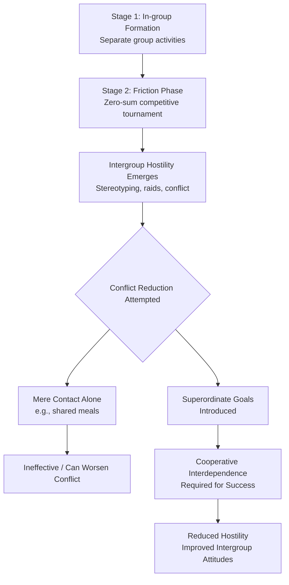

## Realistic Conflict Theory

### Overview

Realistic Conflict Theory (RCT), most closely associated with Muzafer Sherif, proposes that intergroup hostility, prejudice, and discrimination arise from actual (or perceived) competition between groups over scarce, tangible resources — such as land, jobs, political power, or economic opportunity. Under RCT, conflict is a rational response to genuine incompatibility of group interests, rather than a byproduct of categorization alone.

### Core Premise

**Key Points**

- Intergroup attitudes and behaviors are functions of the nature of the groups' goal relations: when two groups' goals are **incompatible** (one group's gain is the other's loss — a zero-sum or negative interdependence structure), intergroup competition, hostility, and prejudice increase.
- When two groups' goals are **compatible or mutually dependent** (requiring cooperation for mutual benefit — a positive interdependence structure), intergroup attitudes improve and cooperation increases.
- Unlike cognitive accounts of prejudice (e.g., Social Identity Theory), RCT holds that competition over real, functionally significant resources — not mere categorization — is the necessary precondition for intergroup hostility.

### The Robbers Cave Experiment (Sherif et al., 1954/1961)

**Key Points**

- A field experiment conducted at a summer camp (Robbers Cave State Park, Oklahoma) with 22 psychologically well-adjusted, demographically similar 11–12-year-old boys, unaware they were part of a study.
- Conducted in three sequential stages:
  1. **In-group formation**: boys were divided into two groups ("Rattlers" and "Eagles") and kept separate, engaging in cooperative activities within each group to build group identity and cohesion before the groups were aware of each other's existence.
  2. **Friction phase**: the two groups were brought into contact through a series of competitive, zero-sum tournament activities (e.g., tug-of-war, baseball, treasure hunts) with prizes awarded only to the winning team. This phase rapidly produced hostility: name-calling, negative stereotyping of the out-group, cabin raids, flag burning, and refusal to interact socially with out-group members.
  3. **Integration/conflict-reduction phase**: researchers tested various methods for reducing the hostility that had developed.
- [Unverified: exact figures such as the number of boys, camp duration, and specific incidents vary slightly in detail across secondary/textbook summaries; core structure and findings as described are well-established in the primary literature.]

### Key Finding: Mere Contact Is Insufficient

**Key Points**

- Sherif's team found that simply bringing the hostile groups into non-competitive contact (e.g., shared meals, movie viewings) did **not** reduce hostility and in some cases provided additional opportunities for conflict (e.g., food fights).
- This finding is historically significant because it demonstrated that contact alone, without a structural change in the groups' interdependence, is not sufficient to reduce prejudice — directly informing later refinements to Allport's contact hypothesis, which specifies that contact must occur under conditions of cooperation, equal status, common goals, and institutional support to be effective.

### Superordinate Goals as the Resolution Mechanism

**Key Points**

- **Superordinate goals** are goals that both groups desire but that neither group can achieve alone — they require intergroup cooperation and cannot be attained through intragroup effort or competition.
- In the Robbers Cave study, researchers staged a series of engineered crises requiring joint effort from both groups (e.g., repairing a "broken" water supply, pooling money to rent a movie, jointly pulling a stalled truck).
- Successive cooperative interactions on superordinate goals progressively reduced hostility, decreased negative out-group stereotyping, and led to the formation of cross-group friendships — providing strong support for the theory's prediction that changing the structure of interdependence (from competitive to cooperative) reverses previously induced intergroup conflict.
- This mechanism underlies the later **Common In-group Identity Model** (Gaertner & Dovidio), which similarly proposes that recategorizing two groups as members of a single, shared superordinate group reduces bias.

### Realistic Conflict Theory vs. Social Identity Theory

| Dimension | Realistic Conflict Theory | Social Identity Theory |
| --- | --- | --- |
| Necessary condition for conflict | Real/perceived competition over tangible resources | Mere categorization into distinct groups |
| Classic study | Robbers Cave experiment | Minimal group paradigm |
| Nature of bias explained | Overt intergroup hostility and conflict | In-group favoritism (which may or may not include out-group derogation) |
| Resolution strategy implied | Introduce superordinate/cooperative goals | Recategorization, changing comparison dimension, status change |

**Key Points**

- The two theories are generally treated as complementary: RCT explains how competition *initiates and intensifies* conflict, while SIT/SCT explain the more basic cognitive/motivational processes (categorization, identification, comparison) that operate even without real competition and that amplify RCT-driven hostility once it begins.

### Extensions: Perceived vs. Actual Competition

**Key Points**

- Later research (e.g., work extending RCT into **Integrated Threat Theory**/Intergroup Threat Theory by Stephan & Stephan) emphasized that *perceived* competition and threat — not only objectively real competition — is sufficient to produce prejudice; actual resource scarcity is not strictly required if group members subjectively believe competition exists.
- This distinction helps RCT account for prejudice toward groups with whom there is no genuine resource competition, as long as competitive threat is perceived (e.g., media or political rhetoric framing an out-group as an economic or cultural threat).
- **Group Position Theory** (Blumer) similarly frames prejudice as arising from a dominant group's perception that a subordinate group threatens its proprietary claim to resources, status, and privileges — extending RCT's logic to explain sustained, structurally embedded prejudice.

### Applications

**Key Points**

- Explains real-world patterns such as increased prejudice and discriminatory attitudes toward immigrant or minority groups during periods of economic downturn or job scarcity (linked also to scapegoating/frustration-aggression accounts).
- Provides the theoretical basis for cooperative learning interventions in education (e.g., the **jigsaw classroom**, developed by Elliot Aronson), which structure group tasks so that success requires cooperative interdependence among diverse students, mirroring the superordinate goal mechanism.
- Informs organizational and diplomatic conflict-resolution strategies that deliberately construct shared goals between rival departments, teams, or nations to rebuild cooperative relations.

### Critiques and Limitations

**Key Points**

- RCT does not fully explain prejudice that occurs in the complete absence of any real or perceived resource competition (as demonstrated by the minimal group paradigm), suggesting it is not a complete, standalone account of all prejudice.
- Critics note the theory better explains conflict *escalation and reduction* than the initial *origin* of group distinctions and identities, which SIT/SCT address more directly.
- [Inference] Because Robbers Cave involved a small, homogeneous, all-male, single-age sample in a specific engineered setting, generalizability to more diverse, real-world intergroup contexts (differing in size, history, and power asymmetries) is typically treated with caution in contemporary discussions, even though the theory's broad logic has received considerable subsequent support.

### Related Topics

- Robbers Cave experiment methodology and stages
- Superordinate goals and the jigsaw classroom technique
- Allport's contact hypothesis and conditions for effective contact
- Social Identity Theory and the minimal group paradigm
- Intergroup Threat Theory (realistic and symbolic threat)
- Group Position Theory (Blumer)
- Common In-group Identity Model
- Scapegoating and frustration-aggression theory