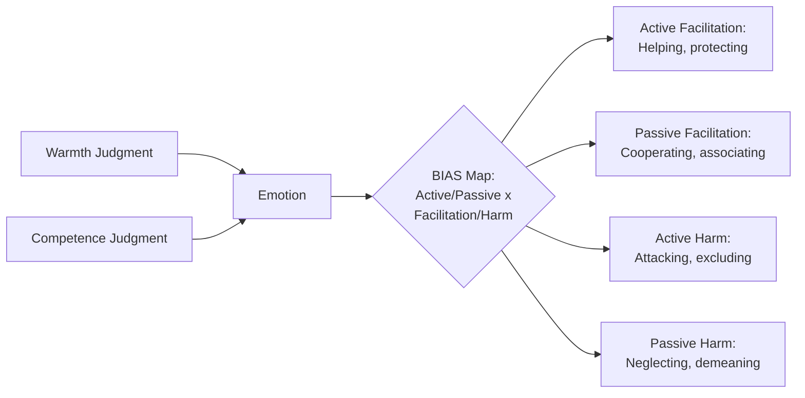

## Stereotype Content Model

### Overview

The Stereotype Content Model (SCM), developed by Susan Fiske, Amy Cuddy, Peter Glick, and Jun Xu (2002), proposes that stereotypes of social groups are organized along two fundamental dimensions — **warmth** and **competence** — and that the combination of perceived warmth and competence predicts distinct, differentiated emotional reactions (prejudices) toward each group, which in turn predict distinct patterns of behavior toward that group.

### Core Premise

**Key Points**

- Prior to the SCM, prejudice research often treated out-group attitudes as uniformly negative along a single positive-to-negative dimension. The SCM instead argues that stereotype content is systematically differentiated and frequently **mixed** (ambivalent) rather than uniformly positive or negative.
- The two dimensions map onto fundamental questions people ask when encountering any social target:
  - **Warmth**: "What are this group's *intentions* toward me/us?" (perceived friendliness, trustworthiness, sincerity, good-naturedness) — inferred first and given priority because it signals whether the other is a threat or an ally.
  - **Competence**: "Is this group *capable* of enacting those intentions?" (perceived capability, skill, intelligence, efficacy).
- These two dimensions are argued to be near-universal building blocks of social perception, replicating across numerous cultures and samples.

### The Warmth × Competence Matrix

Crossing the two dimensions produces four quadrants, each associated with a distinct emotional profile and a stereotypically illustrative group (based on original and cross-cultural SCM survey data):

| Quadrant | Warmth | Competence | Emotion | Example Groups (as typically identified in SCM survey research) |
| --- | --- | --- | --- | --- |
| Admiration | High | High | Pride, admiration | In-groups; close allies; societal reference groups |
| Contempt | Low | Low | Contempt, disgust, resentment | Groups stereotyped as both unmotivated and unable (e.g., stereotypes of those on welfare, homeless persons, in some samples) |
| Paternalistic (Pity) | High | Low | Pity, sympathy | Groups stereotyped as warm but incapable (e.g., stereotypes of elderly people, individuals with disabilities, in some samples) |
| Envious (Envy) | Low | High | Envy, jealousy | Groups stereotyped as capable but cold (e.g., stereotypes of wealthy people, some outgroup professional/ethnic minorities associated with economic success, in some samples) |

**Key Points**

- [Unverified: specific example groups mapped to each quadrant vary across cultures, time periods, and samples; the quadrant structure itself is well-replicated, but the exact groups populating each quadrant are empirical findings from particular studies rather than fixed, universal assignments.]
- Only the high-warmth/high-competence quadrant produces uniformly positive affect; the other three quadrants represent forms of **ambivalent** or mixed prejudice — a key departure from single-dimension models of prejudice.

<svg xmlns="http://www.w3.org/2000/svg" viewBox="0 0 520 420">
<text x="260" y="30" font-size="16" font-weight="bold" text-anchor="middle" fill="#1a1a1a">Stereotype Content Model Matrix (svg_diagram)</text>
<line x1="80" y1="360" x2="480" y2="360" stroke="#333" stroke-width="2" />
<line x1="80" y1="360" x2="80" y2="60" stroke="#333" stroke-width="2" />
<text x="280" y="395" font-size="13" text-anchor="middle" fill="#333">Competence →</text>
<text x="40" y="210" font-size="13" text-anchor="middle" fill="#333" transform="rotate(-90 40 210)">Warmth →</text>
<line x1="280" y1="60" x2="280" y2="360" stroke="#ccc" stroke-dasharray="4" />
<line x1="80" y1="210" x2="480" y2="210" stroke="#ccc" stroke-dasharray="4" />
<rect x="90" y="220" width="180" height="130" fill="#fde2e2" opacity="0.7" />
<text x="180" y="280" font-size="14" text-anchor="middle" fill="#8a1f1f">Contempt</text>
<text x="180" y="298" font-size="11" text-anchor="middle" fill="#8a1f1f">Low warmth, low competence</text>
<text x="180" y="314" font-size="10" text-anchor="middle" fill="#8a1f1f">e.g., stereotypes of welfare recipients*</text>
<rect x="290" y="220" width="180" height="130" fill="#fff3cd" opacity="0.8" />
<text x="380" y="280" font-size="14" text-anchor="middle" fill="#8a6d1f">Envy</text>
<text x="380" y="298" font-size="11" text-anchor="middle" fill="#8a6d1f">Low warmth, high competence</text>
<text x="380" y="314" font-size="10" text-anchor="middle" fill="#8a6d1f">e.g., stereotypes of wealthy groups*</text>
<rect x="90" y="70" width="180" height="130" fill="#d4edda" opacity="0.8" />
<text x="180" y="130" font-size="14" text-anchor="middle" fill="#1f6b2f">Pity</text>
<text x="180" y="148" font-size="11" text-anchor="middle" fill="#1f6b2f">High warmth, low competence</text>
<text x="180" y="164" font-size="10" text-anchor="middle" fill="#1f6b2f">e.g., stereotypes of elderly persons*</text>
<rect x="290" y="70" width="180" height="130" fill="#d1ecf1" opacity="0.8" />
<text x="380" y="130" font-size="14" text-anchor="middle" fill="#0f5c66">Admiration</text>
<text x="380" y="148" font-size="11" text-anchor="middle" fill="#0f5c66">High warmth, high competence</text>
<text x="380" y="164" font-size="10" text-anchor="middle" fill="#0f5c66">e.g., in-groups, close allies*</text>
<text x="260" y="410" font-size="9" text-anchor="middle" fill="#666">*Illustrative groups drawn from published SCM survey samples; vary across studies/cultures</text>
</svg>

### Predictors of Warmth and Competence Judgments

**Key Points**

- **Perceived competition** predicts (low) warmth: groups seen as competing with the perceiver's in-group for resources or status are stereotyped as colder/less trustworthy (a direct theoretical link back to Realistic Conflict Theory).
- **Perceived status** predicts (high) competence: groups with high social status (economic success, prestige, education) are stereotyped as more competent, largely independent of actual individual ability, reflecting status-based inference rather than accurate assessment.
- This produces the theory's structural claim: societal group status hierarchies and competitive relations are directly translated into the warmth/competence content of stereotypes, rather than the two dimensions being arbitrary.

### The BIAS Map: From Stereotypes to Behavior

The **Behaviors from Intergroup Affect and Stereotypes (BIAS) Map** (Cuddy, Fiske, & Glick, 2007) extends the SCM by specifying the behavioral consequences that follow from each warmth/competence-derived emotion.

**Key Points**

- Behaviors are organized along two dimensions: **active vs. passive**, and **facilitation (helping) vs. harm**.
- Predicted behavioral tendencies by quadrant:
  - **Admiration** (high warmth/high competence) → active facilitation (helping, association) and passive facilitation (cooperation).
  - **Contempt** (low warmth/low competence) → active harm (attack, exclusion) and passive harm (neglect, demeaning treatment).
  - **Pity** (high warmth/low competence) → passive facilitation (helping when convenient/low-cost) but also passive harm (neglect when helping is costly).
  - **Envy** (low warmth/high competence) → passive facilitation (grudging association, e.g., cooperation for instrumental reasons) but also active harm (attack, sabotage, especially under threat or resource scarcity).

### Empirical Support and Cross-Cultural Replication

**Key Points**

- The two-dimensional warmth/competence structure has been replicated across dozens of countries and cultural contexts in cross-national survey studies, supporting the model's claim to broad, though not necessarily fully universal, applicability.
- [Inference] Because the specific groups occupying each quadrant differ substantially across cultures and historical periods (while the underlying two-dimensional structure remains stable), most researchers interpret the SCM as identifying a universal *cognitive architecture* for social perception rather than universal content of any specific stereotype.
- The model has been extended beyond social groups to person perception more broadly (e.g., first impressions of individuals, brand perception in consumer psychology, robot/AI perception in human-robot interaction research).

### Distinguishing the SCM from Single-Dimension Prejudice Models

| Feature | Traditional (unidimensional) prejudice models | Stereotype Content Model |
| --- | --- | --- |
| Structure of prejudice | Single good-bad evaluative dimension | Two orthogonal dimensions (warmth, competence) |
| Predicted affect | Uniform positive or negative attitude | Differentiated emotions (pride, contempt, pity, envy) |
| Ambivalence | Not well accounted for | Central prediction (mixed stereotypes are common, not exceptional) |
| Behavioral prediction | Approach vs. avoidance (simple) | Four distinct active/passive, facilitation/harm patterns (via BIAS map) |

### Applications

**Key Points**

- Explains why prejudice toward different groups can manifest in qualitatively different behaviors (e.g., paternalistic "benevolent" treatment of some groups vs. hostile exclusion of others) rather than uniform negativity — informing **ambivalent sexism theory** (Glick & Fiske), which similarly identifies hostile and benevolent components of sexism mapping onto the SCM's contempt and pity/admiration quadrants respectively.
- Used in organizational contexts to analyze perceptions of employee subgroups (e.g., older workers often stereotyped in the high-warmth/low-competence "pity" quadrant, informing age-based workplace bias research).
- Applied in political psychology to explain differentiated public attitudes toward various immigrant, ethnic, and socioeconomic subgroups rather than treating "prejudice" as a single undifferentiated construct.

### Critiques and Limitations

**Key Points**

- Critics note the model's reliance on aggregate societal stereotypes may not fully capture individual-level variation in warmth/competence judgments, which can differ based on personal contact, individuating information, or context.
- The specific behavioral predictions of the BIAS map, while empirically supported in multiple studies, involve probabilistic tendencies rather than deterministic outcomes; actual behavior in a given interaction can be shaped by numerous situational moderators beyond quadrant placement. Treat behavioral claims as tendencies observed across studies, not guarantees for any individual interaction.
- Some scholars argue the two-dimensional structure, while broadly replicated, may not exhaustively capture all relevant content of intergroup stereotypes (e.g., morality has been proposed by some researchers as a potentially distinct or overlapping dimension from warmth). [Unverified: the degree to which morality constitutes a separate third dimension versus a facet of warmth remains an active area of scholarly discussion.]

### Related Topics

- BIAS Map (Behaviors from Intergroup Affect and Stereotypes)
- Ambivalent sexism theory (hostile and benevolent sexism)
- Realistic Conflict Theory (competition as a predictor of warmth)
- Social Identity Theory (status as a predictor of competence)
- Ageism and stereotypes of older adults
- Cross-cultural replication of social perception dimensions
- Person perception and first-impression formation
- Intergroup emotions theory