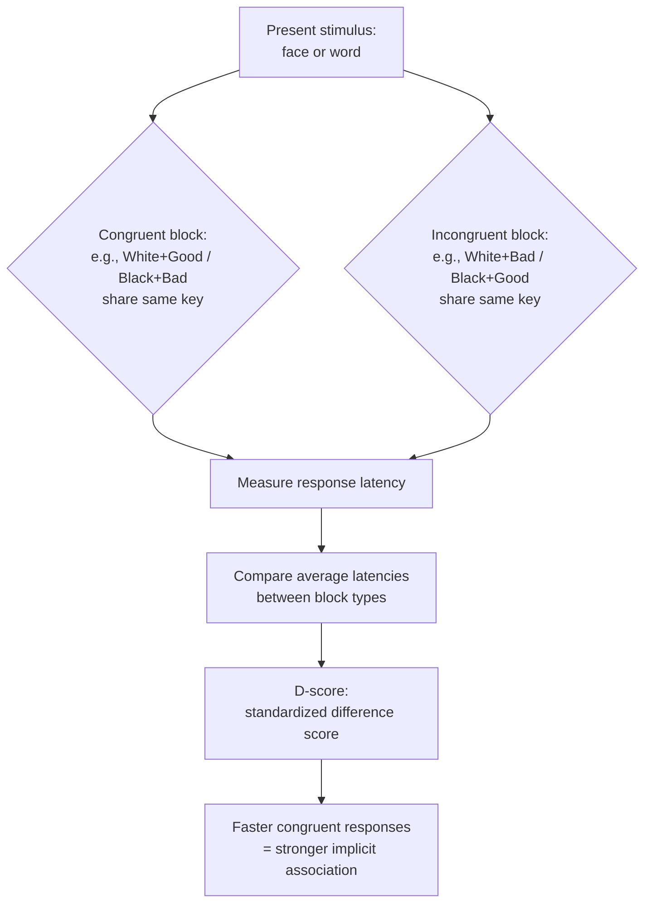

## Implicit Bias and Its Measurement

### Overview

Implicit bias refers to attitudes, stereotypes, or evaluative associations toward social groups that operate automatically, unintentionally, and often outside a person's conscious awareness or control, and that can influence judgments and behavior even when they diverge from a person's consciously endorsed (explicit) beliefs. The construct emerges from dual-process models of cognition, which distinguish automatic/associative processing from controlled/deliberative processing.

### Theoretical Foundations

**Key Points**

- **Dual-process/dual-attitude models** (e.g., Wilson, Lindsey, & Schooler's dual attitudes model; Fazio's MODE model) propose that a person can simultaneously hold two distinct evaluations of the same attitude object: an automatically activated implicit attitude and a consciously endorsed explicit attitude, which may or may not converge.
- Implicit associations are theorized to develop through repeated environmental exposure and cultural learning (e.g., media portrayals, socialization), and can form and persist independent of a person's deliberate, consciously endorsed values.
- Implicit bias is distinguished from deliberate/conscious ("old-fashioned") prejudice in that it does not require, and is often explicitly disavowed by, the person exhibiting it — this is central to modern theories such as **aversive racism** (Gaertner & Dovidio), which propose that individuals with genuinely egalitarian conscious values can still harbor automatic negative associations that surface primarily in ambiguous situations.

### Key Distinction: Implicit vs. Explicit Attitudes

| Feature | Explicit Attitudes | Implicit Attitudes |
| --- | --- | --- |
| Awareness | Consciously accessible, reportable | Often outside conscious awareness |
| Control | Deliberately controllable | Largely automatic, difficult to suppress intentionally |
| Measurement | Self-report scales, surveys | Indirect/reaction-time-based tasks |
| Correlation with behavior | Predicts deliberate, controllable behaviors (e.g., explicit policy positions) | Predicts spontaneous, less controllable behaviors (e.g., nonverbal cues, split-second decisions) |
| Malleability | Can shift with conscious persuasion/reasoning | Often more resistant to short-term deliberate change, though contextually sensitive |

**Key Points**

- Meta-analytic work indicates implicit and explicit measures of the same construct are typically only weakly-to-moderately correlated, supporting the view that they capture at least partially distinct underlying processes rather than being redundant measures of a single attitude.

### The Implicit Association Test (IAT)

The IAT (Greenwald, McGhee, & Schwartz, 1998) is the most widely used and studied implicit measure.

**Key Points**

- **Logic**: measures the relative speed (reaction time) with which a person can categorize stimuli when two concepts (e.g., "Black" / "White" faces, and "good" / "bad" words) share the same response key versus when they are paired with opposite keys.
- **Underlying assumption**: if two concepts are more strongly associated in memory, pairing them on the same response key should produce faster and more accurate responses than pairing them on opposite keys.
- **Scoring**: produces a "D-score," a standardized measure of the difference in average response latency between the two pairing conditions (e.g., "White + good / Black + bad" block vs. "White + bad / Black + good" block).
- Widely deployed via **Project Implicit**, an online platform (Harvard, University of Virginia, University of Washington) offering IATs on race, gender, age, sexuality, and other social categories to the public for research and educational purposes.

**Example**

In a race-attitude IAT, if a participant responds faster when "White faces" and "pleasant words" share a key (and "Black faces" and "unpleasant words" share the other key) than in the reverse pairing, this relative speed difference is interpreted as an automatic association favoring White faces — regardless of what the same participant reports on an explicit attitude questionnaire.

### Other Implicit Measurement Approaches

**Key Points**

- **Evaluative priming task** (Fazio et al.): presents a group-related prime (e.g., a face) briefly before a target word (positive/negative), and measures how quickly participants correctly categorize the target's valence; faster categorization of congruent valence targets indicates automatic evaluative association with the prime.
- **Affect Misattribution Procedure (AMP)** (Payne et al.): participants briefly view a prime (e.g., a group-related image) followed by an ambiguous stimulus (e.g., a Chinese pictograph unfamiliar to most participants) and rate the ambiguous stimulus's pleasantness; systematic misattribution of the prime's affective tone onto ratings of the neutral stimulus indicates implicit bias.
- **Go/No-Go Association Task (GNAT)**: a variant requiring participants to respond ("go") to items from only one target category paired with one attribute (and withhold response, "no-go," to others), used as an alternative to the two-category structure of the standard IAT.
- **Physiological/neural measures**: facial electromyography (EMG), skin conductance response, and neuroimaging (e.g., amygdala activation to out-group faces) have also been used as indirect indices of automatic evaluative responses, though these are less standardized as bias-measurement tools than the behavioral/reaction-time paradigms above.

### Psychometric Properties and Predictive Validity

**Key Points**

- **Internal consistency**: IAT scores generally show acceptable internal reliability within a single testing session.
- **Test-retest reliability**: IAT test-retest reliability is comparatively modest, and lower than typically expected of well-established individual-difference measures, meaning an individual's score can show meaningful fluctuation across administrations.
- **Predictive validity**: meta-analyses (e.g., Greenwald et al., 2009; and later re-analyses/critiques, e.g., Oswald et al., 2013; Kurdi et al., 2019 meta-analysis) have found implicit measures show statistically significant but generally small-to-moderate correlations with discriminatory behavior, and these correlations are a subject of ongoing scientific debate regarding effect size and real-world behavioral relevance.
- [Unverified: the precise magnitude of the IAT's predictive validity for individual-level discriminatory behavior remains actively contested in the psychometric literature; researchers broadly agree implicit measures capture something distinct from explicit self-report, but disagree on how strongly and reliably IAT scores predict specific discriminatory acts at the individual level.]
- Because of test-retest limitations, most researchers and testing organizations caution against using IAT scores to diagnose or label a specific individual's bias level (e.g., for employment or legal decisions), recommending their use primarily as *aggregate, group-level research tools* rather than individual diagnostic instruments.

### Malleability and Intervention Research

**Key Points**

- Some studies show implicit associations can shift temporarily in response to specific interventions: exposure to counter-stereotypical exemplars, perspective-taking exercises, intergroup contact, and specific training/practice tasks have each shown short-term reductions in IAT scores in various studies.
- Meta-analytic evidence on the durability of these changes and their downstream effects on actual behavior is mixed; many documented reductions in implicit measures are short-lived, and effects on subsequent explicit attitudes or behavior are less consistently demonstrated. [Inference] Given this pattern, most contemporary reviews treat single-session implicit bias trainings as having, at best, modest and not clearly durable effects on behavior, rather than being an established, reliable behavior-change tool — though this remains an active area of applied research rather than a fully settled question.

### Applications and Debates

**Key Points**

- Widely applied in domains such as employment/hiring research, healthcare disparities research (e.g., studies of implicit bias among medical providers), education, and criminal justice/policing research.
- Organizational "implicit bias trainings" have proliferated in workplaces and institutions; empirical evaluations of their effectiveness in producing durable behavior change (as distinct from short-term shifts in test scores) are mixed and remain an area of active scientific and public debate.
- Critics of implicit bias research have raised concerns regarding measurement reliability (test-retest), the interpretation of what the IAT actually captures (automatic association vs. cultural knowledge/familiarity vs. genuine personal endorsement), and whether observed statistical associations with discrimination are large enough to justify individual-level or high-stakes institutional applications.
- Proponents counter that, notwithstanding measurement debates, the broader body of dual-process research and behavioral audit studies (e.g., resume correspondence studies) converge in demonstrating that discriminatory outcomes can and do occur without conscious, deliberate prejudicial intent — a finding with independent support beyond IAT data specifically.

### Related Topics

- Dual-process theories of attitudes and cognition
- Aversive racism and modern/symbolic prejudice
- Affect Misattribution Procedure and evaluative priming
- Project Implicit and public IAT research infrastructure
- Predictive validity debates in implicit social cognition research
- Correspondence/audit studies of real-world discrimination
- Prejudice-reduction interventions (contact, perspective-taking, recategorization)
- Distinguishing prejudice, stereotypes, and discrimination