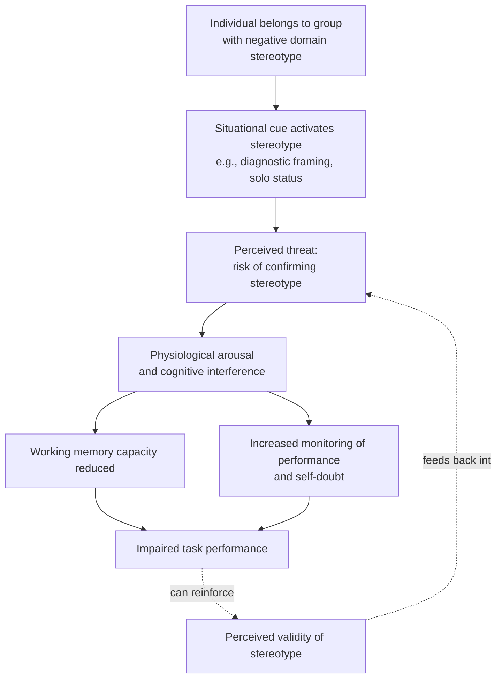

## Stereotype Threat

### Overview

Stereotype threat refers to the situational predicament in which individuals feel at risk of confirming, or being judged/treated in terms of, a negative stereotype held about a group to which they belong. First identified and named by Claude Steele and Joshua Aronson (1995), stereotype threat has been shown to impair performance on tasks in the very domain the stereotype targets, independent of a person's actual ability.

### Core Premise

**Key Points**

- Stereotype threat is a **situational** phenomenon — it arises from features of the immediate context (task framing, environment, cues signaling group-relevant evaluation) rather than being a fixed trait of the individual.
- Anyone belonging to a group associated with a negative stereotype in a given domain is potentially susceptible, regardless of whether they personally endorse the stereotype.
- The threat is conceptualized as a form of situational identity threat: concern that one's performance will be interpreted through, and will reinforce, a stereotype about one's group, which can occur even without any conscious belief that the stereotype is true of oneself.

### Foundational Study

**Key Points**

- Steele and Aronson (1995) had Black and White college students take a difficult verbal test (GRE items) under two framing conditions: one describing the test as diagnostic of intellectual ability (activating the negative stereotype about Black Americans and intellectual ability), and one describing it as a non-diagnostic laboratory problem-solving exercise.
- Black participants performed significantly worse than White participants when the test was framed as diagnostic of ability, but this gap was substantially reduced when the same test was framed as non-diagnostic — despite both groups taking an identical test.
- This dissociation (same test, same ability, different framing, different performance) provided strong evidence that situational stereotype activation, not underlying ability difference, produced the performance gap.

### Proposed Mechanisms

Research has identified several converging mechanisms by which stereotype threat impairs performance:

**Key Points**

- **Working memory disruption**: physiological and cognitive arousal generated by the threat consumes limited working memory resources that would otherwise be devoted to the task, particularly impairing performance on complex or demanding cognitive tasks.
- **Increased physiological stress response**: studies have documented elevated cardiovascular reactivity (e.g., blood pressure) and cortisol responses under stereotype threat conditions, consistent with a generalized stress response.
- **Vigilance and self-monitoring**: threatened individuals may engage in heightened monitoring of their own performance and of others' potential judgments, diverting attention away from the task itself.
- **Effort withdrawal / disengagement**: as a longer-term coping response, chronic exposure to stereotype threat in a domain can lead individuals to psychologically disengage from or devalue that domain altogether ("disidentification") as a means of protecting self-esteem.
- **Negative thought suppression**: attempts to suppress threat-related intrusive thoughts and anxieties themselves consume cognitive resources, paradoxically contributing further to impaired performance.

### Domains and Populations Studied

**Key Points**

- **Race and academic/intellectual testing**: the original and most widely cited domain (Black students and standardized intellectual/verbal tests).
- **Gender and mathematics**: numerous studies have examined women's math performance under stereotype threat related to the stereotype that women are less mathematically capable than men.
- **Age and memory**: studies have examined older adults' memory performance under threat related to age-based stereotypes about cognitive decline.
- **Socioeconomic status and academic performance**: research has extended the paradigm to stereotypes linking lower socioeconomic status to lower academic achievement.
- **Stereotype threat is not limited to historically stigmatized groups**: research has also demonstrated threat effects for groups not typically considered globally disadvantaged when a specific negative stereotype is domain-relevant (e.g., white male athletes' natural athletic ability being compared unfavorably to Black athletes in certain framings, illustrating the situational and domain-specific nature of the effect).

### Moderating Factors

**Key Points**

- **Domain identification**: individuals who are more highly identified with (i.e., care more about performing well in) the stereotyped domain tend to show larger threat effects, since more is at stake for their self-concept.
- **Stereotype endorsement is not required**: threat effects have been documented even among individuals who explicitly reject the stereotype as false, since the mechanism is about situational concern over being *judged* by the stereotype, not personal belief in it.
- **Solo status**: being the only member of one's group present in a testing or performance situation (e.g., the only woman in a room taking a math test) has been shown in some studies to increase the salience of group identity and intensify threat.
- **Task difficulty**: threat effects are typically most pronounced on difficult, cognitively demanding tasks that already tax working memory resources; effects are less consistently observed on very easy or overlearned tasks.

### Interventions and Mitigation Strategies

**Key Points**

- **Reframing the task** as non-diagnostic of the stereotyped ability (as in the original Steele & Aronson design) reduces threat by removing the evaluative link between performance and the stereotype.
- **Self-affirmation interventions** (Cohen et al.): having individuals briefly write about personally important values unrelated to the threatened domain, prior to the task, has been shown in several studies to buffer against stereotype threat by shoring up overall self-integrity.
- **Emphasizing incremental (growth) theories of ability**: teaching or framing ability as malleable and improvable (rather than fixed) has been associated with reduced susceptibility to threat in several studies.
- **Role models and counter-stereotypical exemplars**: exposure to successful in-group members in the threatened domain has been shown to reduce threat effects in some studies.
- **Reducing solo status**: increasing the proportion of in-group members present, or otherwise reducing the salience of numerical minority status, has been associated with reduced threat in some experimental contexts.
- **Values-affirmation and "wise" classroom interventions**: brief, targeted psychological interventions delivered at key transition points (e.g., start of a school year) have shown effects on longer-term academic outcomes in some field studies, though effect sizes and replication across contexts vary. [Inference] Because these are typically brief, low-cost interventions tested primarily in educational field settings, their effects are generally understood as modest but potentially meaningful at scale, rather than as large individual-level performance guarantees.

### Debates and Critiques

**Key Points**

- Some replication and meta-analytic efforts have raised questions about publication bias and the consistency of effect sizes for stereotype threat across studies and labs, and this remains an area of active methodological debate within social psychology (echoing broader replication-crisis discussions in the field).
- Critics have also questioned how much of real-world, large-scale group performance/achievement gaps can be attributed specifically to in-the-moment stereotype threat effects (typically demonstrated in laboratory settings) versus other structural, educational, and socioeconomic factors; most researchers treat stereotype threat as one contributing factor among several, not a complete explanation for group disparities in real-world outcomes.
- Because of variability in replication findings, claims about the precise magnitude of stereotype threat's real-world effect on any given individual's performance should be treated as [Inference] rather than as a fixed, universally reproducible quantity.

### Related Topics

- Stereotype Content Model and warmth/competence judgments
- Distinguishing prejudice, stereotypes, and discrimination
- Self-affirmation theory (Cohen, Steele)
- Implicit bias and dual-process attitude models
- Disidentification and domain devaluation as coping responses
- Growth mindset / incremental theories of ability
- Solo status and tokenism effects in group settings
- Replication debates in social psychology