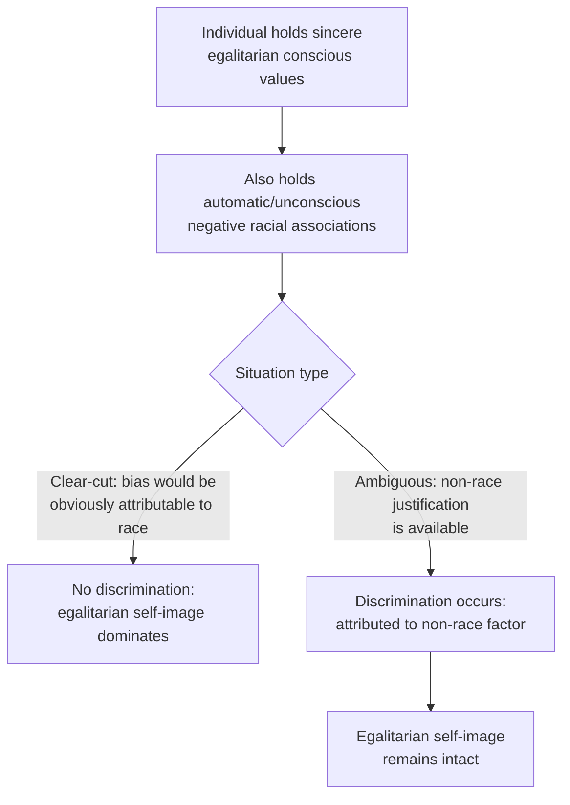

## Aversive Racism and Modern Prejudice

### Overview

Aversive racism and modern (or "symbolic") prejudice are theoretical frameworks developed to explain how prejudice persists and operates in social contexts where overt, blatant expressions of bias have become socially unacceptable. Rather than describing the disappearance of prejudice, these theories describe its transformation into more subtle, indirect, and often self-concealed forms.

### Historical Context: The Shift from Old-Fashioned to Modern Prejudice

**Key Points**

- **Old-fashioned (blatant) prejudice**: characterized by open endorsement of group inferiority, explicit support for segregation/discriminatory policy, and overt expression of negative feelings — the historically dominant form of measured prejudice through the mid-20th century.
- Following the civil rights movement and broader shifts in social norms, egalitarian values became widely and publicly endorsed, making the open expression of blatant prejudice socially costly.
- Researchers observed that self-reported explicit prejudice on traditional scales declined substantially over subsequent decades, yet real-world disparities and subtler forms of biased behavior persisted — motivating theories that reconceptualized prejudice as having migrated to more indirect forms rather than having been eliminated.

### Aversive Racism Theory (Gaertner & Dovidio)

**Key Points**

- Proposed primarily by John Dovidio and Samuel Gaertner, aversive racism describes a form of racial bias found among individuals who **genuinely and consciously endorse egalitarian, non-prejudiced values** but who simultaneously harbor negative feelings and beliefs about racial minorities at a largely automatic, non-conscious level.
- The negative feelings involved are typically **not** hatred or open hostility, but rather discomfort, anxiety, or a vague sense of unease around members of the out-group — hence "aversive" rather than openly hostile.
- Because these individuals hold a strong, sincere self-image as unprejudiced, they are highly motivated to avoid acting in ways that could be attributed to bias, and typically do not discriminate in situations where discrimination would be obvious and clearly attributable to race.
- Critically, aversive racists **do** discriminate in situations where their behavior can be attributed to some non-race-related factor — allowing them to maintain their non-prejudiced self-image while still acting in biased ways when a plausible alternative justification is available.

**Example**

An aversive racist serving on a hiring committee reviewing two equally qualified candidates, one Black and one White, is unlikely to show bias, since the decision criteria are explicit and any deviation would be clearly attributable to race. However, if the candidates' qualifications are made slightly ambiguous (e.g., one has marginally more relevant experience but a slightly less prestigious degree), the same individual may be more likely to favor the White candidate — attributing the decision to the "objective" qualification difference rather than to race, even though race is the underlying driver of the *interpretation* of that ambiguous difference.

### Modern (Symbolic) Racism (McConahay; Sears & Kinder)

**Key Points**

- **Modern racism** (also called symbolic racism), developed primarily by John McConahay and, independently, by David Sears and Donald Kinder, describes prejudice expressed indirectly through opposition to policies or practices symbolically linked to racial minorities, rather than through direct expressions of racial animus.
- Modern racism theory holds that this form of prejudice blends anti-minority affect with traditional individualist values (e.g., belief in a strict meritocracy, personal responsibility, hard work), producing beliefs such as:
  - Discrimination is a thing of the past and no longer a significant barrier.
  - Minority groups' continued disadvantage reflects insufficient effort or motivation rather than structural or historical factors.
  - Minority groups are making excessive or illegitimate demands for accommodation or resources.
  - Recent gains by minority groups are undeserved.
- Because these beliefs are framed in terms of ostensibly race-neutral values (individualism, fairness, meritocracy) rather than explicit claims of group inferiority, they are more socially acceptable to express and endorse than old-fashioned prejudice, while still correlating strongly with opposition to race-conscious policies (e.g., affirmative action) in empirical studies.

### Symbolic Racism vs. Aversive Racism: Key Distinctions

| Feature | Aversive Racism | Modern/Symbolic Racism |
| --- | --- | --- |
| Conscious awareness of bias | Largely unaware; sincerely believes self to be unprejudiced | May be more consciously aware, but frames views as principled, not prejudiced |
| Primary mechanism | Automatic negative affect coexisting with genuine egalitarian values | Blending of anti-minority affect with individualist/meritocratic ideology |
| Behavioral expression | Discrimination surfaces only in ambiguous situations with non-race justification available | Opposition to race-conscious policy; endorsement of "reverse discrimination" narratives |
| Primary domain of study | Interpersonal behavior (hiring, helping behavior, jury decisions) | Political attitudes and policy positions |

**Key Points**

- The two frameworks are complementary rather than competing: aversive racism focuses more on interpersonal behavioral dynamics and self-concept protection, while modern/symbolic racism focuses more on political attitude expression and its ideological packaging.

### Ambivalent and Benevolent Forms of Prejudice

**Key Points**

- Related frameworks extend the logic of "disguised" or ambivalent prejudice to other domains, most notably **ambivalent sexism theory** (Glick & Fiske), which identifies **hostile sexism** (overt antagonism toward women who challenge traditional roles) and **benevolent sexism** (subjectively positive but patronizing attitudes that reinforce traditional gender roles under a guise of chivalry/protection).
- These parallel frameworks share the aversive/modern racism insight that prejudice can be expressed through ostensibly positive, protective, or principled-sounding content rather than only through open hostility.

### Empirical Evidence and Measurement

**Key Points**

- Aversive racism has been demonstrated across numerous experimental paradigms, including studies of helping behavior (e.g., bystander helping is often equivalent across racial lines in unambiguous emergencies but shows racial disparities when situational ambiguity provides a non-race excuse for withholding help), simulated hiring/evaluation decisions, and jury-decision simulations.
- Modern/symbolic racism has typically been measured via specialized scales (e.g., McConahay's Modern Racism Scale; the Symbolic Racism 2000 Scale by Henry & Sears) distinct from old-fashioned prejudice scales, and has shown robust predictive relationships with political attitudes and voting behavior in numerous studies.
- [Inference] Because both frameworks were developed specifically to explain the gap between declining self-reported blatant prejudice and persisting behavioral/political disparities, they are generally treated in the literature as complementary explanatory tools for that gap rather than as fully independent, mutually exclusive theories of prejudice.

### Applications

**Key Points**

- Used to interpret disparities in domains such as hiring, healthcare treatment recommendations, jury verdicts, and lending decisions where overt discriminatory intent is denied or absent but statistical disparities in outcomes persist.
- Informs political science research on the ideological packaging of opposition to race-conscious policy (e.g., affirmative action, reparations, diversity initiatives).
- Provides theoretical grounding for diversity and inclusion interventions that target ambiguous decision procedures specifically (e.g., structured interviews, blind resume review) rather than relying solely on individual attitude change, since aversive racism theory predicts bias concentrates precisely in ambiguous, discretion-heavy situations.

### Critiques and Limitations

**Key Points**

- Critics argue that some symbolic/modern racism scale items conflate genuine principled conservative political values (e.g., general opposition to government intervention) with racial prejudice, raising a validity debate about whether the construct fully isolates racial bias from ideological/political orientation more broadly. [Unverified: the extent of this conflation and its impact on scale validity remains a subject of ongoing methodological debate among researchers.]
- As with implicit bias research generally, some scholars note the difficulty of establishing the precise causal contribution of aversive-racist tendencies (versus other structural or economic factors) to specific real-world disparities, cautioning against treating any single study's effect size as broadly generalizable.
- Because aversive racism is defined partly by the actor's own lack of awareness, it is inherently difficult to measure through self-report, requiring indirect experimental or behavioral paradigms — a methodological constraint acknowledged within the theory's own framework.

### Related Topics

- Implicit bias and its measurement (IAT, priming, AMP)
- Ambivalent sexism theory (hostile and benevolent sexism)
- Stereotype Content Model
- Modern Racism Scale and Symbolic Racism 2000 Scale
- Distinguishing prejudice, stereotypes, and discrimination
- Justification-suppression model of prejudice expression
- Correspondence/audit studies of institutional discrimination