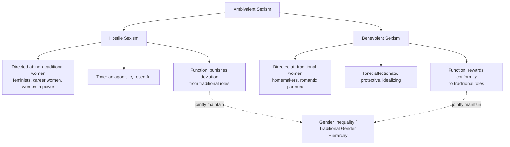

## Ambivalent Sexism

### Overview

Ambivalent Sexism Theory (AST), developed by Peter Glick and Susan Fiske (1996), proposes that sexism is not a uniformly hostile or negative attitude toward women, but rather an **ambivalent** ideology composed of two distinct, coexisting sets of attitudes: **hostile sexism** and **benevolent sexism**. Both subtypes work together to justify and maintain gender inequality and traditional gender roles, despite differing sharply in their emotional tone.

### Core Premise

**Key Points**

- AST emerged from the observation that sexism, unlike many other forms of prejudice, occurs within a context of unusually high interdependence between the dominant group (men) and the subordinate group (women), due to close relationships (romantic partnerships, family, reproduction) that are not similarly present between most other majority/minority group pairings.
- This interdependence is theorized to produce not only antagonism toward women (hostile sexism) but also subjectively positive, affectionate attitudes toward women that nonetheless reinforce gender inequality (benevolent sexism).
- The two components are described as **ambivalent** because they coexist within the same individuals and are, empirically, positively correlated with one another rather than opposed.

### Hostile Sexism

**Key Points**

- **Hostile sexism (HS)** consists of overtly negative, antagonistic attitudes toward women, particularly those perceived as challenging or threatening male power, status, or traditional gender arrangements.
- Content typically includes beliefs that women seek to control men, exaggerate discrimination claims, exploit feminism for unfair advantage, or withhold sex/relationships as a form of manipulation.
- Directed particularly at women perceived as non-traditional (e.g., feminists, career-focused women, women in positions of authority) who are seen as usurping male status or resources.
- Corresponds most closely to how sexism has traditionally been conceptualized and measured in earlier prejudice research (analogous to old-fashioned/blatant prejudice in the racial-prejudice literature).

### Benevolent Sexism

**Key Points**

- **Benevolent sexism (BS)** consists of attitudes toward women that are subjectively positive in tone (affectionate, protective, idealizing) but that rest on and reinforce traditional, restrictive gender roles and women's dependence on men.
- Comprises three interrelated components:
  1. **Protective paternalism**: the belief that women, like children, need to be protected and cared for by men.
  2. **Complementary gender differentiation**: the belief that women possess positive but restrictive traits (nurturance, purity, refinement) that complement men's traits and that women are best suited to domestic and relational roles.
  3. **Heterosexual intimacy**: the belief that men need women romantically as sources of love and fulfillment, idealizing women as romantic partners.
- Directed particularly toward women who conform to traditional gender roles (e.g., homemakers, women perceived as "pure" or "innocent"), who are idealized and protected, in contrast with the hostility directed at non-traditional women.
- Despite its positive emotional tone, benevolent sexism is theorized to be equally (or in some ways more) effective than hostile sexism at maintaining gender inequality, because its pleasant packaging makes it less likely to be recognized, challenged, or resisted by either its targets or observers.

### The Carrot-and-Stick Mechanism

**Key Points**

- Hostile and benevolent sexism function as complementary "stick" and "carrot" mechanisms: hostile sexism punishes women who deviate from traditional roles, while benevolent sexism rewards (with affection, protection, and idealization) women who conform to them.
- Together, these two subtypes create a system in which women face costs for pursuing independence and status but receive apparent benefits for accepting subordinate, traditional roles, making the overall system of gender inequality more stable and more difficult to challenge than hostility alone would achieve.
- Because benevolent sexism feels good to receive, targets themselves may find it difficult to recognize or resist, and third-party observers frequently do not perceive it as a form of prejudice at all — contributing to its persistence relative to more easily recognized hostile forms.

### The Ambivalent Sexism Inventory (ASI)

**Key Points**

- Glick and Fiske developed the **Ambivalent Sexism Inventory (ASI)**, a self-report scale with separate subscales measuring hostile sexism and benevolent sexism, which has been validated and applied across numerous countries and cultures.
- A companion measure, the **Ambivalence toward Men Inventory (AMI)**, was later developed to assess parallel ambivalent attitudes that women (and men) can hold toward men, including hostility toward men perceived as holding illegitimate power and benevolence that idealizes men as protectors/providers.
- Cross-national research using the ASI has found that, at the societal level, higher average endorsement of hostile sexism tends to correlate with higher average endorsement of benevolent sexism across countries, and that both forms are associated with broader indices of gender inequality — though [Unverified: the precise strength and universality of specific cross-national correlations vary by study and dataset, and cross-national comparative findings should be treated as descriptive of studied samples rather than fixed universal laws].

### Relationship to the Stereotype Content Model

**Key Points**

- AST maps closely onto the Stereotype Content Model's warmth/competence framework: benevolent sexism corresponds to a high-warmth/lower-perceived-agentic-competence ("pity"/paternalistic) stereotype profile applied to traditional women, while hostile sexism corresponds more closely to a low-warmth ("envy"/contempt-adjacent) profile applied to non-traditional women perceived as competent and threatening.
- This connection illustrates AST as a domain-specific application of the broader principle that prejudice is frequently differentiated and ambivalent rather than uniformly hostile.

### Empirical Findings and Applications

**Key Points**

- Both hostile and benevolent sexism have been empirically linked to a range of outcomes, including endorsement of traditional gender role attitudes, victim-blaming in sexual assault scenarios, opposition to gender-equality policies, and (particularly for benevolent sexism) reduced likelihood of recognizing certain behaviors as sexist or as gender discrimination.
- Applied in organizational psychology to explain workplace dynamics such as the "glass ceiling" (linked to hostile sexism toward women pursuing leadership) and paternalistic exclusion from challenging assignments (linked to benevolent sexism's protective framing).
- Used in research on romantic relationships, where benevolent sexism has been associated in some studies with relationship satisfaction in the short term (given its affectionate framing) but with reinforcement of unequal relationship dynamics over time.
- Applied in research on attitudes toward sexual violence, where benevolent sexism has been linked in various studies to endorsement of rape myths concerning "ideal victim" stereotypes (e.g., beliefs that "good," traditionally feminine women are less likely to be assaulted or more deserving of protection/belief than others).

### Critiques and Limitations

**Key Points**

- Some scholars argue that measuring benevolent sexism via self-report is complicated by the fact that respondents (of any gender) may not perceive benevolently sexist statements as prejudiced at all, potentially leading to under- or over-endorsement based on how normatively acceptable such statements are perceived to be in a given cultural context.
- The theory's claims about cross-national correlation between national-level gender inequality and ASI scores are correlational, and causal direction (whether ambivalent sexism produces inequality, results from it, or both) cannot be established from cross-sectional survey data alone.
- As with other ambivalent-prejudice frameworks, distinguishing genuinely affectionate/protective interpersonal behavior from benevolently sexist behavior in specific individual interactions can be empirically and practically difficult, and most applications rely on aggregate, questionnaire-based patterns rather than individual-level diagnosis.

### Related Topics

- Stereotype Content Model and the BIAS map
- Aversive racism and modern/symbolic prejudice
- Ambivalence toward Men Inventory (AMI)
- Glass ceiling and workplace gender discrimination
- Rape myth acceptance and victim-blaming research
- Distinguishing prejudice, stereotypes, and discrimination
- Cross-cultural research on gender inequality and ideology