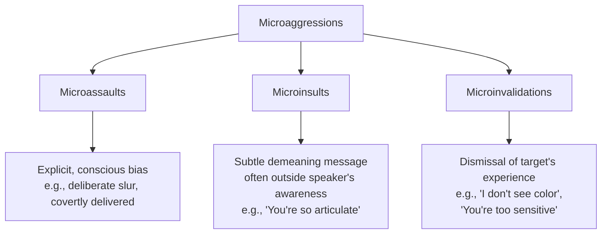

## Microaggressions

### Overview

Microaggressions are brief, everyday verbal, behavioral, or environmental slights, insults, or invalidations — whether intentional or unintentional — that communicate hostile, derogatory, or negative messages toward members of marginalized or stigmatized groups. The concept was originally introduced by psychiatrist Chester Pierce (1970) and substantially developed and popularized within psychology by Derald Wing Sue and colleagues (2007).

### Core Premise

**Key Points**

- Microaggressions are distinguished from overt discrimination or old-fashioned prejudice by their subtlety, ambiguity, and frequent lack of conscious discriminatory intent on the part of the person committing them.
- The cumulative, repeated nature of microaggressions — rather than any single instance — is theorized to be central to their psychological impact on targets, who often experience them as a chronic, everyday stressor rather than a single discrete event.
- Microaggressions are conceptually linked to modern/aversive forms of prejudice: they are proposed to reflect underlying automatic biases or unexamined assumptions that surface in ambiguous, low-stakes interactions even among individuals who consciously hold egalitarian values.

### Sue's Taxonomy of Microaggressions

Sue and colleagues (2007) proposed three primary subtypes of microaggressions:

**Key Points**

1. **Microassaults**: explicit, deliberate, and conscious discriminatory actions or statements, most similar to old-fashioned overt prejudice/discrimination but typically delivered covertly or in private settings.
2. **Microinsults**: verbal or nonverbal communications that convey rudeness or insensitivity, subtly demeaning a person's identity or heritage, often without conscious awareness by the speaker (e.g., a comment implying surprise at a person of color's professional competence).
3. **Microinvalidations**: communications that exclude, negate, or dismiss the psychological thoughts, feelings, or experiential reality of a person from a marginalized group (e.g., telling a person of color that racism no longer exists, or telling a woman she is "overreacting" to a sexist comment).

**Example**

A microinsult occurs when a colleague expresses surprise that an Asian-American employee "doesn't seem that good at math," implicitly reinforcing a stereotype while framing it as an observation about the individual. A microinvalidation occurs when that same employee raises a concern about differential treatment and is told, "I think you're reading too much into it — that's not what happened at all," which dismisses their subjective experience without engagement.

### Common Thematic Categories

**Key Points**

- **Ascription of intelligence**: assigning a level of intelligence to a person based on their group membership (e.g., assuming higher or lower competence based on race).
- **Second-class citizenship**: treating a person as a lesser or subordinate member of a group (e.g., being consistently served last, or having one's presence overlooked).
- **Assumption of criminality**: assuming a person is dangerous, deviant, or likely to engage in criminal behavior based on group membership.
- **Denial of individual racism/sexism**: a speaker's disclaimer or defense that denies personal bias while making a biased statement (e.g., "I'm not racist, but...").
- **Myth of meritocracy**: statements asserting that success is based solely on merit, implicitly dismissing structural or historical barriers faced by marginalized groups.
- **Pathologizing cultural values/communication styles**: treating culturally different values, behaviors, or communication styles as deviant or inferior to the dominant culture's norms.
- **Environmental microaggressions**: systemic and environmental cues that communicate exclusion or marginalization (e.g., a workplace's decor, imagery, or leadership composition that signals a marginalized group does not belong or is underrepresented in valued roles).

### Theorized Psychological Impact on Targets

**Key Points**

- Chronic exposure to microaggressions has been associated in research with increased psychological distress, including elevated depressive symptoms, anxiety, and lowered self-esteem, though most such research is correlational rather than experimental.
- The **ambiguity** of microaggressions is theorized to constitute a distinct psychological burden: targets often experience uncertainty about whether an incident was intentional, whether it reflects genuine bias, and whether/how to respond, leading to a cognitive and emotional cost sometimes referred to in the literature as "attributional ambiguity."
- Some researchers propose a cumulative "minority stress" framework, wherein microaggressions function as chronic, low-grade stressors that, compounded over time and across many social contexts, contribute to broader mental and physical health disparities experienced by marginalized groups. [Inference] This cumulative-stress framing is a widely cited theoretical model within the literature, though establishing precise causal, longitudinal links between microaggression frequency and specific health outcomes for a given individual remains empirically difficult and is typically studied at the aggregate/group level rather than as an individual diagnostic claim.

### Empirical and Methodological Debates

**Key Points**

- The microaggression construct has generated substantial academic debate. Critics (e.g., Lilienfeld, 2017) have raised concerns including: definitional ambiguity and inconsistency across studies, reliance on subjective interpretation to classify an act as a microaggression, limited experimental (as opposed to correlational or qualitative) research designs, and unclear or inconsistent measurement/psychometric properties of microaggression scales.
- Proponents respond that qualitative and mixed-methods research (including target self-report and thematic analysis of documented incidents) provides substantial converging evidence for the phenomenon's real-world impact, and that some psychological constructs are inherently difficult to fully capture through purely experimental paradigms.
- [Unverified: the degree to which microaggression research meets the methodological standards typically expected in mainstream experimental social psychology remains a genuinely contested question among researchers, and readers should be aware this is an active area of scholarly disagreement rather than a fully settled matter.]
- Some scholars have proposed refinements to address these critiques, including clearer operational definitions, more standardized measurement instruments, and increased use of experimental/quasi-experimental designs alongside qualitative approaches.

### Applications

**Key Points**

- Widely applied in organizational diversity, equity, and inclusion (DEI) training programs aimed at increasing awareness of subtle, unintentional bias in workplace interactions.
- Applied in higher education contexts, informing training for faculty and staff and shaping some campus climate initiatives regarding classroom and residential interactions.
- Applied in clinical/counseling psychology training, where awareness of microaggressions is incorporated into multicultural competency frameworks for therapists working with clients from marginalized backgrounds.
- Applied in healthcare settings, where research has examined microaggressions committed by providers toward patients (and vice versa) as a factor potentially contributing to healthcare disparities and patient trust.

### Relationship to Broader Prejudice Frameworks

**Key Points**

- Microaggressions are conceptually situated within the broader shift toward studying **subtle, indirect, and often unintentional** forms of bias (alongside aversive racism, modern/symbolic racism, and implicit bias), reflecting the broader observation that overt prejudice's social unacceptability has not eliminated bias but changed its expression.
- Unlike implicit bias (measured via reaction-time tasks) or aversive racism (a broader personality/attitude framework), microaggressions are defined at the level of observable, discrete **communicative acts** — making them a behaviorally-anchored construct that sits at the intersection of cognitive bias research and interpersonal communication research.

### Related Topics

- Aversive racism and modern/symbolic prejudice
- Implicit bias and its measurement
- Minority stress theory and health disparities
- Multicultural competence in clinical training
- Distinguishing prejudice, stereotypes, and discrimination
- Attributional ambiguity in intergroup perception
- Diversity, equity, and inclusion (DEI) intervention research